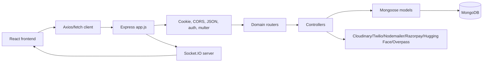

# MediConnect Architectural Workflow

Last reviewed: 2026-06-04.

## 1. Purpose And Scope

This document explains how MediConnect works under the hood, from browser route to backend endpoint to database mutation and real-time event. It is written for engineers who need to maintain, extend, deploy, or audit the project.

The codebase is a healthcare marketplace and communication platform with these major capabilities:

- Doctor and patient registration, login, verification, profile updates, and JWT-based sessions.
- Doctor schedule creation and patient-facing appointment booking.
- Slot request and Razorpay payment workflows.
- Real-time doctor-patient chat with text, image, file, read, and delete behavior.
- WebRTC video calls with Socket.IO signaling and MongoDB-backed call history.
- Medicine search backed by a MongoDB medicines collection.
- Nearby medical facility lookup through Overpass/OpenStreetMap.
- A Hugging Face powered chatbot with a local fallback response engine.

## 2. System Overview

MediConnect is organized as a MERN-style application:

- Frontend: Vite, React, React Router, Zustand, Tailwind, Socket.IO client, WebRTC APIs, Leaflet.
- Backend: Node.js, Express, MongoDB/Mongoose, Socket.IO, JWT, Multer, Cloudinary, Nodemailer, Twilio, Razorpay.
- Database: MongoDB with Mongoose models for doctors, clients, schedules, slot requests, payments, chats, video calls, and medicines.
- External services: Cloudinary for uploaded media, Gmail/Nodemailer for email OTP, Twilio for SMS OTP, Razorpay for payments, Hugging Face for chatbot responses, Overpass API for map data.

High-level request path:



## 3. Repository Layout

```text
MediConnect/
  README.md
  DEPLOYMENT_GUIDE.md
  DEPLOYMENT_CHECKLIST.md
  render.yaml
  deploy.sh

  backend/
    app.js
    package.json
    public/
    uploads/
    src/
      config/db.js
      controllers/
      middlewares/
      models/
      routes/
      utils/

  frontend/
    package.json
    vite.config.js
    vercel.json
    index.html
    src/
      main.jsx
      App.jsx
      index.css
    pages/
    components/
    store/
    context/
    hooks/
    lib/
    services/
    utils/
```

Important entry points:

- Backend process: `backend/app.js`
- Frontend process: `frontend/src/main.jsx`
- Frontend route registry: `frontend/src/App.jsx`
- Backend route registry: route imports and `app.use(...)` calls in `backend/app.js`
- Database connection: `backend/src/config/db.js`
- Socket server behavior: `backend/src/utils/socketHandlers.js`
- Shared frontend HTTP client: `frontend/utils/axois.js`

## 4. Backend Runtime Architecture

### 4.1 Server Bootstrap

The backend starts in `backend/app.js`.

Startup sequence:

1. Load environment variables with `dotenv/config`.
2. Create an Express app and an HTTP server.
3. Compute allowed CORS origins from `CORS_ORIGIN`, `FRONTEND_URL`, `CLIENT_URL`, plus localhost defaults.
4. Register middleware:
   - `cookieParser()` for token cookies.
   - `express.static("public")` for public files.
   - `cors(corsOptions)` with credentials enabled.
   - `express.json({ limit: "16kb" })`.
   - `express.urlencoded({ extended: true, limit: "16kb" })`.
5. Register standalone `/chat` chatbot endpoint.
6. Create a Nodemailer transporter.
7. Create a Socket.IO server on the same HTTP server.
8. Initialize Socket.IO handlers through `initializeSocket(io)`.
9. Attach `req.io = io` so controllers can emit socket events.
10. Mount domain routers.
11. Register `/health`.
12. Register a central Express error handler.
13. Connect to MongoDB with `connectDB()`.
14. Start listening on `PORT`.

The server mounts these domains:

```text
/doctor       -> doctor.routes.js
/client       -> client.routes.js
/schedule     -> schedule.routes.js
/chats        -> chat.routes.js
/video-call   -> video.routes.js
/clinics      -> clinic.routes.js
/medicines    -> medicine.routes.js
/slots        -> slotRequest.routes.js
/payments     -> payment.routes.js
/chat         -> standalone chatbot endpoint in app.js
/health       -> runtime health endpoint
```

### 4.2 Middleware Pipeline

Global middleware in `app.js` runs before route handlers:

```text
HTTP request
  -> cookie parser
  -> static file serving
  -> CORS
  -> JSON parser
  -> URL encoded parser
  -> req.io injection
  -> route-specific middleware
  -> controller
  -> error handler
```

Route-specific middleware:

- `isAuthenticated` validates JWTs from `accessToken` cookie or `Authorization: Bearer ...` header.
- `upload.single("avatar")` or `upload.single("file")` stores multipart uploads under `backend/public/temp`.
- Chat and video routers call `router.use(isAuthenticated)`, protecting every route in those routers.
- Schedule and slot request routes protect their implemented endpoints.

### 4.3 Database Connection

`backend/src/config/db.js` connects to:

```text
${MONGODB_URI}/${DB_NAME}
```

The backend exits the process if MongoDB connection fails.

### 4.4 Response And Error Utilities

The backend includes reusable helpers:

- `ApiResponse`: wraps successful responses as `{ statusCode, data, message, success }`.
- `ApiError`: custom error with `statusCode`, `message`, `errors`, and `success: false`.
- `asyncHandler`: catches promise rejections and forwards them to Express error middleware.

Some controllers use these wrappers consistently, while others send raw JSON. For production consistency, response shape should be standardized across all controllers.

## 5. Data Model Architecture

### 5.1 Doctor

File: `backend/src/models/doctor.models.js`

Core fields:

- `name`, `email`, `phone`, `password`
- `specialization`, `experience`, `degree`, `age`, `gender`
- `avatar`
- `verified`
- `refreshToken`
- `verificationToken`
- `tokenVersion`
- `otp`, `otpExpires`

Behavior:

- Passwords are hashed before save.
- `isPasswordCorrect(password)` validates passwords with bcrypt.
- `generateAccessToken()` signs a JWT with `_id`, `email`, `userType: "Doctor"`, and `tokenVersion`.
- `generateRefreshToken()` signs a refresh token with `_id`.

### 5.2 Client

File: `backend/src/models/client.model.js`

Core fields:

- `name`, `email`, `age`, `gender`
- `password`, `phone`, `avatar`
- `verified`, `refreshToken`
- `verificationToken`
- `tokenVersion`
- `otp`, `otpExpires`

Behavior mirrors the Doctor model, but access tokens use `userType: "Client"`.

### 5.3 Schedule

File: `backend/src/models/schedule.model.js`

Core fields:

- `doctorId`: reference to Doctor.
- `date`: string in `YYYY-MM-DD` format.
- `slots`: embedded array of slot documents.

Slot fields:

- `time`
- `fee`
- `isBooked`
- `bookedBy`: reference to Client.
- `requestId`: reference to SlotRequest.

### 5.4 SlotRequest

File: `backend/src/models/slotRequest.model.js`

Core fields:

- `doctorId`
- `patientId`
- `scheduleId`
- `slotIndex`
- `date`
- `time`
- `fee`
- `status`: `pending`, `accepted`, `rejected`
- `paymentStatus`: `unpaid`, `paid`

This model bridges scheduling and payments.

### 5.5 Payment

File: `backend/src/models/payment.model.js`

Core fields:

- `slotRequestId`
- `doctorId`
- `patientId`
- `amount`
- `status`: `success` or `failed`
- `transactionId`
- `paymentGateway`

Payments are created after Razorpay signature verification succeeds.

### 5.6 Chat

File: `backend/src/models/chat.model.js`

Core fields:

- `participants`: polymorphic references to Doctor or Client.
- `messages`: embedded message array.
- `lastMessage`
- `isActive`
- `chatType`

Message fields:

- `content`
- `messageType`: `text`, `image`, `file`, `voice`
- `fileUrl`
- `createdAt`
- `readBy`
- `sender`: polymorphic reference to Doctor or Client.

Indexes:

- Participants by user ID.
- `lastMessage` descending.
- `createdAt` descending.

### 5.7 VideoCall

File: `backend/src/models/video.model.js`

Core fields:

- `participants`: polymorphic references to Doctor or Client.
- `initiator`
- `callStatus`: `initiated`, `ringing`, `ongoing`, `ended`, `rejected`
- `callType`: `video` or `audio`
- `roomId`
- `startTime`, `endTime`, `duration`
- `callQuality`
- `technicalIssues`

Participant media state:

- `cameraEnabled`
- `microphoneEnabled`
- `screenSharing`
- `qualitySettings`

### 5.8 Medicine

File: `backend/src/models/medicine.model.js`

Backs search against the `medicines` collection. The schema stores medicine identity, name, price, discontinued status, manufacturer, type, pack size, and compositions.

## 6. Backend Domain Workflows

### 6.1 Doctor Registration And Verification

Primary files:

- `frontend/pages/DoctorSignup.jsx`
- `frontend/store/doctorAuthStore.js`
- `backend/src/routes/doctor.routes.js`
- `backend/src/controllers/doctor.controllers.js`
- `backend/src/models/doctor.models.js`

Step-by-step:

1. The doctor opens `/signup`.
2. `DoctorSignup.jsx` collects name, email, phone, password, specialization, experience, degree, age, gender, and avatar.
3. The page validates required fields, password match, phone format, age, and avatar.
4. The page builds `FormData` and calls `useDoctorAuthStore.register(...)`.
5. The store sends `POST /doctor/register` with `multipart/form-data`.
6. `upload.single("avatar")` writes the uploaded file to `public/temp`.
7. `registerDoctor` validates fields, checks duplicate email or phone, uploads avatar to Cloudinary, creates a six-digit OTP, sends the OTP by email, and creates a Doctor document with `verified: false`.
8. The Doctor model hashes the password before saving.
9. The response returns the new doctor without password and refresh token.
10. The frontend opens a verification modal.
11. If the user verifies by email, the page calls `POST /doctor/verify-email` with `{ email, otp }`.
12. The controller checks the OTP and expiry, sets `verified: true`, clears OTP fields, and returns success.
13. The page navigates to `/doctordashboard`.

There is also a `POST /doctor/verify-otp` route that verifies by `doctorId` and OTP. The current registration controller sends email OTP; imported SMS OTP utility exists but is not active in `registerDoctor`.

### 6.2 Client Registration And Verification

Primary files:

- `frontend/pages/ClientSignup.jsx`
- `frontend/store/clientAuthStore.js`
- `backend/src/routes/client.routes.js`
- `backend/src/controllers/client.controllers.js`
- `backend/src/models/client.model.js`

Step-by-step:

1. The client opens the client signup flow.
2. `ClientSignup.jsx` collects name, email, phone, password, age, gender, and optional avatar.
3. The page builds `FormData` and calls `useClientAuthStore.register(...)`.
4. The store sends `POST /client/register`.
5. `registerClient` checks duplicates, uploads avatar if present, generates OTP, creates a verification token, sends SMS OTP through Twilio, sends email OTP through Nodemailer, and creates a Client document.
6. The Client model hashes the password before save.
7. The controller generates access and refresh tokens, stores the refresh token on the client, and sets token cookies.
8. The frontend shows a verification modal.
9. Email verification uses `POST /client/verify-email`.
10. Phone OTP verification uses `POST /client/verify-otp`.
11. Successful verification marks `verified: true` and navigates to `/clientdashboard`.

### 6.3 Login, Cookies, Local Storage, And Auth Checks

Doctor login:

1. `DoctorLogin.jsx` calls `useDoctorAuthStore.login({ email, password })`.
2. The store sends `POST /doctor/login`.
3. The backend finds the doctor, validates bcrypt password, requires `verified: true`, generates access and refresh tokens, stores refresh token in MongoDB, and sets `accessToken` and `refreshToken` cookies.
4. The response also includes tokens. The frontend stores `doctorId`, `doctorAccessToken`, and `doctorRefreshToken` in localStorage.
5. The page navigates to `/doctordashboard`.

Client login follows the same pattern through `/client/login` and stores client token keys.

Protected request authentication:

1. The frontend sends cookies because `axiosInstance` uses `withCredentials: true`.
2. Some direct `fetch` calls also attach an `Authorization: Bearer ...` header from localStorage.
3. `isAuthenticated` looks for `req.cookies.accessToken` first, then a Bearer token.
4. It verifies the JWT with `ACCESS_TOKEN_SECRET`.
5. It searches Doctor first, then Client.
6. It attaches either `req.doctor` and `req.userType = "doctor"` or `req.client` and `req.userType = "client"`.

Refresh behavior:

- `frontend/utils/axois.js` retries a failed request once after calling `/client/refresh-token`.
- Doctor refresh exists on the backend at `/doctor/refresh-token`, but the shared interceptor currently only tries the client refresh route.

### 6.4 Doctor Schedule Creation

Primary files:

- `frontend/components/DoctorSchedue.jsx`
- `backend/src/routes/schedule.routes.js`
- `backend/src/controllers/schedule.controllers.js`
- `backend/src/models/schedule.model.js`

Step-by-step:

1. A doctor opens `/doctorschedule`.
2. The component loads the current doctor through `getCurrentDoctor()`.
3. The doctor selects a date and adds one or more slots, each with a `time` and `fee`.
4. The component sends `POST /schedule/create` with Bearer doctor access token.
5. `isAuthenticated` attaches `req.doctor`.
6. `createSchedule` reads `date` and `slots` from `req.body` and uses `req.doctor._id` as `doctorId`.
7. The controller prevents duplicate schedules for the same doctor and date.
8. It creates a Schedule document with embedded slots.
9. The frontend can fetch the schedule with `GET /schedule?doctorId=...&date=...`.

### 6.5 Patient Appointment Booking And Payment

Primary files:

- `frontend/components/PatientBookingPortal.jsx`
- `backend/src/routes/doctor.routes.js`
- `backend/src/routes/schedule.routes.js`
- `backend/src/routes/slotRequest.routes.js`
- `backend/src/routes/payment.routes.js`
- `backend/src/controllers/slotRequest.controllers.js`
- `backend/src/controllers/payment.controllers.js`

Step-by-step:

1. A client opens `/bookappointment`.
2. The component fetches doctors with `GET /doctor`.
3. The client selects a doctor.
4. The client selects a date.
5. The component fetches the selected doctor's schedule through `GET /schedule?doctorId=...&date=...`, including the client Bearer token.
6. The client chooses a slot.
7. The component sends `POST /slots/request` with `{ doctorId, scheduleId, slotIndex }`.
8. `requestSlot` requires `req.client`, loads the schedule, validates the slot, rejects already-booked slots, creates a SlotRequest with `status: "pending"` and `paymentStatus: "unpaid"`, then writes `slot.requestId`.
9. The frontend stores the pending slot request and prompts for payment.
10. The component dynamically loads Razorpay checkout from `https://checkout.razorpay.com/v1/checkout.js`.
11. It sends `POST /payments/order` with `{ slotRequestId, amount }`.
12. `createOrder` creates a Razorpay order in INR, converting amount to paise.
13. Razorpay checkout returns `razorpay_order_id`, `razorpay_payment_id`, and `razorpay_signature` to the frontend handler.
14. The frontend sends `POST /payments/verify`.
15. `verifyPayment` computes an HMAC SHA-256 signature with `RAZORPAY_KEY_SECRET` and compares it to Razorpay's signature.
16. On success, the backend loads the SlotRequest, sets `paymentStatus: "paid"` and `status: "accepted"`, then creates a Payment document.
17. The frontend shows appointment confirmation.

Design intent:

- SlotRequest represents the reservation request.
- Payment represents financial confirmation.
- Schedule slots represent actual availability.

Current implementation note:

- `requestSlot` sets `slot.requestId` but does not mark the slot booked.
- `updateSlotRequestStatus` marks the slot booked when status becomes accepted.
- `verifyPayment` marks the SlotRequest accepted and paid, but does not currently update the Schedule slot's `isBooked` or `bookedBy` fields.

### 6.6 Doctor Payment History

Primary files:

- `frontend/components/DoctorPayementPortal.jsx`
- `backend/src/controllers/payment.controllers.js`

Step-by-step:

1. The doctor opens `/doctorappointments`.
2. The frontend calls `GET /payments/history?doctorId=...`.
3. The backend loads Payment records for the doctor.
4. It populates patient details from Client.
5. It returns payment history, total payment count, total earnings, and successful payment count.

### 6.7 Real-Time Chat

Primary files:

- `frontend/pages/ChatPage.jsx`
- `frontend/store/chatStore.js`
- `backend/src/routes/chat.routes.js`
- `backend/src/controllers/chat.controller.js`
- `backend/src/utils/socketHandlers.js`
- `backend/src/models/chat.model.js`

Chat has two layers:

- REST persistence layer: creates chats, sends messages, fetches history, marks reads, deletes messages.
- Socket.IO live layer: authenticates sockets, joins rooms, broadcasts new messages, typing, read, status, and delete events.

Socket authentication:

1. `chatStore.connectSocket()` reads `doctorAccessToken` or `clientAccessToken` plus user ID from localStorage.
2. It connects to the backend Socket.IO server with `auth: { token, userType, userId }`.
3. `socketHandlers.js` verifies the token with `ACCESS_TOKEN_SECRET`.
4. It finds the user in Doctor or Client collection.
5. It attaches `socket.user` and `socket.userType`.
6. It joins a user-specific room named `user_<userId>`.

Creating or opening a chat:

1. The page determines whether the current user is a Doctor or Client.
2. Clients fetch doctors; doctors fetch clients.
3. Selecting a contact calls `POST /chats/create-or-get` with participant ID and type.
4. The backend checks both participants, finds an existing chat with both user IDs or creates a new Chat document.
5. The frontend sets `currentChat`, joins the chat room, and fetches messages.

Sending a message:

1. `ChatPage.jsx` calls `chatStore.sendMessage(...)`.
2. The store builds `FormData` with `chatId`, `content`, `messageType`, and optional `file`.
3. The backend verifies the sender is a chat participant.
4. If a non-text file exists, it uploads the file to Cloudinary.
5. It appends a message to the Chat document and updates `lastMessage`.
6. It populates sender info.
7. It emits `newMessage` to the chat room with `req.io.to(chatId).emit(...)`.
8. The frontend receives the socket event, normalizes `createdAt`, de-duplicates by message ID, and appends the message.

Fetching messages:

1. The frontend calls `GET /chats/:chatId/messages?page=1&limit=50`.
2. The backend verifies participant access.
3. It populates sender info.
4. It slices embedded messages and returns pagination data.
5. The frontend sorts messages oldest to newest before rendering.

Read and delete behavior:

- Read: `PATCH /chats/:chatId/mark-read` appends current user to `message.readBy` for messages sent by others, then emits `messagesRead`.
- Delete: `DELETE /chats/:chatId/messages/:messageId` only allows the sender to delete within five minutes, then emits `messageDeleted`.

### 6.8 Video Calling

Primary files:

- `frontend/pages/VideoPage.jsx`
- `frontend/store/videoStore.js`
- `backend/src/routes/video.routes.js`
- `backend/src/controllers/video.controller.js`
- `backend/src/utils/socketHandlers.js`
- `backend/src/models/video.model.js`

Video calling has two layers:

- WebRTC media path: browser-to-browser peer connection.
- Backend coordination path: Socket.IO for signaling and REST/MongoDB for call records and state.

Socket signaling events:

```text
call-offer      caller -> server -> callee
call-answer     callee -> server -> caller
iceCandidate    either side -> server -> other side
call-rejected   either side -> server -> other side
call-ended      either side -> server -> other side
joinCallRoom    join Socket.IO room for call-level events
leaveCallRoom   leave call room
toggleVideo     notify room
toggleAudio     notify room
shareScreen     notify room
```

Call initiation:

1. The user opens `/video-call`.
2. The page resolves the logged-in user and auth token.
3. It opens a Socket.IO connection with JWT auth.
4. It loads contacts: clients see doctors, doctors see clients.
5. The user selects a contact and starts a call.
6. The page calls `navigator.mediaDevices.getUserMedia(...)` for camera and microphone.
7. The page creates an `RTCPeerConnection` with Google STUN servers.
8. It adds local media tracks.
9. It creates an SDP offer and sets local description.
10. It emits `call-offer` over Socket.IO to the target user.
11. It also calls `POST /video-call/initiate` to create a VideoCall document.
12. The backend creates a unique `roomId`, stores participants and initial media state, emits `incomingCall`, and sets status to `ringing`.

Receiving an offer:

1. The callee receives an `offer` socket event.
2. The page initializes local media if necessary.
3. It creates an `RTCPeerConnection`.
4. It sets the remote description to the caller's offer.
5. It creates an answer and sets local description.
6. It emits `call-answer` back to the caller.
7. It fetches active calls so `currentCall` can be set for media controls.

ICE exchange:

1. Each peer emits `iceCandidate` when the browser finds a network candidate.
2. The server forwards the candidate to the other user if connected.
3. The frontend queues ICE candidates until the remote description is ready.
4. Stale candidates are ignored after connection is established.

Call state and media controls:

- `PATCH /video-call/:callId/accept` moves a call to `ongoing`.
- `PATCH /video-call/:callId/reject` moves a call to `rejected`.
- `PATCH /video-call/:callId/end` moves a call to `ended`, sets `endTime`, and calculates duration.
- `PATCH /video-call/:callId/camera` updates participant camera state.
- `PATCH /video-call/:callId/microphone` updates microphone state.
- `PATCH /video-call/:callId/screen-share` updates screen share state and disables camera when screen share starts.
- `PATCH /video-call/:callId/quality` stores audio/video quality preferences.
- `GET /video-call/history` returns paginated call history.
- `POST /video-call/:callId/rate` stores rating and feedback.
- `POST /video-call/:callId/report-issue` appends a technical issue.

### 6.9 Medicine Search

Primary files:

- `frontend/pages/MedicineSearch.jsx`
- `backend/src/routes/medicine.routes.js`
- `backend/src/models/medicine.model.js`

Step-by-step:

1. The user opens `/medicines-search`.
2. The page debounces input by 500 ms.
3. It calls `GET /medicines/search?name=...`.
4. The backend requires a `name` query.
5. It performs a case-insensitive MongoDB regex search on medicine name.
6. It selects medicine fields and returns results.
7. The frontend groups results by manufacturer and renders cards/tables.

### 6.10 Nearby Medical Facilities

Primary files:

- `frontend/components/NearbyClinicMap.jsx`
- `backend/src/routes/clinic.routes.js`

Step-by-step:

1. The user opens `/nearby-clinics`.
2. The frontend dynamically loads Leaflet CSS and JS from CDN.
3. It initializes a Leaflet map centered on a default location.
4. The user grants browser geolocation.
5. The page sends one of:
   - `GET /clinics/nearby-medical?lat=...&lng=...&radius=...`
   - `GET /clinics/nearby-hospitals?...`
   - `GET /clinics/nearby-clinics?...`
   - `GET /clinics/nearby-dispensaries?...`
6. The backend builds an Overpass query for amenities like hospital, clinic, doctors, and pharmacy.
7. It posts the query to `https://overpass-api.de/api/interpreter`.
8. It maps Overpass elements into normalized facility objects.
9. It categorizes results into hospitals, clinics, and dispensaries.
10. The frontend renders markers and facility lists.

### 6.11 Chatbot

Primary files:

- `frontend/components/ChatBot.jsx`
- `backend/app.js`

Step-by-step:

1. The user opens the floating chatbot.
2. The component generates a session-local `userId`.
3. On send, it calls `POST /chat` with `{ userId, message }`.
4. The backend stores message history in an in-memory `chatHistory` object.
5. If `HUGGING_FACE_TOKEN` exists, the backend posts to the BlenderBot model endpoint.
6. If the token is missing or the external request fails, the backend falls back to simple keyword responses.
7. The response is appended to the chat window.

Important runtime behavior:

- Chatbot history is in memory, so it resets when the server restarts and is not shared across instances.

## 7. Frontend Architecture

### 7.1 React Entry Point

`frontend/src/main.jsx` renders `<App />` inside React `StrictMode`.

`frontend/src/App.jsx` wraps the app in `ThemeProvider`, configures `BrowserRouter`, and registers route-to-component mappings.

### 7.2 Frontend Route Map

```text
/                  -> HomePage
/login             -> DoctorLogin
/signup            -> DoctorSignup
/doctordashboard   -> DoctorDashboard
/clientdashboard   -> ClientDashboard
/doctorprofile     -> DoctorProfile
/doctorappointments -> DoctorPaymentPortal
/doctordirectory   -> DoctorDirectory
/chat              -> ChatPage
/clientprofile     -> ClientProfile
/video-call        -> VideoPage
/nearby-clinics    -> NearbyClinicMap
/medicines-search  -> MedicineSearch
/finddoctors       -> GetDoctor
/doctorschedule    -> DoctorSchedue
/bookappointment   -> PatientBookingPortal
```

### 7.3 State Management

Zustand stores:

- `doctorAuthStore.js`: doctor registration, verification, login, logout, auth check, profile update, doctor search/fetch.
- `clientAuthStore.js`: client registration, verification, login, logout, auth check, profile update, client search/fetch.
- `chatStore.js`: Socket.IO connection, chat list, current chat, messages, pagination, send, read, delete, formatting helpers.
- `videoStore.js`: current call, active calls, call history, media state, REST call operations, call event reducers.
- `schedule.store.js`: intended schedule state abstraction, but it currently targets endpoints that are mostly not implemented on the backend.

### 7.4 HTTP Clients

Primary shared client:

- `frontend/utils/axois.js`

Behavior:

- Base URL: `VITE_API_URL` or `http://localhost:5000`.
- Sends credentials by default.
- Sets JSON content type.
- On 401, attempts one refresh through `/client/refresh-token`, then retries the original request.

Direct `fetch` is also used in several components:

- `DoctorSchedue.jsx`
- `PatientBookingPortal.jsx`
- `MedicineSearch.jsx`
- `NearbyClinicMap.jsx`
- `DoctorPayementPortal.jsx`
- `GetDoctor.jsx`

### 7.5 Socket Clients

There are multiple socket client abstractions:

- `frontend/store/chatStore.js` creates and owns the active chat socket.
- `frontend/pages/VideoPage.jsx` creates and owns the video call socket.
- `frontend/lib/socket.js` exports a socket factory but is not the primary active path in chat/video pages.
- `frontend/services/socket.js` exports an autoConnect false socket but is not the main active path in the current chat/video pages.
- `frontend/context/ChatContext.js` appears to be a legacy abstraction.

For production maintainability, one socket client strategy should be chosen and the unused abstractions should be removed or migrated.

### 7.6 Theming

`frontend/context/ThemeContext.jsx` stores `theme` in localStorage and applies it to `document.documentElement` as `data-theme`.

## 8. API Endpoint Catalog

### 8.1 Auth And Users

Doctor:

```text
POST   /doctor/register
POST   /doctor/login
POST   /doctor/verify-otp
POST   /doctor/verify-email
POST   /doctor/logout
POST   /doctor/refresh-token
GET    /doctor/me
PATCH  /doctor/update
GET    /doctor
GET    /doctor/:id
```

Client:

```text
POST   /client/register
POST   /client/login
POST   /client/verify-email
POST   /client/verify-otp
POST   /client/logout
POST   /client/refresh-token
GET    /client/me
PATCH  /client/update
GET    /client
GET    /client/:id
```

### 8.2 Scheduling, Slots, Payments

```text
POST   /schedule/create
GET    /schedule?doctorId=...&date=...

POST   /slots/request
PUT    /slots/:requestId/status

POST   /payments/order
POST   /payments/verify
GET    /payments/history?doctorId=...
```

### 8.3 Chat

```text
POST   /chats/create-or-get
GET    /chats/user-chats
POST   /chats/send-message
GET    /chats/:chatId/messages
PATCH  /chats/:chatId/mark-read
DELETE /chats/:chatId/messages/:messageId
```

### 8.4 Video Calls

```text
POST   /video-call/initiate
PATCH  /video-call/:callId/accept
PATCH  /video-call/:callId/reject
PATCH  /video-call/:callId/end
GET    /video-call/history
POST   /video-call/:callId/rate
POST   /video-call/:callId/report-issue
GET    /video-call/active
PATCH  /video-call/:callId/camera
PATCH  /video-call/:callId/microphone
PATCH  /video-call/:callId/screen-share
GET    /video-call/:callId/media-permissions
PATCH  /video-call/:callId/quality
```

### 8.5 Search And External Data

```text
GET    /medicines/search?name=...

GET    /clinics/nearby-medical?lat=...&lng=...&radius=...
GET    /clinics/nearby-hospitals?lat=...&lng=...&radius=...
GET    /clinics/nearby-clinics?lat=...&lng=...&radius=...
GET    /clinics/nearby-dispensaries?lat=...&lng=...&radius=...

POST   /chat
GET    /health
```

## 9. Authentication And Authorization Concepts

MediConnect uses hybrid session handling:

- HTTP-only cookies for browser-authenticated REST requests.
- localStorage tokens for direct Bearer requests and Socket.IO auth.

JWT access tokens include:

- `_id`
- `email`
- `userType`
- `tokenVersion`

Refresh tokens include:

- `_id`

Authorization model:

- Doctor-only behavior is usually enforced by checking `req.doctor`.
- Client-only behavior is usually enforced by checking `req.client`.
- Chat and video participant authorization checks confirm the authenticated user is part of the target chat or call.
- Some public lookup routes, such as doctor listing, medicine search, clinic search, and payment order creation, are currently not protected.

## 10. File Upload Workflow

Upload path:

```text
Browser FormData
  -> multer disk storage
  -> backend/public/temp/<original filename>
  -> Cloudinary upload
  -> local file deletion
  -> MongoDB stores Cloudinary URL
```

Used by:

- Doctor avatar registration/update.
- Client avatar registration/update.
- Chat image/file messages.

Key files:

- `backend/src/middlewares/multer.middleware.js`
- `backend/src/utils/cloudinary.js`

## 11. External Service Responsibilities

Cloudinary:

- Stores uploaded avatars and chat attachments.
- Returns URL stored in MongoDB.

Nodemailer/Gmail:

- Sends email OTP during doctor and client verification.

Twilio:

- Sends SMS OTP in client registration.
- Utility exists for OTP SMS.

Razorpay:

- Creates INR payment orders.
- Returns checkout data to frontend.
- Backend verifies signatures before persisting payments.

Hugging Face:

- Generates chatbot responses when token exists.
- Backend falls back to simple responses on missing token or API failure.

Overpass API/OpenStreetMap:

- Provides medical facility geodata.
- Leaflet renders map markers on the frontend.

## 12. Deployment And Runtime Configuration

Frontend:

- Vite build command: `npm run build`.
- Vercel config rewrites all routes to `index.html`, allowing React Router browser history routes.
- `VITE_API_URL` controls backend URL.

Backend:

- Node/Express app starts with `node app.js`.
- Required environment variables include MongoDB, JWT, Cloudinary, email, Twilio, Razorpay, CORS, and optional Hugging Face configuration.
- `/health` returns status, timestamp, and uptime.

Representative environment variables inferred from code:

```text
PORT
NODE_ENV
CORS_ORIGIN
FRONTEND_URL
CLIENT_URL
COOKIE_DOMAIN

MONGODB_URI
DB_NAME

ACCESS_TOKEN_SECRET
ACCESS_TOKEN_EXPIRY
REFRESH_TOKEN_SECRET
REFRESH_TOKEN_EXPIRY
EMAIL_SECRET

CLOUDINARY_NAME
CLOUDINARY_KEY
CLOUDINARY_SECRET

EMAIL_USER
EMAIL_PASS

TWILIO_ACCOUNT_SID
TWILIO_AUTH_TOKEN
TWILIO_PHONE_NUMBER

RAZORPAY_KEY_ID
RAZORPAY_KEY_SECRET

HUGGING_FACE_TOKEN
```

## 13. Production Readiness Notes

These are not conceptual architecture changes; they are implementation notes found during code inspection.

### 13.1 Endpoint Mismatches

- `frontend/store/schedule.store.js` calls many schedule endpoints that are not implemented in `backend/src/routes/schedule.routes.js`, such as `/schedule/my-schedule`, `/schedule/update/:id`, `/schedule/delete/:id`, `/schedule/generate-slots`, `/schedule/available-slots/:date`, and analytics/holiday routes.
- `frontend/store/doctorAuthStore.js` calls `GET /doctor/doctors/:doctorId`, but the backend exposes `GET /doctor/:id`.
- `backend/src/controllers/client.controllers.js` reads `req.params.clientId`, but `client.routes.js` defines the route as `/:id`.
- `frontend/context/ChatContext.js` imports `../utils/socket`, but the current repo has socket helpers under `frontend/services/socket.js` and `frontend/lib/socket.js`.
- `frontend/components/Layout.jsx` imports from `../stores/...`, while the repo uses `frontend/store/...`.

### 13.2 Appointment State Consistency

- Payment verification updates SlotRequest but does not update the corresponding Schedule slot's `isBooked` and `bookedBy` fields.
- The booking UI lets a client pay immediately after creating a pending SlotRequest, while the backend also has a doctor accept/reject route. The product workflow should choose one clear source of truth:
  - Pay after doctor acceptance, or
  - Payment confirms the appointment and directly books the slot.
- `getDoctorPaymentHistory` populates appointment fields named `appointmentDate` and `appointmentTime`, but SlotRequest schema uses `date` and `time`.

### 13.3 Auth And Token Handling

- The shared Axios interceptor only refreshes client tokens. Doctor requests that receive 401 do not try `/doctor/refresh-token`.
- The app stores access tokens in localStorage to authenticate sockets. This works, but increases XSS impact. A production hardening path would use short-lived socket tokens or a server-issued socket auth exchange.
- Registration stores users as authenticated in frontend state before verification is complete. Backend login still requires `verified`, but frontend state can briefly imply authentication.
- Some payment routes are unauthenticated. At minimum, `verifyPayment` should validate that the authenticated client owns the SlotRequest.

### 13.4 Realtime Consistency

- Chat store emits `startTyping` and `stopTyping`, but the backend socket handler listens for `typing`.
- Backend and frontend use several similar event names with different casing, for example `call-ended` and `callEnded`. A documented event contract should be introduced.
- Socket connection state is held in process memory, so horizontal scaling requires sticky sessions or a Socket.IO adapter such as Redis.

### 13.5 Deployment Configuration

- `render.yaml` is at repo root, but backend package/app live under `backend/`. Render may need an explicit root directory or build/start commands that `cd backend`.
- `render.yaml` health check path is `/`, while the backend health endpoint is `/health`.
- README environment variable names for Cloudinary and Hugging Face differ from names used in code. Code currently expects `CLOUDINARY_NAME`, `CLOUDINARY_KEY`, `CLOUDINARY_SECRET`, and `HUGGING_FACE_TOKEN`.

### 13.6 Validation And Security

- Add centralized request validation for body/query/params.
- Add rate limiting to auth, OTP, chatbot, and external API routes.
- Add payment idempotency to prevent duplicate Payment documents.
- Use unique schedule constraints for `{ doctorId, date }` at the database level, not only controller checks.
- Do not use original filenames directly for Multer disk storage in production. Generate safe unique filenames.
- Standardize error responses so frontend stores can rely on one shape.

## 14. Recommended Architectural Next Steps

1. Define a clean appointment state machine.
   - Example states: `requested`, `doctor_accepted`, `payment_pending`, `confirmed`, `rejected`, `cancelled`, `completed`.
   - Ensure SlotRequest, Schedule slot, and Payment are updated transactionally.

2. Consolidate socket abstractions.
   - Keep one shared socket factory.
   - Document event names and payloads.
   - Remove legacy `ChatContext` if unused.

3. Split backend routes by access level.
   - Public discovery endpoints.
   - Authenticated client endpoints.
   - Authenticated doctor endpoints.
   - Shared participant endpoints.

4. Standardize environment configuration.
   - Align README, deployment docs, Render, Vercel, and code.
   - Add an `.env.example` per app.

5. Add integration tests for core workflows.
   - Doctor registration/login.
   - Client registration/login.
   - Schedule creation.
   - Slot request and payment verification.
   - Chat message send/fetch.
   - Video call lifecycle persistence.

6. Introduce production observability.
   - Structured logging.
   - Request IDs.
   - Health checks for MongoDB and critical third-party integrations.
   - Socket connection metrics.

## 15. Mental Model For Future Development

Think of MediConnect as four coordinated subsystems:

1. Identity subsystem
   - Doctor and Client models, JWT cookies, localStorage socket tokens, verification flows.

2. Appointment commerce subsystem
   - Schedule, SlotRequest, Payment, Razorpay, doctor/client dashboards.

3. Communication subsystem
   - Chat persistence, Socket.IO live updates, WebRTC signaling, VideoCall history.

4. Discovery and assistance subsystem
   - Doctor search, medicine search, map search, chatbot.

Most new features should declare which subsystem owns the source of truth. For example, a consultation reminder should likely read from the appointment commerce subsystem, then deliver notifications through the communication subsystem. A billing receipt should read from Payment, not from Schedule. A doctor's public availability should read from Schedule, but a confirmed appointment should reconcile Schedule plus SlotRequest plus Payment.
