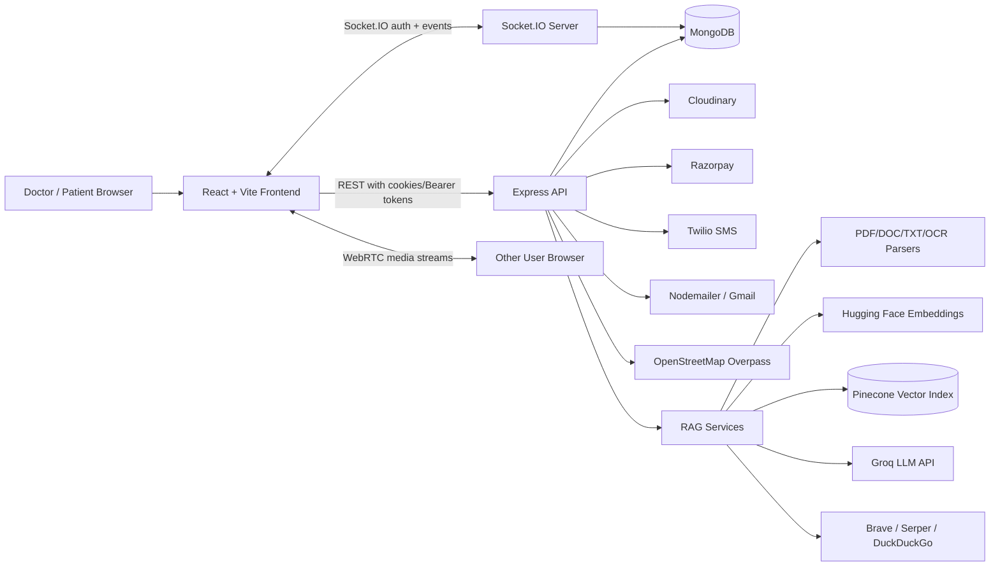

# MediConnect


MediConnect is a full-stack healthcare platform that connects patients and doctors through appointment scheduling, secure authentication, real-time messaging, document-aware AI assistance, video consultation workflows, nearby healthcare discovery, medicine search, and payment processing.

> Built as a MERN stack healthcare product with modern real-time communication, RAG-powered chat, and role-specific doctor/patient experiences.

---

## Table of Contents

1. [Project Overview](#1-project-overview)
2. [Key Features](#2-key-features)
3. [Tech Stack](#3-tech-stack)
4. [Architecture](#4-architecture)
5. [Installation & Setup](#5-installation--setup)
6. [Security Features](#6-security-features)
7. [AI & Intelligent Features](#7-ai--intelligent-features)
8. [Screenshots / Demo Section](#8-screenshots--demo-section)
9. [API Documentation](#9-api-documentation)
12. [License](#12-license)

---

## 1. Project Overview

### Purpose

MediConnect provides a single digital workspace where patients can discover doctors, book appointment slots, pay for consultations, chat with providers, join video calls, ask questions about doctor-shared documents, search medicines, and locate nearby clinics, hospitals, and pharmacies.

### Problem It Solves

Healthcare access often involves fragmented tools: separate platforms for doctor discovery, booking, payments, communication, prescriptions, document sharing, and follow-up questions. MediConnect combines these workflows into one application so patients and doctors can coordinate care with less friction.

### Main Objectives

| Objective | Description |
| --- | --- |
| Improve access | Help patients find verified doctors and nearby medical facilities quickly. |
| Simplify scheduling | Let doctors publish dated time slots with fees and let patients request available slots. |
| Enable digital consultations | Support real-time chat, file sharing, read receipts, typing states, and video call workflows. |
| Add trusted AI assistance | Allow patients to ask questions over doctor-uploaded documents using RAG and source-aware answers. |
| Support secure workflows | Use JWT auth, refresh tokens, OTP/email verification, password hashing, protected routes, and safer upload validation. |
| Track payment activity | Record Razorpay payments and expose doctor-side payment summaries. |

### Target Users

| User | Needs |
| --- | --- |
| Patients / Clients | Find doctors, book consultations, pay securely, message doctors, ask document questions, search medicines, locate nearby care. |
| Doctors | Register professional profiles, manage schedules, communicate with patients, upload documents for RAG, conduct video calls, view payments. |
| Developers | Extend a modular MERN codebase with healthcare, AI, real-time, and payment features. |

### Functionality 


- RAG document upload and chat Q&A.
- Groq-powered dashboard assistant with local fallback.
- Hugging Face embeddings, Pinecone vector search, MongoDB lexical/vector fallback, OCR, and hybrid web fallback.
- Socket-authenticated chat events, typing/read/delete workflows, replies, file broadcasts, and online status.
- Notifications and a real-time event system (incoming call, message, presence, appointment notifications) via Socket.IO, backed by persisted notification records.
- Automatic agentic scheduling assistant that parses natural language booking prompts, checks doctor availability, reserves slots, creates pending appointments, and issues Razorpay orders.
- Video-call lifecycle APIs, media controls, call quality, ratings, issue reporting, and history.
- S3/local chat-file storage and Cloudinary media upload behavior.
- Razorpay payment history analytics for doctors.
- Nearby facility lookup through OpenStreetMap Overpass.
- Medicine search over the `medicines` MongoDB collection.
- Render/Vercel deployment assets and the `/health` endpoint.

---

## 2. Key Features

### 🔐 Authentication & Account Management

| Feature | How It Works | Benefit |
| --- | --- | --- |
| Separate doctor and patient accounts | Doctors use `/doctor/*`; patients use `/client/*`. Both have independent models, stores, dashboards, and profile pages. | Keeps role-specific data and workflows cleanly separated. |
| Registration with avatars | Doctors and clients can register with profile details. Avatar uploads are processed with Multer and Cloudinary. | Creates richer user profiles for healthcare interactions. |
| Email OTP verification | Registration generates a 6-digit OTP that is sent through Nodemailer/Gmail and expires after 5 minutes. | Ensures email ownership before login. |
| SMS OTP support | Client registration calls Twilio SMS through `sendotp.js`; Twilio credentials are loaded from environment variables. | Adds phone-based verification support. |
| Login and logout | Credentials are validated with bcrypt comparisons. Login issues access and refresh tokens; logout clears cookies and stored refresh tokens. | Provides authenticated sessions with server-side invalidation. |
| Refresh token flow | Refresh tokens are stored on the user document and compared during refresh requests. | Allows session renewal without asking users to log in repeatedly. |
| Current-user endpoints | `/doctor/me` and `/client/me` return authenticated profile data without sensitive fields. | Powers protected dashboards and profile hydration. |
| Profile updates | Users can update profile fields and optionally upload a new avatar. Password changes are hashed. | Lets doctors and patients maintain accurate account information. |

### 🩺 Doctor Discovery & User Management

| Feature | How It Works | Benefit |
| --- | --- | --- |
| Doctor listing | `GET /doctor` returns paginated doctors with filters for specialization, experience, gender, verified status, and search. | Helps patients browse and search providers. |
| Doctor detail lookup | `GET /doctor/:id` returns public verified doctor details without secrets. | Supports doctor profile views. |
| Client listing | `GET /client` supports pagination, gender and verification filters, and sorting. | Lets doctors discover patients for chat workflows. |
| Themed doctor directory UI | React pages show doctor cards with specialization, experience, contact info, avatar fallback, and dark-mode support. | Improves browsing and scanning. |

### 📅 Appointment Scheduling & Slot Requests

| Feature | How It Works | Benefit |
| --- | --- | --- |
| Doctor schedule creation | Authenticated doctors create schedules by date with one or more time slots and fees. | Lets doctors publish availability. |
| Schedule lookup | Patients and doctors can fetch a doctor's schedule by `doctorId` and `date`. | Enables date-based appointment browsing. |
| Slot request workflow | Patients request a slot using `doctorId`, `scheduleId`, and `slotIndex`. | Turns availability into trackable appointment requests. |
| Slot status updates | Slot requests can be accepted or rejected. Accepted requests mark slots as booked and associate the patient. | Keeps booking state consistent across schedules and requests. |
| Booking portal UI | Patients search doctors, select a date, request slots, and move into payment from one flow. | Reduces friction from discovery to booking. |

### 💳 Payments & Doctor Earnings

| Feature | How It Works | Benefit |
| --- | --- | --- |
| Razorpay order creation | `/payments/order` creates an INR Razorpay order using the requested slot amount. | Starts a secure checkout flow. |
| Payment verification | `/payments/verify` validates Razorpay signatures using HMAC SHA-256. | Protects against forged payment callbacks. |
| Appointment confirmation after payment | Successful verification marks the slot request as paid and accepted, then creates a `Payment` record. | Connects payment state to booking state. |
| Doctor payment history | `/payments/history?doctorId=...` returns payment rows plus total earnings, total payments, and successful payment count. | Gives doctors lightweight financial visibility. |

### 💬 Real-Time Chat & File Sharing

| Feature | How It Works | Benefit |
| --- | --- | --- |
| Socket-authenticated chat | Socket.IO validates JWTs during connection and joins users to private rooms. | Enables secure real-time communication. |
| Create or reuse chats | `/chats/create-or-get` finds an existing doctor-patient chat or creates a new consultation chat. | Prevents duplicate chat threads. |
| Message sending | Users can send text through REST or socket events. Messages are saved in MongoDB and broadcast in real time. | Supports live consultation messaging. |
| Attachments | Chat supports PDF, DOC, DOCX, TXT, PNG, JPG, and JPEG uploads up to the configured size limit. | Allows reports, prescriptions, and images to be shared. |
| Reply previews | Messages can include a `replyTo` snapshot with content, type, file ID, and sender metadata. | Makes conversations easier to follow. |
| Read receipts | `mark-read` stores `readBy` metadata and emits `messagesRead`. | Gives participants delivery/read awareness. |
| Message deletion window | Users can delete their own messages within 5 minutes. | Gives a short correction window while preserving consultation integrity. |
| Typing and presence events | Sockets broadcast typing, online/offline, status updates, and online-user lists. | Makes chat feel active and responsive. |

### 🔔 Notifications & Real-Time Events

| Feature | How It Works | Benefit |
| --- | --- | --- |
| Incoming call notifications | Call initiation emits `incomingCall` to the target user's private socket room. | Alerts doctors or patients when a consultation call starts. |
| Call status notifications | Accept, reject, and end actions emit `callAccepted`, `callRejected`, and `callEnded`. | Keeps both participants synchronized during video workflows. |
| Message notifications | New messages, file uploads, RAG answers, read receipts, and deletions are broadcast to chat rooms. | Keeps conversations live without page refreshes. |
| Presence updates | Online, offline, custom status, and online-user events are emitted through Socket.IO. | Helps users know when contacts are available. |
| Appointment reminders | A backend cron job detects upcoming accepted appointments and sends appointment reminder notifications to both doctor and patient. | Helps users prepare for upcoming consultations. |

### 🤖 AI Features

| Feature | How It Works | Benefit |
| --- | --- | --- |
| Dashboard assistant | `POST /chat` sends dashboard questions to Groq's OpenAI-compatible API when `GROQ_API_KEY` is configured, with a simple local fallback. | Helps users navigate app actions without leaving the dashboard. |
| RAG document Q&A | Doctor-uploaded files are parsed, chunked, embedded, indexed, and queried inside the current chat session. | Lets patients ask context-aware questions about doctor-shared documents. |
| OCR for image uploads | Tesseract extracts text from PNG/JPG/JPEG files before ingestion. | Supports scanned reports and photographed documents. |
| Hybrid web fallback | If doctor documents are insufficient, optional web search adds reference snippets from Brave, Serper, or DuckDuckGo. | Gives more useful general medical-reference answers while preserving source separation. |
| Source-aware answers | AI messages include document and web sources. | Improves transparency and trust. |

### 📹 Video Consultation Workflows

| Feature | How It Works | Benefit |
| --- | --- | --- |
| Call initiation | Authenticated users initiate audio/video calls with another participant and receive a generated room ID. | Starts virtual consultations from the app. |
| WebRTC signaling | Socket.IO forwards offers, answers, and ICE candidates between online users. | Enables browser-to-browser video/audio calls. |
| Accept/reject/end lifecycle | REST endpoints update call state and notify the other participant. | Keeps call history and UI state consistent. |
| Media controls | Users can toggle camera, microphone, screen sharing, and media quality settings. | Gives users control over consultation media. |
| Call history | `/video-call/history` returns paginated call records with optional status filtering. | Allows users to review previous consultations. |
| Ratings and issue reports | Users can rate completed calls and report technical issues. | Helps track consultation quality. |

### 🗺️ Nearby Clinics, Hospitals & Pharmacies

| Feature | How It Works | Benefit |
| --- | --- | --- |
| Current-location lookup | Browser geolocation provides latitude and longitude to the clinic finder. | Finds nearby medical help based on the user's location. |
| Overpass API integration | Backend queries multiple OpenStreetMap Overpass mirrors with fallbacks. | Reduces dependency on a single map endpoint. |
| Facility categories | Results are categorized into hospitals, clinics, and dispensaries/pharmacies. | Makes map results easier to scan. |
| Leaflet map UI | Facilities render as map markers with details like address, phone, hours, website, and emergency metadata. | Gives patients location-aware healthcare discovery. |

### 💊 Medicine Search

| Feature | How It Works | Benefit |
| --- | --- | --- |
| Medicine lookup | `/medicines/search?name=...` searches the MongoDB `medicines` collection case-insensitively. | Helps users find medicine details quickly. |
| Medicine metadata | Results include name, price, discontinued status, manufacturer, type, pack size, and composition fields. | Gives users practical medication information. |
| Search history and grouping | The frontend groups results by manufacturer and stores recent search terms in component state. | Improves repeated medicine lookups. |

### 📊 Analytics, Insights & Dashboard UX

| Feature | How It Works | Benefit |
| --- | --- | --- |
| Payment summaries | Doctor payment history computes total earnings, total payments, and successful payments. | Gives doctors quick financial insight. |
| Call quality records | Video calls store ratings, feedback, duration, status, and technical issue reports. | Provides consultation-quality data. |
| Dashboard cards | Doctor and client dashboards provide quick action cards and summary UI sections. | Gives each role a clear navigation hub. |
| Theme support | `ThemeContext` stores light/dark preference in local storage. | Improves accessibility and user comfort. |

### 🚀 Deployment & Operations

| Feature | How It Works | Benefit |
| --- | --- | --- |
| Health check endpoint | `GET /health` returns status, timestamp, and uptime. | Supports monitoring and deployment checks. |
| Render config | `render.yaml` configures the backend as a Render web service. | Simplifies backend deployment. |
| Vercel config | `frontend/vercel.json` rewrites SPA routes to `index.html`. | Supports React Router in production. |
| Production examples | `.env.production.example` files describe frontend/backend production variables. | Helps configure cloud environments safely. |

---

## 3. Tech Stack

### Frontend

| Area | Technologies |
| --- | --- |
| Framework | React 19, Vite 6 |
| Styling | Tailwind CSS 4, custom CSS, responsive utility styles |
| Routing | React Router DOM 7 |
| State Management | Zustand, React Context |
| Realtime | Socket.IO Client |
| UI/UX | Lucide React, React Icons, React Hot Toast, Framer Motion, Swiper |
| Maps | Leaflet, React Leaflet, OpenStreetMap tiles |
| Media | WebRTC browser APIs |
| 3D/Animation Dependencies | Three.js, GSAP |

### Backend

| Area | Technologies |
| --- | --- |
| Runtime | Node.js, Express.js |
| Database ODM | Mongoose |
| Realtime | Socket.IO |
| Auth | JSON Web Tokens, bcrypt/bcryptjs, cookie-parser |
| File Uploads | Multer, Cloudinary, optional AWS S3 |
| Email/SMS | Nodemailer, Twilio |
| Payments | Razorpay |
| Document Parsing | pdf-parse, Mammoth, Word Extractor |
| OCR | Tesseract.js |
| HTTP Clients | Axios, Fetch |

### Database

| Store | Usage |
| --- | --- |
| MongoDB | Doctors, clients, schedules, slot requests, payments, chats, uploaded files, local RAG chunks, medicines. |
| Pinecone | Optional vector index for RAG retrieval, namespaced by chat session ID. |
| Local filesystem | Development fallback for chat file storage under `backend/public/uploads/chat`. |
| Cloudinary | Avatar/media uploads and signed access URLs for raw file resources. |
| AWS S3 | Optional production storage for chat files. |

### Authentication & Security

| Capability | Stack |
| --- | --- |
| Access tokens | JWT signed with `ACCESS_TOKEN_SECRET`. |
| Refresh tokens | JWT signed with `REFRESH_TOKEN_SECRET`, persisted on user documents. |
| Password hashing | bcryptjs/bcrypt with pre-save hooks and update hashing. |
| Cookie auth | HTTP-only cookies with secure/sameSite production settings. |
| Bearer fallback | `Authorization: Bearer <token>` supported by auth middleware. |
| OTP | Nodemailer email OTP and Twilio SMS OTP. |
| Upload validation | MIME/extension allowlist and configurable file-size limit. |
| Payment verification | Razorpay HMAC signature validation. |

### AI/ML Services & APIs

| Capability | Stack |
| --- | --- |
| Dashboard assistant | Groq OpenAI-compatible chat completions. |
| RAG orchestration | LangChain runnables and prompts. |
| LLM client | `@langchain/openai` `ChatOpenAI` configured with Groq base URL. |
| Embeddings | Hugging Face Feature Extraction API. |
| Vector search | Pinecone or MongoDB-stored local chunks with vector/lexical fallback. |
| OCR | Tesseract.js for image text extraction. |
| Web references | Brave Search, Serper, or DuckDuckGo HTML fallback. |

### Deployment & Cloud

| Layer | Tools |
| --- | --- |
| Frontend | Vercel |
| Backend | Render |
| Database | MongoDB Atlas or local MongoDB |
| Media | Cloudinary, optional AWS S3 |
| Config | `.env`, `.env.production.example`, `render.yaml`, `frontend/vercel.json` |

---

## 4. Architecture

### High-Level System Architecture



### Data Flow Explanation

1. A user signs up as a doctor or client.
2. The backend validates input, uploads avatars when present, hashes passwords, creates a user record, generates OTP metadata, and sends verification codes.
3. Verified users log in and receive access/refresh tokens through HTTP-only cookies and response payloads.
4. Protected REST routes use `isAuthenticated` to validate cookies or bearer tokens and attach `req.doctor` or `req.client`.
5. Frontend pages call REST APIs through fetch or Axios and keep user/session state in Zustand.
6. Socket.IO connections authenticate with JWTs, join user-specific rooms, and broadcast chat/video/presence events.
7. Doctors create schedules. Patients fetch schedules, request slots, complete Razorpay payment, and payment verification updates booking state.
8. Doctors and patients create chat sessions. Messages and attachments are stored in MongoDB and broadcast to participants.
9. Doctor-uploaded documents are queued for RAG ingestion. The backend extracts text, chunks it, embeds it, stores vectors/chunks, and answers patient questions with source metadata.
10. Video calls use REST APIs for call records and Socket.IO/WebRTC for signaling and media exchange.

### Component Interaction Overview

| Component | Interacts With | Responsibility |
| --- | --- | --- |
| React pages/components | Zustand stores, REST APIs, sockets | Render dashboards, forms, maps, chat, booking, payments, and video UI. |
| Auth stores | `/doctor/*`, `/client/*` | Register, login, verify, refresh, logout, load current user, update profiles. |
| Chat store/page | `/chats/*`, `/api/upload`, Socket.IO | Manage conversations, messages, files, read receipts, replies, RAG questions. |
| Video store/page | `/video-call/*`, Socket.IO, WebRTC | Manage call lifecycle, peer connections, media state, history, ratings. |
| Express routes | Controllers/services/models | Validate requests, enforce auth, orchestrate business logic. |
| Mongoose models | MongoDB | Persist users, chats, schedules, requests, payments, files, vectors, medicines. |
| RAG services | LangChain, Hugging Face, Pinecone, Groq, web search | Ingest documents and generate grounded answers. |
| Payment services | Razorpay | Create orders and verify payment signatures. |
| Map services | Overpass API | Fetch nearby medical facilities. |

---

## 5. Installation & Setup

### Prerequisites

| Tool | Recommended Version / Notes |
| --- | --- |
| Node.js | 18+ recommended |
| npm | Installed with Node.js |
| MongoDB | Local MongoDB or MongoDB Atlas |
| Cloudinary | Required for avatars and Cloudinary-backed chat file uploads |
| Twilio | Required for SMS OTP flows |
| Gmail app password or SMTP account | Required for email OTP |
| Razorpay account | Required for payments |
| Groq API key | Required for AI assistant and RAG answers |
| Hugging Face API key | Recommended for embeddings |
| Pinecone account | Optional but recommended for production RAG |
| AWS S3 bucket | Optional production chat-file storage |

### Repository Structure

```text
MediConnect/
├── backend/
│   ├── app.js
│   ├── src/
│   │   ├── config/
│   │   ├── controllers/
│   │   ├── jobs/
│   │   ├── middlewares/
│   │   ├── models/
│   │   ├── routes/
│   │   ├── services/
│   │   └── utils/
│   └── package.json
├── frontend/
│   ├── components/
│   ├── context/
│   ├── hooks/
│   ├── pages/
│   ├── store/
│   ├── src/
│   ├── utils/
│   └── package.json
├── DEPLOYMENT_GUIDE.md
├── RAG_CHAT_SETUP.md
├── render.yaml
└── README.md
```

### Environment Variables

Create `backend/.env` and `frontend/.env`. Do not commit real secrets.

#### Backend `.env`

```env
# Server
NODE_ENV=development
PORT=5000
CORS_ORIGIN=http://localhost:5173
FRONTEND_URL=http://localhost:5173
CLIENT_URL=http://localhost:5173

# Database
MONGODB_URI=mongodb://127.0.0.1:27017
DB_NAME=MediConnect

# JWT
ACCESS_TOKEN_SECRET=replace_with_long_random_secret
ACCESS_TOKEN_EXPIRY=1d
REFRESH_TOKEN_SECRET=replace_with_long_random_refresh_secret
REFRESH_TOKEN_EXPIRY=7d
EMAIL_SECRET=replace_with_email_secret

# Email / OTP
EMAIL_USER=your_email@gmail.com
EMAIL_PASS=your_gmail_app_password
TWILIO_ACCOUNT_SID=your_twilio_account_sid
TWILIO_AUTH_TOKEN=your_twilio_auth_token
TWILIO_PHONE_NUMBER=+10000000000

# Cloudinary
CLOUDINARY_NAME=your_cloud_name
CLOUDINARY_API_KEY=your_api_key
CLOUDINARY_API_SECRET=your_api_secret

# Razorpay
RAZORPAY_KEY_ID=your_razorpay_key_id
RAZORPAY_KEY_SECRET=your_razorpay_key_secret

# AI / RAG
GROQ_API_KEY=your_groq_api_key
GROQ_BASE_URL=https://api.groq.com/openai/v1
GROQ_MODEL=llama-3.1-8b-instant
GROQ_MAX_TOKENS=800
HUGGINGFACE_API_KEY=your_hugging_face_api_key
HUGGINGFACE_EMBEDDING_MODEL=sentence-transformers/all-MiniLM-L6-v2
HUGGINGFACE_EMBEDDING_BATCH_SIZE=8

# Pinecone, optional but recommended
PINECONE_API_KEY=your_pinecone_api_key
PINECONE_INDEX=medical-chat
PINECONE_DIMENSION=384
PINECONE_CREATE_INDEX=false
PINECONE_CLOUD=aws
PINECONE_REGION=us-east-1

# Hybrid web fallback, optional
WEB_SEARCH_ENABLED=true
WEB_SEARCH_RESULT_LIMIT=4
WEB_SEARCH_TIMEOUT_MS=8000
BRAVE_SEARCH_API_KEY=optional_brave_key
SERPER_API_KEY=optional_serper_key

# Chat file storage
CHAT_UPLOAD_MAX_SIZE_BYTES=10485760
BACKEND_PUBLIC_URL=http://localhost:5000
AWS_REGION=us-east-1
AWS_S3_BUCKET=
AWS_ACCESS_KEY_ID=
AWS_SECRET_ACCESS_KEY=
AWS_SIGNED_URL_EXPIRES_SECONDS=3600
```

#### Frontend `.env`

```env
VITE_API_URL=http://localhost:5000
VITE_SOCKET_URL=http://localhost:5000
VITE_BASE_URL=http://localhost:5000
REACT_APP_RAZORPAY_KEY_ID=your_razorpay_key_id
```

> Note: Most frontend code reads `VITE_API_URL`. The payment component currently references `REACT_APP_RAZORPAY_KEY_ID`; for a production Vite app, consider migrating that key to a `VITE_`-prefixed variable.

### Backend Setup

```bash
cd backend
npm install
node app.js
```

For local development with automatic restarts:

```bash
cd backend
npm test
```

The backend package currently defines `npm test` as `nodemon app.js`. You can also add explicit `start` and `dev` scripts later if preferred.

Backend runs on:

```text
http://localhost:5000
```

Health check:

```bash
curl http://localhost:5000/health
```

### Frontend Setup

```bash
cd frontend
npm install
npm run dev
```

Frontend runs on:

```text
http://localhost:5173
```

### Database Configuration

1. Start a local MongoDB server or create a MongoDB Atlas cluster.
2. Set `MONGODB_URI` to the base connection URI and `DB_NAME` to the database name.
3. The backend connects with:

```js
mongoose.connect(`${process.env.MONGODB_URI}/${process.env.DB_NAME}`)
```

4. Ensure these collections can be created by Mongoose:

| Collection / Model | Purpose |
| --- | --- |
| `doctors` | Doctor profiles and auth data |
| `clients` | Patient/client profiles and auth data |
| `schedules` | Doctor date-based slots |
| `slotrequests` | Appointment requests and payment state |
| `payments` | Razorpay payment records |
| `chats` | Chat sessions and messages |
| `uploadedfiles` | Chat document metadata and RAG status |
| `ragchunks` | Local RAG chunk and embedding fallback |
| `medicines` | Medicine search dataset |
| `videocalls` | Video call lifecycle and history |

5. Import medicine data into the `medicines` collection if you want `/medicines/search` to return results.

### Running Locally

Open two terminals:

```bash
# Terminal 1
cd backend
node app.js
```

```bash
# Terminal 2
cd frontend
npm run dev
```

Then visit:

```text
http://localhost:5173
```

### Production Deployment

| Layer | Recommended Setup |
| --- | --- |
| Frontend | Deploy `frontend/` to Vercel. |
| Backend | Deploy `backend/` to Render using `render.yaml` or a web service. |
| Database | Use MongoDB Atlas. |
| Media | Use Cloudinary and optionally AWS S3 for chat files. |
| RAG | Use Pinecone for vector search and keep `PINECONE_CREATE_INDEX=false` after provisioning. |

More detailed deployment notes are available in:

- [`DEPLOYMENT_GUIDE.md`](DEPLOYMENT_GUIDE.md)
- [`RAG_CHAT_SETUP.md`](RAG_CHAT_SETUP.md)
- [`DEPLOYMENT_CHECKLIST.md`](DEPLOYMENT_CHECKLIST.md)

---

## 6. Security Features

| Security Feature | Implementation |
| --- | --- |
| JWT Authentication | Access tokens are signed with `ACCESS_TOKEN_SECRET`. Auth middleware validates cookies first, then `Authorization: Bearer` headers. |
| Refresh Tokens | Refresh tokens are signed separately, stored on user documents, and compared during refresh. |
| OTP Verification | Email OTP uses Nodemailer. Client SMS OTP uses Twilio. OTPs expire after 5 minutes. |
| Password Hashing | Doctor and client schemas hash passwords before save. Profile update handlers hash new passwords manually. |
| Protected Routes | `isAuthenticated` protects profile, logout, schedule creation, slot requests, chat, upload, and video-call routes. |
| HTTP-only Cookies | Login and refresh flows set `accessToken` and `refreshToken` cookies with `httpOnly`, `secure` in production, and sameSite handling. |
| CORS Allowlist | Backend accepts configured origins plus local dev origins and allows credentials. |
| Upload Validation | Chat uploads are restricted by MIME type, extension, and size limit. |
| Signed Raw File Access | Cloudinary raw resources can use signed private download URLs. |
| Payment Signature Verification | Razorpay verification uses HMAC SHA-256 with `RAZORPAY_KEY_SECRET`. |
| Socket Authentication | Socket.IO validates JWTs before allowing realtime events. |
| Error Handling | Central Express error middleware normalizes upload-size and API errors. |

### Rate Limiting & Production Best Practices

The production example includes rate-limit environment names, but no active Express rate-limiting middleware is currently registered in `app.js`. Before public deployment, add middleware such as `express-rate-limit` for auth, OTP, upload, and AI endpoints.

Recommended hardening:

- Rotate all development secrets before deployment.
- Add `helmet` for secure HTTP headers.
- Add rate limiting for login, OTP, upload, chat, and RAG query routes.
- Add request validation with a schema library such as Zod or Joi.
- Store production chat files in S3 instead of local disk.
- Set strict CORS origins for deployed frontend URLs only.
- Use HTTPS-only cookies in production.
- Move the in-memory RAG queue to Redis/BullMQ before scaling to multiple backend instances.
- Add server-side authorization checks to payment routes if they are exposed publicly.

---

## 7. AI & Intelligent Features

### Dashboard Assistant

The dashboard chatbot is exposed through:

```text
POST /chat
GET /chat/:userId/history
```

It uses:

- `GROQ_API_KEY` for Groq chat completions.
- `GROQ_MODEL`, defaulting to `llama-3.1-8b-instant`.
- A concise system prompt that helps users navigate MediConnect actions.
- A local fallback for simple greetings/help/bye when Groq is not configured or fails.
- In-memory chat history capped to the most recent 80 messages per user.

### RAG-Based Knowledge Retrieval

MediConnect supports real-time document Q&A inside doctor-patient chats.

1. A doctor uploads a supported file.
2. The backend stores the file metadata in `UploadedFile`.
3. The upload is broadcast to the chat in real time.
4. A queue ingests the document asynchronously.
5. The RAG pipeline extracts text from PDF, DOCX, DOC, TXT, or image OCR.
6. Text is chunked into 500-character chunks with overlap.
7. Hugging Face embeddings are generated.
8. Chunks are stored in Pinecone when configured and also in MongoDB for local fallback.
9. A patient asks a question in the chat.
10. Retrieval is scoped to the current chat session and optionally to a replied file.
11. Groq generates an answer from the retrieved context.
12. The answer is saved as an AI chat message with sources.

Supported upload types:

| Type | Extensions |
| --- | --- |
| Documents | `.pdf`, `.doc`, `.docx`, `.txt` |
| Images with OCR | `.png`, `.jpg`, `.jpeg` |

### Recommendation Engine

The current project implements rule-based discovery rather than a trained ML recommendation model.

| Implemented Capability | Description |
| --- | --- |
| Doctor discovery filters | Search by name/email/specialization and filter by specialization, experience, gender, and verification status. |
| Appointment choice assistance | Patients select doctors, dates, and slots based on visible availability and fees. |
| Contextual AI guidance | The dashboard assistant can suggest app actions such as booking, messaging, finding doctors, or starting video calls. |

Future upgrade path:

- Rank doctors by location, availability, specialty match, historical booking behavior, and patient preferences.
- Add collaborative filtering or learning-to-rank over appointment outcomes.
- Personalize health content with consent-based profile and appointment context.

### Personalized Suggestions

Current personalization is implemented through role-aware dashboards, route-specific assistant guidance, filtered doctor discovery, and chat context. The app distinguishes doctor and patient experiences at the auth, UI, API, and socket layers.

### Analytics and Insights

Implemented insight features include:

| Insight | Source |
| --- | --- |
| Doctor total earnings | Aggregated from `Payment` records. |
| Total payments | Counted from doctor payment history. |
| Successful payments | Filtered by payment status. |
| Video call duration/status | Stored in `VideoCall`. |
| Call quality rating/feedback | Stored after completed calls. |
| RAG source transparency | Returned as document and web source metadata. |

### Medical Safety Boundaries

The AI prompts are designed to:

- Prefer doctor-provided documents and replied-message context.
- Avoid hidden knowledge when document context is expected.
- Clearly separate uploaded document facts from web reference context.
- Return a fallback message when evidence is insufficient.
- Avoid diagnosis in the dashboard assistant and direct urgent symptoms toward medical care or emergency services.

---

## 8. Screenshots / Demo Section

Add screenshots or GIFs to `docs/screenshots/` and update the table below.

| Area | Placeholder | Notes |
| --- | --- | --- |
| Home page | `docs/screenshots/home.png` | Landing page with navbar, services, about, contact, footer. |
| Doctor dashboard | `docs/screenshots/doctor-dashboard.png` | Doctor portal action cards and assistant. |
| Client dashboard | `docs/screenshots/client-dashboard.png` | Patient portal action cards and assistant. |
| Booking flow | `docs/screenshots/booking.gif` | Doctor selection, date selection, slot request, Razorpay payment. |
| Chat + RAG | `docs/screenshots/chat-rag.gif` | File upload, reply-specific question, AI answer with sources. |
| Video consultation | `docs/screenshots/video-call.gif` | WebRTC call, media controls, screen sharing. |
| Nearby clinics | `docs/screenshots/nearby-clinics.png` | Leaflet map with categorized facilities. |
| Medicine search | `docs/screenshots/medicine-search.png` | Medicine results grouped by manufacturer. |
| Payment history | `docs/screenshots/payment-history.png` | Doctor earnings and payment table. |

Demo links:

| Demo | URL |
| --- | --- |
| Live frontend | `https://your-vercel-app.vercel.app` |
| Backend health | `https://your-render-service.onrender.com/health` |
| Demo video | `https://your-demo-video-link` |

---

## 9. API Documentation

Base URL for local development:

```text
http://localhost:5000
```

### Authentication Requirements

Protected endpoints accept either:

```http
Cookie: accessToken=<jwt>
```

or:

```http
Authorization: Bearer <access_token>
```

Socket.IO connections send the token in:

```js
auth: { token, userType, userId }
```

### Response Shape

Most controller responses use:

```json
{
  "statusCode": 200,
  "data": {},
  "message": "Success",
  "success": true
}
```

Some payment, schedule, slot, clinic, and medicine routes return custom JSON shapes.

### Health & Dashboard Assistant

| Method | Endpoint | Auth | Description |
| --- | --- | --- | --- |
| GET | `/health` | No | Returns service status, timestamp, and uptime. |
| POST | `/chat` | No | Dashboard assistant message. |
| GET | `/chat/:userId/history` | No | Returns in-memory dashboard assistant history for a user ID. |

Example:

```http
POST /chat
Content-Type: application/json

{
  "userId": "client_123",
  "message": "How do I book an appointment?"
}
```

Response:

```json
{
  "response": "Open Book Appointment, choose a doctor, select a date and available slot, then continue to payment.",
  "message": {
    "role": "assistant",
    "content": "Open Book Appointment, choose a doctor, select a date and available slot, then continue to payment."
  },
  "history": []
}
```

### Doctor APIs

| Method | Endpoint | Auth | Description |
| --- | --- | --- | --- |
| POST | `/doctor/register` | No | Register doctor with avatar upload. |
| POST | `/doctor/login` | No | Login doctor and issue tokens. |
| POST | `/doctor/verify-email` | No | Verify email OTP. |
| POST | `/doctor/verify-otp` | No | Verify OTP by doctor ID. |
| POST | `/doctor/logout` | Doctor | Clear tokens and logout. |
| POST | `/doctor/refresh-token` | Refresh token | Refresh access and refresh tokens. |
| GET | `/doctor/me` | Doctor | Get current doctor profile. |
| PATCH | `/doctor/update` | Doctor | Update doctor profile and optional avatar. |
| GET | `/doctor` | No | List doctors with filters and pagination. |
| GET | `/doctor/:id` | No | Get verified doctor by ID. |

Doctor registration uses `multipart/form-data`:

```http
POST /doctor/register
Content-Type: multipart/form-data

name=Jane Doe
email=jane@example.com
phone=+911234567890
password=StrongPass123
specialization=Cardiology
experience=8
degree=MD
age=38
gender=Female
avatar=<file>
```

Doctor login:

```http
POST /doctor/login
Content-Type: application/json

{
  "email": "jane@example.com",
  "password": "StrongPass123"
}
```

Response:

```json
{
  "statusCode": 200,
  "data": {
    "doctor": {
      "_id": "doctorId",
      "name": "Jane Doe",
      "email": "jane@example.com",
      "specialization": "Cardiology"
    },
    "accessToken": "jwt_access_token",
    "refreshToken": "jwt_refresh_token"
  },
  "message": "Doctor logged In Successfully",
  "success": true
}
```

List doctors:

```http
GET /doctor?page=1&limit=10&specialization=cardiology&verified=true&search=jane
```

### Client APIs

| Method | Endpoint | Auth | Description |
| --- | --- | --- | --- |
| POST | `/client/register` | No | Register client with optional avatar. |
| POST | `/client/login` | No | Login client and issue tokens. |
| POST | `/client/verify-email` | No | Verify email OTP. |
| POST | `/client/verify-otp` | No | Verify OTP by client ID. |
| POST | `/client/logout` | Client | Clear tokens and logout. |
| POST | `/client/refresh-token` | Refresh token | Refresh access and refresh tokens. |
| GET | `/client/me` | Client | Get current client profile. |
| PATCH | `/client/update` | Client | Update client profile and optional avatar. |
| GET | `/client` | No | List clients with filters and pagination. |
| GET | `/client/:id` | No | Get client by ID. |

Client registration:

```http
POST /client/register
Content-Type: multipart/form-data

name=Rahul Sharma
email=rahul@example.com
phone=+911234567890
password=StrongPass123
age=29
gender=Male
avatar=<optional-file>
```

### Schedule & Slot Request APIs

| Method | Endpoint | Auth | Description |
| --- | --- | --- | --- |
| POST | `/schedule/create` | Doctor | Create a dated schedule with slots. |
| GET | `/schedule?doctorId=:id&date=YYYY-MM-DD` | No | Fetch schedule for a doctor and date. |
| POST | `/slots/request` | Client | Request an available slot. |
| PUT | `/slots/:requestId/status` | Authenticated | Accept or reject a slot request. |

Create schedule:

```http
POST /schedule/create
Authorization: Bearer <doctor_token>
Content-Type: application/json

{
  "date": "2026-06-25",
  "slots": [
    {
      "time": "10:00",
      "fee": 500
    },
    {
      "time": "10:30",
      "fee": 500
    }
  ]
}
```

Request slot:

```http
POST /slots/request
Authorization: Bearer <client_token>
Content-Type: application/json

{
  "doctorId": "doctorId",
  "scheduleId": "scheduleId",
  "slotIndex": 0
}
```

### Payment APIs

| Method | Endpoint | Auth | Description |
| --- | --- | --- | --- |
| POST | `/payments/order` | Not guarded in current router | Create a Razorpay order. |
| POST | `/payments/verify` | Not guarded in current router | Verify payment signature and record payment. |
| GET | `/payments/history?doctorId=:id` | Not guarded in current router | Get doctor payment history and totals. |

Create order:

```http
POST /payments/order
Content-Type: application/json

{
  "slotRequestId": "slotRequestId",
  "amount": 500
}
```

Verify payment:

```http
POST /payments/verify
Content-Type: application/json

{
  "razorpay_order_id": "order_xxx",
  "razorpay_payment_id": "pay_xxx",
  "razorpay_signature": "signature_xxx",
  "slotRequestId": "slotRequestId"
}
```

Payment history response:

```json
{
  "success": true,
  "data": {
    "paymentHistory": [],
    "totalPayments": 0,
    "totalEarnings": 0,
    "successfulPayments": 0
  }
}
```

### Notification APIs

| Method | Endpoint | Auth | Description |
| --- | --- | --- | --- |
| GET | `/notifications` | Authenticated | Fetch current user's notification list. |
| GET | `/notifications/unread-count` | Authenticated | Get unread notification count. |
| PATCH | `/notifications/:notificationId/read` | Authenticated | Mark a notification as read. |
| PATCH | `/notifications/read-all` | Authenticated | Mark all notifications as read. |

### Agent APIs

| Method | Endpoint | Auth | Description |
| --- | --- | --- | --- |
| POST | `/agent/query` | Client | Natural-language scheduling assistant for doctor search, availability, booking, and payment preparation. |

### Chat & RAG APIs

Chat routes are mounted at both `/chats` and `/api/chats`.

| Method | Endpoint | Auth | Description |
| --- | --- | --- | --- |
| POST | `/chats/create-or-get` | Authenticated | Create or retrieve a chat with a participant. |
| GET | `/chats/user-chats` | Authenticated | List current user's active chats. |
| POST | `/chats/send-message` | Authenticated | Send text or multipart file message. |
| POST | `/chats/:chatId/query` | Authenticated | Ask a RAG question in a chat. |
| GET | `/chats/:chatId/messages?page=1&limit=50` | Authenticated | Get paginated messages. |
| PATCH | `/chats/:chatId/mark-read` | Authenticated | Mark message IDs as read. |
| DELETE | `/chats/:chatId/messages/:messageId` | Authenticated | Delete own message within 5 minutes. |
| POST | `/api/upload` | Doctor | Upload a doctor document for RAG ingestion. |
| GET | `/api/chats/:sessionId/files` | Authenticated | List uploaded files for a chat session. |

Create or get chat:

```http
POST /chats/create-or-get
Authorization: Bearer <token>
Content-Type: application/json

{
  "participantId": "doctorOrClientId",
  "participantType": "Doctor"
}
```

Send text message:

```http
POST /chats/send-message
Authorization: Bearer <token>
Content-Type: application/json

{
  "chatId": "chatId",
  "content": "Hello doctor",
  "messageType": "text"
}
```

Ask document question:

```http
POST /chats/chatId/query
Authorization: Bearer <token>
Content-Type: application/json

{
  "question": "What does this report say about hemoglobin?",
  "replyTo": {
    "messageId": "messageIdWithFile"
  }
}
```

Response:

```json
{
  "statusCode": 200,
  "data": {
    "answer": "According to report.pdf, ...",
    "sources": {
      "documents": ["report.pdf"],
      "web": []
    },
    "message": {
      "messageType": "ai"
    }
  },
  "message": "Question answered successfully",
  "success": true
}
```

Upload RAG file:

```http
POST /api/upload
Authorization: Bearer <doctor_token>
Content-Type: multipart/form-data

sessionId=chatId
doctorId=doctorId
file=<pdf/doc/docx/txt/png/jpg/jpeg>
```

### Video Call APIs

All video routes are protected by `isAuthenticated`.

| Method | Endpoint | Auth | Description |
| --- | --- | --- | --- |
| POST | `/video-call/initiate` | Authenticated | Start a call with a participant. |
| PATCH | `/video-call/:callId/accept` | Authenticated | Accept a call. |
| PATCH | `/video-call/:callId/reject` | Authenticated | Reject a call. |
| PATCH | `/video-call/:callId/end` | Authenticated | End a call and calculate duration. |
| GET | `/video-call/history` | Authenticated | Get paginated call history. |
| GET | `/video-call/active` | Authenticated | Get active calls. |
| POST | `/video-call/:callId/rate` | Authenticated | Rate completed call quality. |
| POST | `/video-call/:callId/report-issue` | Authenticated | Report a technical issue. |
| PATCH | `/video-call/:callId/camera` | Authenticated | Toggle camera state. |
| PATCH | `/video-call/:callId/microphone` | Authenticated | Toggle microphone state. |
| PATCH | `/video-call/:callId/screen-share` | Authenticated | Toggle screen sharing. |
| GET | `/video-call/:callId/media-permissions` | Authenticated | Get current media state. |
| PATCH | `/video-call/:callId/quality` | Authenticated | Update video/audio quality setting. |

Initiate call:

```http
POST /video-call/initiate
Authorization: Bearer <token>
Content-Type: application/json

{
  "participantId": "otherUserId",
  "participantType": "Doctor",
  "callType": "video",
  "cameraEnabled": true,
  "microphoneEnabled": true
}
```

Toggle media:

```http
PATCH /video-call/callId/camera
Authorization: Bearer <token>
Content-Type: application/json

{
  "enabled": false
}
```

### Clinic & Nearby Medical APIs

| Method | Endpoint | Auth | Description |
| --- | --- | --- | --- |
| GET | `/clinics/nearby-medical?lat=:lat&lng=:lng&radius=:km` | No | Fetch hospitals, clinics, and dispensaries. |
| GET | `/clinics/nearby-hospitals?lat=:lat&lng=:lng&radius=:km` | No | Fetch hospitals only. |
| GET | `/clinics/nearby-clinics?lat=:lat&lng=:lng&radius=:km` | No | Fetch clinics/doctors only. |
| GET | `/clinics/nearby-dispensaries?lat=:lat&lng=:lng&radius=:km` | No | Fetch pharmacies/dispensaries only. |

Example:

```http
GET /clinics/nearby-medical?lat=26.8467&lng=80.9462&radius=5
```

### Medicine APIs

| Method | Endpoint | Auth | Description |
| --- | --- | --- | --- |
| GET | `/medicines/search?name=:query` | No | Search medicines by name. |

Example:

```http
GET /medicines/search?name=paracetamol
```

Response:

```json
{
  "success": true,
  "data": [
    {
      "name": "Paracetamol",
      "price(₹)": 25,
      "manufacturer_name": "Example Pharma",
      "type": "tablet",
      "pack_size_label": "10 tablets",
      "short_composition1": "Paracetamol"
    }
  ]
}
```

### Realtime Socket Events

| Event | Direction | Description |
| --- | --- | --- |
| `authenticated` | Server -> Client | Confirms socket auth. |
| `joinChat` / `leaveChat` | Client -> Server | Join or leave chat rooms. |
| `newMessage` | Server -> Client | Broadcast newly saved chat messages. |
| `message:send` | Client -> Server | Socket text message flow. |
| `message:receive` | Server -> Client | Normalized chat message payload. |
| `file:upload` / `file:receive` | Both | File upload broadcast flow. |
| `query:ask` / `query:answer` | Both | RAG Q&A over Socket.IO. |
| `messagesRead` | Server -> Client | Read receipt updates. |
| `messageDeleted` | Server -> Client | Message deletion broadcast. |
| `userOnline` / `userOffline` | Server -> Client | Presence updates. |
| `call-offer`, `call-answer`, `iceCandidate` | Both | WebRTC signaling. |
| `notification:new` | Server -> Client | Delivers new persisted notification payloads for chat, call invites, and reminders. |
| `incomingCall`, `callAccepted`, `callRejected`, `callEnded` | Server -> Client | Call lifecycle notifications. |
| `toggleVideo`, `toggleAudio`, `shareScreen` | Client -> Server | Media state events. |
| `userToggleVideo`, `userToggleAudio`, `userShareScreen` | Server -> Client | Remote media state updates. |

---

## 12. License

This project is licensed under the **ISC License** as declared in `backend/package.json`.

If you plan to publish or distribute this project, add a root-level `LICENSE` file containing the full ISC license text.
