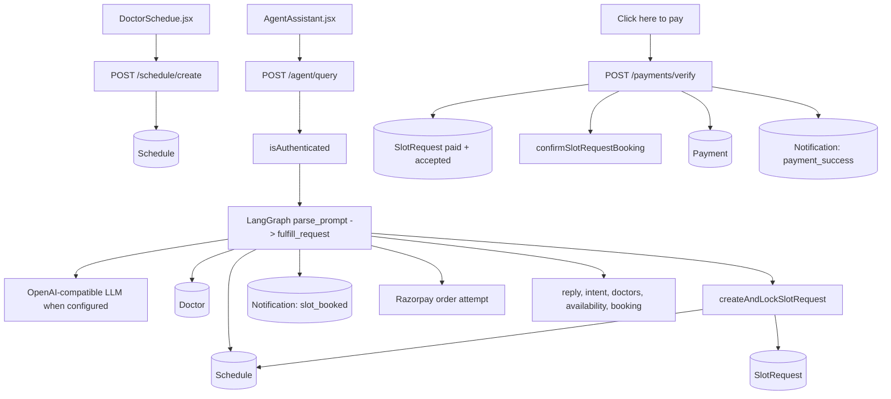
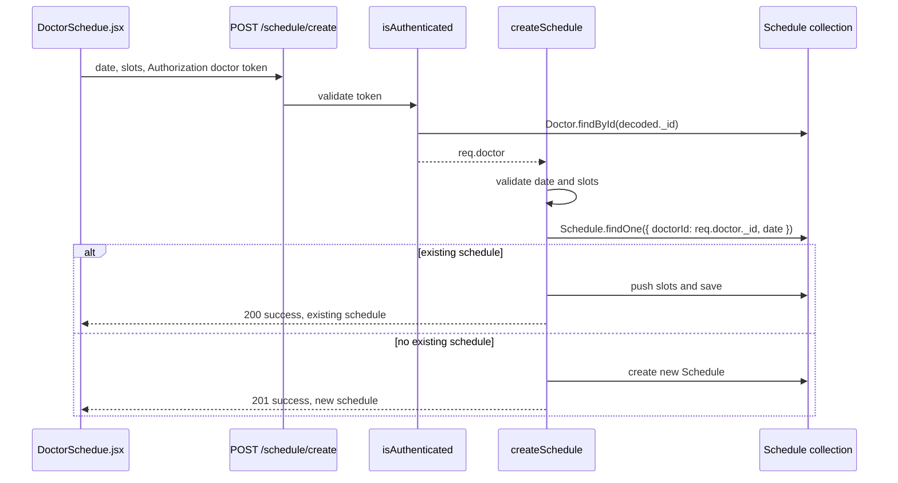
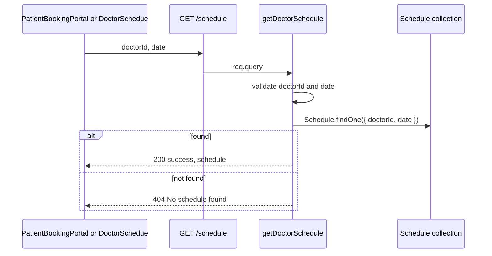
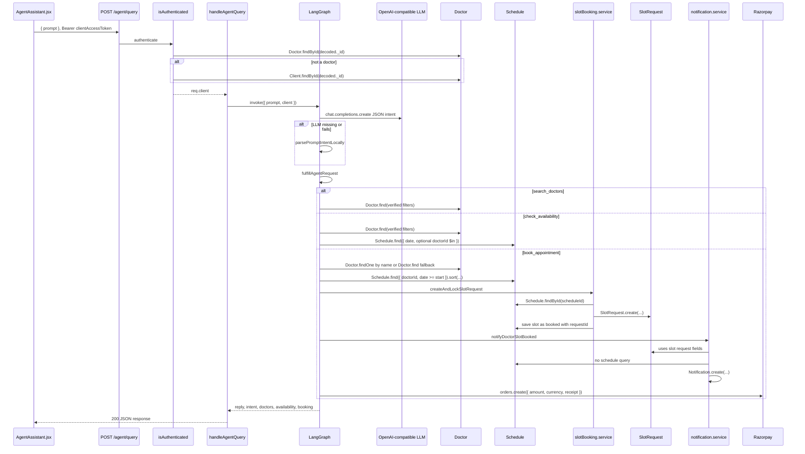
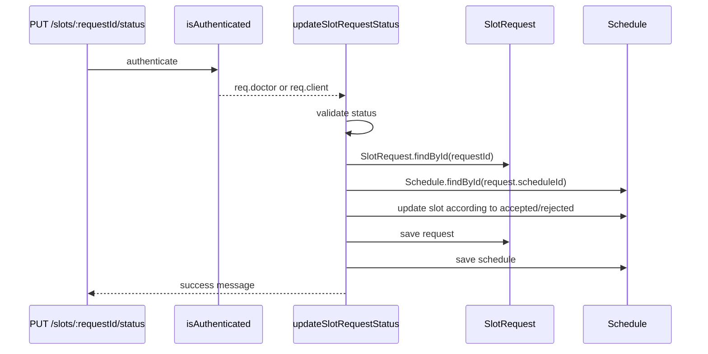
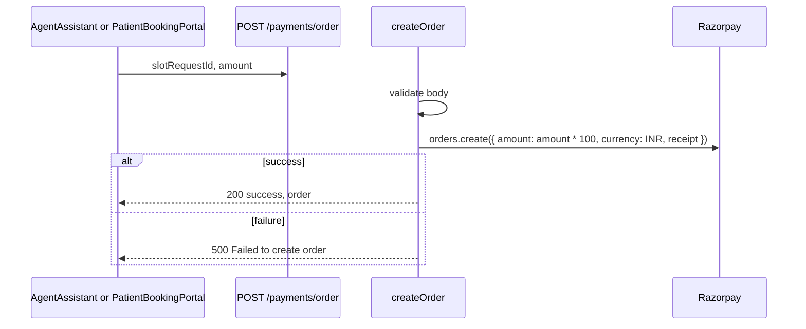
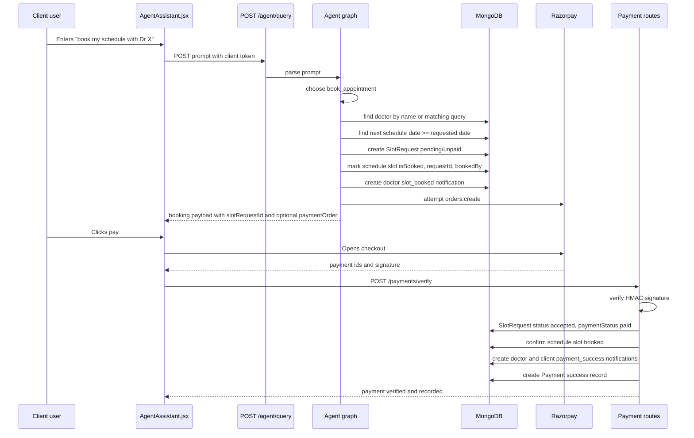
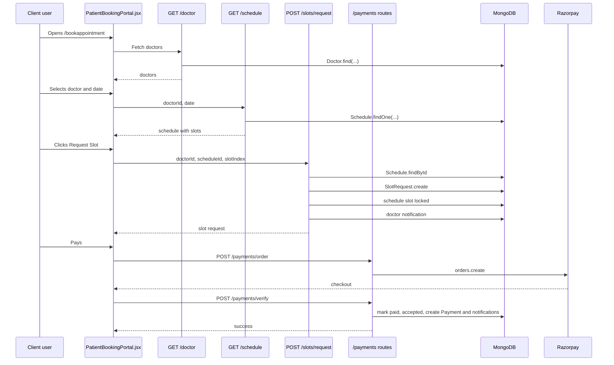

# Agentic Scheduling Workflow

This document explains the MediConnect scheduling agent strictly from the current source code. It focuses on the routes, controllers, services, helper functions, database models, LLM calls, Razorpay calls, notifications, and frontend request flow that participate in appointment scheduling.

## Source Scope

Primary backend files:

- `backend/app.js`
- `backend/src/routes/agent.routes.js`
- `backend/src/routes/schedule.routes.js`
- `backend/src/routes/slotRequest.routes.js`
- `backend/src/routes/payment.routes.js`
- `backend/src/routes/notification.routes.js`
- `backend/src/routes/doctor.routes.js`
- `backend/src/controllers/agent.controller.js`
- `backend/src/controllers/schedule.controllers.js`
- `backend/src/controllers/slotRequest.controllers.js`
- `backend/src/controllers/payment.controllers.js`
- `backend/src/controllers/notification.controllers.js`
- `backend/src/controllers/doctor.controllers.js`
- `backend/src/services/slotBooking.service.js`
- `backend/src/services/notification.service.js`
- `backend/src/jobs/appointmentReminder.cron.js`
- `backend/src/middlewares/auth.middleware.js`
- `backend/src/models/schedule.model.js`
- `backend/src/models/slotRequest.model.js`
- `backend/src/models/payment.model.js`
- `backend/src/models/notification.model.js`
- `backend/src/models/doctor.models.js`
- `backend/src/models/client.model.js`
- `backend/src/utils/razorpay.js`
- `backend/src/utils/ApiError.js`
- `backend/src/utils/asyncHandler.js`

Primary frontend files:

- `frontend/components/AgentAssistant.jsx`
- `frontend/components/PatientBookingPortal.jsx`
- `frontend/components/DoctorSchedue.jsx`
- `frontend/pages/ClientDashboard.jsx`
- `frontend/src/App.jsx`

## High Level Summary

MediConnect has two appointment paths:

1. Agentic path: the client dashboard renders `AgentAssistant`. A client sends natural language to `POST /agent/query`. The backend authenticates the client, parses intent through an OpenAI-compatible LLM when configured, falls back to local parsing when the LLM is unavailable or fails, searches doctors or schedules, and can reserve the next available slot. If booking succeeds, it creates a `SlotRequest`, locks the slot in `Schedule`, notifies the doctor, optionally creates a Razorpay order, and returns a booking card payload to the frontend.

2. Manual booking path: `PatientBookingPortal` lets a patient pick a doctor, date, and exact slot. It calls `GET /schedule`, then `POST /slots/request`, then `POST /payments/order`, then `POST /payments/verify`.

The actual booking lock is shared by both paths through `createAndLockSlotRequest` in `slotBooking.service.js`.



## Application Mounting

`backend/app.js` builds the Express app, HTTP server, CORS policy, JSON parsing, Socket.IO, route mounting, error middleware, MongoDB connection, and appointment reminder cron startup.

Scheduling routes are mounted as:

- `/schedule` to `scheduleRoutes`
- `/slots` to `slotRequestRoutes`
- `/payments` to `paymentRoutes`
- `/agent` to `agentRouter`
- `/notifications` to `notificationRouter`
- `/doctor` to `doctorRouter`

The global error middleware returns:

```json
{
  "success": false,
  "statusCode": 500,
  "message": "Internal Server Error"
}
```

For `ApiError`, the status comes from `err.statusCode`. For Multer file size errors, status is forced to `413`. In development it also includes `stack`.

## Authentication In Scheduling Routes

Function: `isAuthenticated(req, res, next)`

File: `backend/src/middlewares/auth.middleware.js`

Purpose:

- Authenticate requests using either `req.cookies.accessToken` or `Authorization: Bearer <token>`.
- Decode with `jwt.verify(token, process.env.ACCESS_TOKEN_SECRET)`.
- Find the decoded `_id` first in `Doctor`, then in `Client`.
- Attach exactly one of:
  - `req.doctor` and `req.userType = "doctor"`
  - `req.client` and `req.userType = "client"`

Parameters:

- `req`: Express request.
- `res`: Express response.
- `next`: Express next callback.

Return value:

- No direct value. Calls `next()` on success.
- Calls `next(new ApiError(...))` on auth failure.

Internal logic:

1. Reads access token from cookie or bearer header.
2. Returns `401` if missing.
3. Verifies JWT.
4. Queries `Doctor.findById(decoded._id).select("-password -refreshToken")`.
5. If no doctor, queries `Client.findById(decoded._id).select("-password -refreshToken")`.
6. Attaches user context to the request.

Called by:

- `POST /agent/query`
- `POST /schedule/create`
- `POST /slots/request`
- `PUT /slots/:requestId/status`
- Notification routes
- Several doctor auth routes

Calls:

- `jwt.verify`
- `Doctor.findById`
- `Client.findById`
- `ApiError`

Important behavior:

- The agent explicitly requires `req.client`, so an authenticated doctor receives a `403` from `handleAgentQuery`.
- `POST /schedule/create` expects `req.doctor`; a client token would authenticate but then `createSchedule` would access `req.doctor._id` and fail into its `500` catch.

## Database Models Used By Scheduling

### `Schedule`

File: `backend/src/models/schedule.model.js`

Fields:

- `doctorId`: ObjectId ref `Doctor`, required.
- `date`: string, required, documented in code as `YYYY-MM-DD`.
- `slots`: array of subdocuments:
  - `time`: string, required.
  - `fee`: number, required.
  - `isBooked`: boolean, default `false`.
  - `bookedBy`: ObjectId ref `Client`, default `null`.
  - `requestId`: ObjectId ref `SlotRequest`, default `null`.

Why it exists:

- Stores a doctor's available appointment slots for a date.
- The agent and manual booking both treat a slot as available only when `isBooked` is false and `requestId` is empty.

### `SlotRequest`

File: `backend/src/models/slotRequest.model.js`

Fields:

- `doctorId`: ObjectId ref `Doctor`, required.
- `patientId`: ObjectId ref `Client`, required.
- `scheduleId`: ObjectId ref `Schedule`, required.
- `slotIndex`: number, required.
- `date`: string, required.
- `time`: string, required.
- `fee`: number, required.
- `status`: enum `pending`, `accepted`, `rejected`, default `pending`.
- `paymentStatus`: enum `unpaid`, `paid`, default `unpaid`.
- `reminderSentAt`: Date, default `null`.

Why it exists:

- Captures the patient request or reservation for a slot.
- Payment verification updates this record to `status: "accepted"` and `paymentStatus: "paid"`.

### `Payment`

File: `backend/src/models/payment.model.js`

Fields:

- `slotRequestId`: ObjectId ref `SlotRequest`, required.
- `doctorId`: ObjectId ref `Doctor`, required.
- `patientId`: ObjectId ref `Client`, required.
- `amount`: number, required.
- `status`: enum `success`, `failed`, required.
- `transactionId`: string, required.
- `paymentGateway`: string, default `Razorpay`.

Why it exists:

- Stores successful payment records after Razorpay signature verification.

### `Notification`

File: `backend/src/models/notification.model.js`

Fields relevant to scheduling:

- `recipientId` and `recipientModel`: doctor or client recipient.
- `senderId` and `senderModel`: optional sender.
- `type`: one of `slot_booked`, `payment_success`, `appointment_reminder`, `chat_message`, `video_call_invite`.
- `title`, `message`.
- `appointment`: includes `slotRequestId`, `scheduleId`, `date`, `time`.
- `read`: boolean, default `false`.

Why it exists:

- Stores doctor and patient notifications for reserved slots, paid appointments, and reminders.

## Route 1: `POST /schedule/create`

Route file: `backend/src/routes/schedule.routes.js`

Route:

```js
router.post('/create', isAuthenticated, createSchedule);
```

Frontend caller:

- `DoctorSchedue.jsx` function `createSchedule`.

Request body sent by current frontend:

```json
{
  "doctorId": "doctor id from store, sent but ignored by controller",
  "date": "YYYY-MM-DD",
  "slots": [
    { "time": "09:30", "fee": 500 }
  ]
}
```

Authentication:

- Requires a valid token.
- Controller uses `req.doctor._id`, not `req.body.doctorId`.

Controller function: `createSchedule(req, res)`

Purpose:

- Create a new schedule for the authenticated doctor and date, or append slots to an existing schedule for that same doctor and date.

Parameters:

- `req.body.date`: required date string.
- `req.body.slots`: required non-empty array.
- `req.doctor._id`: doctor id from auth middleware.
- `res`: Express response.

Return value:

- `201` with `{ success: true, schedule: newSchedule }` when a new schedule is created.
- `200` with `{ success: true, schedule: existing, message: "Slots added to existing schedule" }` when appending to an existing schedule.
- `400` when date or slots are missing.
- `500` on exceptions.

Internal logic:

1. Reads `date` and `slots` from request body.
2. Reads `doctorId` from `req.doctor._id`.
3. Normalizes `slots` to an array, or `[]` when not an array.
4. Validates date and at least one slot.
5. Runs `Schedule.findOne({ doctorId, date })`.
6. If found, pushes new slots into `existing.slots` and saves.
7. If not found, constructs and saves a new `Schedule`.

Calls:

- `Schedule.findOne`
- `existing.save`
- `new Schedule`
- `newSchedule.save`

Called by:

- Express route `POST /schedule/create`.

Database interactions:

- Reads `Schedule` by authenticated doctor and date.
- Writes `Schedule` by insert or update.

Error handling:

- Validation failure returns `400`.
- Any thrown error returns `500` with `{ message: "Failed to create schedule", error: err.message }`.

Mermaid sequence:



## Route 2: `GET /schedule?doctorId=&date=`

Route file: `backend/src/routes/schedule.routes.js`

Route:

```js
router.get('/', getDoctorSchedule);
```

Frontend callers:

- `PatientBookingPortal.jsx` function `fetchDoctorSchedule`.
- `DoctorSchedue.jsx` function `getDoctorSchedule`.

Request query:

```text
doctorId=<doctor ObjectId>&date=YYYY-MM-DD
```

Authentication:

- The backend route does not use `isAuthenticated`.
- The current frontend sends an Authorization header in some calls, but the backend does not require or consume it for this route.

Controller function: `getDoctorSchedule(req, res)`

Purpose:

- Fetch one schedule document for a doctor and date.

Parameters:

- `req.query.doctorId`: required.
- `req.query.date`: required.
- `res`: Express response.

Return value:

- `200` with `{ success: true, schedule }`.
- `400` when `doctorId` or `date` is missing.
- `404` when no schedule exists.
- `500` on exceptions.

Internal logic:

1. Reads `doctorId` and `date` from `req.query`.
2. Validates both exist.
3. Runs `Schedule.findOne({ doctorId, date })`.
4. Returns the schedule or a not found message.

Calls:

- `Schedule.findOne`

Called by:

- Express route `GET /schedule`.

Database interactions:

- Reads one `Schedule` document.

Error handling:

- Missing query returns `400`.
- Missing schedule returns `404`.
- Thrown exceptions return `500` with `{ message: "Error fetching schedule", error: err.message }`.

Mermaid sequence:



## Route 3: `POST /agent/query`

Route file: `backend/src/routes/agent.routes.js`

Route:

```js
router.post("/query", isAuthenticated, handleAgentQuery);
```

Frontend caller:

- `AgentAssistant.jsx` function `handleSubmit`.

Request body:

```json
{
  "prompt": "I have diarrhea, show me doctors"
}
```

Request headers:

```text
Authorization: Bearer <clientAccessToken>
Content-Type: application/json
```

Controller response shape:

```json
{
  "success": true,
  "reply": "I found 2 doctors matching your description.",
  "intent": "search_doctors",
  "doctors": [],
  "availability": [],
  "booking": null
}
```

When booking succeeds, `booking` contains:

```json
{
  "doctor": {
    "_id": "doctor id",
    "name": "Doctor Name",
    "specialization": "Specialization",
    "avatar": "url"
  },
  "scheduleId": "schedule id",
  "slotRequestId": "slot request id",
  "date": "YYYY-MM-DD",
  "time": "HH:mm",
  "fee": 500,
  "paymentOrder": {}
}
```

`paymentOrder` is either the Razorpay order returned by `razorpay.orders.create` or `null` if order creation failed.

### Controller Function: `handleAgentQuery(req, res)`

Purpose:

- Entry point for the natural language scheduling agent.
- Validates client identity and prompt.
- Invokes a two-node LangGraph workflow.
- Sends normalized agent output to the frontend.

Parameters:

- `req.client`: required authenticated client document from `isAuthenticated`.
- `req.body.prompt`: required string.
- `res`: Express response.

Return value:

- `200` JSON with `success`, `reply`, `intent`, `doctors`, `availability`, and `booking`.
- Throws `ApiError(403)` if the authenticated user is not a client.
- Throws `ApiError(400)` if prompt is missing or not a string.

Internal logic:

1. Checks `req.client`.
2. Reads and validates `prompt`.
3. Calls `agentGraph.invoke({ prompt, client: req.client })`.
4. Returns graph result fields with defaults for arrays and nullable booking.

Calls:

- `agentGraph.invoke`
- `ApiError`

Called by:

- Express route `POST /agent/query`.

Error handling:

- Wrapped in `asyncHandler`, so thrown errors go to the global Express error middleware.

### LangGraph State And Nodes

State definition: `AgentState`

Fields:

- `prompt`
- `client`
- `parsed`
- `reply`
- `intent`
- `doctors`
- `availability`
- `booking`

Graph:

```js
START -> parse_prompt -> fulfill_request -> END
```

Node `parse_prompt`:

- Calls `parsePromptIntent(state.prompt)`.
- Writes `{ parsed }` into state.

Node `fulfill_request`:

- Calls `fulfillAgentRequest(state)`.
- Returns `{ reply, intent, doctors, availability, booking }`.

Why LangGraph exists here:

- It separates prompt parsing from request fulfillment while carrying a typed state object between steps.
- The current graph is linear and has no branching edges; branching is inside `fulfillAgentRequest`.

### LLM Configuration

Constants in `agent.controller.js`:

- `AGENT_MODEL`: first non-empty of `AGENT_LLM_MODEL`, `OPENROUTER_MODEL`, `GROQ_MODEL`, or fallback `"llama-3.1-8b-instant"`.
- `AGENT_API_KEY`: first non-empty of `AGENT_LLM_API_KEY`, `OPENROUTER_API_KEY`, `GROQ_API_KEY`.
- `AGENT_BASE_URL`: first non-empty of `AGENT_LLM_BASE_URL`, OpenRouter base URL when OpenRouter key exists, or Groq base URL/default.

`agentClient`:

- Created with the `openai` package only if `AGENT_API_KEY` exists.
- Uses OpenAI-compatible `chat.completions.create`.
- Adds optional OpenRouter headers from `OPENROUTER_SITE_URL` and `OPENROUTER_APP_NAME`.
- Uses `maxRetries: 0`.

External API:

- OpenAI-compatible chat completions endpoint at `AGENT_BASE_URL`.

Important behavior:

- If no LLM API key exists, the backend does not fail. It logs a warning and uses local prompt parsing.
- If the LLM request throws, the backend also falls back to local parsing.
- If the LLM returns an empty response or invalid JSON, the backend throws a `502 ApiError` unless JSON can be recovered from a `{...}` substring.

### Agent Helper Functions

#### `findSpecializations(text = "")`

Purpose:

- Map symptom keywords to doctor specializations using the hardcoded `symptomSpecializations` object.

Parameters:

- `text`: input string.

Return value:

- Array of unique specialization strings.

Internal logic:

1. Lowercases text.
2. Iterates over keyword to specialization mappings.
3. If text includes a keyword, adds mapped specializations to a `Set`.
4. Returns the set as an array.

Called by:

- `parsePromptIntentLocally`
- `parsePromptIntent` fallback parsing
- `buildDoctorFilter`
- `fulfillAgentRequest`

Calls:

- No project functions.

Why it exists:

- Provides deterministic medical-specialty hints when the prompt contains symptoms such as `diarrhea`, `fever`, `cough`, `skin`, or `injury`.

#### `inferIntentFromText(prompt)`

Purpose:

- Infer an intent from keyword matches without LLM help.

Parameters:

- `prompt`: user prompt string.

Return value:

- One of `payment_intent`, `book_appointment`, `check_availability`, `search_doctors`, or `unknown`.

Internal logic:

1. Lowercases prompt.
2. Checks payment words first.
3. Checks booking words.
4. Checks availability/date words.
5. Checks doctor/symptom words.
6. Falls back to `unknown`.

Called by:

- `parsePromptIntentLocally`
- `parsePromptIntent`

Calls:

- No project functions.

Why it exists:

- Provides local intent classification and a fallback when the LLM is unavailable.

#### `getLocalDateParts()`

Purpose:

- Get the current date in `Asia/Kolkata`.

Parameters:

- None.

Return value:

```json
{ "year": 2026, "month": 7, "day": 3 }
```

Internal logic:

1. Creates `Intl.DateTimeFormat("en-CA", { timeZone: "Asia/Kolkata", year, month, day })`.
2. Converts `formatToParts(new Date())` into an object.
3. Returns numeric year, month, and day.

Called by:

- `extractDateFromText`
- `parsePromptIntent`
- `findNextAvailableSlot`
- `fulfillAgentRequest`

Calls:

- Native `Intl.DateTimeFormat`.

Why it exists:

- Makes date parsing and default booking date use India time.

#### `toDateKey(year, month, day)`

Purpose:

- Validate and format date parts as `YYYY-MM-DD`.

Parameters:

- `year`: number.
- `month`: number.
- `day`: number.

Return value:

- Valid date string like `"2026-07-03"`.
- Empty string for missing or invalid date parts.

Internal logic:

1. Builds a UTC date from the parts.
2. Verifies the resulting UTC year, month, and day match the input.
3. Pads values and joins with hyphens.

Called by:

- `extractDateFromText`
- `normalizeDateKey`
- `parsePromptIntent`
- `findNextAvailableSlot`
- `fulfillAgentRequest`

Calls:

- Native `Date`.

Why it exists:

- Prevents invalid dates such as February 31 from becoming silently normalized dates.

#### `extractDateFromText(text = "")`

Purpose:

- Extract a date from user text.

Parameters:

- `text`: prompt string.

Return value:

- `YYYY-MM-DD` or empty string.

Internal logic:

1. Matches ISO-like dates: `YYYY-M-D`.
2. Matches numeric dates: `D/M/YYYY`, `D-M-YYYY`, with two-digit years converted to `20YY`.
3. Matches month-first text like `June12`, `June 12`, with optional year.
4. Matches day-first text like `12 June`, with optional year.
5. Uses the current India year when month-name dates omit the year.
6. Uses `toDateKey` to validate every parsed date.

Called by:

- `parsePromptIntentLocally`
- `parsePromptIntent`

Calls:

- `getLocalDateParts`
- `toDateKey`

Why it exists:

- Gives both the LLM path and the local parser a deterministic date extractor.

#### `normalizeDateKey(date = "")`

Purpose:

- Normalize a string already shaped like a date into `YYYY-MM-DD`.

Parameters:

- `date`: string.

Return value:

- Normalized date string or empty string.

Internal logic:

1. Regex-matches `YYYY-M-D`.
2. Calls `toDateKey`.

Called by:

- `parsePromptIntent`

Calls:

- `toDateKey`

Why it exists:

- Sanitizes the LLM's `date` field.

#### `isDateOnlyQuery(text = "")`

Purpose:

- Detect whether a string is only a date in `YYYY-MM-DD` form.

Parameters:

- `text`: string.

Return value:

- Boolean.

Internal logic:

- Runs a regex against the entire string.

Called by:

- `normalizeSearchQuery`

Calls:

- No project functions.

Why it exists:

- Prevents date-only text from becoming a doctor search query.

#### `normalizeSearchQuery(searchQuery = "", prompt = "")`

Purpose:

- Clean the search query returned by the LLM or local parser.

Parameters:

- `searchQuery`: candidate query.
- `prompt`: original prompt.

Return value:

- Cleaned query or empty string.

Internal logic:

1. Trims the query.
2. Returns empty for blank values.
3. Returns empty when the query equals the full prompt.
4. Returns empty for date-only query.
5. Returns empty for long generic prompts over seven words that include generic words like `find`, `available`, `book`, or `doctor`.
6. Otherwise returns the trimmed query.

Called by:

- `parsePromptIntentLocally`
- `parsePromptIntent`

Calls:

- `isDateOnlyQuery`

Why it exists:

- Keeps broad natural language prompts from becoming overly broad regex searches.

#### `escapeRegex(value = "")`

Purpose:

- Escape regex metacharacters before using a doctor name in a MongoDB regex.

Parameters:

- `value`: string.

Return value:

- Escaped string.

Called by:

- `findDoctorByName`

Calls:

- No project functions.

Why it exists:

- Prevents special characters in names from altering regex meaning.

#### `extractDoctorNameFromText(text = "")`

Purpose:

- Pull a doctor name from natural language text.

Parameters:

- `text`: prompt string.

Return value:

- Extracted name or empty string.

Internal logic:

1. If text contains `{ name }`, returns text inside braces.
2. Tries regex patterns for:
   - `Dr. <name>`
   - `doctor name: <name>`
   - `with this doctor <name>`
   - `book my schedule with <name>`
3. Removes generic words like `this`, `doctor`, `schedule`, `appointment`, `book`, `please`.
4. Only returns names with four or fewer words.

Called by:

- `parsePromptIntentLocally`
- `parsePromptIntent`

Calls:

- No project functions.

Why it exists:

- Lets booking prompts identify a specific doctor without relying entirely on LLM extraction.

#### `toAgentProviderError(error)`

Purpose:

- Normalize provider errors into an `ApiError`.

Parameters:

- `error`: error object from OpenAI-compatible client.

Return value:

- `ApiError` whose message starts with `Agent provider error:`.

Internal logic:

1. Reads status from `error.status`, `error.statusCode`, or `error.response.status`.
2. Reads a provider message from nested error fields or `error.message`.
3. Returns `new ApiError(statusCode, message)`.

Called by:

- `parsePromptIntent`

Calls:

- `ApiError`

Why it exists:

- Captures useful provider error details before the code falls back to local parsing.

#### `parsePromptIntentLocally(prompt)`

Purpose:

- Parse prompt intent without an LLM.

Parameters:

- `prompt`: user prompt string.

Return value:

```json
{
  "intent": "search_doctors",
  "searchQuery": "",
  "symptoms": ["General Physician"],
  "doctorName": "",
  "date": "2026-07-03",
  "timePreference": ""
}
```

Internal logic:

1. Extracts date using `extractDateFromText`.
2. Infers base intent using `inferIntentFromText`.
3. Computes availability and booking hints from regexes.
4. Extracts doctor name.
5. Maps symptoms to specializations.
6. Forces intent to `book_appointment` when booking words appear.
7. Forces intent to `check_availability` when a date and availability hint appear.
8. Otherwise uses inferred intent.
9. Builds `searchQuery` from doctor name if present, otherwise prompt, then normalizes it.

Called by:

- `parsePromptIntent` when no LLM client exists.
- `parsePromptIntent` when the provider request fails.

Calls:

- `extractDateFromText`
- `inferIntentFromText`
- `extractDoctorNameFromText`
- `findSpecializations`
- `normalizeSearchQuery`

Why it exists:

- Keeps the agent usable without external LLM credentials and as a runtime fallback.

#### `parsePromptIntent(prompt)`

Purpose:

- Parse the prompt with the configured LLM, while preserving deterministic fallbacks.

Parameters:

- `prompt`: user prompt string.

Return value:

- Parsed object with `intent`, `searchQuery`, `symptoms`, `doctorName`, `date`, and `timePreference`.

Internal logic:

1. If `agentClient` is not configured, logs a warning and returns `parsePromptIntentLocally(prompt)`.
2. Builds an LLM system message that requires JSON with six fields.
3. Includes today's date in `Asia/Kolkata`.
4. Calls `agentClient.chat.completions.create` with:
   - `model: AGENT_MODEL`
   - `temperature: 0`
   - `response_format: { type: "json_object" }`
   - system and user messages
5. If provider call fails, logs and returns local parsing.
6. If raw content is missing, throws `ApiError(502)`.
7. Parses JSON.
8. Uses local date extraction as a fallback over the LLM date.
9. Re-applies booking and availability intent overrides based on the original prompt.
10. Normalizes search query.
11. Uses LLM symptoms only when they are a non-empty array; otherwise uses local symptom mapping.
12. Uses LLM doctor name or local extraction.
13. If direct JSON parse fails, tries to parse the first `{...}` substring.
14. Throws `ApiError(502)` if no valid JSON can be parsed.

Called by:

- LangGraph node `parse_prompt`.

Calls:

- `parsePromptIntentLocally`
- `getLocalDateParts`
- `toDateKey`
- `agentClient.chat.completions.create`
- `toAgentProviderError`
- `extractDateFromText`
- `normalizeDateKey`
- `inferIntentFromText`
- `normalizeSearchQuery`
- `findSpecializations`
- `extractDoctorNameFromText`
- `ApiError`

Why it exists:

- Converts natural language into structured scheduling intent before database work starts.

#### `buildDoctorFilter(searchQuery, symptoms)`

Purpose:

- Build a MongoDB filter for verified doctors.

Parameters:

- `searchQuery`: string.
- `symptoms`: array.

Return value:

- MongoDB filter object.

Internal logic:

1. Starts with `{ verified: true }`.
2. If `searchQuery` exists, adds regex `$or` clauses for `name`, `email`, and `specialization`.
3. Maps specializations from `searchQuery` and `symptoms.join(" ")`.
4. If mapped specializations exist, adds an `$in` regex clause for `specialization`.
5. Adds `$or` only when there are clauses.

Called by:

- `findMatchingDoctors`

Calls:

- `findSpecializations`

Why it exists:

- Centralizes doctor search filter creation for agent search, availability, and booking fallback.

#### `findMatchingDoctors(searchQuery, symptoms)`

Purpose:

- Query verified doctors matching the parsed search query or symptoms.

Parameters:

- `searchQuery`: string.
- `symptoms`: array.

Return value:

- Mongoose query resolving to doctor documents with sensitive fields excluded.

Internal logic:

1. Calls `buildDoctorFilter`.
2. Runs `Doctor.find(filter).select("-password -refreshToken -otp -otpExpires")`.

Called by:

- `getAvailableDoctorsByDate`
- `fulfillAgentRequest`

Calls:

- `buildDoctorFilter`
- `Doctor.find`

Why it exists:

- Gives all agent branches one consistent doctor search behavior.

#### `findDoctorByName(name)`

Purpose:

- Find one verified doctor by exact or partial name.

Parameters:

- `name`: doctor name string.

Return value:

- Matching doctor document or `null`.

Internal logic:

1. Returns `null` when name is empty.
2. Escapes regex characters.
3. Searches exact case-insensitive name match.
4. If exact match fails, searches partial case-insensitive name match.
5. Excludes sensitive fields.

Called by:

- `fulfillAgentRequest` in `book_appointment` branch.

Calls:

- `escapeRegex`
- `Doctor.findOne`

Why it exists:

- Booking requires a specific doctor. This function tries the explicit doctor name before falling back to broader search.

#### `findFallbackDoctors()`

Purpose:

- Return all verified doctors.

Parameters:

- None.

Return value:

- Mongoose query resolving to all verified doctors with sensitive fields excluded.

Called by:

- `fulfillAgentRequest`

Calls:

- `Doctor.find`

Why it exists:

- Provides a broad fallback when doctor search yields no matches.

#### `getAvailableDoctorsByDate(query, symptoms, date)`

Purpose:

- Find schedules on a date that still contain available slots.

Parameters:

- `query`: search query string.
- `symptoms`: array.
- `date`: `YYYY-MM-DD`.

Return value:

```json
[
  {
    "doctor": { "_id": "...", "name": "...", "specialization": "...", "avatar": "..." },
    "date": "YYYY-MM-DD",
    "availableSlots": [{ "time": "09:30", "fee": 500, "isBooked": false, "requestId": null }]
  }
]
```

Internal logic:

1. Calls `findMatchingDoctors(query, symptoms)`.
2. Extracts candidate doctor ids.
3. Starts schedule filter as `{ date }`.
4. If any candidate doctors exist, adds `doctorId: { $in: doctorIds }`.
5. Runs `Schedule.find(filter).populate("doctorId", "name specialization avatar")`.
6. Maps each schedule to doctor, date, and slots filtered by `isSlotAvailable`.
7. Removes schedules with no available slots.

Called by:

- `fulfillAgentRequest` in `check_availability` branch and unknown fallback branch.

Calls:

- `findMatchingDoctors`
- `Schedule.find`
- `populate`
- `isSlotAvailable`

Why it exists:

- Converts parsed availability intent into a user-facing list of doctors and open slots.

Important actual behavior:

- If no candidate doctors match, the schedule filter remains `{ date }`, so it checks all doctors with schedules on that date.

#### `findNextAvailableSlot(doctorId, startingDate)`

Purpose:

- Find the first available slot for a doctor on or after a starting date.

Parameters:

- `doctorId`: doctor ObjectId.
- `startingDate`: optional `YYYY-MM-DD`.

Return value:

- `{ schedule, slotIndex, slot }` or `null`.

Internal logic:

1. Uses `startingDate`, or today in `Asia/Kolkata` if missing.
2. Runs `Schedule.find({ doctorId, date: { $gte: dateKey } }).sort({ date: 1, createdAt: 1 })`.
3. Loops schedules in sorted order.
4. Finds the first slot for which `isSlotAvailable(slot)` is true.
5. Returns schedule, slot index, and slot.
6. Returns `null` if none found.

Called by:

- `fulfillAgentRequest` in `book_appointment` branch.

Calls:

- `getLocalDateParts`
- `toDateKey`
- `Schedule.find`
- `isSlotAvailable`

Why it exists:

- Agent booking does not ask the user to pick an exact slot. It reserves the next available slot.

Important actual behavior:

- `timePreference` is parsed but not used here.
- The function searches by date only, then picks the first available slot in array order.

#### `fulfillAgentRequest({ client, prompt, parsed })`

Purpose:

- Execute the parsed intent by querying doctors, querying availability, reserving a slot, or returning a payment prompt.

Parameters:

- `client`: authenticated client document.
- `prompt`: original user prompt.
- `parsed`: object from `parsePromptIntent`.

Return value:

```json
{
  "reply": "string",
  "intent": "book_appointment",
  "doctors": [],
  "availability": [],
  "booking": null
}
```

Internal logic by intent:

`search_doctors`

1. Calls `findMatchingDoctors(searchQuery, symptoms)`.
2. If empty, maps fallback specializations from the raw prompt.
3. If still empty, calls `findFallbackDoctors()`.
4. Reply says how many doctors were found or that none matched.

`check_availability`

1. Requires `date`; otherwise throws `ApiError(400)`.
2. Calls `getAvailableDoctorsByDate(searchQuery, symptoms, date)`.
3. Reply says whether available doctors were found on that date.

`book_appointment`

1. Calls `findDoctorByName(doctorName)`.
2. If no explicit doctor match, calls `findMatchingDoctors(searchQuery, symptoms)` and takes the first result.
3. If no doctor is found, throws `ApiError(404)`.
4. Uses parsed date or today's India date as `slotSearchDate`.
5. Calls `findNextAvailableSlot(doctor._id, slotSearchDate)`.
6. If no available slot exists, throws `ApiError(404)`.
7. Calls `createAndLockSlotRequest` with:
   - `doctorId`
   - `patientId: client._id`
   - `scheduleId`
   - `slotIndex`
   - `status: "pending"`
   - `paymentStatus: "unpaid"`
8. Calls `notifyDoctorSlotBooked`.
9. Attempts to create a Razorpay order with amount `available.slot.fee * 100`.
10. If Razorpay order creation fails, logs the error and continues with `paymentOrder = null`.
11. Returns reply and booking payload.

`payment_intent`

1. Does not create or verify payment.
2. Returns a reply asking which booking the user wants to pay for.

`unknown`

1. Calls `findMatchingDoctors(searchQuery, symptoms)`.
2. If none found and prompt mentions doctors or specialists, calls `findFallbackDoctors()`.
3. If a date exists, calls `getAvailableDoctorsByDate`.
4. Reply prioritizes availability, then doctors, then an unclear-request message.

Called by:

- LangGraph node `fulfill_request`.

Calls:

- `findMatchingDoctors`
- `findSpecializations`
- `findFallbackDoctors`
- `getAvailableDoctorsByDate`
- `findDoctorByName`
- `getLocalDateParts`
- `toDateKey`
- `findNextAvailableSlot`
- `createAndLockSlotRequest`
- `notifyDoctorSlotBooked`
- `razorpay.orders.create`
- `ApiError`

Why it exists:

- This is the agent's action executor. It turns structured intent into database reads, database writes, notifications, payment-order generation, and the final API response.

### `POST /agent/query` Mermaid Sequence



## Route 4: `POST /slots/request`

Route file: `backend/src/routes/slotRequest.routes.js`

Route:

```js
router.post('/request', isAuthenticated, requestSlot);
```

Frontend caller:

- `PatientBookingPortal.jsx` function `requestSlot`.

Request body:

```json
{
  "doctorId": "doctor id",
  "scheduleId": "schedule id",
  "slotIndex": 0
}
```

Authentication:

- Requires a valid token.
- The controller requires `req.client`; doctor tokens are rejected with a JSON `401` from the controller, even though auth itself succeeds.

Controller function: `requestSlot(req, res)`

Purpose:

- Let a client reserve a specific schedule slot chosen in the UI.

Parameters:

- `req.body.doctorId`: required.
- `req.body.scheduleId`: required.
- `req.body.slotIndex`: required, can be `0`.
- `req.client._id`: required.
- `res`: Express response.

Return value:

- `201` with `{ success: true, request: newRequest }`.
- `401` if no client user exists in request.
- `400` if required fields are missing or slot service rejects the slot.
- `404` if schedule is not found in service.
- `500` for other failures.

Internal logic:

1. Logs request body and request user context.
2. Reads `doctorId`, `scheduleId`, and `slotIndex`.
3. Reads `patientId` from `req.client._id`.
4. Validates client and required fields.
5. Calls `createAndLockSlotRequest({ doctorId, patientId, scheduleId, slotIndex })`.
6. Calls `notifyDoctorSlotBooked`.
7. Returns the created `SlotRequest`.

Calls:

- `createAndLockSlotRequest`
- `notifyDoctorSlotBooked`

Called by:

- Express route `POST /slots/request`.

Database interactions:

- Delegated to `createAndLockSlotRequest`:
  - `Schedule.findById`
  - `SlotRequest.create`
  - `schedule.save`
- Delegated to `notifyDoctorSlotBooked`:
  - `Notification.create`

Error handling:

- The controller catches errors directly.
- It uses `err.statusCode || 500` and returns `{ message, error }`.

Mermaid sequence:

```mermaid
sequenceDiagram
  participant UI as PatientBookingPortal.jsx
  participant API as POST /slots/request
  participant Auth as isAuthenticated
  participant C as requestSlot
  participant S as createAndLockSlotRequest
  participant DB1 as Schedule
  participant DB2 as SlotRequest
  participant N as Notification

  UI->>API: doctorId, scheduleId, slotIndex, client token
  API->>Auth: authenticate
  Auth-->>C: req.client
  C->>C: validate client and fields
  C->>S: doctorId, patientId, scheduleId, slotIndex
  S->>DB1: Schedule.findById(scheduleId)
  S->>S: validate slot exists and is available
  S->>DB2: SlotRequest.create(...)
  S->>DB1: set requestId, isBooked, bookedBy; save
  C->>N: notifyDoctorSlotBooked(...)
  C-->>UI: 201 success, request
```

## Shared Service: `slotBooking.service.js`

### `isSlotAvailable(slot)`

Purpose:

- Determine if a schedule slot can be reserved.

Parameters:

- `slot`: schedule slot subdocument.

Return value:

- `true` only when `slot` exists, `slot.isBooked` is false, and `slot.requestId` is empty.

Called by:

- `createAndLockSlotRequest`
- `getAvailableDoctorsByDate`
- `findNextAvailableSlot`

Calls:

- No project functions.

Why it exists:

- Centralizes slot availability logic shared by agent and manual booking.

### `createAndLockSlotRequest({ doctorId, patientId, scheduleId, slotIndex, status = "pending", paymentStatus = "unpaid" })`

Purpose:

- Create a slot request and immediately mark the chosen schedule slot as booked/locked.

Parameters:

- `doctorId`: doctor ObjectId or id string.
- `patientId`: client ObjectId or id string.
- `scheduleId`: schedule ObjectId or id string.
- `slotIndex`: index into `schedule.slots`.
- `status`: optional, default `pending`.
- `paymentStatus`: optional, default `unpaid`.

Return value:

```json
{
  "request": "SlotRequest document",
  "schedule": "Schedule document",
  "slot": "slot subdocument"
}
```

Internal logic:

1. Runs `Schedule.findById(scheduleId)`.
2. Throws `Error("Schedule not found")` with `statusCode = 404` if missing.
3. Reads `schedule.slots[slotIndex]`.
4. Throws `Error("Slot index invalid")` with `statusCode = 400` if missing.
5. Calls `isSlotAvailable(slot)`.
6. Throws `Error("Slot not available")` with `statusCode = 400` if slot is booked or has `requestId`.
7. Creates a `SlotRequest` with doctor, patient, schedule, slot index, date, time, fee, status, and payment status.
8. Updates the schedule slot:
   - `requestId = request._id`
   - `isBooked = true`
   - `bookedBy = patientId`
9. Saves the schedule.
10. Returns request, schedule, and slot.

Called by:

- `requestSlot`
- `fulfillAgentRequest` booking branch

Calls:

- `Schedule.findById`
- `isSlotAvailable`
- `SlotRequest.create`
- `schedule.save`

Why it exists:

- Provides one shared lock operation for both agentic and manual slot reservation.

Important actual behavior:

- The lock is not implemented as a MongoDB transaction or atomic conditional update. It reads the schedule, checks the in-memory slot, creates a request, then saves the schedule.
- The function marks `isBooked = true` immediately even though `SlotRequest.status` is still `pending` and `paymentStatus` is still `unpaid`.

### `confirmSlotRequestBooking(slotRequestId)`

Purpose:

- Ensure the schedule slot is marked booked for an existing slot request.

Parameters:

- `slotRequestId`: SlotRequest id.

Return value:

- `null` when slot request is missing.
- `{ slotRequest, schedule: null, slot: null }` when schedule is missing.
- `{ slotRequest, schedule, slot }` when schedule exists.

Internal logic:

1. Runs `SlotRequest.findById(slotRequestId)`.
2. Returns `null` if not found.
3. Runs `Schedule.findById(slotRequest.scheduleId)`.
4. Returns partial result if schedule is not found.
5. Reads `schedule.slots[slotRequest.slotIndex]`.
6. If the slot exists, sets:
   - `requestId = slotRequest._id`
   - `isBooked = true`
   - `bookedBy = slotRequest.patientId`
7. Saves schedule.
8. Returns documents.

Called by:

- `verifyPayment`

Calls:

- `SlotRequest.findById`
- `Schedule.findById`
- `schedule.save`

Why it exists:

- Payment verification uses it to reinforce the schedule booking after marking the request paid and accepted.

## Route 5: `PUT /slots/:requestId/status`

Route file: `backend/src/routes/slotRequest.routes.js`

Route:

```js
router.put('/:requestId/status', isAuthenticated, updateSlotRequestStatus);
```

Frontend usage in current code:

- No direct frontend caller was found in the inspected scheduling components.

Request params:

```text
requestId=<slot request id>
```

Request body:

```json
{
  "status": "accepted"
}
```

Controller function: `updateSlotRequestStatus(req, res)`

Purpose:

- Allow updating a slot request to accepted or rejected.

Parameters:

- `req.params.requestId`: required.
- `req.body.status`: must be `accepted` or `rejected`.

Return value:

- `200` with `{ success: true, message: "Request accepted" }` or `"Request rejected"`.
- `400` for invalid status or invalid slot.
- `404` for missing request or schedule.
- `500` for exceptions.

Internal logic:

1. Reads `requestId` and `status`.
2. Validates status is `accepted` or `rejected`.
3. Loads `SlotRequest.findById(requestId)`.
4. Loads `Schedule.findById(request.scheduleId)`.
5. Reads `schedule.slots[request.slotIndex]`.
6. Sets `request.status = status`.
7. If accepted:
   - `request.paymentStatus = "unpaid"`
   - `slot.isBooked = true`
   - `slot.bookedBy = request.patientId`
   - `slot.requestId = request._id`
8. If rejected:
   - clears `slot.requestId`
   - sets `slot.isBooked = false`
   - clears `slot.bookedBy`
9. Saves request and schedule.

Calls:

- `SlotRequest.findById`
- `Schedule.findById`
- `request.save`
- `schedule.save`

Called by:

- Express route `PUT /slots/:requestId/status`.

Important actual behavior:

- The route is authenticated but does not check that the authenticated doctor owns the request's schedule.
- Payment verification separately sets status to `accepted` and payment status to `paid`, so this route is not required for the payment-confirmed flow.

Mermaid sequence:



## Route 6: `POST /payments/order`

Route file: `backend/src/routes/payment.routes.js`

Route:

```js
router.post('/order', createOrder);
```

Frontend callers:

- `AgentAssistant.jsx` function `createPaymentOrder`.
- `PatientBookingPortal.jsx` function `createRazorpayOrder`.

Authentication:

- The backend route does not use `isAuthenticated`.

Request body:

```json
{
  "slotRequestId": "slot request id",
  "amount": 500
}
```

Controller function: `createOrder(req, res)`

Purpose:

- Create a Razorpay order for a slot request and amount.

Parameters:

- `req.body.slotRequestId`: required.
- `req.body.amount`: required.

Return value:

- `200` with `{ success: true, order }`.
- `400` if slotRequestId or amount missing.
- `500` if Razorpay order creation fails.

Internal logic:

1. Reads `slotRequestId` and `amount`.
2. Validates both exist.
3. Builds Razorpay options:
   - `amount: amount * 100`
   - `currency: "INR"`
   - `receipt: receipt_<slotRequestId>`
4. Calls `razorpay.orders.create(options)`.
5. Returns Razorpay order.

Calls:

- `razorpay.orders.create`

Called by:

- Express route `POST /payments/order`.
- Frontend payment helpers after a booking exists.

External API:

- Razorpay Orders API through the `razorpay` Node SDK.

Important actual behavior:

- The controller does not load the `SlotRequest` to verify that `amount` matches `slotRequest.fee`.
- The route is unauthenticated in the current backend.
- Agent booking already attempts to create a Razorpay order inside `fulfillAgentRequest`, so this route is used as a fallback or retry when the frontend does not already have a payment order.

Mermaid sequence:



## Route 7: `POST /payments/verify`

Route file: `backend/src/routes/payment.routes.js`

Route:

```js
router.post('/verify', verifyPayment);
```

Frontend callers:

- `AgentAssistant.jsx` function `verifyPayment`, inside Razorpay checkout handler.
- `PatientBookingPortal.jsx` function `verifyPayment`, inside Razorpay checkout handler.

Authentication:

- The backend route does not use `isAuthenticated`.

Request body:

```json
{
  "razorpay_order_id": "order id",
  "razorpay_payment_id": "payment id",
  "razorpay_signature": "signature",
  "slotRequestId": "slot request id"
}
```

Controller function: `verifyPayment(req, res)`

Purpose:

- Verify Razorpay payment signature, mark the appointment paid and accepted, reinforce schedule booking, notify both parties, and create a `Payment` record.

Parameters:

- `req.body.razorpay_order_id`
- `req.body.razorpay_payment_id`
- `req.body.razorpay_signature`
- `req.body.slotRequestId`

Return value:

- `200` with `{ success: true, message: "Payment verified and recorded", payment }`.
- `400` if signature verification fails.
- `404` if slot request is not found.
- `500` on internal errors.

Internal logic:

1. Generates an HMAC SHA-256 signature using `process.env.RAZORPAY_KEY_SECRET`.
2. Signs the string `<razorpay_order_id>|<razorpay_payment_id>`.
3. Compares generated signature to `razorpay_signature`.
4. If mismatched, returns `400`.
5. Loads `SlotRequest.findById(slotRequestId).populate('doctorId', 'name').populate('patientId', 'name')`.
6. If missing, returns `404`.
7. Sets:
   - `slotRequest.paymentStatus = "paid"`
   - `slotRequest.status = "accepted"`
8. Saves the slot request.
9. Calls `confirmSlotRequestBooking(slotRequest._id)`.
10. Calls `notifyAppointmentPaid`.
11. Creates a `Payment` document with:
   - slot request id
   - doctor id
   - patient id
   - amount from `slotRequest.fee`
   - status `success`
   - transaction id from Razorpay payment id
12. Saves payment.
13. Returns success.

Calls:

- `crypto.createHmac`
- `SlotRequest.findById`
- `populate`
- `slotRequest.save`
- `confirmSlotRequestBooking`
- `notifyAppointmentPaid`
- `new Payment`
- `payment.save`

Called by:

- Express route `POST /payments/verify`.

Database interactions:

- Reads and writes `SlotRequest`.
- Reads and writes `Schedule` through `confirmSlotRequestBooking`.
- Creates two `Notification` records through `notifyAppointmentPaid`.
- Creates `Payment`.

External API:

- Does not call Razorpay API directly. It verifies the signature locally using Razorpay secret.

Mermaid sequence:

```mermaid
sequenceDiagram
  participant UI as Razorpay handler in frontend
  participant API as POST /payments/verify
  participant C as verifyPayment
  participant R as SlotRequest
  participant Svc as confirmSlotRequestBooking
  participant S as Schedule
  participant N as notification.service
  participant P as Payment

  UI->>API: razorpay ids, signature, slotRequestId
  C->>C: HMAC SHA-256 verification
  alt invalid signature
    C-->>UI: 400 Payment verification failed
  else valid signature
    C->>R: findById(slotRequestId).populate doctor and patient
    C->>R: set paymentStatus paid, status accepted; save
    C->>Svc: confirmSlotRequestBooking(slotRequest._id)
    Svc->>R: SlotRequest.findById
    Svc->>S: Schedule.findById
    Svc->>S: ensure slot requestId, isBooked, bookedBy; save
    C->>N: notifyAppointmentPaid(...)
    N->>N: Notification.create doctor payment_success
    N->>N: Notification.create client payment_success
    C->>P: save success payment
    C-->>UI: 200 success, payment
  end
```

## Route 8: `GET /payments/history?doctorId=`

Route file: `backend/src/routes/payment.routes.js`

Route:

```js
router.get('/history', getDoctorPaymentHistory);
```

Frontend caller:

- `DoctorPayementPortal.jsx` calls `/payments/history?doctorId=${doctorId}`.

Authentication:

- The backend route does not use `isAuthenticated`.

Controller function: `getDoctorPaymentHistory(req, res)`

Purpose:

- Fetch payment history for a doctor.

Parameters:

- `req.query.doctorId`: required.

Return value:

- `200` with `data.paymentHistory`, `totalPayments`, `totalEarnings`, and `successfulPayments`.
- `400` if doctorId missing.
- `500` on errors.

Internal logic:

1. Reads `doctorId` from query.
2. Validates it exists.
3. Runs `Payment.find({ doctorId })`.
4. Populates `patientId` with `name email age phone`.
5. Populates `slotRequestId` with `appointmentDate appointmentTime`.
6. Sorts newest first.
7. Maps payment documents into response objects.
8. Sums successful payment amounts.

Important actual behavior:

- `SlotRequest` schema has `date` and `time`, not `appointmentDate` or `appointmentTime`. Because the populate select asks for `appointmentDate appointmentTime`, the formatted history may show `N/A` for appointment date and time.

## Notification Service In Scheduling

### `createNotification({ recipientId, recipientModel, senderId = null, senderModel = null, type, title, message, appointment = {}, metadata = {} })`

Purpose:

- Create a notification document.

Parameters:

- Recipient fields, optional sender fields, type, title, message, appointment metadata, and generic metadata.

Return value:

- Promise resolving to created `Notification`.

Internal logic:

1. Builds a notification object.
2. Adds sender fields only if both sender id and sender model exist.
3. Calls `Notification.create(notification)`.

Called by:

- `notifyDoctorSlotBooked`
- `notifyAppointmentPaid`
- `notifyAppointmentReminder`
- chat/video notification helpers

Calls:

- `Notification.create`

Why it exists:

- Avoids duplicating notification document construction.

### `notifyDoctorSlotBooked({ doctorId, patientId, patientName, slotRequest })`

Purpose:

- Notify a doctor that a patient reserved an appointment slot.

Parameters:

- `doctorId`
- `patientId`
- `patientName`
- `slotRequest`

Return value:

- Promise from `createNotification`.

Internal logic:

- Creates one notification:
  - recipient: doctor
  - sender: client
  - type: `slot_booked`
  - title: `New appointment reserved`
  - message includes patient name, time, date
  - appointment includes slot request id, schedule id, date, time

Called by:

- `requestSlot`
- `fulfillAgentRequest` booking branch

Calls:

- `createNotification`

### `notifyAppointmentPaid({ doctorId, patientId, patientName, doctorName, slotRequest })`

Purpose:

- Notify both doctor and patient after payment verification succeeds.

Parameters:

- `doctorId`
- `patientId`
- `patientName`
- `doctorName`
- `slotRequest`

Return value:

- Promise resolving after both notifications are created.

Internal logic:

- Uses `Promise.all` to create:
  - Doctor notification of type `payment_success`.
  - Client notification of type `payment_success`.

Called by:

- `verifyPayment`

Calls:

- `createNotification`

### `notifyAppointmentReminder({ doctorId, patientId, patientName, doctorName, slotRequest })`

Purpose:

- Notify doctor and patient shortly before a paid appointment.

Parameters:

- `doctorId`
- `patientId`
- `patientName`
- `doctorName`
- `slotRequest`

Return value:

- Promise resolving after both reminder notifications are created.

Internal logic:

- Uses `Promise.all` to create:
  - Doctor reminder.
  - Client reminder.

Called by:

- Appointment reminder cron.

Calls:

- `createNotification`

## Notification Routes

Route file: `backend/src/routes/notification.routes.js`

All routes use `isAuthenticated`.

### `GET /notifications`

Controller: `getMyNotifications(req, res)`

Purpose:

- Return notifications for the authenticated doctor or client.

Parameters:

- Authenticated `req.doctor` or `req.client`.
- Optional `req.query.limit`, capped at 100 and defaulting to 30.

Return value:

- `ApiResponse(200, notifications, "Notifications fetched successfully")`.

Internal logic:

1. Calls `getRecipientContext(req)`.
2. Queries `Notification.find({ recipientId, recipientModel })`.
3. Sorts newest first.
4. Applies limit.

Calls:

- `getRecipientContext`
- `Notification.find`

### `GET /notifications/unread-count`

Controller: `getUnreadNotificationCount(req, res)`

Purpose:

- Count unread notifications for the authenticated user.

Parameters:

- Authenticated user context.

Return value:

- `ApiResponse(200, { count }, "Unread notification count fetched successfully")`.

Internal logic:

1. Calls `getRecipientContext(req)`.
2. Runs `Notification.countDocuments({ recipientId, recipientModel, read: false })`.

Calls:

- `getRecipientContext`
- `Notification.countDocuments`

### `PATCH /notifications/:notificationId/read`

Controller: `markNotificationRead(req, res)`

Purpose:

- Mark one notification as read, scoped to the authenticated recipient.

Parameters:

- `req.params.notificationId`.
- Authenticated user context.

Return value:

- Updated notification in an `ApiResponse`.
- Throws `ApiError(404)` if not found.

Internal logic:

1. Calls `getRecipientContext(req)`.
2. Runs `Notification.findOneAndUpdate({ _id, recipientId, recipientModel }, { read: true }, { new: true })`.

Calls:

- `getRecipientContext`
- `Notification.findOneAndUpdate`
- `ApiError`

### `PATCH /notifications/read-all`

Controller: `markAllNotificationsRead(req, res)`

Purpose:

- Mark every unread notification for the authenticated recipient as read.

Parameters:

- Authenticated user context.

Return value:

- Empty object in an `ApiResponse`.

Internal logic:

1. Calls `getRecipientContext(req)`.
2. Runs `Notification.updateMany({ recipientId, recipientModel, read: false }, { read: true })`.

Calls:

- `getRecipientContext`
- `Notification.updateMany`

### `getRecipientContext(req)`

Purpose:

- Determine the notification recipient from the authenticated request.

Parameters:

- `req` with `req.doctor` or `req.client`.

Return value:

- `{ recipientId, recipientModel }`.

Internal logic:

1. If `req.doctor` exists, returns doctor context.
2. If `req.client` exists, returns client context.
3. Throws `ApiError(401)`.

Called by:

- All notification controllers.

Calls:

- `ApiError`

## Appointment Reminder Cron

Started in:

- `backend/app.js` after MongoDB connects.

### `startAppointmentReminderCron()`

Purpose:

- Schedule periodic reminder checks.

Parameters:

- None.

Return value:

- Cron task, or `null` if disabled.

Internal logic:

1. If `DISABLE_APPOINTMENT_REMINDER_CRON === "true"`, logs and returns `null`.
2. Schedules `sendDueAppointmentReminders` using `APPOINTMENT_REMINDER_CRON` or default `*/5 * * * *`.
3. Uses timezone `Asia/Kolkata`.
4. Catches and logs reminder errors.

Calls:

- `cron.schedule`
- `sendDueAppointmentReminders`

### `sendDueAppointmentReminders()`

Purpose:

- Find paid accepted appointments due soon and notify both parties.

Parameters:

- None.

Return value:

- Promise resolving when candidates have been processed.

Internal logic:

1. Computes now and cutoff using `APPOINTMENT_REMINDER_WINDOW_MINUTES`, default 30.
2. Queries `SlotRequest.find({ status: "accepted", paymentStatus: "paid", reminderSentAt: null })`.
3. Populates doctor and patient names.
4. Limits to 100 candidates.
5. For each slot request, computes appointment datetime.
6. Skips invalid, past, or beyond-window appointments.
7. Calls `notifyAppointmentReminder`.
8. Sets `reminderSentAt = now` and saves the slot request.

Calls:

- `SlotRequest.find`
- `populate`
- `getAppointmentDateTime`
- `notifyAppointmentReminder`
- `slotRequest.save`

### `getAppointmentDateTime(slotRequest)`

Purpose:

- Convert a slot request's date and time fields to a JavaScript Date in India timezone offset.

Parameters:

- `slotRequest` containing `date` and `time`.

Return value:

- JavaScript `Date` or `null`.

Internal logic:

1. Returns null if date or time missing.
2. Trims time.
3. Accepts only `H:mm` or `HH:mm` after normalization.
4. Rejects invalid hour or minute values.
5. Returns `new Date("${date}T${HH}:${mm}:00+05:30")`.

Important actual behavior:

- Although code normalizes spaces and uppercase for non-`HH:mm` strings, it still only accepts numeric `H:mm` or `HH:mm`. Strings like `2 PM` are rejected.

## Manual Doctor Search Route Used By Booking UI

Route file: `backend/src/routes/doctor.routes.js`

Route:

```js
router.route("/").get(getAllDoctors);
```

Frontend caller:

- `PatientBookingPortal.jsx` function `fetchDoctors`.

Controller function: `getAllDoctors(req, res)`

Purpose:

- Return paginated doctors with optional filters.

Parameters:

- Query params:
  - `page`, default 1.
  - `limit`, default 10.
  - `specialization`.
  - `experience`.
  - `gender`.
  - `verified`.
  - `search`.

Return value:

- `ApiResponse` containing `{ doctors, pagination }`.

Internal logic:

1. Builds a filter object from query params.
2. Uses regex search against name, email, and specialization when `search` is provided.
3. Counts doctors with `Doctor.countDocuments(filter)`.
4. Fetches doctors with `Doctor.find(filter)`, excludes sensitive fields, sorts newest first, skips, and limits.
5. Builds pagination metadata.

Important actual behavior:

- Unlike the agent's internal doctor search, `getAllDoctors` does not default to `verified: true` unless the query explicitly includes `verified=true`.

## Frontend Agent Flow

Component: `AgentAssistant.jsx`

Rendered in:

- `ClientDashboard.jsx`.

### `handleSubmit(event)`

Purpose:

- Send the user's natural language prompt to the agent route and render the result.

Parameters:

- Form submit event.

Return value:

- No direct value. Updates React state.

Internal logic:

1. Prevents default form submission.
2. Clears previous reply, doctors, availability, booking, payment order, and messages.
3. Validates prompt is non-empty.
4. Reads `clientAccessToken` from localStorage.
5. Sends `POST ${API_URL}/agent/query` with JSON body `{ prompt }` and optional bearer token.
6. Parses response JSON.
7. If response is not OK, shows `data.message` or a fallback.
8. Stores:
   - `reply`
   - `doctors`
   - `availability`
   - `booking`
   - `paymentOrder` from `booking.paymentOrder`
9. Catches network errors and shows an unreachable-agent message.

Calls:

- Browser `fetch`.

Backend called:

- `POST /agent/query`.

### `loadRazorpayScript()`

Purpose:

- Load Razorpay checkout script into the page.

Parameters:

- None.

Return value:

- Promise resolving to `true` or `false`.

Internal logic:

1. Checks whether element id `razorpay-script` already exists.
2. If present, resolves true.
3. Otherwise injects script source `https://checkout.razorpay.com/v1/checkout.js`.
4. Resolves true on load and false on error.

Calls:

- Browser DOM APIs.

External API:

- Razorpay checkout script URL.

### `createPaymentOrder(slotRequestId, amount)`

Purpose:

- Create or recreate a Razorpay order after the agent reserved a booking.

Parameters:

- `slotRequestId`
- `amount`

Return value:

- Razorpay order object.

Internal logic:

1. Sends `POST /payments/order`.
2. Throws if response status is not OK or `data.success` is false.
3. Returns `data.order`.

Backend called:

- `POST /payments/order`.

### `verifyPayment(paymentData)`

Purpose:

- Ask backend to verify the Razorpay signature and finalize the appointment.

Parameters:

- `paymentData` with Razorpay ids, signature, and `slotRequestId`.

Return value:

- Backend verification response.

Internal logic:

1. Sends `POST /payments/verify`.
2. Throws on non-OK response or unsuccessful response.
3. Returns parsed data.

Backend called:

- `POST /payments/verify`.

### `handlePayment()`

Purpose:

- Open Razorpay checkout for the agent-created booking.

Parameters:

- None.

Return value:

- No direct value. Updates payment UI state.

Internal logic:

1. Requires `booking.slotRequestId`.
2. Loads Razorpay script.
3. Uses existing `paymentOrder` from agent response, or calls `createPaymentOrder`.
4. Builds Razorpay checkout options:
   - key from `VITE_RAZORPAY_KEY_ID`, `REACT_APP_RAZORPAY_KEY_ID`, or hardcoded fallback.
   - amount and currency from order.
   - name `MediConnect`.
   - description includes doctor name.
   - order id.
   - handler that calls `verifyPayment`.
   - notes containing slot request id, doctor id, date, time.
5. Opens checkout with `new window.Razorpay(options).open()`.
6. Updates message on success, verification failure, cancellation, or script/order errors.

Calls:

- `loadRazorpayScript`
- `createPaymentOrder`
- `verifyPayment`
- Browser `window.Razorpay`

## Frontend Manual Booking Flow

Component: `PatientBookingPortal.jsx`

Rendered by route:

- `/bookappointment` in `frontend/src/App.jsx`.

### `fetchDoctors()`

Purpose:

- Load doctors for the manual booking list.

Backend called:

- `GET /doctor`

State updates:

- Stores `data.data.doctors`.
- Shows error message on failure.

### `fetchDoctorSchedule(doctorId, date)`

Purpose:

- Fetch the selected doctor's schedule for one date.

Backend called:

- `GET /schedule?doctorId=<id>&date=<date>`

Return value:

- Schedule object when `data.success` is true.
- `null` otherwise.

### `requestSlot(scheduleId, slotIndex, slotFee)`

Purpose:

- Reserve the exact slot selected by the patient.

Backend called:

- `POST /slots/request`

Request body:

```json
{
  "doctorId": "selectedDoctor._id",
  "scheduleId": "schedule id",
  "slotIndex": 0
}
```

State updates:

- On success, stores `pendingSlotRequest` with request id, amount, doctor name, date, and time.
- Refreshes schedule by calling `fetchDoctorSchedule`.

### `createRazorpayOrder(slotRequestId, amount)`

Purpose:

- Create a Razorpay order for manual booking.

Backend called:

- `POST /payments/order`

### `verifyPayment(paymentData)`

Purpose:

- Verify manual booking payment and confirm the appointment.

Backend called:

- `POST /payments/verify`

### `handlePayment()`

Purpose:

- Open Razorpay checkout for the manual booking pending request.

Internal logic:

1. Requires `pendingSlotRequest`.
2. Loads Razorpay script.
3. Calls `createRazorpayOrder`.
4. Reads current client info from `getCurrentClient`.
5. Builds Razorpay options with prefill and notes.
6. Handler calls `verifyPayment`.
7. On success, clears pending slot request and refreshes schedule.

### Slot availability rendering

The UI computes:

```js
const hasRequest = slot.requestId !== null;
const isBooked = slot.isBooked;
const isAvailable = !isBooked && !hasRequest;
```

Only `isAvailable` slots show the `Request Slot` button.

## Frontend Doctor Schedule Flow

Component: `DoctorSchedue.jsx`

Rendered by route:

- `/doctorschedule` in `frontend/src/App.jsx`.

### `addSlot()`

Purpose:

- Add `{ time: "", fee: "" }` to local `newSchedule.slots`.

### `removeSlot(index)`

Purpose:

- Remove one slot from local form state by index.

### `updateSlot(index, field, value)`

Purpose:

- Update `time` or `fee` for one local slot.

### `createSchedule()`

Purpose:

- Validate the doctor schedule form and call the backend schedule creation route.

Backend called:

- `POST /schedule/create`

Internal logic:

1. Requires date and at least one slot.
2. Requires all slots to have time and fee.
3. Requires doctor data in auth store.
4. Sends bearer token from `doctorAccessToken`.
5. Sends date and slots with parsed numeric fee.
6. Resets form on success.

### `getDoctorSchedule()`

Purpose:

- Load a doctor's schedule for the selected date.

Backend called:

- `GET /schedule?doctorId=<doctor id>&date=<date>`

Internal logic:

1. Requires view date and doctor data.
2. Sends fetch request.
3. Stores `currentSchedule` when backend returns success.

## End To End Agent Booking Flow



## End To End Manual Booking Flow



## Request And Response Examples

### Search Doctors Through Agent

Request:

```http
POST /agent/query
Authorization: Bearer <client token>
Content-Type: application/json

{ "prompt": "I have diarrhea, show me doctors" }
```

Backend path:

1. `isAuthenticated`
2. `handleAgentQuery`
3. `agentGraph.invoke`
4. `parsePromptIntent`
5. `fulfillAgentRequest`
6. `findMatchingDoctors`
7. `Doctor.find`

Response shape:

```json
{
  "success": true,
  "reply": "I found 3 doctors matching your description.",
  "intent": "search_doctors",
  "doctors": [
    {
      "_id": "doctor id",
      "name": "Doctor Name",
      "email": "doctor@example.com",
      "specialization": "Gastroenterologist"
    }
  ],
  "availability": [],
  "booking": null
}
```

### Check Availability Through Agent

Request:

```http
POST /agent/query
Authorization: Bearer <client token>
Content-Type: application/json

{ "prompt": "find doctors available on June12" }
```

Backend path:

1. Parse date to `YYYY-MM-DD`.
2. Intent becomes `check_availability`.
3. `getAvailableDoctorsByDate`.
4. `Schedule.find({ date, optional doctorId: { $in } })`.
5. Filter slots through `isSlotAvailable`.

Response shape:

```json
{
  "success": true,
  "reply": "Here are doctors with available slots on 2026-06-12.",
  "intent": "check_availability",
  "doctors": [],
  "availability": [
    {
      "doctor": {
        "_id": "doctor id",
        "name": "Doctor Name",
        "specialization": "General Physician",
        "avatar": "url"
      },
      "date": "2026-06-12",
      "availableSlots": [
        { "time": "09:30", "fee": 500, "isBooked": false, "requestId": null }
      ]
    }
  ],
  "booking": null
}
```

### Book Through Agent

Request:

```http
POST /agent/query
Authorization: Bearer <client token>
Content-Type: application/json

{ "prompt": "book my schedule with this doctor Moksh Jain" }
```

Backend path:

1. Intent becomes `book_appointment`.
2. Doctor found by name, or first matching doctor fallback.
3. Next available slot found on or after parsed date or today.
4. `createAndLockSlotRequest`.
5. `notifyDoctorSlotBooked`.
6. Razorpay order attempt.

Response shape:

```json
{
  "success": true,
  "reply": "I have reserved the next available 09:30 slot with Dr. Moksh Jain on 2026-07-04. Complete payment to confirm your appointment.",
  "intent": "book_appointment",
  "doctors": [],
  "availability": [],
  "booking": {
    "doctor": {
      "_id": "doctor id",
      "name": "Moksh Jain",
      "specialization": "General Physician",
      "avatar": "url"
    },
    "scheduleId": "schedule id",
    "slotRequestId": "slot request id",
    "date": "2026-07-04",
    "time": "09:30",
    "fee": 500,
    "paymentOrder": {
      "id": "order_xxx",
      "amount": 50000,
      "currency": "INR"
    }
  }
}
```

## Error Handling Matrix

| Location | Condition | Status | Response source |
| --- | --- | --- | --- |
| `isAuthenticated` | Missing token | 401 | Global error middleware via `ApiError` |
| `isAuthenticated` | Invalid or expired token | 401 | Global error middleware via `ApiError` |
| `handleAgentQuery` | Authenticated user is not a client | 403 | Global error middleware via `ApiError` |
| `handleAgentQuery` | Prompt missing or not string | 400 | Global error middleware via `ApiError` |
| `parsePromptIntent` | LLM missing | No error | Uses local parser |
| `parsePromptIntent` | LLM request throws | No error | Uses local parser |
| `parsePromptIntent` | LLM returns empty content | 502 | Throws `ApiError` |
| `parsePromptIntent` | LLM returns invalid JSON | 502 | Throws `ApiError` |
| `fulfillAgentRequest` | Availability intent without date | 400 | Throws `ApiError` |
| `fulfillAgentRequest` | Booking doctor not identified | 404 | Throws `ApiError` |
| `fulfillAgentRequest` | No available slot for doctor | 404 | Throws `ApiError` |
| `fulfillAgentRequest` | Razorpay order creation fails | No error | Logs and returns booking with `paymentOrder: null` |
| `createSchedule` | Missing date or slots | 400 | Controller JSON |
| `createSchedule` | Exception | 500 | Controller JSON |
| `getDoctorSchedule` | Missing doctorId or date | 400 | Controller JSON |
| `getDoctorSchedule` | Schedule not found | 404 | Controller JSON |
| `requestSlot` | No `req.client` | 401 | Controller JSON |
| `requestSlot` | Missing required fields | 400 | Controller JSON |
| `createAndLockSlotRequest` | Schedule missing | 404 | Error with `statusCode` |
| `createAndLockSlotRequest` | Slot index invalid | 400 | Error with `statusCode` |
| `createAndLockSlotRequest` | Slot not available | 400 | Error with `statusCode` |
| `updateSlotRequestStatus` | Invalid status | 400 | Controller JSON |
| `updateSlotRequestStatus` | Request or schedule not found | 404 | Controller JSON |
| `createOrder` | Missing slotRequestId or amount | 400 | Controller JSON |
| `createOrder` | Razorpay order creation fails | 500 | Controller JSON |
| `verifyPayment` | Signature mismatch | 400 | Controller JSON |
| `verifyPayment` | Slot request not found | 404 | Controller JSON |
| `verifyPayment` | Exception after signature check | 500 | Controller JSON |

## External APIs And Libraries

### OpenAI-compatible LLM

Used by:

- `parsePromptIntent`.

Library:

- `openai`.

Configuration:

- `AGENT_LLM_API_KEY`, `OPENROUTER_API_KEY`, or `GROQ_API_KEY`.
- `AGENT_LLM_BASE_URL`, OpenRouter URL, or Groq base URL.
- `AGENT_LLM_MODEL`, `OPENROUTER_MODEL`, `GROQ_MODEL`, or `llama-3.1-8b-instant`.

Request:

- Chat completions.
- JSON object response format.
- Temperature 0.

Failure behavior:

- Provider request failure falls back to local parser.
- Empty or invalid provider content becomes `502`.

### Razorpay Node SDK

Used by:

- `fulfillAgentRequest` booking branch.
- `createOrder`.

Configuration:

- `RAZORPAY_KEY_ID`.
- `RAZORPAY_KEY_SECRET`.

Behavior:

- Agent booking attempts to create an order but continues if it fails.
- `/payments/order` returns `500` if order creation fails.

### Razorpay Checkout Browser Script

Used by:

- `AgentAssistant.jsx`.
- `PatientBookingPortal.jsx`.

Script:

- `https://checkout.razorpay.com/v1/checkout.js`

Behavior:

- Frontend opens checkout.
- Checkout handler sends Razorpay response to `/payments/verify`.

### Node Crypto

Used by:

- `verifyPayment`.

Behavior:

- Generates HMAC SHA-256 with `RAZORPAY_KEY_SECRET`.
- Compares with Razorpay signature.

## Actual Data State Transitions

### Before booking

`Schedule.slots[index]`:

```json
{
  "time": "09:30",
  "fee": 500,
  "isBooked": false,
  "bookedBy": null,
  "requestId": null
}
```

### After agent or manual reservation

Created `SlotRequest`:

```json
{
  "status": "pending",
  "paymentStatus": "unpaid",
  "date": "YYYY-MM-DD",
  "time": "09:30",
  "fee": 500
}
```

Updated `Schedule.slots[index]`:

```json
{
  "isBooked": true,
  "bookedBy": "client id",
  "requestId": "slot request id"
}
```

Created notification:

```json
{
  "recipientModel": "Doctor",
  "type": "slot_booked",
  "title": "New appointment reserved"
}
```

### After payment verification

Updated `SlotRequest`:

```json
{
  "status": "accepted",
  "paymentStatus": "paid"
}
```

Schedule slot is confirmed as booked again through `confirmSlotRequestBooking`.

Created documents:

- `Payment` with `status: "success"`.
- Doctor notification with `type: "payment_success"`.
- Client notification with `type: "payment_success"`.

## Important Source-Accurate Observations

- The agent uses a two-step LangGraph, but all intent branching is inside `fulfillAgentRequest`.
- The agent can search doctors, check availability, reserve a slot, or respond to payment intent. It does not complete payment from natural language alone.
- The agent's `timePreference` field is parsed but not used to choose a slot.
- Agent booking always chooses the first available slot in the first schedule found on or after the search date.
- `createAndLockSlotRequest` sets `isBooked = true` immediately for pending unpaid requests.
- Payment confirmation sets `SlotRequest.status = "accepted"` and `paymentStatus = "paid"`.
- `POST /payments/order` and `POST /payments/verify` are unauthenticated in current route definitions.
- `GET /schedule` is unauthenticated in current route definitions.
- `PUT /slots/:requestId/status` is authenticated but does not verify doctor ownership of the request.
- The manual booking UI and agent UI both rely on `slot.requestId` and `slot.isBooked` to prevent choosing unavailable slots.
- `frontend/store/schedule.store.js` references several endpoints such as `/schedule/my-schedule`, `/schedule/update/:id`, `/schedule/generate-slots`, and `/schedule/doctor/:doctorId/available-slots/:date`, but those routes are not present in the inspected `schedule.routes.js`.
- `getDoctorPaymentHistory` populates `slotRequestId` fields named `appointmentDate appointmentTime`, but the current `SlotRequest` schema defines `date` and `time`.

## Interview-Ready Explanation

The agentic scheduling feature is a natural-language wrapper around the same appointment reservation primitives used by manual booking. A client submits a prompt to `POST /agent/query`. The route first authenticates the user and only allows clients. The controller then invokes a LangGraph with two nodes: one node parses the prompt into structured intent, and the second node fulfills that intent.

For parsing, the system prefers an OpenAI-compatible LLM configured through environment variables. The LLM is instructed to return only JSON with `intent`, `searchQuery`, `symptoms`, `doctorName`, `date`, and `timePreference`. The code still protects the workflow with local regex and keyword parsing. If no LLM key exists or the provider request fails, the local parser extracts dates, detects booking or availability hints, maps symptoms to specializations, and extracts doctor names.

For fulfillment, the agent branches on intent. For doctor search it queries verified doctors using regex filters and symptom-specialization mapping. For availability it queries schedules on a date, populates doctor details, and returns only slots where `isBooked` is false and `requestId` is empty. For booking it identifies a doctor, finds the next available slot on or after the requested date, creates a `SlotRequest`, and locks the schedule slot by setting `requestId`, `isBooked`, and `bookedBy`.

The booking is not fully confirmed at reservation time. It is pending and unpaid. The backend notifies the doctor that a slot was reserved, then tries to create a Razorpay order. The frontend shows a booking card with a pay button. When the user pays, Razorpay returns payment ids and a signature to the browser. The browser sends them to `POST /payments/verify`. The backend verifies the HMAC signature, marks the slot request as accepted and paid, ensures the schedule slot is booked, creates doctor and client payment notifications, and stores a successful `Payment` record.

The key shared service is `createAndLockSlotRequest`. Both the agent path and manual booking path call it, so they share the same slot availability rule and slot locking behavior. That function checks the schedule, validates the slot index, rejects unavailable slots, creates the slot request, and updates the schedule slot.

The design is practical because natural-language parsing is isolated from booking mechanics. The risky operation, reserving a slot, lives in one service. The agent can fail over from LLM parsing to local parsing, and payment confirmation is handled separately through Razorpay signature verification.

