# MediConnect Detailed Route-By-Route Workflow

This document traces the current MediConnect codebase from user action to frontend state, route navigation, API request, backend controller/service work, database writes, external services, response handling, and next page.

Codebase analyzed:

- Frontend app root: `MediConnect/frontend`
- Backend app root: `MediConnect/backend`
- Frontend router: `frontend/src/App.jsx`
- Backend route registry: `backend/app.js`

Important correction: the example flow in the prompt mentions trip-planning routes such as `/dashboard/new`, flights, hotels, weather, budget, and itinerary. Those routes do not exist in this repository. This document follows the actual MediConnect routes: doctor/client auth, dashboards, appointment scheduling, payments, chat, RAG document Q&A, video calls, nearby clinics, medicine search, notifications, and the AI appointment agent.

---

## Runtime And Auth Conventions

### Frontend HTTP Client

Default client:

- File: `frontend/utils/axois.js`
- Base URL: `VITE_API_URL` or `http://localhost:5000`
- `withCredentials: true`
- Default header: `Content-Type: application/json`
- 401 interceptor: tries `POST /client/refresh-token`, then retries the failed request with the new bearer token.

Many components also send:

```http
Authorization: Bearer <doctorAccessToken or clientAccessToken>
```

Tokens are stored in localStorage by the Zustand auth stores and httpOnly cookies are also set by backend login/register/refresh flows.

### Backend Auth Middleware

File: `backend/src/middlewares/auth.middleware.js`

Every protected backend route uses `isAuthenticated`.

Flow:

1. Read JWT from `req.cookies.accessToken`.
2. If no cookie exists, read `Authorization: Bearer <token>`.
3. Verify token with `ACCESS_TOKEN_SECRET`.
4. Search `Doctor.findById(decoded._id)` first.
5. If not found, search `Client.findById(decoded._id)`.
6. Set one of:
   - `req.doctor`
   - `req.client`
   - `req.userType`
7. Reject with 401 if no token, bad token, or deleted user.

### Main Collections

- `doctors`
- `clients`
- `schedules`
- `slotrequests`
- `payments`
- `chats`
- `uploadedfiles`
- `ragchunks`
- `videocalls`
- `notifications`
- `medicines`

### Main External APIs And Services

- Cloudinary: avatar upload and chat file upload.
- Gmail SMTP via Nodemailer: doctor/client email OTP.
- Twilio: client phone OTP.
- Razorpay: payment order creation and payment verification.
- OpenRouter or Groq-compatible OpenAI API: AI appointment agent and dashboard chatbot.
- Hugging Face Inference API: RAG embeddings.
- Pinecone: optional vector storage for RAG.
- Brave Search, Serper, or DuckDuckGo HTML search: optional web evidence for RAG answers.
- Overpass API: nearby hospitals, clinics, pharmacies/dispensaries.
- OpenStreetMap tile server: map rendering.
- Razorpay Checkout script: frontend payment modal.
- Socket.IO: chat, notifications, and WebRTC signaling.

---

## Complete Navigation Tree

Actual current navigation:

```text
Landing Page /
  -> Navbar auth modal
     -> Patient Login
        -> /clientdashboard
     -> Patient Signup
        -> verification modal
        -> /clientdashboard
     -> Doctor Login
        -> /doctordashboard
     -> Doctor Signup
        -> verification modal
        -> /doctordashboard
  -> Standalone Doctor Login /login
     -> /doctordashboard
  -> Standalone Doctor Signup /signup
     -> verification modal
     -> /doctordashboard

Doctor Dashboard /doctordashboard
  -> /doctorschedule
  -> /doctorappointments
  -> /chat
  -> /video-call
  -> /doctorprofile
  -> logout -> intended /

Client Dashboard /clientdashboard
  -> /bookappointment
  -> /nearby-clinics
  -> /finddoctors
  -> /doctor/:id
  -> /chat
  -> /video-call
  -> /medicines-search
  -> /clientprofile
  -> /clientappointments (linked but no frontend route exists)
  -> logout -> intended /

Book Appointment /bookappointment
  -> select doctor in same page
  -> select date in same page
  -> request slot
  -> Razorpay checkout
  -> confirmation in same page

Doctor Schedule /doctorschedule
  -> create tab
  -> view tab

Chat /chat
  -> booked contacts
  -> chat conversation
  -> document Q&A inside same page
  -> /video-call via video icon

Video Call /video-call
  -> contacts tab
  -> active call state
  -> call history tab

Nearby Clinics /nearby-clinics
  -> geolocation prompt
  -> map and facility cards in same page

Medicine Search /medicines-search
  -> debounced search results in same page

Doctor Public Profile /doctor/:id
  -> /finddoctors
  -> /bookappointment
```

Prompt example routes not present:

```text
/dashboard/new
/dashboard/trip/:tripId/overview
/weather
/flights
/hotels
/budget
/events
/routes
/news
/itinerary
/calendar-sync
```

---

## Frontend Route Inventory

| Route | Page/component | Primary purpose |
|---|---|---|
| `/` | `HomePage` | Landing page, auth modal, contact form |
| `/login` | `DoctorLogin` | Standalone doctor login |
| `/signup` | `DoctorSignup` | Standalone doctor signup |
| `/doctordashboard` | `DoctorDashboard` | Doctor home after auth |
| `/clientdashboard` | `ClientDashboard` | Patient home after auth |
| `/doctorprofile` | `DoctorProfile` | Doctor profile view/edit |
| `/doctorappointments` | `DoctorPaymentPortal` | Doctor payment/appointment payment history |
| `/doctordirectory` | `DoctorDirectory` | Appointment directory UI, but backend endpoints are missing |
| `/chat` | `ChatPage` | Booked doctor-patient messaging and RAG Q&A |
| `/clientprofile` | `ClientProfile` | Patient profile view/edit |
| `/video-call` | `VideoCallPage` | WebRTC video calling |
| `/nearby-clinics` | `NearbyClinicsMap` | Nearby medical facilities map |
| `/medicines-search` | `MedicineSearch` | Medicine search |
| `/finddoctors` | `GetDoctor` | Doctor browsing/search |
| `/doctor/:id` | `DoctorPublicProfile` | Public doctor detail page |
| `/doctorschedule` | `ScheduleManagement` | Doctor schedule creation/viewing |
| `/bookappointment` | `PatientBookingPortal` | Patient appointment booking and payment |

---

# Page And Component Workflows

## 1. Landing Page `/`

### User Visits Landing Page

USER VISITS:
`/`

-> Renders:
`HomePage`

-> Frontend Components:

1. `Navbar`
2. `HeroSection`
3. `Services`
4. `AboutUs`
5. `ContactForm`
6. `Footer`

-> API Request:
None on initial page load.

-> Database Flow:
None.

-> Response/UI:
Static marketing/home content appears.

### Navbar Anchor Links

USER CLICKS:
`Home`, `Services`, `About`, or `Contact`

-> Current Page:
`/`, `Navbar`

-> Frontend Function:
React Router `Link`/anchor hash navigation, depending on the link.

-> State Changes:
Mobile menu may close if open.

-> Route Navigation:
Current Route: `/`
Next Location: `/#home`, `/#services`, `/#about`, or `/#contact`

-> API Request:
None.

-> Backend Flow:
None.

-> UI Updates:
Browser scrolls to the matching landing-page section.

### Navbar Theme Toggle

USER CLICKS:
Theme toggle button

-> Current Page:
`/`, `Navbar`

-> Frontend Function:
Theme context toggle.

-> State Changes:
Theme switches between light/dark mode.

-> API Request:
None.

-> Database Flow:
None.

-> UI Updates:
CSS theme changes locally.

### Navbar Mobile Menu

USER CLICKS:
Mobile hamburger/menu button

-> Current Page:
`/`, `Navbar`

-> Frontend Function:
Menu toggle handler.

-> State Changes:
Mobile menu open/closed boolean changes.

-> API Request:
None.

-> UI Updates:
Mobile navigation expands or collapses.

### Book Appointment Button Opens Auth Modal

USER CLICKS:
`Book Appointment` button

-> Current Page:
`/`, `Navbar`

-> Frontend Function:
Auth modal open handler.

-> State Changes:
`isAuthModalOpen = true`

-> Route Navigation:
Current Route: `/`
Next Route: `/`
Why: modal opens in-place.

-> API Request:
None yet.

-> UI Updates:
`AuthModal` appears.

---

## 2. Auth Modal On Landing Page

### Switch Patient/Doctor Tab

USER CLICKS:
`Patient` or `Doctor` tab

-> Current Page:
`/`, `AuthModal`

-> Frontend Function:
Auth tab setter.

-> State Changes:
Selected role becomes patient/client or doctor.

-> API Request:
None.

-> UI Updates:
Modal body swaps between client and doctor forms.

### Switch Login/Signup Mode

USER CLICKS:
`Login` or `Signup` mode control

-> Current Page:
`/`, `AuthModal`

-> Frontend Function:
Auth mode setter.

-> State Changes:
Mode becomes login or signup.

-> API Request:
None.

-> UI Updates:
Modal swaps between login and registration forms.

### Close Modal

USER CLICKS:
Close button or modal close affordance

-> Current Page:
`/`, `AuthModal`

-> Frontend Function:
Close modal handler.

-> State Changes:
`isAuthModalOpen = false`

-> API Request:
None.

-> UI Updates:
Auth modal disappears.

---

## 3. Doctor Login `/login` Or Modal Doctor Login

USER CLICKS:
`Login` submit button in `DoctorLogin`

-> Current Page/Component:
`/login` or `/` modal, `DoctorLogin`

-> Frontend Flow:

1. Email/password inputs update local form state.
2. Submit handler prevents default form submission.
3. Validates required fields.
4. Calls `useDoctorAuthStore.login(email, password)`.

-> Sends API Request:

```http
POST /doctor/login
Content-Type: application/json
withCredentials: true
```

Payload:

```json
{
  "email": "doctor@example.com",
  "password": "plain-text-password"
}
```

-> Backend Route:
`backend/src/routes/doctor.routes.js`

-> Controller:
`loginDoctor` in `backend/src/controllers/doctor.controllers.js`

-> Backend Flow:

1. Validate email/password.
2. `Doctor.findOne({ email })`.
3. `doctor.isPasswordCorrect(password)`.
4. Ensure `doctor.verified === true`.
5. Generate access token and refresh token.
6. Store refresh token on doctor document.
7. Set `accessToken` and `refreshToken` cookies.

-> Database Flow:

- Reads: `doctors`
- Updates: matching doctor `refreshToken`

-> External APIs:
None.

-> Backend Response:

```json
{
  "statusCode": 200,
  "data": {
    "doctor": "...",
    "accessToken": "...",
    "refreshToken": "..."
  },
  "message": "Doctor logged In Successfully"
}
```

-> Frontend Receives Data:

1. Stores doctor object.
2. Stores `doctorAccessToken`.
3. Clears loading/error state.

-> Next Navigation:
Current Route: `/login` or `/`
Next Route: `/doctordashboard`
Why: authenticated doctor session starts.

---

## 4. Doctor Signup `/signup` Or Modal Doctor Signup

USER CLICKS:
`Sign Up` submit button in `DoctorSignup`

-> Current Page/Component:
`/signup` or `/` modal, `DoctorSignup`

-> Frontend Flow:

1. Form inputs update local state.
2. Avatar file input stores selected file.
3. Submit builds `FormData`.
4. Calls `useDoctorAuthStore.register(formData)`.

-> Sends API Request:

```http
POST /doctor/register
Content-Type: multipart/form-data
withCredentials: true
```

Payload:

```text
name
email
password
specialization
experience
degree
age
phone
gender
avatar
```

-> Backend Route:
`backend/src/routes/doctor.routes.js`

-> Middleware:
`upload.single("avatar")` from `backend/src/middlewares/multer.middleware.js`

-> Controller:
`registerDoctor`

-> Backend Flow:

1. Validate required doctor fields and avatar.
2. Check duplicate doctor by email or phone.
3. Upload avatar to Cloudinary.
4. Generate OTP and expiration timestamp.
5. Send OTP email.
6. Create unverified doctor.
7. Return created doctor without password/refresh token.

-> Database Flow:

- Reads: `doctors` for duplicate email/phone.
- Creates: one `doctors` record with `verified: false`, `otp`, `otpExpires`.

-> External APIs:

- Cloudinary receives local avatar path and returns hosted avatar URL.
- Gmail SMTP receives email/OTP and sends verification email.

-> Backend Response:
Doctor registration success with doctor data.

-> Frontend Receives Data:

1. Stores returned doctor.
2. Shows verification modal.
3. Keeps current route until OTP verification succeeds.

-> Next Navigation:
None yet. Verification is required.

### Doctor Email Verification

USER CLICKS:
`Verify Email` button in verification modal

-> Current Component:
`DoctorSignup`

-> Frontend Function:
Verification submit handler.

-> Sends API Request:

```http
POST /doctor/verify-email
Content-Type: application/json
```

Payload:

```json
{
  "email": "doctor@example.com",
  "otp": "123456"
}
```

-> Backend Route:
`doctor.routes.js`

-> Controller:
`verifyEmail`

-> Backend Flow:

1. Find doctor by email.
2. Compare OTP.
3. Ensure OTP has not expired.
4. Set `verified: true`.
5. Clear OTP fields.

-> Database Flow:

- Reads: `doctors`
- Updates: doctor verification fields.

-> External APIs:
None.

-> Frontend Receives Data:
Verification success.

-> Next Navigation:
`/doctordashboard`

### Doctor Phone/OTP Verification

USER CLICKS:
Phone OTP verification button

-> Sends API Request:

```http
POST /doctor/verify-otp
Content-Type: application/json
```

Payload:

```json
{
  "doctorId": "<doctor-id>",
  "otp": "123456"
}
```

-> Controller:
`verifyOtp`

-> Backend Flow:

1. Find doctor by id.
2. Validate OTP and expiry.
3. Set `verified: true`.
4. Generate access/refresh cookies.

-> Database Flow:

- Reads and updates `doctors`.

-> Next Navigation:
`/doctordashboard`

---

## 5. Client Login In Landing Modal

USER CLICKS:
`Login` submit button in `ClientLogin`

-> Current Page/Component:
`/` modal, `ClientLogin`

-> Frontend Flow:

1. Email/password inputs update state.
2. Submit validates fields.
3. Calls `useClientAuthStore.login(email, password)`.

-> Sends API Request:

```http
POST /client/login
Content-Type: application/json
withCredentials: true
```

Payload:

```json
{
  "email": "patient@example.com",
  "password": "plain-text-password"
}
```

-> Backend Route:
`backend/src/routes/client.routes.js`

-> Controller:
`loginClient`

-> Backend Flow:

1. Validate email/password.
2. `Client.findOne({ email })`.
3. Check password.
4. Ensure client is verified.
5. Generate access and refresh tokens.
6. Save refresh token.
7. Set httpOnly cookies.

-> Database Flow:

- Reads: `clients`
- Updates: client `refreshToken`

-> External APIs:
None.

-> Frontend Receives Data:
Stores client and `clientAccessToken`.

-> Next Navigation:
Current Route: `/`
Next Route: `/clientdashboard`
Why: authenticated patient session starts.

---

## 6. Client Signup In Landing Modal

USER CLICKS:
`Sign Up` submit button in `ClientSignup`

-> Current Page/Component:
`/` modal, `ClientSignup`

-> Frontend Flow:

1. Form inputs update state.
2. Optional avatar file is stored.
3. Submit builds `FormData`.
4. Calls `useClientAuthStore.register(formData)`.

-> Sends API Request:

```http
POST /client/register
Content-Type: multipart/form-data
withCredentials: true
```

Payload:

```text
name
email
age
gender
password
phone
avatar optional
```

-> Backend Route:
`client.routes.js`

-> Middleware:
`upload.single("avatar")`

-> Controller:
`registerClient`

-> Backend Flow:

1. Validate required client fields.
2. Check duplicate email/phone.
3. Upload avatar to Cloudinary if provided.
4. Generate OTP.
5. Send phone OTP through Twilio utility.
6. Send email OTP through Nodemailer.
7. Create client.
8. Generate cookies/tokens.

-> Database Flow:

- Reads: `clients` for duplicate email/phone.
- Creates: one `clients` record.
- Updates: refresh token when tokens are generated.

-> External APIs:

- Cloudinary if avatar exists.
- Twilio for phone OTP.
- Gmail SMTP for email OTP.

-> Frontend Receives Data:
Stores client data and shows verification modal.

-> Next Navigation:
None until verification succeeds.

### Client Email Verification

USER CLICKS:
`Verify Email`

-> Sends API Request:

```http
POST /client/verify-email
Content-Type: application/json
```

Payload:

```json
{
  "email": "patient@example.com",
  "otp": "123456"
}
```

-> Controller:
`verifyEmail`

-> Database Flow:
Reads and updates `clients`.

-> Next Navigation:
`/clientdashboard`

### Client Phone/OTP Verification

USER CLICKS:
Phone OTP verification button

-> Sends API Request:

```http
POST /client/verify-otp
Content-Type: application/json
```

Payload:

```json
{
  "clientId": "<client-id>",
  "otp": "123456"
}
```

-> Controller:
`verifyOtp`

-> Database Flow:
Reads and updates `clients`.

-> Next Navigation:
`/clientdashboard`

---

## 7. Doctor Dashboard `/doctordashboard`

USER VISITS:
`/doctordashboard`

-> Frontend Component:
`DoctorDashboard`

-> Frontend Flow:

1. Component mounts.
2. `useDoctorAuthStore.checkAuth()` runs.
3. Store calls `GET /doctor/me`.
4. If authenticated, dashboard cards render.
5. If unauthenticated, route redirects to `/`.

-> Sends API Request:

```http
GET /doctor/me
Authorization: Bearer <doctorAccessToken>
withCredentials: true
```

-> Backend Route:
`doctor.routes.js`

-> Middleware:
`isAuthenticated`

-> Controller:
`getCurrentDoctor`

-> Database Flow:
Auth middleware reads `doctors`, then controller returns `req.doctor`.

-> Response Flow:
Doctor data returns to store and updates `doctor`, `isAuthenticated`, `isCheckingAuth`.

### Doctor Dashboard Card Navigation

USER CLICKS:
`My Schedule`

-> Current Route:
`/doctordashboard`

-> Next Route:
`/doctorschedule`

-> Why:
Doctor wants to create/view availability.

-> API Request:
None until schedule page loads or user acts.

USER CLICKS:
`Appointments` or payment history card

-> Next Route:
`/doctorappointments`

-> API Request:
None until payment portal loads.

USER CLICKS:
`Messages`

-> Next Route:
`/chat`

-> API Request:
Chat page fetches chats/contacts.

USER CLICKS:
`Video Call`

-> Next Route:
`/video-call`

-> API Request:
Video page fetches contacts, active calls, and call history.

USER CLICKS:
`Profile`

-> Next Route:
`/doctorprofile`

-> API Request:
Profile reads current store state. Save action later calls backend.

### Doctor Dashboard Logout

USER CLICKS:
`Logout` in `DoctorDashboardNavbar`

-> Frontend Function:
`useDoctorAuthStore.logout()`

-> Sends API Request:

```http
POST /doctor/logout
Authorization: Bearer <doctorAccessToken>
withCredentials: true
```

-> Backend Route:
`doctor.routes.js`

-> Middleware:
`isAuthenticated`

-> Controller:
`logoutDoctor`

-> Database Flow:
Updates `doctors`, unsets `refreshToken`.

-> Backend Response:
Clears `accessToken` and `refreshToken` cookies.

-> Frontend Receives Data:
Clears doctor store and localStorage token.

-> Next Navigation:
Intended `/`.

Observed code issue: the navbar currently calls `navigate('/ ')` with a trailing space, so the actual path can become an invalid `/%20`-style route instead of `/`.

---

## 8. Client Dashboard `/clientdashboard`

USER VISITS:
`/clientdashboard`

-> Frontend Component:
`ClientDashboard`

-> Frontend Flow:

1. Component mounts.
2. `useClientAuthStore.checkAuth()` runs.
3. Store calls `GET /client/me`.
4. If authenticated, dashboard cards render.
5. If unauthenticated, route redirects to `/`.

-> Sends API Request:

```http
GET /client/me
Authorization: Bearer <clientAccessToken>
withCredentials: true
```

-> Backend Route:
`client.routes.js`

-> Middleware:
`isAuthenticated`

-> Controller:
`getCurrentClient`

-> Database Flow:
Auth middleware reads `clients`, then controller returns `req.client`.

### Client Dashboard Card Navigation

USER CLICKS:
`Book Appointment`

-> Current Route:
`/clientdashboard`

-> Next Route:
`/bookappointment`

-> Why:
Patient wants to choose a doctor, slot, and pay.

USER CLICKS:
`My Appointments`

-> Next Route:
`/clientappointments`

-> Important:
This route is linked in the UI, but no `<Route path="/clientappointments">` exists in `App.jsx`.

USER CLICKS:
`Nearby Clinics`

-> Next Route:
`/nearby-clinics`

USER CLICKS:
`Find Doctors`

-> Next Route:
`/finddoctors`

USER CLICKS:
`Messages`

-> Next Route:
`/chat`

USER CLICKS:
`Video Call`

-> Next Route:
`/video-call`

USER CLICKS:
`Medicine Search`

-> Next Route:
`/medicines-search`

USER CLICKS:
`Profile`

-> Next Route:
`/clientprofile`

### Client Dashboard Logout

USER CLICKS:
`Logout` in `ClientDashboardNavbar`

-> Sends API Request:

```http
POST /client/logout
Authorization: Bearer <clientAccessToken>
withCredentials: true
```

-> Backend Route:
`client.routes.js`

-> Middleware:
`isAuthenticated`

-> Controller:
`logoutClient`

-> Database Flow:
Updates `clients`, unsets `refreshToken`.

-> Next Navigation:
Intended `/`.

Observed code issue: the navbar currently calls `navigate('/ ')` with a trailing space.

---

## 9. Notification Bell And Notification Panel

Components:

- `NotificationBell`
- `NotificationPanel`

These appear on dashboards/navbars.

### Fetch Notifications

USER OPENS:
Dashboard or notification menu

-> Frontend Flow:

1. Component mounts.
2. Fetch notifications immediately.
3. Polls every 30 seconds.

-> Sends API Request:

```http
GET /notifications
Authorization: Bearer <doctorAccessToken or clientAccessToken>
withCredentials: true
```

-> Backend Route:
`notification.routes.js`

-> Middleware:
`isAuthenticated`

-> Controller:
`getMyNotifications`

-> Database Flow:
`Notification.find({ recipientId, recipientModel }).sort({ createdAt: -1 })`

-> Response Flow:
Frontend stores notifications and unread count locally.

### Refresh Button

USER CLICKS:
Refresh notifications button

-> Current Component:
`NotificationBell` or `NotificationPanel`

-> Frontend Function:
Manual fetch handler.

-> API Request:
`GET /notifications`

-> UI Updates:
Notification list refreshes.

### Mark All Read Button

USER CLICKS:
`Mark all read`

-> Sends API Request:

```http
PATCH /notifications/read-all
Authorization: Bearer <token>
```

-> Controller:
`markAllNotificationsRead`

-> Database Flow:
`Notification.updateMany({ recipientId, recipientModel, read: false }, { read: true })`

-> UI Updates:
Unread count becomes zero and notification read styling changes.

### Mark One Notification Read

BACKEND ENDPOINT EXISTS:

```http
PATCH /notifications/:notificationId/read
```

-> Controller:
`markNotificationRead`

-> Database Flow:
Find matching notification for current recipient and set `read: true`.

-> Current UI:
The backend endpoint exists, but the visible components primarily use fetch and mark-all behavior.

---

## 10. Dashboard ChatBot Component

Component:
`ChatBot`

Used on:

- `DoctorDashboard`
- `ClientDashboard`

### Open ChatBot

USER CLICKS:
Floating chatbot button

-> Frontend Flow:

1. Toggle chatbot open.
2. Determine `userId` from authenticated doctor/client.
3. Load locally stored messages.
4. Fetch backend history.

-> Sends API Request:

```http
GET /chat/:userId/history
```

-> Backend Route:
Inline route in `backend/app.js`

-> Backend Flow:
Reads in-memory `chatHistory[userId]`.

-> Database Flow:
None.

-> UI Updates:
Chatbot panel opens and displays history.

### Send ChatBot Message

USER CLICKS:
Send button or presses Enter

-> Frontend Function:
Message submit handler in `ChatBot`

-> State Changes:

1. Adds user message locally.
2. Sets loading/typing state.

-> Sends API Request:

```http
POST /chat
Content-Type: application/json
```

Payload:

```json
{
  "userId": "<doctor-or-client-id>",
  "message": "User message"
}
```

-> Backend Route:
Inline route in `backend/app.js`

-> Backend Flow:

1. Append user message to in-memory history.
2. If `GROQ_API_KEY` exists, call Groq chat completions.
3. If unavailable or failing, call local fallback `getSimpleResponse`.
4. Append assistant response to in-memory history.

-> Database Flow:
None.

-> External APIs:
Groq OpenAI-compatible chat completions if configured.

-> Backend Response:

```json
{
  "response": "assistant reply",
  "success": true
}
```

-> UI Updates:
Assistant response is appended and loading clears.

### Retry Failed ChatBot Message

USER CLICKS:
Retry on failed message

-> Frontend Flow:
Resends the failed text through the same `POST /chat` flow.

---

## 11. Doctor Schedule `/doctorschedule`

USER VISITS:
`/doctorschedule`

-> Frontend Component:
`ScheduleManagement`

-> Initial Flow:
Reads current doctor from `useDoctorAuthStore`.

### Create Schedule Tab

USER CLICKS:
`Create` tab

-> State Changes:
`activeTab = "create"`

-> API Request:
None.

### Add Slot Button

USER CLICKS:
`Add Slot`

-> Frontend Function:
Add local slot handler.

-> State Changes:
Adds `{ time: "", fee: "" }` to local `slots` array.

-> API Request:
None.

### Remove Slot Button

USER CLICKS:
Remove slot button

-> State Changes:
Removes that slot from local `slots`.

-> API Request:
None.

### Create Schedule Button

USER CLICKS:
`Create Schedule`

-> Current Page:
`/doctorschedule`

-> Frontend Function:
Schedule submit handler.

-> State Changes:
Sets loading/submitting state, later clears slots on success.

-> Sends API Request:

```http
POST /schedule/create
Authorization: Bearer <doctorAccessToken>
Content-Type: application/json
```

Payload:

```json
{
  "doctorId": "<doctor-id>",
  "date": "YYYY-MM-DD",
  "slots": [
    {
      "time": "10:00",
      "fee": 500
    }
  ]
}
```

Note: frontend sends `doctorId`, but backend trusts `req.doctor._id`, not body `doctorId`.

-> Backend Route:
`backend/src/routes/schedule.routes.js`

-> Middleware:
`isAuthenticated`

-> Controller:
`createSchedule` in `backend/src/controllers/schedule.controllers.js`

-> Backend Flow:

1. Ensure authenticated user is a doctor.
2. Validate `date` and `slots`.
3. Search existing schedule for same doctor/date.
4. If found, append slots.
5. If not found, create new schedule.

-> Database Flow:

- Reads: `schedules`
- Creates or updates: `schedules`
- Slot fields stored: `time`, `fee`, `isBooked`, `bookedBy`, `requestId`

-> External APIs:
None.

-> Backend Response:
Schedule object.

-> Frontend Receives Data:
Shows success toast/message and resets form.

-> Next Navigation:
No route change.

### View Schedule Tab

USER CLICKS:
`View` tab

-> State Changes:
`activeTab = "view"`

### Get My Schedule Button

USER CLICKS:
`Get My Schedule`

-> Sends API Request:

```http
GET /schedule?doctorId=<doctor-id>&date=YYYY-MM-DD
```

-> Backend Route:
`schedule.routes.js`

-> Controller:
`getDoctorSchedule`

-> Backend Flow:

1. Read `doctorId` and `date` query params.
2. `Schedule.findOne({ doctorId, date })`.

-> Database Flow:
Reads `schedules`.

-> Response Flow:
Frontend displays slots for the selected date.

---

## 12. Patient Booking Portal `/bookappointment`

USER VISITS:
`/bookappointment`

-> Frontend Component:
`PatientBookingPortal`

-> Initial Frontend Flow:

1. Component mounts.
2. Calls `fetchDoctors`.
3. Shows doctor cards.

-> Sends API Request:

```http
GET /doctor
```

-> Backend Route:
`doctor.routes.js`

-> Controller:
`getAllDoctors`

-> Database Flow:
Reads verified doctors from `doctors`; optional query filters are supported.

-> UI Updates:
Doctor list appears.

### Search Doctors Input

USER TYPES:
Search text

-> State Changes:
Search query updates.

-> API Request:
None after initial load.

-> UI Updates:
Doctor cards are filtered locally.

### Select Doctor Or Book Appointment Button

USER CLICKS:
Doctor card or `Book Appointment`

-> Current Route:
`/bookappointment`

-> Frontend Function:
`handleDoctorSelect(doctor)`

-> State Changes:

1. `selectedDoctor = doctor`
2. `currentView = "booking"`
3. Clears previous selected date/schedule/pending request.

-> Route Navigation:
No route change.

-> UI Updates:
Doctor booking panel opens.

### Date Selection

USER SELECTS:
Appointment date

-> Frontend Function:
`fetchDoctorSchedule(doctorId, date)`

-> Sends API Request:

```http
GET /schedule?doctorId=<doctor-id>&date=YYYY-MM-DD
Authorization: Bearer <clientAccessToken>
```

Note: backend schedule lookup is public, but the frontend still sends the token.

-> Backend Route:
`schedule.routes.js`

-> Controller:
`getDoctorSchedule`

-> Database Flow:
Reads `schedules`.

-> UI Updates:
Available slots are rendered.

### Request Slot Button

USER CLICKS:
`Request Slot`

-> Current Page:
`/bookappointment`

-> Frontend Function:
`handleSlotRequest(slotIndex)`

-> State Changes:
Sets request loading state.

-> Sends API Request:

```http
POST /slots/request
Authorization: Bearer <clientAccessToken>
Content-Type: application/json
```

Payload:

```json
{
  "doctorId": "<doctor-id>",
  "scheduleId": "<schedule-id>",
  "slotIndex": 0
}
```

-> Backend Route:
`backend/src/routes/slotRequest.routes.js`

-> Middleware:
`isAuthenticated`

-> Controller:
`requestSlot`

-> Service:
`createAndLockSlotRequest` in `backend/src/services/slotBooking.service.js`

-> Backend Flow:

1. Ensure authenticated user is a client.
2. Validate `doctorId`, `scheduleId`, and `slotIndex`.
3. Load schedule by id.
4. Check slot exists and is available.
5. Create `SlotRequest` with pending/unpaid status.
6. Lock schedule slot by setting:
   - `isBooked: true`
   - `bookedBy: clientId`
   - `requestId: slotRequestId`
7. Notify doctor that slot was booked/requested.

-> Database Flow:

- Reads: `schedules`
- Creates: `slotrequests`
- Updates: `schedules.slots[slotIndex]`
- Creates: `notifications` for doctor

-> External APIs:
None.

-> Backend Response:

```json
{
  "success": true,
  "request": {
    "_id": "<slotRequestId>",
    "doctorId": "...",
    "patientId": "...",
    "status": "pending",
    "paymentStatus": "unpaid"
  }
}
```

-> Frontend Receives Data:

1. Stores `pendingSlotRequest`.
2. Refreshes schedule.
3. Shows payment confirmation UI.

-> Next Navigation:
No route change.

### Pay And Confirm Appointment Button

USER CLICKS:
`Pay ... - Confirm Appointment`

-> Frontend Function:
Payment handler in `PatientBookingPortal`

-> Frontend Flow:

1. Load Razorpay Checkout script if needed.
2. Create Razorpay order.
3. Open Razorpay modal.
4. On Razorpay success, verify payment.

-> Sends API Request 1:

```http
POST /payments/order
Content-Type: application/json
```

Payload:

```json
{
  "slotRequestId": "<slotRequestId>",
  "amount": 500
}
```

-> Backend Route:
`payment.routes.js`

-> Controller:
`createOrder`

-> Backend Flow:

1. Read amount and slot request id.
2. Create Razorpay order with amount in paise.

-> External APIs:
Razorpay Orders API.

-> Backend Response:
Razorpay order object.

-> Frontend:
Opens Razorpay Checkout.

-> Sends API Request 2 after Razorpay success:

```http
POST /payments/verify
Content-Type: application/json
```

Payload:

```json
{
  "razorpay_order_id": "...",
  "razorpay_payment_id": "...",
  "razorpay_signature": "...",
  "slotRequestId": "<slotRequestId>"
}
```

-> Controller:
`verifyPayment`

-> Service:
`confirmSlotRequestBooking`

-> Backend Flow:

1. Verify Razorpay HMAC signature using `RAZORPAY_KEY_SECRET`.
2. Find `SlotRequest` and populate doctor/patient.
3. Set `paymentStatus: "paid"` and `status: "accepted"`.
4. Confirm schedule slot remains booked.
5. Create `Payment`.
6. Notify doctor and patient about successful payment.

-> Database Flow:

- Reads/updates: `slotrequests`
- Reads/updates: `schedules`
- Creates: `payments`
- Creates: `notifications`

-> External APIs:
Razorpay signature verification is local HMAC; payment details originate from Razorpay Checkout.

-> Backend Response:
Payment success and `Payment` record.

-> Frontend Receives Data:

1. Shows confirmation.
2. Clears `pendingSlotRequest`.
3. Refreshes schedule.

-> Next Navigation:
No route change; user remains on `/bookappointment`.

### Back To Doctors Button

USER CLICKS:
`Back to Doctors`

-> State Changes:

1. `currentView = "doctors"`
2. Clears selected doctor/date/schedule state.

-> Route Navigation:
No route change.

---

## 13. AI Appointment Agent On Client Dashboard

Component:
`AgentAssistant`

Used on:
`/clientdashboard`

### Ask Agent Button

USER TYPES:
Prompt such as `Find a cardiologist tomorrow`

USER CLICKS:
Agent submit/send button

-> Current Page:
`/clientdashboard`

-> Frontend Function:
Agent submit handler.

-> State Changes:

1. `loading = true`
2. Clears previous error.
3. Later stores `reply`, `doctors`, `availability`, `booking`, `paymentOrder`.

-> Sends API Request:

```http
POST /agent/query
Authorization: Bearer <clientAccessToken>
Content-Type: application/json
```

Payload:

```json
{
  "prompt": "Find a cardiologist tomorrow"
}
```

-> Backend Route:
`backend/src/routes/agent.routes.js`

-> Middleware:
`isAuthenticated`

-> Controller:
`handleAgentQuery` in `backend/src/controllers/agent.controller.js`

-> Backend Flow:

1. Ensure authenticated user is a client.
2. Parse prompt with LangGraph/OpenAI-compatible model when configured.
3. Fallback to local rule-based parser when model parsing fails.
4. Detect intent:
   - `search_doctors`
   - `check_availability`
   - `book_appointment`
   - `payment_intent`
   - `unknown`
5. Search doctors by specialization, name, email, or symptom mapping.
6. If availability is requested, read schedules and return free slots.
7. If booking is requested, create and lock a slot request.
8. Optionally create a Razorpay order for the selected slot.

-> Services Called:

- Slot availability helpers from `slotBooking.service.js`
- Notification helpers from `notification.service.js`
- Razorpay utility from `utils/razorpay.js`

-> Database Flow:

- Reads: `doctors`
- Reads: `schedules`
- Creates: `slotrequests` for booking intent
- Updates: `schedules.slots` to lock booked slot
- Creates: `notifications` for doctor

-> External APIs:

- OpenRouter/Groq-compatible chat completion for intent parsing if configured.
- Razorpay Orders API when booking/payment order is created.

-> Backend Response:

```json
{
  "success": true,
  "reply": "Natural language answer",
  "doctors": [],
  "availability": [],
  "booking": {},
  "paymentOrder": {}
}
```

-> Frontend Receives Data:

1. Displays reply text.
2. Renders doctor cards.
3. Renders availability list.
4. Renders booking/payment card when present.

-> Next Navigation:
No automatic route change.

### Agent Doctor View Profile Link

USER CLICKS:
`View Profile`

-> Current Route:
`/clientdashboard`

-> Next Route:
`/doctor/:id`

-> Why:
User wants public doctor detail.

-> API Request:
Doctor public profile fetches `GET /doctor/:id`.

### Agent Payment Link

USER CLICKS:
`Click here to pay`

-> Frontend Flow:

1. Load Razorpay script.
2. Reuse `booking.paymentOrder` if present.
3. If missing, call `POST /payments/order`.
4. Open Razorpay Checkout.
5. On success, call `POST /payments/verify`.

-> Backend Flow:
Same payment verification flow as `/bookappointment`.

-> UI Updates:
Payment message changes to success or error.

---

## 14. Find Doctors `/finddoctors`

USER VISITS:
`/finddoctors`

-> Frontend Component:
`GetDoctor`

-> Initial Flow:
Calls all doctors API.

-> Sends API Request:

```http
GET /doctor
```

-> Backend Route:
`doctor.routes.js`

-> Controller:
`getAllDoctors`

-> Database Flow:
Reads verified doctors from `doctors`.

-> UI Updates:
Doctor cards are displayed.

### Search Box

USER TYPES:
Doctor name or specialization

-> Frontend State:
Search query changes.

-> API Request:
None after initial load.

-> UI Updates:
Doctor list filters locally.

### Theme Toggle

USER CLICKS:
Theme toggle

-> State:
Local theme changes.

-> API Request:
None.

### View Profile Button

USER CLICKS:
`View Profile`

-> Current Behavior:
The rendered button currently does not have a React Router `Link` or `onClick` handler in this component, so no navigation occurs from this page.

Expected route if implemented:
`/doctor/:id`

---

## 15. Doctor Public Profile `/doctor/:id`

USER VISITS:
`/doctor/:id`

-> Frontend Component:
`DoctorPublicProfile`

-> Frontend Flow:

1. Read `id` from route params.
2. Fetch doctor details.

-> Sends API Request:

```http
GET /doctor/:id
```

-> Backend Route:
`doctor.routes.js`

-> Controller:
`getDoctorById`

-> Backend Flow:

1. Validate Mongo ObjectId.
2. `Doctor.findOne({ _id: id, verified: true }).select("-password -refreshToken ...")`.
3. Return public doctor profile.

-> Database Flow:
Reads `doctors`.

-> UI Updates:
Doctor profile details render.

### Back To Doctors Link

USER CLICKS:
`Back to Doctors`

-> Current Route:
`/doctor/:id`

-> Next Route:
`/finddoctors`

### Book Appointment Link

USER CLICKS:
`Book Appointment`

-> Current Route:
`/doctor/:id`

-> Next Route:
`/bookappointment`

-> Data Passed:
No route state is passed. User must select doctor again on booking page unless future code adds state/query param support.

---

## 16. Doctor Profile `/doctorprofile`

USER VISITS:
`/doctorprofile`

-> Frontend Component:
`DoctorProfile`

-> Initial Flow:
Reads doctor from `useDoctorAuthStore`.

-> API Request:
No automatic fetch in this component if store already has doctor.

### Edit Profile Button

USER CLICKS:
`Edit Profile`

-> State Changes:
`isEditing = true`

-> API Request:
None.

### Change Photo Button/Input

USER SELECTS:
Avatar file

-> State Changes:

1. Stores selected file.
2. Creates local preview URL.

-> API Request:
None until save.

### Save Changes Button

USER CLICKS:
`Save Changes`

-> Frontend Function:
Profile submit handler.

-> Sends API Request:

```http
PATCH /doctor/update
Authorization: Bearer <doctorAccessToken>
Content-Type: multipart/form-data
withCredentials: true
```

Payload:
Editable doctor fields plus optional `avatar`.

-> Backend Route:
`doctor.routes.js`

-> Middleware:
`isAuthenticated`, `upload.single("avatar")`

-> Controller:
`updateDoctor`

-> Backend Flow:

1. Validate authenticated doctor.
2. Upload new avatar to Cloudinary if provided.
3. Update allowed profile fields.
4. Return doctor without password/refresh token.

-> Database Flow:
Updates `doctors`.

-> External APIs:
Cloudinary if avatar changes.

-> Frontend Receives Data:
Updates doctor store and exits edit mode.

### Cancel Button

USER CLICKS:
`Cancel`

-> State Changes:
Discard local edits and set `isEditing = false`.

-> API Request:
None.

---

## 17. Client Profile `/clientprofile`

USER VISITS:
`/clientprofile`

-> Frontend Component:
`ClientProfile`

-> Initial Flow:
Reads client from `useClientAuthStore`.

### Edit Profile Button

USER CLICKS:
`Edit Profile`

-> State Changes:
`isEditing = true`

### Change Photo

USER SELECTS:
Avatar file

-> State Changes:
Stores local file and preview.

### Save Changes Button

USER CLICKS:
`Save Changes`

-> Sends API Request:

```http
PATCH /client/update
Authorization: Bearer <clientAccessToken>
Content-Type: multipart/form-data
withCredentials: true
```

Payload:
Editable client fields plus optional `avatar`.

-> Backend Route:
`client.routes.js`

-> Middleware:
`isAuthenticated`, `upload.single("avatar")`

-> Controller:
`updateClient`

-> Backend Flow:

1. Validate authenticated client.
2. Upload avatar to Cloudinary if provided.
3. Update profile fields.
4. Return client without password/refresh token.

-> Database Flow:
Updates `clients`.

-> External APIs:
Cloudinary if avatar changes.

-> UI Updates:
Client store updates and edit mode closes.

### Cancel Button

USER CLICKS:
`Cancel`

-> State Changes:
Discard local edits and close edit mode.

---

## 18. Doctor Payment Portal `/doctorappointments`

USER VISITS:
`/doctorappointments`

-> Frontend Component:
`DoctorPaymentPortal`

-> Frontend Flow:

1. Fetch current doctor.
2. Use doctor id to fetch payment history.

-> Sends API Request 1:

```http
GET /doctor/me
Authorization: Bearer <doctorAccessToken>
withCredentials: true
```

-> Backend Controller:
`getCurrentDoctor`

-> Sends API Request 2:

```http
GET /payments/history?doctorId=<doctor-id>
```

-> Backend Route:
`payment.routes.js`

-> Controller:
`getDoctorPaymentHistory`

-> Backend Flow:

1. Read `doctorId` from query.
2. Find payments by doctor.
3. Populate patient and slot request.
4. Sort newest first.
5. Map records for frontend display.

-> Database Flow:

- Reads: `payments`
- Populates: `clients` through `patientId`
- Populates: `slotrequests`

-> External APIs:
None.

-> UI Updates:
Payment history table/cards render.

### Status Filter Dropdown

USER SELECTS:
Payment status filter

-> State Changes:
Filter value changes.

-> API Request:
None.

-> UI Updates:
Displayed payments filter locally.

### Retry Button

USER CLICKS:
Retry/fetch again button

-> Frontend Function:
Payment history fetch handler.

-> API Request:
`GET /payments/history?doctorId=<doctor-id>`

-> UI Updates:
Payment list refreshes or error message displays.

---

## 19. Doctor Directory `/doctordirectory`

USER VISITS:
`/doctordirectory`

-> Frontend Component:
`DoctorDirectory`

-> Intended API Request:

```http
GET /doctor/appointments?status=<status>
```

-> Intended Update Request:

```http
PATCH /doctor/appointments/:appointmentId/status
```

Payload:

```json
{
  "status": "confirmed"
}
```

-> Current Backend Status:
No matching endpoints exist in `backend/src/routes/doctor.routes.js`.

-> Result:
This page will fail to load/update appointment records unless those backend routes are added.

### Filter Buttons/Dropdowns

USER CHANGES:
Status filter/search

-> State Changes:
Local filter state changes.

-> API Request:
Likely re-fetches intended missing endpoint.

### Confirm/Cancel/Complete Buttons

USER CLICKS:
Appointment status action

-> Intended Flow:
Call missing `PATCH /doctor/appointments/:appointmentId/status`.

-> Actual Flow:
Backend returns 404 because the route is absent.

---

## 20. Medicine Search `/medicines-search`

USER VISITS:
`/medicines-search`

-> Frontend Component:
`MedicineSearch`

-> Initial API Request:
None until query is typed.

### Search Input

USER TYPES:
Medicine name

-> Frontend Flow:

1. `query` state updates.
2. Debounce waits about 500ms.
3. Calls search endpoint.

-> Sends API Request:

```http
GET /medicines/search?name=<query>
```

-> Backend Route:
`backend/src/routes/medicine.routes.js`

-> Backend Flow:

1. Read `name` query param.
2. Validate non-empty search.
3. `Medicine.find({ name: { $regex: name, $options: "i" } }).limit(...)`

-> Database Flow:
Reads `medicines` collection.

-> Response Flow:
Returns medicine documents with fields such as name, price, manufacturer, type, pack size, and compositions.

-> UI Updates:
Results list appears. Search history is updated.

### Clear Search Button

USER CLICKS:
Clear/X button

-> State Changes:
`query = ""`, results clear.

-> API Request:
None.

### Recent Search Button

USER CLICKS:
Previous search term

-> State Changes:
`query` becomes selected term.

-> API Request:
Debounced search endpoint runs again.

---

## 21. Nearby Clinics `/nearby-clinics`

USER VISITS:
`/nearby-clinics`

-> Frontend Component:
`NearbyClinicsMap`

-> Initial Flow:

1. Loads Leaflet CSS/JS from CDN.
2. Initializes map.
3. Waits for user to request facilities.

-> External APIs:

- Unpkg CDN for Leaflet assets.
- OpenStreetMap tiles for map rendering.

### Find Facilities Button

USER CLICKS:
`Find Facilities`

-> Frontend Function:
Location/facility fetch handler.

-> Browser API:
`navigator.geolocation.getCurrentPosition`

-> State Changes:
Sets `userLocation`, loading state, map center.

-> Sends API Request:

```http
GET /clinics/nearby-medical?lat=<lat>&lng=<lng>&radius=<meters>
```

-> Backend Route:
`backend/src/routes/clinic.routes.js`

-> Backend Flow:

1. Validate lat/lng.
2. Build Overpass query for nearby hospitals, clinics, doctors, pharmacies/dispensaries.
3. Try configured Overpass mirrors.
4. Normalize returned nodes/ways into facility objects.
5. Categorize by type.

-> Database Flow:
None.

-> External APIs:
Overpass API.

-> Backend Response:
Facilities with name, type, coordinates, address/tags, and distance-like map data.

-> UI Updates:
Markers and facility cards render.

### Facility Type Tabs

USER CLICKS:
`All`, `Hospitals`, `Clinics`, or `Pharmacies`

-> Frontend State:
`activeTab` changes.

-> Sends API Request:

```http
GET /clinics/nearby-medical?lat=...&lng=...&radius=...
GET /clinics/nearby-hospitals?lat=...&lng=...&radius=...
GET /clinics/nearby-clinics?lat=...&lng=...&radius=...
GET /clinics/nearby-dispensaries?lat=...&lng=...&radius=...
```

-> Backend Route:
`clinic.routes.js`

-> External API:
Overpass API.

-> UI Updates:
Map markers and cards update to selected facility type.

### Radius Dropdown

USER CHANGES:
Radius value

-> State Changes:
Radius updates.

-> API Request:
If location is known, refetch current tab endpoint with new radius.

### Facility Card Click

USER CLICKS:
Facility card

-> State Changes:
`selectedFacility` updates.

-> API Request:
None.

-> UI Updates:
Map pans/zooms to facility marker.

### Website Link

USER CLICKS:
Facility website link

-> Navigation:
External website opens in browser.

---

## 22. Chat `/chat`

USER VISITS:
`/chat`

-> Frontend Component:
`ChatPage`

-> Initial Frontend Flow:

1. Determine user type from doctor/client auth stores or localStorage.
2. Connect Socket.IO with auth token.
3. Fetch booked contacts.
4. Fetch existing user chats.

-> Socket Flow:
Frontend connects to backend Socket.IO and emits identity/auth data.

### Fetch Booked Contacts

USER OPENS:
Chat page

-> Store Function:
`chatStore.fetchContacts()`

-> Sends API Request:

```http
GET /chats/booked-contacts
Authorization: Bearer <token>
```

-> Backend Route:
`chat.routes.js`

-> Middleware:
`isAuthenticated`

-> Controller:
`getBookedChatContacts`

-> Backend Flow:

1. Identify current doctor/client.
2. Query `SlotRequest` records involving current user.
3. Include records that are not rejected and are pending, accepted, or paid.
4. Populate doctor/patient.
5. Return unique contacts.

-> Database Flow:
Reads `slotrequests`, `doctors`, and `clients`.

-> UI Updates:
Contact list renders.

### Fetch User Chats

-> Store Function:
`chatStore.fetchUserChats()`

-> Sends API Request:

```http
GET /chats/user-chats
Authorization: Bearer <token>
```

-> Controller:
`getUserChats`

-> Backend Flow:

1. Find active chats where current user is a participant.
2. Populate participant profile data.
3. Filter chats through appointment access checks.

-> Database Flow:
Reads `chats`, `slotrequests`, `doctors`, `clients`.

### Click Existing Chat

USER CLICKS:
Existing chat row

-> Frontend Function:
`handleChatSelect(chat)`

-> State Changes:

1. `currentChat = chat`
2. `selectedContact` is inferred from other participant.
3. Mobile contact list hides.

-> Sends API Request:

```http
GET /chats/:chatId/messages?page=1&limit=50
Authorization: Bearer <token>
```

-> Backend Controller:
`getChatMessages`

-> Backend Flow:

1. Verify current user is chat participant.
2. Verify booked appointment access still exists.
3. Return paginated messages in oldest-to-newest display order.

-> Database Flow:
Reads `chats` and appointment access through `slotrequests`.

-> UI Updates:
Message list renders.

### Click Booked Contact

USER CLICKS:
Booked doctor/patient contact

-> Frontend Function:
`handleContactSelect(contact)`

-> Store Function:
`chatStore.createOrGetChat(participantId, participantType)`

-> Sends API Request:

```http
POST /chats/create-or-get
Authorization: Bearer <token>
Content-Type: application/json
```

Payload:

```json
{
  "participantId": "<other-user-id>",
  "participantType": "Doctor"
}
```

-> Backend Controller:
`createOrGetChat`

-> Backend Flow:

1. Identify current authenticated user.
2. Confirm a valid appointment relationship exists.
3. Find existing two-person chat.
4. If not found, create new chat with both participants.

-> Database Flow:

- Reads: `slotrequests`
- Reads/creates: `chats`

-> UI Updates:
Chat opens and messages are fetched.

### Send Text Message

USER TYPES:
Message text

USER CLICKS:
Send button or presses Enter

-> Frontend Function:
`handleSendMessage`

-> Store Function:
`chatStore.sendMessage(formData)`

-> Sends API Request:

```http
POST /chats/send-message
Authorization: Bearer <token>
Content-Type: multipart/form-data
```

Payload:

```text
chatId=<chat-id>
content=<message text>
messageType=text
replyTo=<optional message id>
file=<optional file>
```

-> Backend Controller:
`sendMessage`

-> Backend Flow:

1. Validate chat exists and user is participant.
2. Verify booked appointment access.
3. If no file, create text message object.
4. Push message into `chat.messages`.
5. Update `lastMessage`.
6. Emit `newMessage` to socket room.
7. Create chat-message notification for recipient.
8. Emit notification socket event.

-> Database Flow:

- Reads/updates: `chats`
- Reads: `slotrequests`
- Creates: `notifications`

-> External APIs:
None for plain text.

-> UI Updates:
Message appears in thread.

### Attach File And Send

USER CLICKS:
Paperclip button

-> Frontend Flow:

1. Hidden file input opens.
2. User selects image/pdf/doc/docx/txt.
3. File preview appears.

USER CLICKS:
Send

-> Sends API Request:
Same `POST /chats/send-message` with `file`.

-> Backend Flow:

1. Multer accepts file through `chatUpload.single("file")`.
2. Upload file to Cloudinary.
3. Add message with file metadata.
4. If sender is doctor and file extension is supported, create `UploadedFile`.
5. Enqueue RAG ingestion job.
6. Emit message/file socket events.

-> Database Flow:

- Updates: `chats.messages`
- Creates: `uploadedfiles` when RAG-eligible
- Later creates: `ragchunks`
- Creates: `notifications`

-> External APIs:

- Cloudinary for file upload.
- RAG job may call PDF/DOC/OCR extraction libraries, Hugging Face embeddings, optional Pinecone.

-> UI Updates:
File message appears. Client can later ask questions about doctor-uploaded documents.

### Ask Document Question

USER TYPES:
Question in document Q&A input

USER CLICKS:
`Ask`

-> Frontend Function:
`chatStore.askQuestion(sessionId, question)`

-> Transport:
Uses socket `query:ask` when connected, otherwise falls back to HTTP.

-> HTTP Fallback:

```http
POST /chats/:chatId/query
Authorization: Bearer <token>
Content-Type: application/json
```

Payload:

```json
{
  "question": "What does this report say about blood sugar?"
}
```

-> Backend Controller:
`askDocumentQuestion`

-> Services:

- `ragChat.service.js`
- `rag.service.js`
- `webSearch.service.js` when needed

-> Backend Flow:

1. Verify chat access.
2. Save user's question as a chat message.
3. Retrieve relevant document chunks by session/chat.
4. Generate answer using local chunks and optional web search.
5. Save AI answer as chat message.
6. Emit `query:answer` socket event.

-> Database Flow:

- Reads: `chats`, `uploadedfiles`, `ragchunks`
- Updates: `chats.messages`

-> External APIs:

- Hugging Face embeddings if new retrieval requires embedding.
- Groq/OpenAI-compatible LLM for answer generation.
- Brave/Serper/DuckDuckGo if web search is triggered.

-> UI Updates:
AI answer appears in chat.

### Reply To Message

USER CLICKS:
Reply button, double-clicks, or long-presses a message

-> State Changes:
`replyingTo = message`

-> API Request:
None until send.

USER CLICKS:
Cancel reply

-> State Changes:
`replyingTo = null`

### Delete Own Message

USER CLICKS:
Trash/delete button on own message

-> UI Flow:
Confirmation modal opens.

USER CLICKS:
Confirm delete

-> Sends API Request:

```http
DELETE /chats/:chatId/messages/:messageId
Authorization: Bearer <token>
```

-> Backend Controller:
`deleteMessage`

-> Backend Flow:

1. Validate chat and participant.
2. Ensure sender owns message.
3. Ensure message is within allowed delete window.
4. Remove message subdocument.
5. Emit `messageDeleted`.

-> Database Flow:
Updates `chats.messages`.

-> UI Updates:
Message disappears.

### Mark Messages Read

TRIGGER:
Chat opens or message list changes.

-> Sends API Request:

```http
PATCH /chats/:chatId/mark-read
Authorization: Bearer <token>
```

-> Backend Controller:
`markMessagesAsRead`

-> Database Flow:
Updates message `readBy` arrays inside `chats`.

-> Socket Flow:
Emits `messagesRead`.

### Open/Download File Buttons

USER CLICKS:
Open file or download icon

-> Frontend Flow:
Opens `message.fileUrl` in new tab or downloads via anchor.

-> API Request:
None.

### Video Icon

USER CLICKS:
Video icon in chat header

-> Current Route:
`/chat`

-> Next Route:
`/video-call`

-> Data Passed:
No explicit route state in the current implementation.

---

## 23. Video Call `/video-call`

USER VISITS:
`/video-call`

-> Frontend Component:
`VideoCallPage`

-> Initial Frontend Flow:

1. Determine current user and type from auth stores/localStorage.
2. Connect Socket.IO with auth token and user metadata.
3. Fetch booked contacts.
4. Fetch active calls.
5. Fetch call history.

### Fetch Contacts

-> Sends API Request:

```http
GET /chats/booked-contacts
Authorization: Bearer <token>
```

-> Backend:
Same as chat contact flow.

### Fetch Active Calls

-> Sends API Request:

```http
GET /video-call/active
Authorization: Bearer <token>
```

-> Backend Route:
`video.routes.js`

-> Middleware:
`isAuthenticated`

-> Controller:
`getActiveCalls`

-> Database Flow:
Reads `videocalls` where current user is participant and call is active/ringing/ongoing.

### Fetch History

-> Sends API Request:

```http
GET /video-call/history
Authorization: Bearer <token>
```

-> Controller:
`getCallHistory`

-> Database Flow:
Reads `videocalls` for current participant.

### Select Contact

USER CLICKS:
Booked contact row/card

-> Frontend Function:
`handleContactSelect(contact)`

-> State Changes:
`selectedContact = contact`

-> API Request:
None yet.

### Start Call Button

USER CLICKS:
Green phone/video call button

-> Frontend Function:
`handleInitiateCall`

-> Frontend Flow:

1. Ensure selected contact exists.
2. Ensure socket is connected.
3. Call backend to create video call record.
4. Request local media through `getUserMedia`.
5. Create `RTCPeerConnection`.
6. Create WebRTC offer.
7. Emit socket `call-offer`.

-> Sends API Request:

```http
POST /video-call/initiate
Authorization: Bearer <token>
Content-Type: application/json
```

Payload:

```json
{
  "participantId": "<other-user-id>",
  "participantType": "Doctor",
  "callType": "video",
  "cameraEnabled": true,
  "microphoneEnabled": true
}
```

-> Backend Route:
`video.routes.js`

-> Controller:
`initiateCall`

-> Backend Flow:

1. Validate participant exists.
2. Confirm appointment/chat access between users.
3. End stale active calls if needed.
4. Create `VideoCall` with `initiated` then `ringing` state.
5. Create call invite notification.
6. Emit `incomingCall` to target user room.

-> Database Flow:

- Reads: `doctors` or `clients`
- Reads: `slotrequests`
- Creates/updates: `videocalls`
- Creates: `notifications`

-> Socket Flow:

- Backend emits incoming call.
- Frontend emits WebRTC `call-offer` with SDP offer and call id.

-> UI Updates:
Local video preview and ringing/calling state appear.

### Accept Incoming Call

USER CLICKS:
`Accept`

-> Frontend Function:
Incoming accept handler.

-> Sends API Request:

```http
PATCH /video-call/:callId/accept
Authorization: Bearer <token>
```

-> Backend Controller:
`acceptCall`

-> Backend Flow:

1. Confirm user is call participant.
2. Ensure call is initiated/ringing.
3. Set status `ongoing`.
4. Set `startTime`.
5. Mark current participant joined.
6. Emit `callAccepted`.

-> Database Flow:
Updates `videocalls`.

-> Frontend WebRTC Flow:

1. Set remote offer.
2. Get local media.
3. Create answer.
4. Emit socket `call-answer`.
5. Apply ICE candidates.

-> UI Updates:
Call screen opens with local/remote video.

### Reject Incoming Call

USER CLICKS:
`Reject`

-> Sends API Request:

```http
PATCH /video-call/:callId/reject
Authorization: Bearer <token>
```

-> Controller:
`rejectCall`

-> Database Flow:
Updates `videocalls` status to `rejected`.

-> Socket Flow:
Emits call rejection.

-> UI Updates:
Ringing UI closes.

### End Call Button

USER CLICKS:
End call button

-> Sends API Request:

```http
PATCH /video-call/:callId/end
Authorization: Bearer <token>
```

-> Controller:
`endCall`

-> Backend Flow:

1. Confirm user is participant.
2. Set status `ended`.
3. Set `endTime`.
4. Calculate duration if call was ongoing.
5. Emit `callEnded`.

-> Database Flow:
Updates `videocalls`.

-> Frontend Flow:
Stops local tracks, closes peer connection, clears selected contact/current call.

### Toggle Microphone Button

USER CLICKS:
Mic button

-> Frontend Flow:

1. Toggle local audio track.
2. Ensure current call id.
3. Call backend media state endpoint.

-> Sends API Request:

```http
PATCH /video-call/:callId/microphone
Authorization: Bearer <token>
Content-Type: application/json
```

Payload:

```json
{
  "enabled": false
}
```

-> Controller:
`toggleMicrophone`

-> Database Flow:
Updates participant media state in `videocalls`.

-> Socket Flow:
Emits media state update.

### Toggle Camera Button

USER CLICKS:
Camera button

-> Sends API Request:

```http
PATCH /video-call/:callId/camera
Authorization: Bearer <token>
```

Payload:

```json
{
  "enabled": false
}
```

-> Controller:
`toggleCamera`

-> Database Flow:
Updates `videocalls.participants.mediaState.cameraEnabled`.

### Share Screen Button

USER CLICKS:
Screen share button

-> Browser API:
`navigator.mediaDevices.getDisplayMedia`

-> Sends API Request:

```http
PATCH /video-call/:callId/screen-share
Authorization: Bearer <token>
```

Payload:

```json
{
  "enabled": true
}
```

-> Controller:
`toggleScreenShare`

-> Database Flow:
Updates `videocalls` media state.

### History Tab

USER CLICKS:
History tab/button

-> State Changes:
`showHistory = true`

-> API Request:
Uses already fetched history or calls `GET /video-call/history`.

### Rate And Report Endpoints

BACKEND ENDPOINTS EXIST:

```http
POST /video-call/:callId/rate
POST /video-call/:callId/report-issue
PATCH /video-call/:callId/quality
GET /video-call/:callId/media-permissions
```

-> Current UI:
The store exposes these calls and some helper functions exist, but the visible page does not provide a complete rating/report/quality settings workflow.

---

## 24. Upload API Helper `/api/upload`

Store/helper:
`chatStore.uploadFile`

Current visible ChatPage sends files through `/chats/send-message`. This separate upload endpoint exists for doctor document uploads and RAG.

USER ACTION:
Doctor uploads a chat document through code path using `chatStore.uploadFile`.

-> Sends API Request:

```http
POST /api/upload
Authorization: Bearer <doctorAccessToken>
Content-Type: multipart/form-data
```

Payload:

```text
file=<pdf/doc/docx/txt/image>
sessionId=<chat/session id>
doctorId=<doctor id>
```

-> Backend Route:
`backend/src/routes/upload.routes.js`

-> Middleware:
`isAuthenticated`, `chatUpload.single("file")`

-> Controller:
`uploadChatFile`

-> Backend Flow:

1. Ensure current user is doctor.
2. Ensure doctor id matches auth user.
3. Ensure doctor participates in target chat/session.
4. Store file via local/S3/cloudinary storage service.
5. Create `UploadedFile` with `ragStatus: "pending"`.
6. Append file message to chat.
7. Emit socket events.
8. Enqueue RAG ingestion.

-> Database Flow:

- Reads/updates: `chats`
- Creates: `uploadedfiles`
- Later creates: `ragchunks`

-> External APIs:
Cloudinary/S3/local storage depending env, plus RAG services.

### Fetch Chat Files

USER ACTION:
Code path requests uploaded files for a chat/session.

-> Sends API Request:

```http
GET /api/chats/:sessionId/files
Authorization: Bearer <token>
```

-> Controller:
`getChatFiles`

-> Backend Flow:
Verify user is chat participant, then fetch uploaded files.

-> Database Flow:
Reads `chats` and `uploadedfiles`.

---

## 25. Health Check

USER OR MONITOR CALLS:
`GET /health`

-> Backend Route:
Inline route in `backend/app.js`

-> Auth:
None.

-> Database Flow:
None.

-> Response:

```json
{
  "status": "healthy",
  "timestamp": "...",
  "uptime": 123
}
```

---

# Support Components, Stores, And Local-Only Actions

## Landing Support Components

| Component | User action | Frontend behavior | API/database |
|---|---|---|---|
| `HeroSection` | User scrolls/resizes viewport | Three.js scene, GSAP animation, and IntersectionObserver update local animation/rendering behavior | none |
| `Services` | User scrolls into section | Framer Motion reveal animations run | none |
| `AboutUs` | User scrolls into section | Static informational content and animation | none |
| `ContactForm` | User fills fields and clicks submit | Local form state validates loosely, browser alert appears, form resets | none |
| `Footer` | User clicks quick links | Hash navigation to landing sections | none |
| `Footer` | User clicks support/social placeholder links | Current `href="#"` placeholders keep user on page/top | none |

## Dashboard Navbars

| Component | User action | Frontend behavior | API/database |
|---|---|---|---|
| `DoctorDashboardNavbar` | Click dashboard/schedule/payments/chat/directory/video links | React Router navigates to the matching route | no direct API |
| `DoctorDashboardNavbar` | Click profile avatar/menu | `navigate("/doctorprofile")` | no direct API |
| `DoctorDashboardNavbar` | Click theme toggle | Theme context changes | none |
| `DoctorDashboardNavbar` | Click mobile menu | Local open state toggles | none |
| `DoctorDashboardNavbar` | Click logout | Calls doctor logout store, then navigates to intended home route | `POST /doctor/logout` |
| `ClientDashboardNavbar` | Click dashboard/book/client appointments/chat/find/profile links | React Router navigates to the matching route, except `/clientappointments` is missing | no direct API |
| `ClientDashboardNavbar` | Click profile avatar/menu | `navigate("/clientprofile")` | no direct API |
| `ClientDashboardNavbar` | Click theme toggle/mobile menu/logout | Same pattern as doctor navbar | `POST /client/logout` for logout |

## Store Function Map

### `doctorAuthStore.js`

| Store function | Endpoint | State updated |
|---|---|---|
| `register(formData)` | `POST /doctor/register` | `doctor`, `isAuthenticated`, `isSigningUp`, `error`, localStorage `doctorId` |
| `verifyOtp(doctorId, otp)` | `POST /doctor/verify-otp` | `isAuthenticated`, loading/error |
| `verifyEmail(email, otp)` | `POST /doctor/verify-email` | loading/error |
| `login(credentials)` | `POST /doctor/login` | `doctor`, `isAuthenticated`, localStorage doctor tokens |
| `logout()` | `POST /doctor/logout` | clears `doctor`, auth state, localStorage doctor tokens |
| `checkAuth()` | `GET /doctor/me` | `doctor`, `isAuthenticated`, `isCheckingAuth` |
| `updateProfile(formData)` | `PATCH /doctor/update` | `doctor`, `isUpdatingProfile` |
| `getCurrentDoctor()` | `GET /doctor/me` | `currentDoctor`, fetch state |
| `getAllDoctors(params)` | `GET /doctor` | `doctors`, pagination/fetch state |
| `getDoctorById(id)` | `GET /doctor/:id` | fetch state and returned doctor |

### `clientAuthStore.js`

| Store function | Endpoint | State updated |
|---|---|---|
| `register(formData)` | `POST /client/register` | `client`, `isAuthenticated`, localStorage `clientId` |
| `verifyOtp(clientId, otp)` | `POST /client/verify-otp` | token state when returned, auth/loading |
| `verifyEmail(email, otp)` | `POST /client/verify-email` | token state when returned, auth/loading |
| `login(credentials)` | `POST /client/login` | `client`, `accessToken`, localStorage client tokens |
| `logout()` | `POST /client/logout` | clears client/auth/token state |
| `checkAuth()` | `GET /client/me`, optional `POST /client/refresh-token` | `client`, `accessToken`, `isAuthenticated` |
| `getCurrentClient()` | `GET /client/me` | `currentClient`, fetch state |
| `getAllClients(params)` | `GET /client` | `clients`, pagination/fetch state |
| `getClientById(id)` | `GET /client/:id` | fetch state and returned client |
| `updateProfile(formData)` | `PATCH /client/update` | `client`, loading/error |

### `chatStore.js`

| Store function/action | Endpoint or socket | State updated |
|---|---|---|
| `connectSocket()` | Socket.IO connect | socket connection, user rooms/events |
| `fetchContacts()` | `GET /chats/booked-contacts` | booked contacts |
| `fetchUserChats()` | `GET /chats/user-chats` | chat list |
| `createOrGetChat()` | `POST /chats/create-or-get` | current chat/chat list |
| `getMessages()` | `GET /chats/:chatId/messages` | messages/pagination |
| `sendMessage()` | `POST /chats/send-message` | messages, chat preview |
| `askQuestion()` | socket `query:ask` or `POST /chats/:chatId/query` | AI answer/message state |
| `markMessagesAsRead()` | `PATCH /chats/:chatId/mark-read` | read receipts |
| `deleteMessage()` | `DELETE /chats/:chatId/messages/:messageId` | removes message locally after backend success |
| `uploadFile()` | `POST /api/upload` | uploaded file/chat message state |

### `videoStore.js`

| Store function/action | Endpoint or socket | State updated |
|---|---|---|
| `initiateCall()` | `POST /video-call/initiate` | current call/calling state |
| `acceptCall()` | `PATCH /video-call/:callId/accept` | current call/ringing state |
| `rejectCall()` | `PATCH /video-call/:callId/reject` | clears incoming/ringing state |
| `endCall()` | `PATCH /video-call/:callId/end` | clears current call and media state |
| `getActiveCalls()` | `GET /video-call/active` | active calls |
| `getCallHistory()` | `GET /video-call/history` | call history |
| `toggleCamera()` | `PATCH /video-call/:callId/camera` | camera state |
| `toggleMicrophone()` | `PATCH /video-call/:callId/microphone` | microphone state |
| `toggleScreenShare()` | `PATCH /video-call/:callId/screen-share` | screen share state |
| `rateCall()` | `POST /video-call/:callId/rate` | call rating state if used |
| `reportIssue()` | `POST /video-call/:callId/report-issue` | issue state if used |
| `updateQuality()` | `PATCH /video-call/:callId/quality` | quality state if used |

### `schedule.store.js`

The visible `ScheduleManagement` page does not rely on this store for its main create/view flow. It calls the mounted backend endpoints directly.

Store methods that match current backend:

- `createSchedule()` -> `POST /schedule/create`

Store methods that currently point to missing backend routes:

- `GET /schedule/my-schedule`
- `PATCH /schedule/update/:scheduleId`
- `DELETE /schedule/delete/:scheduleId`
- `POST /schedule/generate-slots`
- `GET /schedule/doctor/:doctorId/available-slots/:date`
- `GET /schedule/available-slots/:date`
- `POST /schedule/:scheduleId/holidays`
- `DELETE /schedule/:scheduleId/holidays/:holidayId`
- `POST /schedule/:scheduleId/temporary-changes`
- `GET /schedule/:scheduleId/analytics`

## Context And Service Files

| File/component | Status | Workflow impact |
|---|---|---|
| `ThemeContext.jsx` | Active | Provides theme and `toggleTheme` for landing, navbars, profile pages, and other themed components |
| `services/socket.js` | Active helper | Exports a Socket.IO client with `autoConnect: false` and `withCredentials: true` |
| `Layout.jsx` | Appears unused/stale | Defines sidebar links such as `/${userRole}/dashboard`, but those routes do not match current `App.jsx`; imports also reference `../stores/...` rather than current `../store/...` |
| `ChatContext.js` | Appears legacy | Has chat helper methods using `/api/chats` paths; current page uses Zustand `chatStore` |
| `ChatIntegration.jsx` | Appears legacy/stale | Imports store paths that do not match the current project layout |

---

# Backend Endpoint Catalog

## Doctor Endpoints

| Endpoint | Trigger | Auth | Controller | Database | External |
|---|---|---|---|---|---|
| `POST /doctor/register` | Doctor signup | Public | `registerDoctor` | read/create `doctors` | Cloudinary, Gmail SMTP |
| `POST /doctor/login` | Doctor login | Public | `loginDoctor` | read/update `doctors` | none |
| `POST /doctor/verify-otp` | Doctor phone/OTP verification | Public | `verifyOtp` | read/update `doctors` | none |
| `POST /doctor/verify-email` | Doctor email OTP verification | Public | `verifyEmail` | read/update `doctors` | none |
| `POST /doctor/logout` | Doctor logout | Doctor/client token, intended doctor | `logoutDoctor` | update `doctors.refreshToken` | none |
| `POST /doctor/refresh-token` | Token refresh | Refresh token | `refreshAccessToken` | read/update `doctors` | none |
| `GET /doctor/me` | Dashboard/profile auth check | Protected | `getCurrentDoctor` | auth reads `doctors` | none |
| `PATCH /doctor/update` | Doctor profile save | Protected | `updateDoctor` | update `doctors` | Cloudinary if avatar |
| `GET /doctor` | Find doctors, booking page | Public | `getAllDoctors` | read `doctors` | none |
| `GET /doctor/:id` | Public doctor profile | Public | `getDoctorById` | read `doctors` | none |

## Client Endpoints

| Endpoint | Trigger | Auth | Controller | Database | External |
|---|---|---|---|---|---|
| `POST /client/register` | Client signup | Public | `registerClient` | read/create `clients` | Cloudinary, Twilio, Gmail SMTP |
| `POST /client/login` | Client login | Public | `loginClient` | read/update `clients` | none |
| `POST /client/verify-email` | Client email OTP | Public | `verifyEmail` | read/update `clients` | none |
| `POST /client/verify-otp` | Client phone OTP | Public | `verifyOtp` | read/update `clients` | none |
| `POST /client/logout` | Client logout | Protected | `logoutClient` | update `clients.refreshToken` | none |
| `POST /client/refresh-token` | Axios 401 refresh | Refresh token | `refreshAccessToken` | read/update `clients` | none |
| `GET /client/me` | Client dashboard auth check | Protected | `getCurrentClient` | auth reads `clients` | none |
| `PATCH /client/update` | Client profile save | Protected | `updateClient` | update `clients` | Cloudinary if avatar |
| `GET /client` | Admin/list helper | Public | `getAllClients` | read `clients` | none |
| `GET /client/:id` | Client detail helper | Public | `getClientById` | read `clients` | none |

Observed issue: `getClientById` destructures `clientId` while the route param is `:id`, so it may not find the intended client.

## Schedule And Slot Endpoints

| Endpoint | Trigger | Auth | Controller/service | Database | External |
|---|---|---|---|---|---|
| `POST /schedule/create` | Doctor creates slots | Protected doctor | `createSchedule` | create/update `schedules` | none |
| `GET /schedule?doctorId&date` | Patient/doctor views slots | Public | `getDoctorSchedule` | read `schedules` | none |
| `POST /slots/request` | Patient requests slot | Protected client | `requestSlot` -> `createAndLockSlotRequest` | create `slotrequests`, update `schedules`, create `notifications` | none |
| `PUT /slots/:requestId/status` | Accept/reject slot request | Protected | `updateSlotRequestStatus` | update `slotrequests`, update `schedules` | none |

## Payment Endpoints

| Endpoint | Trigger | Auth | Controller/service | Database | External |
|---|---|---|---|---|---|
| `POST /payments/order` | Before Razorpay checkout | Public | `createOrder` | none directly | Razorpay Orders |
| `POST /payments/verify` | Razorpay success callback | Public | `verifyPayment` -> `confirmSlotRequestBooking` | update `slotrequests`, update `schedules`, create `payments`, create `notifications` | Razorpay signature/HMAC |
| `GET /payments/history?doctorId` | Doctor payment portal | Public | `getDoctorPaymentHistory` | read `payments`, populate `clients`, `slotrequests` | none |

Security note: payment order, verification, and history routes are currently public. Verification protects integrity with Razorpay signature, but history disclosure still depends only on knowing `doctorId`.

## Agent Endpoint

| Endpoint | Trigger | Auth | Controller | Database | External |
|---|---|---|---|---|---|
| `POST /agent/query` | Client AI assistant prompt | Protected client | `handleAgentQuery` | read `doctors`/`schedules`, create `slotrequests`, update `schedules`, create `notifications` | OpenRouter/Groq LLM, Razorpay |

## Chat Endpoints

All routes below are protected by `isAuthenticated`.

| Endpoint | Trigger | Controller/service | Database | External |
|---|---|---|---|---|
| `POST /chats/create-or-get` | Click booked contact | `createOrGetChat`, appointment access service | read `slotrequests`, read/create `chats` | none |
| `GET /chats/booked-contacts` | Chat/video contacts load | `getBookedChatContacts` | read `slotrequests`, populate `doctors`/`clients` | none |
| `GET /chats/user-chats` | Chat sidebar load | `getUserChats` | read `chats`, `slotrequests` | none |
| `POST /chats/send-message` | Send text/file | `sendMessage` | update `chats`, create `uploadedfiles`, create `notifications` | Cloudinary, RAG queue |
| `POST /chats/:chatId/query` | Ask document question | `askDocumentQuestion` | read `ragchunks`, update `chats` | Groq/OpenAI-compatible LLM, Hugging Face, optional web search |
| `GET /chats/:chatId/messages` | Open chat | `getChatMessages` | read `chats` | none |
| `PATCH /chats/:chatId/mark-read` | Open/read chat | `markMessagesAsRead` | update `chats.messages.readBy` | Socket.IO emit |
| `DELETE /chats/:chatId/messages/:messageId` | Delete own message | `deleteMessage` | update `chats.messages` | Socket.IO emit |

The same chat router is also mounted at `/api/chats`, so equivalent paths such as `/api/chats/user-chats` also exist.

## Upload Endpoints

| Endpoint | Trigger | Auth | Controller | Database | External |
|---|---|---|---|---|---|
| `POST /api/upload` | Doctor document upload helper | Protected doctor | `uploadChatFile` | create `uploadedfiles`, update `chats`, later `ragchunks` | Cloudinary/S3/local, Hugging Face, Pinecone optional |
| `GET /api/chats/:sessionId/files` | Fetch chat files | Protected participant | `getChatFiles` | read `uploadedfiles`, `chats` | none |

## Video Endpoints

All routes use `isAuthenticated`.

| Endpoint | Trigger | Controller | Database | Socket event |
|---|---|---|---|---|
| `POST /video-call/initiate` | Start call | `initiateCall` | create/update `videocalls`, create `notifications` | `incomingCall` |
| `PATCH /video-call/:callId/accept` | Accept call | `acceptCall` | update `videocalls` | `callAccepted` |
| `PATCH /video-call/:callId/reject` | Reject call | `rejectCall` | update `videocalls` | `callRejected` |
| `PATCH /video-call/:callId/end` | End call | `endCall` | update `videocalls` | `callEnded` |
| `GET /video-call/history` | History tab/load | `getCallHistory` | read `videocalls` | none |
| `POST /video-call/:callId/rate` | Rate call helper | `rateCall` | update `videocalls` | none |
| `POST /video-call/:callId/report-issue` | Report call issue | `reportIssue` | update `videocalls` | none |
| `GET /video-call/active` | Page load/ensure current call | `getActiveCalls` | read `videocalls` | none |
| `PATCH /video-call/:callId/camera` | Camera toggle | `toggleCamera` | update `videocalls` | media update |
| `PATCH /video-call/:callId/microphone` | Mic toggle | `toggleMicrophone` | update `videocalls` | media update |
| `PATCH /video-call/:callId/screen-share` | Screen share toggle | `toggleScreenShare` | update `videocalls` | media update |
| `GET /video-call/:callId/media-permissions` | Permission helper | `getMediaPermissions` | read `videocalls` | none |
| `PATCH /video-call/:callId/quality` | Quality helper | `updateMediaQuality` | update `videocalls` | quality update |

## Clinic Endpoints

| Endpoint | Trigger | Auth | Database | External |
|---|---|---|---|---|
| `GET /clinics/nearby-medical` | All facilities tab | Public | none | Overpass API |
| `GET /clinics/nearby-hospitals` | Hospitals tab | Public | none | Overpass API |
| `GET /clinics/nearby-clinics` | Clinics tab | Public | none | Overpass API |
| `GET /clinics/nearby-dispensaries` | Pharmacies/dispensaries tab | Public | none | Overpass API |

## Medicine Endpoints

| Endpoint | Trigger | Auth | Database | External |
|---|---|---|---|---|
| `GET /medicines/search?name=` | Medicine search input | Public | read `medicines` | none |

## Notification Endpoints

| Endpoint | Trigger | Auth | Controller | Database |
|---|---|---|---|---|
| `GET /notifications` | Bell/panel load | Protected | `getMyNotifications` | read `notifications` |
| `GET /notifications/unread-count` | Count helper | Protected | `getUnreadNotificationCount` | count `notifications` |
| `PATCH /notifications/read-all` | Mark all read | Protected | `markAllNotificationsRead` | update `notifications` |
| `PATCH /notifications/:notificationId/read` | Mark one read | Protected | `markNotificationRead` | update one `notification` |

## ChatBot And Health Endpoints In `app.js`

| Endpoint | Trigger | Auth | Storage | External |
|---|---|---|---|---|
| `POST /chat` | Dashboard chatbot send | Public | in-memory `chatHistory` | Groq if configured |
| `GET /chat/:userId/history` | Chatbot open | Public | in-memory `chatHistory` | none |
| `GET /health` | Health monitor | Public | none | none |

---

# Backend Function Map

## Controllers

### `doctor.controllers.js`

- `registerDoctor`: validates doctor signup, uploads avatar, sends OTP, creates unverified doctor.
- `verifyEmail`: validates doctor email OTP and marks verified.
- `verifyOtp`: validates doctor id OTP, marks verified, issues cookies.
- `loginDoctor`: validates credentials, checks verified status, stores refresh token.
- `logoutDoctor`: clears refresh token and cookies.
- `refreshAccessToken`: verifies refresh token and issues new tokens.
- `getCurrentDoctor`: returns `req.doctor`.
- `updateDoctor`: updates authenticated doctor profile and optional avatar.
- `getAllDoctors`: returns verified doctors with optional filters.
- `getDoctorById`: returns one verified public doctor profile.

### `client.controllers.js`

- `registerClient`: validates patient signup, optionally uploads avatar, sends phone/email OTP, creates client, issues tokens.
- `verifyEmail`: validates email OTP and marks verified.
- `verifyOtp`: validates phone OTP and marks verified.
- `loginClient`: validates credentials, checks verified status, stores refresh token.
- `logoutClient`: clears refresh token and cookies.
- `refreshAccessToken`: verifies refresh token and issues new tokens.
- `getCurrentClient`: returns `req.client`.
- `updateClient`: updates authenticated client profile and optional avatar.
- `getAllClients`: returns client list.
- `getClientById`: intended to return one client, but route param mismatch exists.

### `schedule.controllers.js`

- `createSchedule`: doctor creates or appends slots for a date.
- `getDoctorSchedule`: returns one schedule by `doctorId` and `date`.

### `slotRequest.controllers.js`

- `requestSlot`: authenticated client requests a slot and locks it.
- `updateSlotRequestStatus`: accepts or rejects a slot request and updates schedule slot state.

### `payment.controllers.js`

- `createOrder`: creates Razorpay order for a slot request amount.
- `verifyPayment`: verifies Razorpay signature, accepts slot request, confirms schedule slot, creates payment, sends notifications.
- `getDoctorPaymentHistory`: returns payment history for a doctor id.

### `agent.controller.js`

- `handleAgentQuery`: authenticates client prompt, parses intent, searches doctors/schedules, optionally books slot and creates payment order.

### `chat.controller.js`

- `createOrGetChat`: creates/fetches chat after appointment-access validation.
- `getBookedChatContacts`: returns contacts from slot requests.
- `getUserChats`: returns active chats filtered by appointment access.
- `sendMessage`: sends text/file message, uploads file, creates notifications, optionally enqueues RAG.
- `askDocumentQuestion`: saves question, retrieves document context, saves AI answer.
- `getChatMessages`: returns paginated messages.
- `markMessagesAsRead`: updates read receipts.
- `deleteMessage`: deletes owned message inside allowed time window.

### `upload.controller.js`

- `uploadChatFile`: doctor-only document upload path for chat/RAG.
- `getChatFiles`: lists uploaded files for a chat/session participant.

### `video.controller.js`

- `initiateCall`: creates/rings video call and sends invite.
- `acceptCall`: marks call ongoing.
- `rejectCall`: marks call rejected.
- `endCall`: marks call ended and computes duration.
- `getCallHistory`: returns participant call history.
- `rateCall`: stores rating.
- `reportIssue`: stores technical issue.
- `getActiveCalls`: returns active calls.
- `toggleCamera`: stores camera state.
- `toggleMicrophone`: stores microphone state.
- `toggleScreenShare`: stores screen-share state.
- `getMediaPermissions`: reads media permissions/state.
- `updateMediaQuality`: stores call quality.

### `notification.controllers.js`

- `getMyNotifications`
- `getUnreadNotificationCount`
- `markNotificationRead`
- `markAllNotificationsRead`

## Services And Utilities

- `slotBooking.service.js`
  - `isSlotAvailable`
  - `createAndLockSlotRequest`
  - `confirmSlotRequestBooking`
- `appointmentAccess.service.js`
  - validates whether two users can chat/video based on slot requests.
- `chatSession.service.js`
  - session/chat helper logic for RAG uploads.
- `fileStorage.service.js`
  - stores files locally/S3/Cloudinary based on configuration.
- `rag.service.js`
  - extracts text, chunks documents, masks PHI, creates embeddings, stores chunks.
- `ragChat.service.js`
  - retrieves chunks and generates AI answers.
- `webSearch.service.js`
  - optional external web search for RAG answers.
- `notification.service.js`
  - creates slot, payment, reminder, chat, and video notifications.
- `appointmentReminder.cron.js`
  - periodically finds accepted/paid future appointments and sends reminder notifications.
- `socketHandlers.js`
  - authenticates sockets, joins user/chat/call rooms, handles chat, notifications, and WebRTC signaling.

---

# Mermaid Sequence Diagrams

## Doctor Signup And Verification

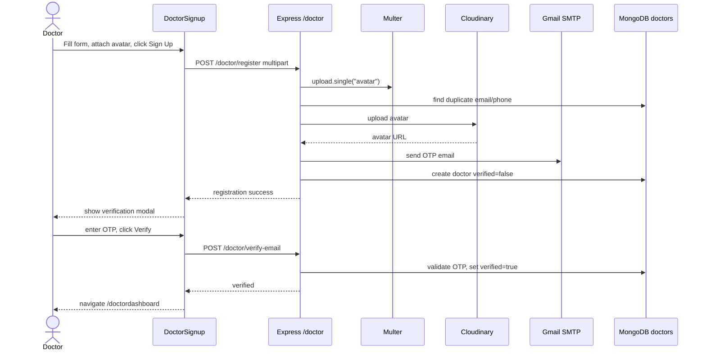

## Client Login

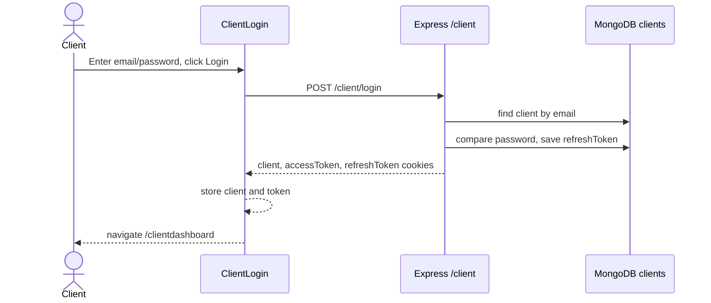

## Doctor Creates Schedule

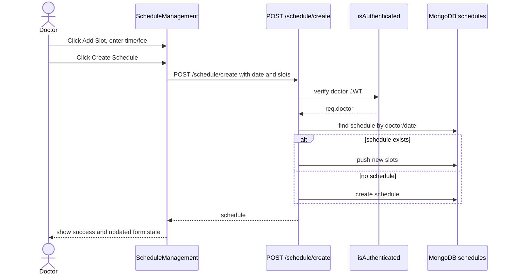

## Patient Books And Pays For Appointment

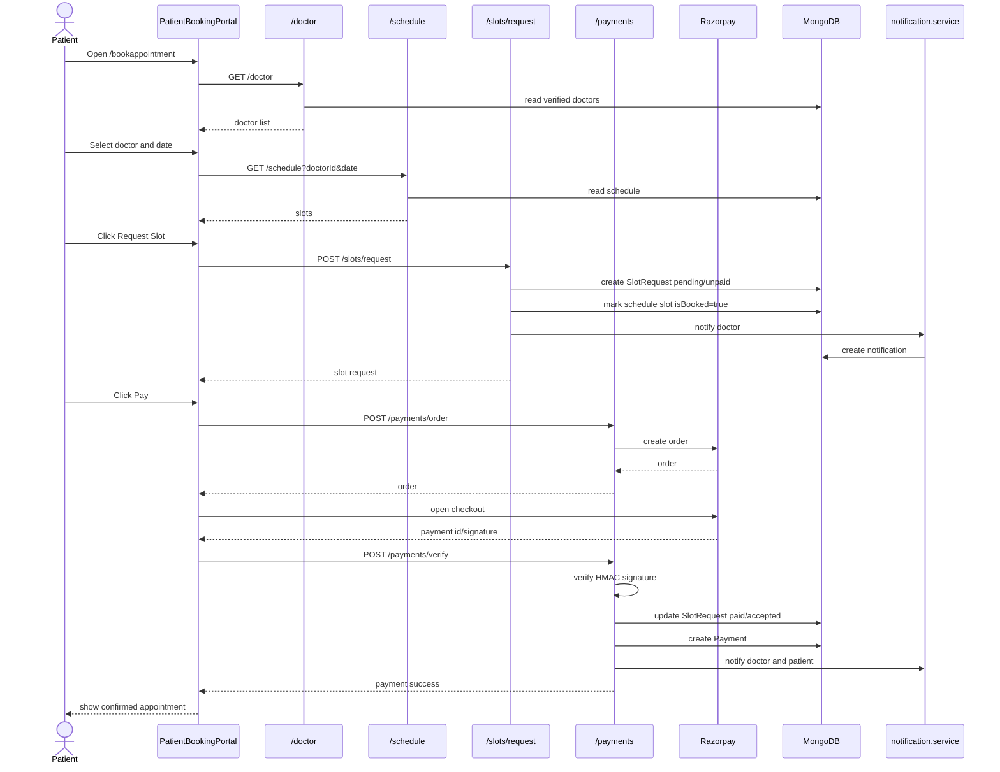

## AI Agent Books Appointment

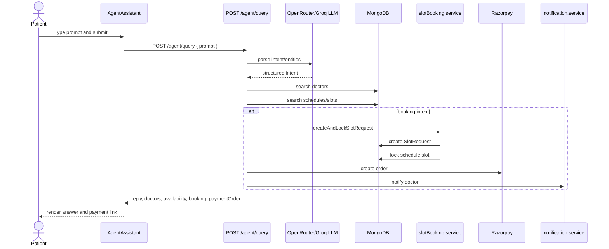

## Chat Message With Optional RAG Document

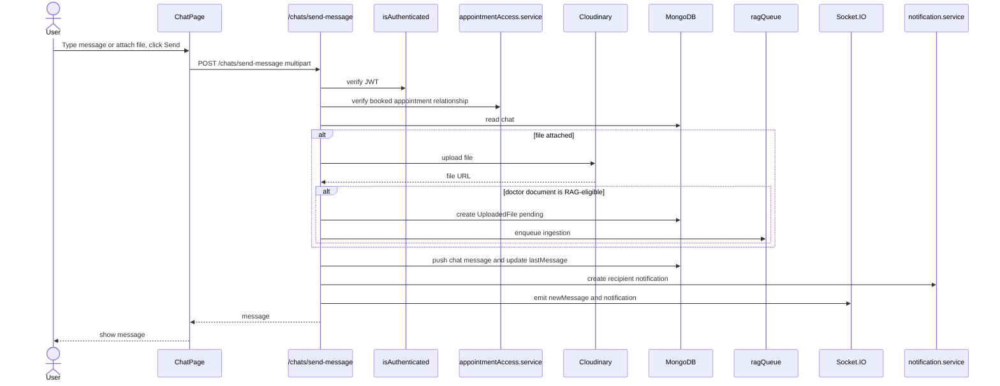

## Document Q&A

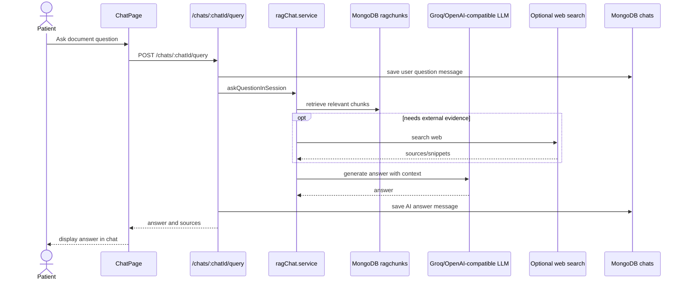

## Video Call

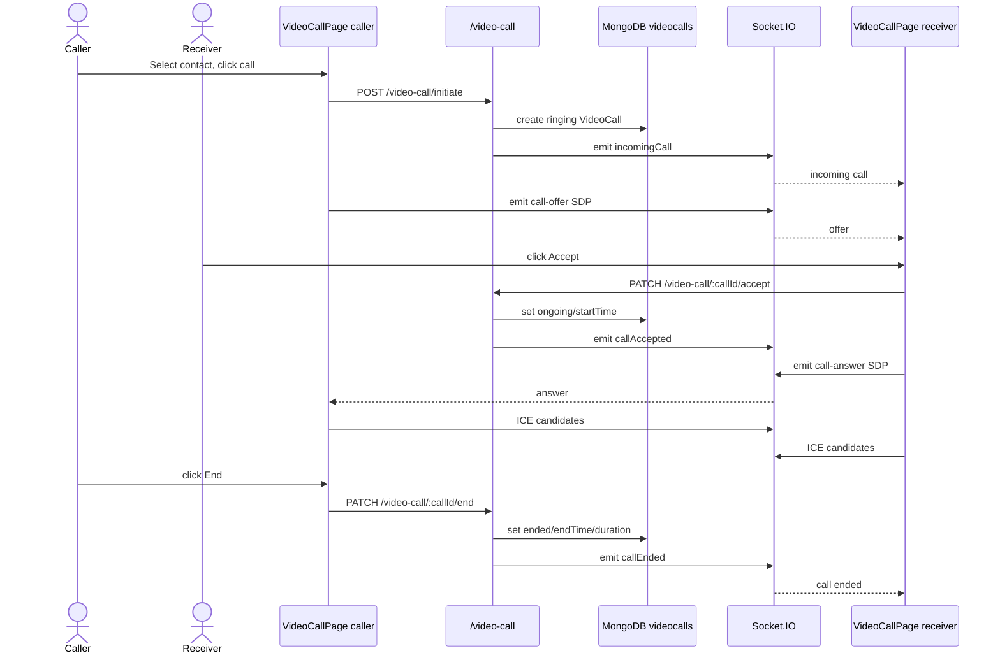

## Nearby Clinics

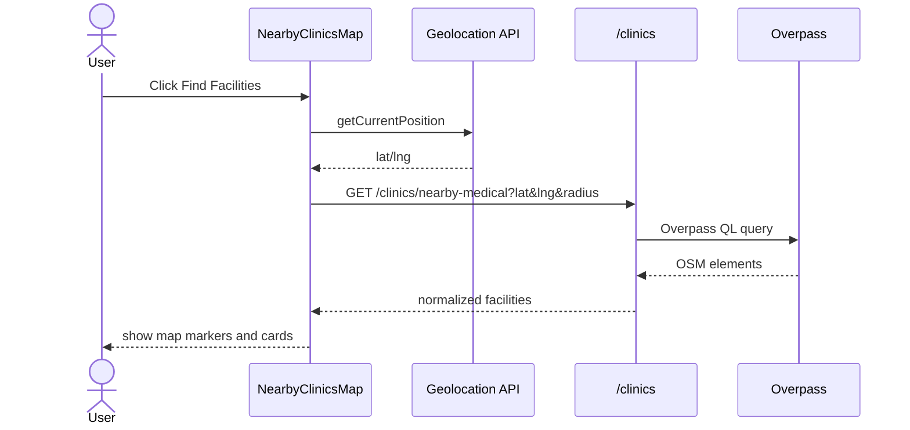

## Medicine Search

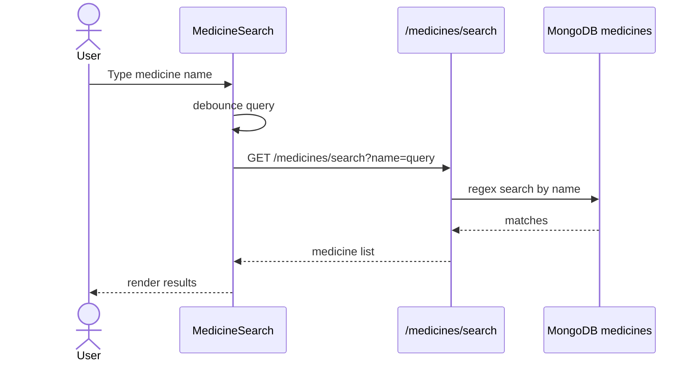

## Notifications

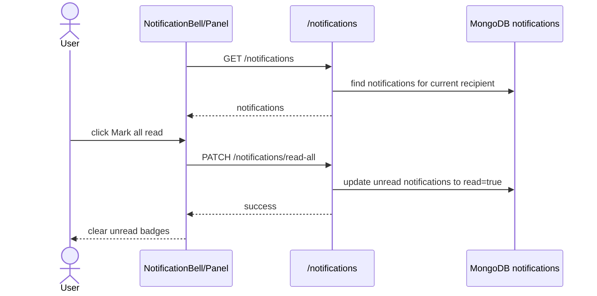

---

# Known Missing Or Stale Flows

1. `/clientappointments` is linked from the client dashboard/navbar but is not registered in `frontend/src/App.jsx`.
2. `DoctorDirectory` calls `/doctor/appointments` and `/doctor/appointments/:appointmentId/status`, but no matching backend routes exist.
3. Doctor/client navbar logout uses `navigate('/ ')` with a trailing space instead of `navigate('/')`.
4. `GetDoctor` renders a `View Profile` button without an active click handler/link.
5. `ChatContext.js` and `hooks/ChatIntegration.jsx` look like stale/legacy chat integrations and reference paths that do not match the current store layout.
6. Chat typing socket names appear mismatched in places: frontend store emits `startTyping`/`stopTyping`, while backend socket handlers also use a `typing` event path.
7. `GET /client/:id` route param is `id`, but controller logic references `clientId`.
8. Payment history route is public and maps fields from populated slot requests; verify the mapped date/time names against the current `SlotRequest` schema before relying on display fields.
9. `POST /doctor/refresh-token` has a token naming inconsistency in the controller helper return/destructure path; client refresh is the path used by the axios interceptor.

---

# Quick "When User Clicks X" Index

| User action | Current page/component | Function/API | Next route |
|---|---|---|---|
| Book Appointment in navbar | `/`, `Navbar` | open `AuthModal` | no route |
| Patient login submit | Auth modal | `POST /client/login` | `/clientdashboard` |
| Doctor login submit | `/login` or modal | `POST /doctor/login` | `/doctordashboard` |
| Patient signup submit | Auth modal | `POST /client/register` | verification modal |
| Doctor signup submit | `/signup` or modal | `POST /doctor/register` | verification modal |
| Verify OTP/email | signup modal/page | `/client/verify-*` or `/doctor/verify-*` | dashboard |
| Doctor schedule card | `/doctordashboard` | React Router Link | `/doctorschedule` |
| Create schedule | `/doctorschedule` | `POST /schedule/create` | no route |
| View schedule | `/doctorschedule` | `GET /schedule` | no route |
| Book Appointment card | `/clientdashboard` | React Router Link | `/bookappointment` |
| Select doctor/date | `/bookappointment` | `GET /schedule` | no route |
| Request Slot | `/bookappointment` | `POST /slots/request` | no route |
| Pay appointment | `/bookappointment` | `/payments/order`, Razorpay, `/payments/verify` | no route |
| Ask AI agent | `/clientdashboard` | `POST /agent/query` | no route |
| Agent view doctor | `AgentAssistant` | Link | `/doctor/:id` |
| Find Doctors card | `/clientdashboard` | Link | `/finddoctors` |
| Doctor public back | `/doctor/:id` | Link | `/finddoctors` |
| Doctor public book | `/doctor/:id` | Link | `/bookappointment` |
| Save doctor profile | `/doctorprofile` | `PATCH /doctor/update` | no route |
| Save client profile | `/clientprofile` | `PATCH /client/update` | no route |
| Search medicine | `/medicines-search` | `GET /medicines/search` | no route |
| Find facilities | `/nearby-clinics` | geolocation + `GET /clinics/...` | no route |
| Open chat contact | `/chat` | `POST /chats/create-or-get` | no route |
| Send chat message | `/chat` | `POST /chats/send-message` | no route |
| Ask document question | `/chat` | socket or `POST /chats/:chatId/query` | no route |
| Delete message | `/chat` | `DELETE /chats/:chatId/messages/:messageId` | no route |
| Start video call | `/video-call` | `POST /video-call/initiate` + socket offer | no route |
| Accept call | `/video-call` | `PATCH /video-call/:callId/accept` + socket answer | no route |
| End call | `/video-call` | `PATCH /video-call/:callId/end` | no route |
| Mark notifications read | dashboard/nav | `PATCH /notifications/read-all` | no route |
| Logout doctor/client | dashboard navbar | `/doctor/logout` or `/client/logout` | intended `/` |

---

# Continuation Appendix A: Model And Collection Map

This section is useful when you want to answer, "What exact collection changes when this route runs?"

## Doctor Model

File:
`MediConnect/backend/src/models/doctor.models.js`

Mongo model:
`Doctor`

Default collection:
`doctors`

Primary fields:

| Field | Meaning | Written by | Read by |
|---|---|---|---|
| `name` | Doctor display name | register/update | doctor listing, profile, notifications |
| `email` | Unique login/email OTP identity | register | login, verification, listing |
| `password` | Hashed by pre-save hook | register | login password check |
| `specialization` | Search/filter category | register/update | doctor search, agent matching |
| `experience` | Years of experience | register/update | doctor list/profile |
| `degree` | Medical degree | register/update | doctor list/profile |
| `age` | Doctor age | register/update | profile |
| `phone` | Unique phone number | register/update | duplicate check/profile |
| `gender` | Doctor gender | register/update | profile |
| `avatar` | Cloudinary URL | register/update | UI profile/cards |
| `verified` | Login gate | verification routes | login and public doctor listing |
| `refreshToken` | Current refresh JWT | login/register/refresh/logout | refresh/logout |
| `otp`, `otpExpires` | Verification code and expiry | register | OTP verification |

Model methods:

1. `isPasswordCorrect(password)` compares plaintext input with bcrypt hash.
2. `generateAccessToken()` signs JWT with `_id`, `email`, `userType: "Doctor"`, `tokenVersion`.
3. `generateRefreshToken()` signs refresh JWT with `_id`.

## Client Model

File:
`MediConnect/backend/src/models/client.model.js`

Mongo model:
`Client`

Default collection:
`clients`

Primary fields:

| Field | Meaning | Written by | Read by |
|---|---|---|---|
| `name` | Patient display name | register/update | chat, booking, notifications |
| `email` | Unique login/email OTP identity | register | login, verification |
| `age` | Patient age | register/update | profile/payment history |
| `gender` | Patient gender | register/update | profile |
| `password` | Hashed by pre-save hook | register | login |
| `phone` | Unique phone number | register/update | duplicate check/profile |
| `avatar` | Optional Cloudinary URL | register/update | UI |
| `verified` | Login gate | verification routes | login |
| `refreshToken` | Current refresh JWT | login/register/refresh/logout | refresh/logout |
| `otp`, `otpExpires` | Verification code and expiry | register | OTP verification |

Model methods mirror the doctor model but use `userType: "Client"`.

## Schedule Model

File:
`MediConnect/backend/src/models/schedule.model.js`

Mongo model:
`Schedule`

Default collection:
`schedules`

Fields:

| Field | Meaning |
|---|---|
| `doctorId` | Doctor who owns the schedule |
| `date` | Schedule date as `YYYY-MM-DD` string |
| `slots[]` | Embedded appointment slots |
| `slots[].time` | Slot time string |
| `slots[].fee` | Consultation fee |
| `slots[].isBooked` | True when a slot is locked by a request |
| `slots[].bookedBy` | Client id that locked the slot |
| `slots[].requestId` | SlotRequest id that owns the lock |

Important behavior:

- A pending slot request immediately locks the schedule slot.
- Rejected slot requests unlock the schedule slot.
- Paid/accepted slot requests keep the schedule slot locked.

## SlotRequest Model

File:
`MediConnect/backend/src/models/slotRequest.model.js`

Mongo model:
`SlotRequest`

Default collection:
`slotrequests`

Fields:

| Field | Meaning |
|---|---|
| `doctorId` | Doctor being booked |
| `patientId` | Client who requested the appointment |
| `scheduleId` | Schedule document containing the slot |
| `slotIndex` | Index into `schedule.slots[]` |
| `date` | Copied from schedule |
| `time` | Copied from schedule slot |
| `fee` | Copied from schedule slot |
| `status` | `pending`, `accepted`, or `rejected` |
| `paymentStatus` | `unpaid` or `paid` |
| `reminderSentAt` | Set by reminder cron after reminder notification |

Lifecycle:

```text
pending/unpaid
  -> paid/accepted after Razorpay verify
  -> rejected/unpaid if doctor/admin status route rejects it
```

## Payment Model

File:
`MediConnect/backend/src/models/payment.model.js`

Mongo model:
`Payment`

Default collection:
`payments`

Fields:

| Field | Meaning |
|---|---|
| `slotRequestId` | Paid appointment request |
| `doctorId` | Doctor receiving payment |
| `patientId` | Client who paid |
| `amount` | Amount copied from slot fee |
| `status` | `success` or `failed` |
| `transactionId` | Razorpay payment id |
| `paymentGateway` | Defaults to `Razorpay` |

Created only after `POST /payments/verify` succeeds.

## Chat Model

File:
`MediConnect/backend/src/models/chat.model.js`

Mongo model:
`Chat`

Default collection:
`chats`

Fields:

| Field | Meaning |
|---|---|
| `participants[]` | Doctor/client pair with `userId` and `userType` |
| `messages[]` | Embedded message documents |
| `messages[].content` | Message text or generated answer |
| `messages[].messageType` | `text`, `image`, `file`, `voice`, `ai` |
| `messages[].fileUrl` | Hosted file URL |
| `messages[].fileId` | UploadedFile file id when present |
| `messages[].sources` | RAG document/web source metadata |
| `messages[].metadata` | Flexible message metadata |
| `messages[].replyTo` | Snapshot of replied-to message |
| `messages[].readBy[]` | Read receipts |
| `messages[].sender` | Sender id and type |
| `lastMessage` | Used for chat sorting |
| `isActive` | Soft active flag |
| `chatType` | Defaults to consultation |

Access rule:
Chat creation/read/send is allowed only when a non-rejected appointment relationship exists between the doctor and patient.

## UploadedFile Model

File:
`MediConnect/backend/src/models/uploadedFile.model.js`

Mongo model:
`UploadedFile`

Default collection:
`uploadedfiles`

Fields:

| Field | Meaning |
|---|---|
| `fileId` | Stable file identifier |
| `sessionId` | Chat/session id |
| `doctorId` | Doctor who uploaded the document |
| `fileName`, `fileType`, `fileExtension`, `fileSize` | File metadata |
| `fileUrl` | Download/view URL |
| `storageProvider` | `s3`, `local`, or `cloudinary` |
| `storageKey`, `localPath` | Provider-specific storage references |
| `ragStatus` | `pending`, `processing`, `indexed`, `failed`, `skipped` |
| `ragError` | Failure reason if indexing fails |
| `chunkCount` | Number of RAG chunks created |
| `uploadedAt` | Upload timestamp |

## RagChunk Model

File:
`MediConnect/backend/src/models/ragChunk.model.js`

Mongo model:
`RagChunk`

Default collection:
`ragchunks`

Fields:

| Field | Meaning |
|---|---|
| `sessionId` | Chat/session id |
| `fileId` | Uploaded file id |
| `fileName` | Source file name |
| `chunkIndex` | Order of chunk inside file |
| `text` | Extracted and chunked text |
| `embedding` | Numeric embedding vector |
| `metadata` | Flexible extraction/source metadata |

Unique index:
`{ sessionId: 1, fileId: 1, chunkIndex: 1 }`

## VideoCall Model

File:
`MediConnect/backend/src/models/video.model.js`

Mongo model:
`VideoCall`

Default collection:
`videocalls`

Fields:

| Field | Meaning |
|---|---|
| `participants[]` | Doctor/client participants |
| `participants[].mediaState` | Camera, mic, screen share, quality settings |
| `initiator` | User who started the call |
| `callStatus` | `initiated`, `ringing`, `ongoing`, `ended`, `rejected` |
| `callType` | `video` or `audio` |
| `roomId` | Unique socket/WebRTC room id |
| `startTime`, `endTime`, `duration` | Call timing |
| `callQuality` | Rating/feedback/rater |
| `technicalIssues[]` | Reported call issues |

## Notification Model

File:
`MediConnect/backend/src/models/notification.model.js`

Mongo model:
`Notification`

Default collection:
`notifications`

Types:

- `slot_booked`
- `payment_success`
- `appointment_reminder`
- `chat_message`
- `video_call_invite`

Fields:

| Field | Meaning |
|---|---|
| `recipientId`, `recipientModel` | Doctor/client receiving notification |
| `senderId`, `senderModel` | Optional actor |
| `type` | Notification category |
| `title`, `message` | Display content |
| `appointment` | Slot/schedule/date/time references |
| `metadata` | Chat id, call id, room id, etc. |
| `read` | Read/unread state |

## Medicine Model

File:
`MediConnect/backend/src/models/medicine.model.js`

Mongo model:
`Medicine`

Explicit collection:
`medicines`

Fields:
`id`, `name`, `price(₹)`, `Is_discontinued`, `manufacturer_name`, `type`, `pack_size_label`, `short_composition1`, `short_composition2`.

---

# Continuation Appendix B: Exact Backend Function And Query Trace

## Auth Middleware Trace

FUNCTION:
`isAuthenticated(req, res, next)`

File:
`backend/src/middlewares/auth.middleware.js`

Flow:

```text
Request reaches protected route
-> read token from cookie accessToken
-> else read Authorization: Bearer token
-> jwt.verify(token, ACCESS_TOKEN_SECRET)
-> Doctor.findById(decoded._id).select("-password -refreshToken")
-> if doctor exists: req.doctor = doctor, req.userType = "doctor"
-> else Client.findById(decoded._id).select("-password -refreshToken")
-> if client exists: req.client = client, req.userType = "client"
-> next()
```

Failure branches:

| Failure | Response path |
|---|---|
| No token | 401 `Unauthorized: No token provided` |
| JWT invalid/expired | 401 `Unauthorized: Invalid or expired token` |
| User id not found in either collection | 401 `Unauthorized: User not found` |

## Doctor Controller Query Trace

### `registerDoctor`

```text
POST /doctor/register
-> multer writes avatar to public/temp
-> validate body fields
-> Doctor.findOne({ $or: [{ email }, { phone }] })
-> uploadToCloudinary(req.file.path)
-> generate OTP and expiry
-> nodemailer sends OTP email
-> Doctor.create({
     name, email, password, specialization, experience, degree,
     age, phone, gender, avatar, verified:false, otp, otpExpires
   })
-> Doctor pre-save hook hashes password
-> return created doctor without password/refreshToken
```

Database:

- Reads `doctors` for duplicates.
- Creates `doctors`.

External:

- Cloudinary
- Gmail SMTP

### `loginDoctor`

```text
POST /doctor/login
-> Doctor.findOne({ email })
-> doctor.isPasswordCorrect(password)
-> check doctor.verified
-> doctor.generateAccessToken()
-> doctor.generateRefreshToken()
-> doctor.refreshToken = refreshToken
-> doctor.save({ validateBeforeSave:false })
-> set accessToken and refreshToken cookies
-> return doctor and tokens
```

Database:

- Reads `doctors`.
- Updates `doctors.refreshToken`.

### `verifyEmail`

```text
POST /doctor/verify-email
-> Doctor.findOne({ email })
-> compare otp and otpExpires
-> doctor.verified = true
-> doctor.otp = undefined
-> doctor.otpExpires = undefined
-> doctor.save()
```

### `verifyOtp`

```text
POST /doctor/verify-otp
-> Doctor.findById(doctorId)
-> compare otp and otpExpires
-> doctor.verified = true
-> clear otp fields
-> generate tokens/cookies
```

### `updateDoctor`

```text
PATCH /doctor/update
-> auth middleware supplies req.doctor
-> if avatar exists: upload to Cloudinary
-> Doctor.findByIdAndUpdate(req.doctor._id, updateFields, { new:true })
-> return updated doctor without secret fields
```

### `getAllDoctors`

```text
GET /doctor
-> build query from optional filters
-> include verified doctors
-> Doctor.find(query).select("-password -refreshToken ...")
-> return list/pagination-style response
```

### `getDoctorById`

```text
GET /doctor/:id
-> validate ObjectId
-> Doctor.findOne({ _id:id, verified:true }).select("-password -refreshToken ...")
-> return doctor or 404
```

## Client Controller Query Trace

Client controller behavior is parallel to the doctor controller with these differences:

```text
POST /client/register
-> avatar is optional
-> duplicate check uses Client.findOne({ $or: [{ email }, { phone }] })
-> sendOtp(phone, otp) sends phone OTP through Twilio utility
-> nodemailer sends email OTP
-> Client.create(...)
-> generate access/refresh tokens
```

Database:

- Reads/creates/updates `clients`.

External:

- Cloudinary only when avatar file exists.
- Twilio for phone OTP.
- Gmail SMTP for email OTP.

Known mismatch:
`GET /client/:id` is routed with `:id`, but `getClientById` expects `clientId` in params.

## Schedule And Slot Query Trace

### `createSchedule`

```text
POST /schedule/create
-> isAuthenticated
-> doctorId = req.doctor._id
-> read { date, slots }
-> Schedule.findOne({ doctorId, date })
-> if existing: existing.slots.push(...slots), existing.save()
-> else new Schedule({ doctorId, date, slots }).save()
```

Database:

- Reads `schedules`.
- Creates or updates `schedules`.

### `getDoctorSchedule`

```text
GET /schedule?doctorId&date
-> validate query params
-> Schedule.findOne({ doctorId, date })
-> return schedule or 404
```

### `requestSlot`

```text
POST /slots/request
-> isAuthenticated
-> patientId = req.client._id
-> validate doctorId, scheduleId, slotIndex
-> createAndLockSlotRequest({ doctorId, patientId, scheduleId, slotIndex })
-> notifyDoctorSlotBooked(...)
-> return request
```

Service:
`createAndLockSlotRequest`

```text
-> Schedule.findById(scheduleId)
-> slot = schedule.slots[slotIndex]
-> isSlotAvailable(slot) checks !slot.isBooked && !slot.requestId
-> SlotRequest.create({
     doctorId, patientId, scheduleId, slotIndex,
     date:schedule.date, time:slot.time, fee:slot.fee,
     status:"pending", paymentStatus:"unpaid"
   })
-> slot.requestId = request._id
-> slot.isBooked = true
-> slot.bookedBy = patientId
-> schedule.save()
```

Database:

- Reads `schedules`.
- Creates `slotrequests`.
- Updates embedded slot inside `schedules`.
- Creates `notifications`.

### `updateSlotRequestStatus`

```text
PUT /slots/:requestId/status
-> validate status is accepted or rejected
-> SlotRequest.findById(requestId)
-> Schedule.findById(request.scheduleId)
-> slot = schedule.slots[request.slotIndex]
-> if accepted:
     request.status = "accepted"
     request.paymentStatus = "unpaid"
     slot.isBooked = true
     slot.bookedBy = request.patientId
     slot.requestId = request._id
-> if rejected:
     request.status = "rejected"
     slot.requestId = null
     slot.isBooked = false
     slot.bookedBy = null
-> save request and schedule
```

Current frontend note:
No visible current page calls this endpoint.

## Payment Query Trace

### `createOrder`

```text
POST /payments/order
-> read slotRequestId and amount
-> razorpay.orders.create({
     amount: amount * 100,
     currency: "INR",
     receipt: `receipt_${slotRequestId}`
   })
-> return Razorpay order
```

Database:
None directly.

External:
Razorpay Orders API.

### `verifyPayment`

```text
POST /payments/verify
-> read razorpay_order_id, razorpay_payment_id, razorpay_signature, slotRequestId
-> crypto.createHmac("sha256", RAZORPAY_KEY_SECRET)
-> compare generated signature with razorpay_signature
-> SlotRequest.findById(slotRequestId)
     .populate("doctorId", "name")
     .populate("patientId", "name")
-> slotRequest.paymentStatus = "paid"
-> slotRequest.status = "accepted"
-> slotRequest.save()
-> confirmSlotRequestBooking(slotRequest._id)
-> notifyAppointmentPaid(...)
-> new Payment({
     slotRequestId,
     doctorId,
     patientId,
     amount: slotRequest.fee,
     status: "success",
     transactionId: razorpay_payment_id
   }).save()
-> return payment
```

Database:

- Reads/updates `slotrequests`.
- Reads/updates `schedules`.
- Creates `payments`.
- Creates two `notifications`.

Failure branches:

| Failure | Result |
|---|---|
| Signature mismatch | 400 `Payment verification failed` |
| Missing slot request | 404 `Slot request not found` |
| Razorpay order create fails | 500 `Failed to create order` |

### `getDoctorPaymentHistory`

```text
GET /payments/history?doctorId
-> validate doctorId
-> Payment.find({ doctorId })
     .populate("patientId", "name email age phone")
     .populate("slotRequestId", "appointmentDate appointmentTime")
     .sort({ createdAt:-1 })
-> map payments to display DTO
-> compute totalEarnings from success payments
```

Important:
`SlotRequest` currently stores `date` and `time`, not `appointmentDate` and `appointmentTime`, so appointment date/time in this response can become `N/A`.

## Notification Service Query Trace

### `createNotification`

```text
createNotification(input)
-> build notification document
-> include sender only when senderId and senderModel are both present
-> Notification.create(notification)
```

### Notification creators

| Function | Creates | Trigger |
|---|---|---|
| `notifyDoctorSlotBooked` | 1 notification for doctor | slot request lock |
| `notifyAppointmentPaid` | 1 notification for doctor and 1 for patient | payment verification |
| `notifyAppointmentReminder` | 1 notification for doctor and 1 for patient | reminder cron |
| `notifyChatMessage` | 1 notification for message recipient | chat message send |
| `notifyVideoCallInvite` | 1 notification for call recipient | video call initiate |

## Notification Controller Query Trace

```text
GET /notifications
-> getRecipientContext(req) from req.doctor or req.client
-> limit = min(query.limit || 30, 100)
-> Notification.find({ recipientId, recipientModel }).sort({ createdAt:-1 }).limit(limit)
```

```text
GET /notifications/unread-count
-> Notification.countDocuments({ recipientId, recipientModel, read:false })
```

```text
PATCH /notifications/:notificationId/read
-> Notification.findOneAndUpdate(
     { _id: notificationId, recipientId, recipientModel },
     { read:true },
     { new:true }
   )
```

```text
PATCH /notifications/read-all
-> Notification.updateMany(
     { recipientId, recipientModel, read:false },
     { read:true }
   )
```

## Appointment Access Service Trace

FUNCTION:
`hasBookedAppointmentBetween`

```text
-> derive doctorId/clientId pair from userA and userB types
-> if pair is invalid: return false
-> SlotRequest.findOne({
     doctorId,
     patientId,
     status: { $ne:"rejected" },
     $or: [
       { paymentStatus:"paid" },
       { status:"accepted" },
       { status:"pending" }
     ]
   }).select("_id")
-> Boolean(booking)
```

Used by:

- Chat create/read/send
- Video call initiate
- Socket chat room/send events

## Chat Query Trace

### Create Or Get Chat

```text
POST /chats/create-or-get
-> auth identifies current user
-> read participantId and participantType
-> hasBookedAppointmentBetween(current user, requested participant)
-> Chat.findOne({
     participants: {
       $all: [
         { $elemMatch: { userId: currentUserId, userType: currentUserType } },
         { $elemMatch: { userId: participantId, userType: participantType } }
       ]
     },
     isActive:true
   })
-> if missing: Chat.create({ participants:[...] })
-> return chat
```

### Booked Contacts

```text
GET /chats/booked-contacts
-> if current user is doctor:
     SlotRequest.find({ doctorId: currentDoctorId, status: { $ne:"rejected" }, accessStatusCondition })
       .populate("patientId")
-> if current user is client:
     SlotRequest.find({ patientId: currentClientId, status: { $ne:"rejected" }, accessStatusCondition })
       .populate("doctorId")
-> de-duplicate contacts
-> return contacts
```

### Send Message

```text
POST /chats/send-message
-> multer accepts optional file
-> Chat.findById(chatId)
-> verify sender is participant
-> verify appointment access
-> if replyTo supplied, build reply snapshot
-> if file supplied:
     upload file to Cloudinary
     determine messageType/file metadata
     if sender is Doctor and file type supports RAG:
       UploadedFile.create({ ragStatus:"pending", ... })
       enqueueRagIngestion({ fileId, sourcePath })
-> push message into chat.messages
-> update chat.lastMessage
-> chat.save()
-> notifyChatMessage(...)
-> req.io.to(chatRoom).emit("newMessage", ...)
-> return message
```

### Ask Document Question

```text
POST /chats/:chatId/query
or socket query:ask
-> verify chat access
-> askQuestionInSession({ sessionId:chatId, question, requester })
-> service writes question message
-> service retrieves RagChunk documents
-> optional web search
-> LLM generates answer
-> service writes AI message
-> return answer payload
```

### Delete Message

```text
DELETE /chats/:chatId/messages/:messageId
-> Chat.findById(chatId)
-> verify participant
-> locate embedded message by id
-> verify sender owns message
-> verify delete window
-> message.deleteOne()
-> chat.save()
-> emit messageDeleted
```

## RAG Ingestion Trace

TRIGGER:
Doctor sends/uploads a supported document file.

```text
UploadedFile created with ragStatus:"pending"
-> enqueueRagIngestion({ fileId, sourcePath })
-> queue worker loads UploadedFile
-> ragStatus = "processing"
-> loadDocument({ uploadedFile, sourcePath })
     pdf -> pdf parser
     docx -> mammoth
     doc -> word extractor
     image -> Tesseract OCR
     txt -> fs read
-> mask PHI
-> chunkDocuments()
-> embedAndStore()
     Hugging Face embeddings
     RagChunk upserts locally
     optional Pinecone vector store
-> UploadedFile.ragStatus = "indexed"
-> UploadedFile.chunkCount = chunk count
```

Failure branch:

```text
any extraction/embedding/store failure
-> UploadedFile.ragStatus = "failed"
-> UploadedFile.ragError = error.message
```

## Video Query Trace

### Initiate Call

```text
POST /video-call/initiate
-> auth current user
-> validate participantId, participantType
-> find participant in Doctor or Client collection
-> hasBookedAppointmentBetween(current user, participant)
-> close/clean stale active calls if needed
-> VideoCall.create({
     participants:[caller, receiver],
     initiator,
     callStatus:"initiated",
     callType,
     roomId,
     mediaState
   })
-> set callStatus = "ringing"
-> notifyVideoCallInvite(...)
-> socket emit incomingCall to recipient room
-> return call
```

### Accept Call

```text
PATCH /video-call/:callId/accept
-> VideoCall.findById(callId)
-> verify current user is participant
-> require status initiated/ringing
-> callStatus = "ongoing"
-> startTime = now
-> participant.joinedAt = now
-> participant.mediaState from body
-> save
-> socket emit callAccepted
```

### Reject Call

```text
PATCH /video-call/:callId/reject
-> find call
-> verify participant
-> callStatus = "rejected"
-> endTime = now
-> save
-> socket emit callRejected
```

### End Call

```text
PATCH /video-call/:callId/end
-> find call
-> verify participant
-> callStatus = "ended"
-> endTime = now
-> if startTime exists: duration = seconds between start/end
-> participant.leftAt = now
-> save
-> socket emit callEnded
```

### Media Toggles

```text
PATCH /video-call/:callId/camera
PATCH /video-call/:callId/microphone
PATCH /video-call/:callId/screen-share
-> find call
-> verify participant
-> update participant.mediaState
-> save
-> emit media-state event
```

## Clinic Route Trace

Each clinic route follows the same shape:

```text
GET /clinics/<type>?lat&lng&radius
-> validate lat/lng
-> convert radius to nearby bounding/Overpass search area
-> build Overpass QL
-> try Overpass endpoint mirror 1
-> if failed, try next mirror
-> map nodes/ways to facility objects
-> return normalized facilities
```

No database records are created, updated, or deleted.

## Medicine Route Trace

```text
GET /medicines/search?name=abc
-> validate name exists
-> Medicine.find({ name: { $regex:name, $options:"i" } })
-> return medicine matches
```

No writes happen.

## Dashboard ChatBot Route Trace

```text
POST /chat
-> read userId/message
-> append user message to in-memory chatHistory[userId]
-> if GROQ_API_KEY exists:
     call Groq chat completions
-> else:
     local getSimpleResponse(message)
-> append assistant message to in-memory chatHistory[userId]
-> return assistant response
```

No MongoDB writes happen. ChatBot history is lost when the server process restarts.

---

# Continuation Appendix C: Component Button And Handler Index

## Landing And Auth

| Component | Button/link/action | Handler/function | API | Result |
|---|---|---|---|---|
| `Navbar` | `Home`, `Services`, `About`, `Contact` | anchor navigation | none | scrolls to landing section |
| `Navbar` | theme toggle | `toggleTheme` | none | theme changes |
| `Navbar` | `Book Appointment` | `setIsModalOpen(true)` | none | auth modal opens |
| `Navbar` | mobile menu | `setIsOpen(!isOpen)` | none | mobile nav opens/closes |
| `AuthModal` | close | `onClose` | none | modal closes |
| `AuthModal` | Patient tab | `setActiveTab("client")` | none | renders client auth form |
| `AuthModal` | Doctor tab | `setActiveTab("doctor")` | none | renders doctor auth form |
| `AuthModal` | Signup mode | `setAuthMode("signup")` | none | renders signup form |
| `AuthModal` | Login mode | `setAuthMode("login")` | none | renders login form |
| `ContactForm` | submit | local submit handler | none | alert and form reset |

## Doctor Login/Signup

| Component | Button/action | Handler | API | Result |
|---|---|---|---|---|
| `DoctorLogin` | submit | `handleSubmit` | `POST /doctor/login` | stores doctor and navigates `/doctordashboard` |
| `DoctorSignup` | avatar input | `handleFileChange` | none | stores file preview |
| `DoctorSignup` | submit | `handleSubmit` | `POST /doctor/register` | shows verification modal |
| `DoctorSignup` | email tab | `setVerificationMethod("email")` | none | selects email OTP form |
| `DoctorSignup` | phone tab | `setVerificationMethod("phone")` | none | selects phone OTP form |
| `DoctorSignup` | verify | `handleVerify` | `POST /doctor/verify-email` or `POST /doctor/verify-otp` | navigates `/doctordashboard` |
| `DoctorSignup` | close verification modal | `setShowVerificationModal(false)` | none | modal closes |
| `DoctorSignup` | resend OTP | inline alert-only handler | none | no backend resend route is called |

## Client Login/Signup

| Component | Button/action | Handler | API | Result |
|---|---|---|---|---|
| `ClientLogin` | submit | `handleSubmit` | `POST /client/login` | stores client and navigates `/clientdashboard` |
| `ClientSignup` | avatar input | `handleFileChange` | none | stores optional file preview |
| `ClientSignup` | submit | `handleSubmit` | `POST /client/register` | shows verification modal |
| `ClientSignup` | email tab | `setVerificationMethod("email")` | none | selects email OTP form |
| `ClientSignup` | phone tab | `setVerificationMethod("phone")` | none | selects phone OTP form |
| `ClientSignup` | verify | `handleVerify` | `POST /client/verify-email` or `POST /client/verify-otp` | navigates `/clientdashboard` |
| `ClientSignup` | resend OTP | inline alert-only handler | none | no backend resend route is called |

## Dashboard Buttons

| Component | Button/link | Handler/API | Next result |
|---|---|---|---|
| `DoctorDashboard` | schedule card | `<Link to="/doctorschedule">` | schedule page |
| `DoctorDashboard` | appointments/payment card | `<Link to="/doctorappointments">` | payment portal |
| `DoctorDashboard` | chat card | `<Link to="/chat">` | chat page |
| `DoctorDashboard` | video card | `<Link to="/video-call">` | video call page |
| `DoctorDashboard` | profile card | `<Link to="/doctorprofile">` | profile page |
| `DoctorDashboardNavbar` | directory link | `<Link to="/doctordirectory">` | route opens but backend endpoints are missing |
| `DoctorDashboardNavbar` | logout | `logout()` -> `POST /doctor/logout` | intended home navigation |
| `ClientDashboard` | book appointment card | `<Link to="/bookappointment">` | booking page |
| `ClientDashboard` | appointments card | `<Link to="/clientappointments">` | broken route, not registered |
| `ClientDashboard` | clinics card | `<Link to="/nearby-clinics">` | map page |
| `ClientDashboard` | find doctors card | `<Link to="/finddoctors">` | doctor browser |
| `ClientDashboard` | chat card | `<Link to="/chat">` | chat page |
| `ClientDashboard` | video card | `<Link to="/video-call">` | video page |
| `ClientDashboard` | medicines card | `<Link to="/medicines-search">` | medicine search |
| `ClientDashboard` | profile card | `<Link to="/clientprofile">` | profile page |
| `ClientDashboardNavbar` | logout | `logout()` -> `POST /client/logout` | intended home navigation |

## Booking Buttons

| Component | Button/action | Handler/API | Result |
|---|---|---|---|
| `PatientBookingPortal` | search doctors | local search state | filters loaded doctor list |
| `PatientBookingPortal` | refresh/retry doctors | `fetchDoctors` -> `GET /doctor` | reloads doctors |
| `PatientBookingPortal` | doctor card click | `handleDoctorSelect` | moves to booking view |
| `PatientBookingPortal` | date input | `fetchDoctorSchedule` -> `GET /schedule` | loads selected day slots |
| `PatientBookingPortal` | back to doctors | state reset | returns to doctor list in same route |
| `PatientBookingPortal` | request slot | `requestSlot` -> `POST /slots/request` | creates pending request and locks slot |
| `PatientBookingPortal` | pay | `handlePayment` -> `/payments/order` and `/payments/verify` | confirms appointment |
| `AgentAssistant` | submit prompt | `POST /agent/query` | displays doctors/availability/booking |
| `AgentAssistant` | doctor links | `<Link to="/doctor/:id">` | public profile |
| `AgentAssistant` | pay link/button | Razorpay flow | confirms agent-created booking |

## Schedule Buttons

| Component | Button/action | Handler/API | Result |
|---|---|---|---|
| `ScheduleManagement` | create tab | `setActiveTab("create")` | shows create form |
| `ScheduleManagement` | view tab | `setActiveTab("view")` | shows lookup form |
| `ScheduleManagement` | add slot | `addSlot` | adds local slot row |
| `ScheduleManagement` | remove slot | `removeSlot(index)` | removes local slot row |
| `ScheduleManagement` | create schedule | `createSchedule` -> `POST /schedule/create` | creates/appends schedule |
| `ScheduleManagement` | get my schedule | `getDoctorSchedule` -> `GET /schedule` | displays schedule slots |

## Profile Buttons

| Component | Button/action | Handler/API | Result |
|---|---|---|---|
| `DoctorProfile` | theme toggle | `toggleTheme` | local theme switch |
| `DoctorProfile` | edit | `setIsEditing(true)` | form becomes editable |
| `DoctorProfile` | cancel | `setIsEditing(false)` | discards local edit mode |
| `DoctorProfile` | save | submit -> `PATCH /doctor/update` | profile saved and store updated |
| `ClientProfile` | theme toggle | `toggleTheme` | local theme switch |
| `ClientProfile` | edit | `setIsEditing(true)` | form becomes editable |
| `ClientProfile` | cancel | `setIsEditing(false)` | discards local edit mode |
| `ClientProfile` | save | submit -> `PATCH /client/update` | profile saved and store updated |

## Discovery/Search Buttons

| Component | Button/action | Handler/API | Result |
|---|---|---|---|
| `GetDoctor` | theme toggle | `toggleTheme` | theme changes |
| `GetDoctor` | retry fetch | `fetchDoctors` -> `GET /doctor` | reloads doctors |
| `GetDoctor` | clear search | `setSearchTerm("")` | resets local filter |
| `GetDoctor` | view profile | no handler in current code | no navigation |
| `DoctorPublicProfile` | back | `<Link to="/finddoctors">` | doctor list route |
| `DoctorPublicProfile` | book appointment | `<Link to="/bookappointment">` | booking route |
| `MedicineSearch` | clear | `clearSearch` | clears query/results |
| `MedicineSearch` | recent term | `handleHistoryClick(term)` | reruns debounced search |
| `NearbyClinicsMap` | radius dropdown | `setIsRadiusOpen` | opens/closes radius menu |
| `NearbyClinicsMap` | radius option | `handleRadiusChange` | refetches facilities if location exists |
| `NearbyClinicsMap` | find facilities | `getCurrentLocation` | browser geolocation then clinics API |
| `NearbyClinicsMap` | facility tab | `handleTabChange` | calls matching `/clinics/...` endpoint |
| `NearbyClinicsMap` | zoom/pan/reset | map methods | changes map viewport only |
| `NearbyClinicsMap` | facility card | set selected facility | pans map/highlights facility |
| `NearbyClinicsMap` | website link | external anchor | opens facility website |

## Chat Buttons

| Component | Button/action | Handler/API | Result |
|---|---|---|---|
| `ChatPage` | refresh chats | `fetchUserChats` -> `GET /chats/user-chats` | reloads sidebar |
| `ChatPage` | load more | `loadMoreMessages` -> `GET /chats/:chatId/messages` | prepends/loads more messages |
| `ChatPage` | existing chat row | `handleChatSelect` | opens messages |
| `ChatPage` | contact row | `handleContactSelect` -> `POST /chats/create-or-get` | creates/opens chat |
| `ChatPage` | info/search style buttons | mostly presentational/no implemented API | no backend flow |
| `ChatPage` | video icon | `<Link to="/video-call">` | video page |
| `ChatPage` | open file | `window.open(fileUrl)` | opens file |
| `ChatPage` | download file | anchor download | downloads file |
| `ChatPage` | reply | `handleReplyToMessage` | sets reply state |
| `ChatPage` | cancel reply | `setReplyingTo(null)` | clears reply state |
| `ChatPage` | paperclip | `fileInputRef.current.click()` | opens file picker |
| `ChatPage` | send | form submit/store `sendMessage` | sends chat message/file |
| `ChatPage` | ask document question | `askQuestion` | RAG answer appears |
| `ChatPage` | delete own message | opens modal then `DELETE /chats/:chatId/messages/:messageId` | removes message |
| `ChatPage` | error close | `clearError` | clears toast/banner |
| `ChatBot` | floating button | `toggleChat` | opens/closes bot |
| `ChatBot` | message submit | `sendMessage` -> `POST /chat` | bot reply appears |
| `ChatBot` | retry | `retryMessage` -> `POST /chat` | retries failed bot message |

## Video Buttons

| Component | Button/action | Handler/API/socket | Result |
|---|---|---|---|
| `VideoCallPage` | reject incoming | `handleRejectCall` -> `PATCH /video-call/:callId/reject` | call rejected |
| `VideoCallPage` | accept incoming | `handleAcceptCall` -> `PATCH /video-call/:callId/accept` + WebRTC answer | call starts |
| `VideoCallPage` | contacts tab | `setShowHistory(false)` | contact list |
| `VideoCallPage` | history tab | `setShowHistory(true)` | call history |
| `VideoCallPage` | active call accept/reject | accept/reject handlers | call state changes |
| `VideoCallPage` | contact row | `handleContactSelect` | selects recipient |
| `VideoCallPage` | show contacts mobile | `setShowContactList(true)` | sidebar appears |
| `VideoCallPage` | mic | `handleToggleMicrophone` -> `PATCH /video-call/:id/microphone` | local/server mic state changes |
| `VideoCallPage` | camera | `handleToggleCamera` -> `PATCH /video-call/:id/camera` | local/server camera state changes |
| `VideoCallPage` | screen share | `handleToggleScreenShare` -> browser `getDisplayMedia` + backend patch | screen stream replaces camera |
| `VideoCallPage` | end call | `handleEndCall` -> `PATCH /video-call/:id/end` | call ends and streams stop |
| `VideoCallPage` | start call | `handleInitiateCall` -> `POST /video-call/initiate` + socket `call-offer` | rings recipient |
| `VideoCallPage` | settings button | presentational in current JSX | no complete visible settings flow |
| `VideoCallPage` | close error | clear local/store error | hides error |

---

# Continuation Appendix D: Failure And Empty-State Paths

## Authentication Failures

| User sees | Trigger | Backend reason |
|---|---|---|
| Login error | wrong email/password | user not found or bcrypt compare fails |
| Login error | unverified account | `verified` is false |
| Dashboard redirects home | `/doctor/me` or `/client/me` fails | cookie/header token absent or invalid |
| Protected API 401 | expired/missing token | `isAuthenticated` rejects request |

## Booking Failures

| User action | Failure branch | Backend response |
|---|---|---|
| View date schedule | no schedule for doctor/date | 404 `No schedule found for this date` |
| Request slot | missing doctorId/scheduleId/slotIndex | 400 |
| Request slot | slot already has `isBooked` or `requestId` | 400 `Slot not available` |
| Request slot | logged in as doctor/no client | 401 client user not found |
| Pay | Razorpay order create fails | 500 order error |
| Verify payment | bad signature | 400 payment verification failed |
| Verify payment | slot request deleted/missing | 404 slot request not found |

## Chat Failures

| User action | Failure branch | Why |
|---|---|---|
| Open/create chat | no appointment relation | appointment access service returns false |
| Send message | user not a participant | chat participant check fails |
| Send file | unsupported extension or MIME type | `chatUpload` file filter rejects |
| Upload RAG document | sender is not doctor | upload controller rejects doctor-only path |
| Ask document question | no indexed chunks yet | RAG returns fallback/no context answer |
| Delete message | not sender or too old | delete guard rejects |

## Video Failures

| User action | Failure branch | Why |
|---|---|---|
| Start call | no selected contact | frontend guard |
| Start call | no booked relation | backend access check |
| Start call | browser media denied | `getUserMedia` fails |
| Accept call | call already ended/rejected | backend status check |
| Toggle screen share | permission denied | browser `getDisplayMedia` fails |
| End call | no active call id | frontend/store cannot resolve current call |

## Search/Map Failures

| Page | Failure branch | Result |
|---|---|---|
| Medicine search | empty query | no request or validation error |
| Medicine search | no matches | empty results UI |
| Nearby clinics | geolocation denied | user location error |
| Nearby clinics | Overpass mirror fails | backend tries next mirror, then returns failure if all fail |
| Doctor search | no doctors returned | empty doctor state |

---

# Continuation Appendix E: More Sequence Diagrams

## Profile Update

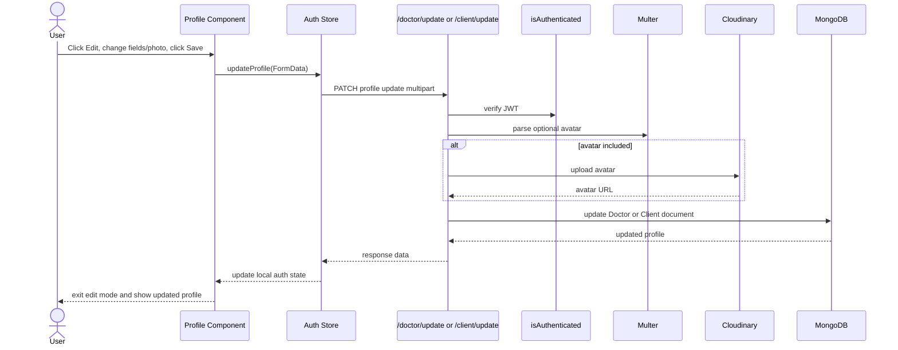

## Logout

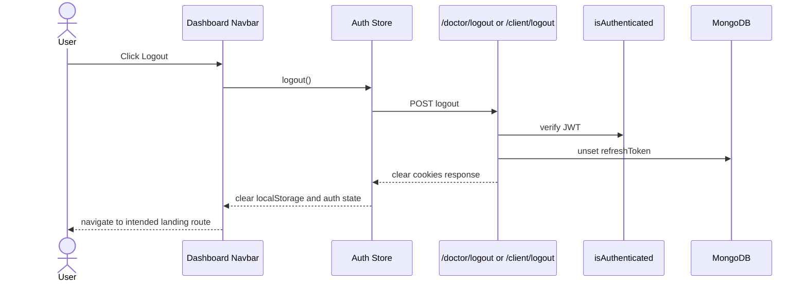

## Slot Request Creates Notification

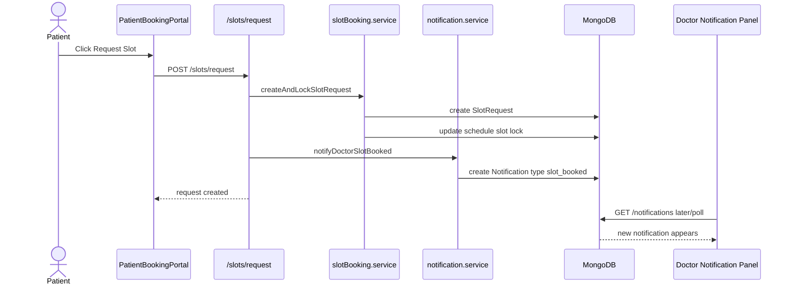

## RAG Ingestion Pipeline

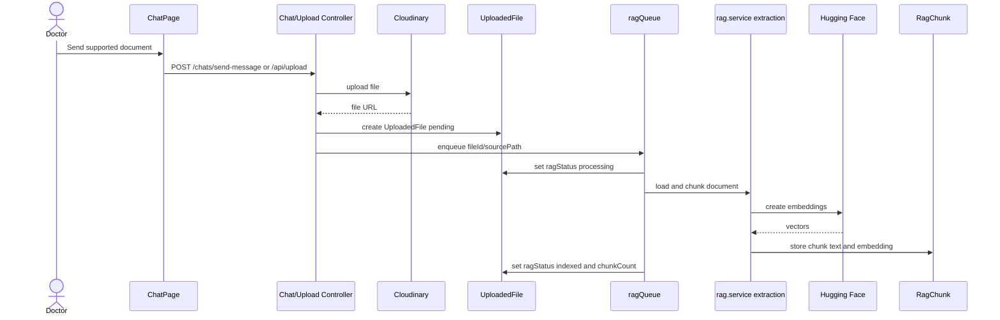

## Chat Socket Message

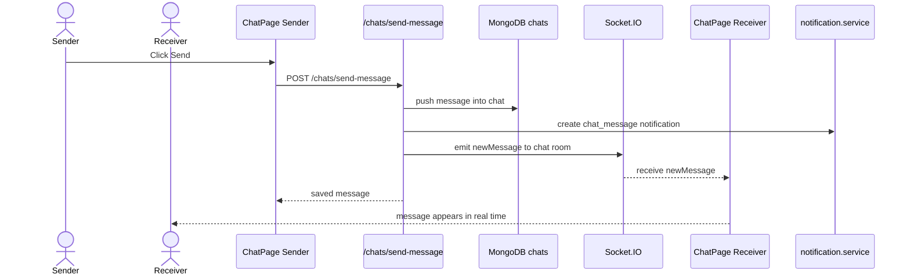
