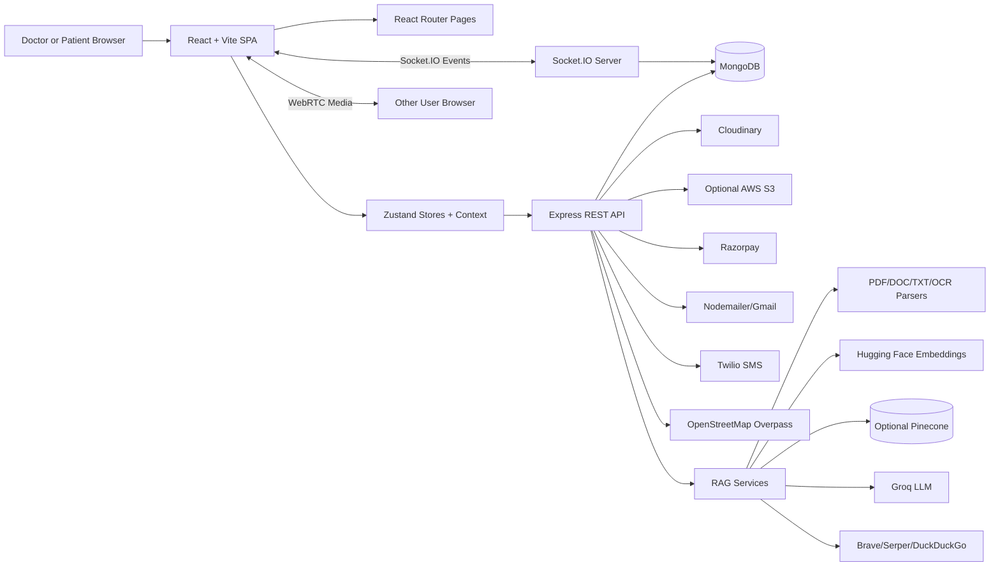
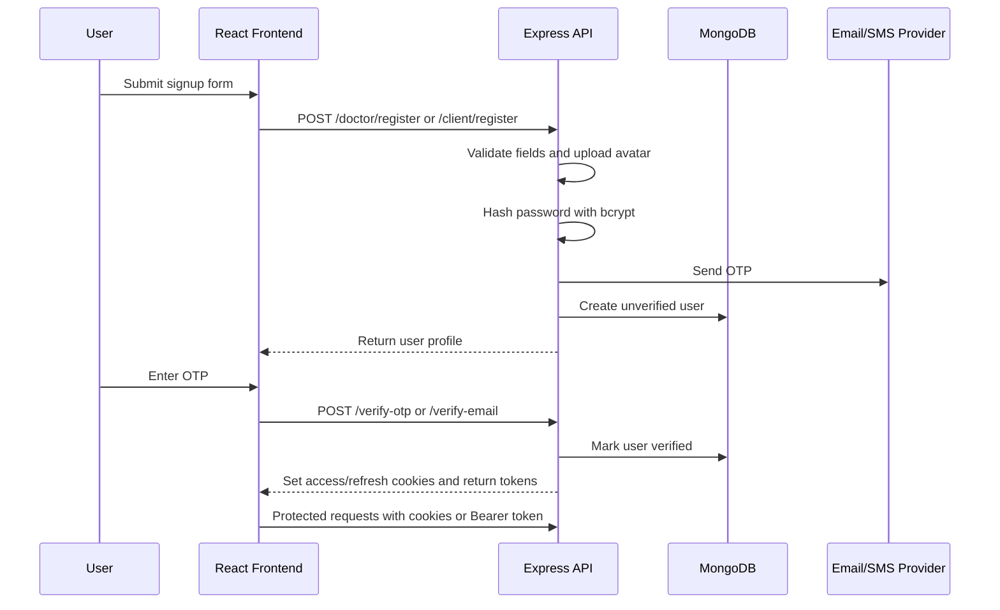
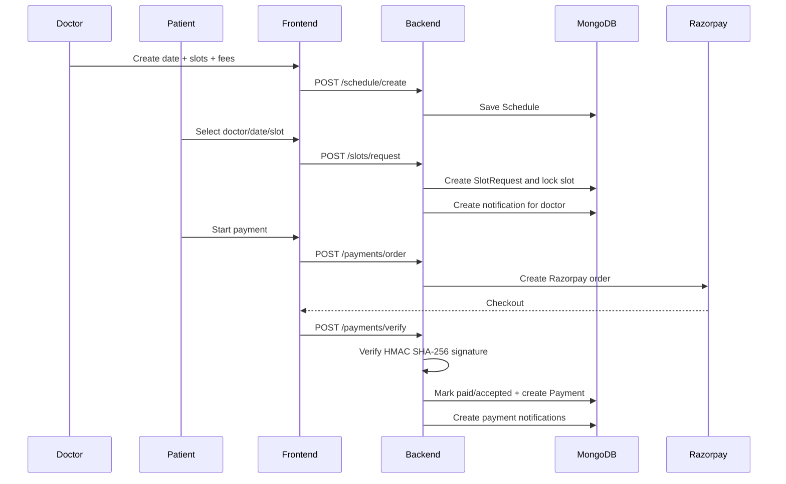
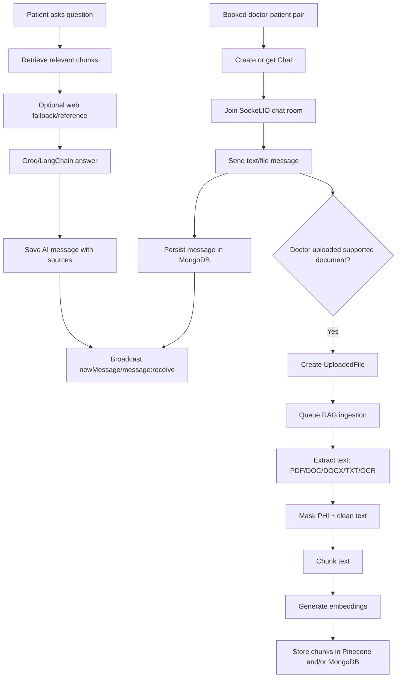
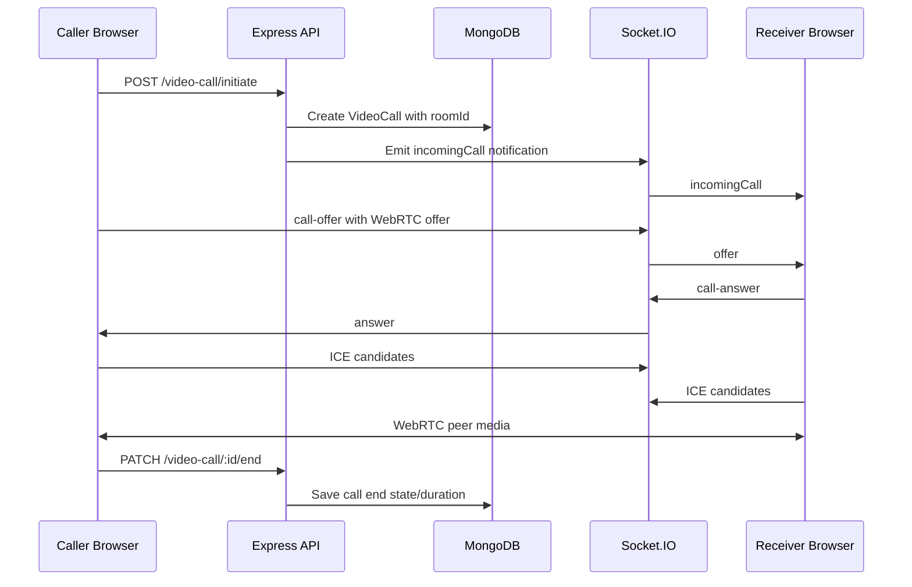
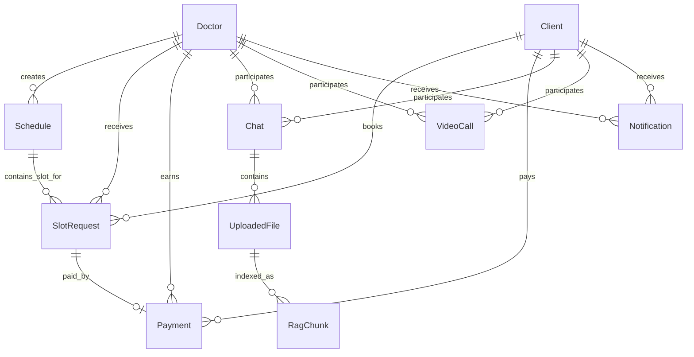

# MediConnect Interview Preparation Guide

Use this document as a project story, technical revision sheet, and mock interview bank for MediConnect. It is written for product-based company interviews, where interviewers care about product thinking, system design, trade-offs, correctness, security, and how clearly you explain engineering decisions.

---

## 1. Project Positioning

### One-Line Description

MediConnect is a full-stack healthcare platform that connects patients and doctors through doctor discovery, appointment booking, payments, real-time chat, file sharing, document-aware AI assistance, video consultations, medicine search, and nearby clinic discovery.

### 30-Second Explanation

MediConnect is a MERN-based healthcare platform for patients and doctors. Patients can discover doctors, book available slots, pay through Razorpay, chat with the doctor, join video consultations, search medicines, and find nearby clinics or hospitals. Doctors can manage schedules, view payments, communicate with patients, and upload medical documents so patients can ask AI-powered questions grounded in those documents. The project combines core product workflows with real-time communication, secure authentication, payment verification, and RAG-based document Q&A.

### 1-Minute Explanation

MediConnect solves the problem of fragmented digital healthcare workflows. In many cases, doctor discovery, appointment booking, payment, messaging, video calls, document sharing, and follow-up questions happen on different tools. MediConnect combines them into one role-based platform.

The frontend is built with React, Vite, React Router, Zustand, Tailwind/custom CSS, Socket.IO client, WebRTC APIs, and Leaflet. The backend is Node.js and Express with MongoDB/Mongoose, Socket.IO, JWT authentication, Multer/Cloudinary uploads, Razorpay payments, Nodemailer/Twilio OTP verification, and AI/RAG services using LangChain, Groq, Hugging Face embeddings, optional Pinecone, OCR, and web fallback.

The strongest design idea is that healthcare communication is gated by appointment context: a doctor and patient can chat or video call only after a slot request exists. Payments are verified server-side using Razorpay signatures, and document Q&A is scoped to doctor-shared files inside the chat session.

### Detailed Explanation

MediConnect has two major user roles: doctors and clients/patients. Doctors register with professional information such as specialization, experience, degree, gender, phone number, and avatar. Patients register with personal details. Both roles use OTP verification, password hashing, JWT-based access/refresh tokens, and protected APIs.

The product flow starts with doctor discovery. Patients can browse verified doctors, filter/search by specialization and profile details, view doctor public profiles, and choose a date for an appointment. Doctors create schedules by date, with one or more time slots and consultation fees. When a patient requests a slot, the backend creates a `SlotRequest`, locks the selected slot, notifies the doctor, and lets the patient proceed to payment.

The payment flow uses Razorpay. The backend creates an order in paise, and after checkout, it verifies the callback signature using HMAC SHA-256. Only after successful verification does the backend mark the request as paid/accepted, confirm the schedule slot, create a `Payment` record, and generate appointment notifications.

After booking, doctors and patients can use real-time chat. Chat messages are persisted in MongoDB and broadcast with Socket.IO. The chat supports text, file/image attachments, read receipts, replies, deletion within a short time window, and online/typing events. For medical documents uploaded by doctors, the system creates an `UploadedFile` record, stores the file through Cloudinary/local/S3 logic, queues RAG ingestion, extracts text from PDFs/DOC/DOCX/TXT/images, chunks it, generates embeddings, stores chunks in Pinecone and/or MongoDB, and answers patient questions with source metadata.

For video consultations, the backend stores the call lifecycle in MongoDB, while Socket.IO handles WebRTC signaling: offers, answers, ICE candidates, accept/reject/end events, presence, and media state updates. This gives the system both real-time behavior and persistent call history.

The project also includes nearby medical facility search using browser geolocation, Leaflet maps, and OpenStreetMap Overpass API; medicine search backed by a MongoDB `medicines` collection; dashboard assistant chat using Groq with fallback responses; notification persistence; and cron-based appointment reminders.

### How To Present It Confidently

Lead with the product problem, then explain the architecture, then mention two or three hard engineering decisions.

Good interview framing:

> "I built MediConnect as an end-to-end healthcare workflow platform, not just a CRUD app. The main challenge was coordinating state across booking, payment, chat, video, files, and notifications while keeping role-based access clear."

Then say:

> "The backend is modular by domain: auth, schedules, slot requests, payments, chats, uploads/RAG, video calls, notifications, medicine search, and clinics. The frontend mirrors those domains using React pages, Zustand stores, and Socket.IO/WebRTC integrations."

Finish with:

> "If I were improving it for production scale, I would add stronger validation, MongoDB transactions for booking/payment consistency, Redis-backed queues and Socket.IO scaling, rate limiting, test coverage, and stricter healthcare privacy controls."

---

## 2. Problem It Solves

### User Problem

Patients often have to use separate systems for:

- Finding a doctor.
- Checking appointment availability.
- Paying consultation fees.
- Messaging the doctor.
- Sharing reports or prescriptions.
- Joining video calls.
- Asking follow-up questions about reports.
- Finding nearby clinics, hospitals, or pharmacies.

Doctors also need a single place to manage availability, communicate with patients, track payments, and support follow-up care.

### Product Solution

MediConnect centralizes the complete consultation workflow:

1. Patient discovers a doctor.
2. Doctor publishes availability.
3. Patient books a slot.
4. Patient pays online.
5. Doctor and patient chat after booking.
6. Doctor uploads documents.
7. Patient asks AI questions about doctor-shared documents.
8. Both users can join video consultation workflows.
9. Notifications and reminders keep the process moving.

### Why This Is Interview-Worthy

This project demonstrates:

- Full-stack product engineering.
- Role-based authentication.
- Database modeling.
- Real-time systems.
- Payment gateway integration.
- File upload and storage.
- RAG and AI orchestration.
- Map/search API integration.
- Deployment readiness.
- Practical security trade-offs.

---

## 3. Key Features

### Patient Features

- Register/login with OTP verification.
- Search and view doctors.
- Book appointment slots.
- Pay consultation fee using Razorpay.
- Chat with booked doctors.
- Upload/share files in chat.
- Ask AI questions about doctor-uploaded documents.
- Join video calls.
- Search medicine details.
- Find nearby clinics, hospitals, and pharmacies.
- Receive notifications and appointment reminders.

### Doctor Features

- Register/login with professional profile.
- Manage profile and avatar.
- Create date-wise schedules and consultation slots.
- View appointment and payment history.
- Chat with booked patients.
- Upload documents for patient-specific RAG Q&A.
- Start/receive video calls.
- Receive booking, payment, message, call, and reminder notifications.

### AI Features

- Dashboard assistant using Groq API with local fallback.
- Smart booking assistant using LangGraph and OpenAI-compatible LLM APIs.
- RAG document Q&A over doctor-uploaded files.
- PDF, DOC, DOCX, TXT, and image OCR support.
- Hugging Face embeddings.
- Optional Pinecone vector search.
- MongoDB vector/lexical fallback.
- Web reference fallback through search providers.
- Source-aware AI answers.

---

## 4. Architecture Overview

### High-Level Architecture



### Backend Domain Layout

```text
backend/
  app.js
  src/
    config/db.js
    controllers/
    jobs/
    middlewares/
    models/
    routes/
    services/
    utils/
```

### Frontend Domain Layout

```text
frontend/
  src/App.jsx
  pages/
  components/
  store/
  context/
  hooks/
  lib/
  services/
  utils/
```

### Main Backend Routes

| Domain | Base Path | Purpose |
|---|---|---|
| Doctor auth/profile | `/doctor` | Doctor registration, OTP, login, logout, profile, listing, public detail |
| Client auth/profile | `/client` | Patient registration, OTP, login, logout, profile, listing |
| Schedule | `/schedule` | Doctor schedule creation and date-based lookup |
| Slot requests | `/slots` | Patient slot reservation and doctor status update |
| Payments | `/payments` | Razorpay order, verification, doctor payment history |
| Chat | `/chats`, `/api/chats` | Chat creation, messages, read receipts, document query |
| Uploads | `/api/upload` | Doctor file upload for chat/RAG |
| Video calls | `/video-call` | Call lifecycle, media controls, history, rating |
| Clinics | `/clinics` | Nearby medical facility lookup through Overpass |
| Medicines | `/medicines` | Medicine search |
| Agent | `/agent` | Smart booking assistant |
| Notifications | `/notifications` | Notification list/count/read state |
| Dashboard assistant | `/chat` | Groq-powered dashboard chatbot |
| Health check | `/health` | Runtime health response |

---

## 5. Core Workflows

### Authentication Flow



Interview explanation:

> "I used separate Doctor and Client models because their profile fields and workflows differ. Passwords are hashed with bcrypt, OTPs expire in five minutes, and login issues access and refresh tokens. The auth middleware accepts either HTTP-only cookies or a Bearer token, which is useful because REST requests can use cookies while Socket.IO needs a token during the handshake."

### Appointment Booking And Payment Flow



Interview explanation:

> "The important part is that payment verification happens on the server. The frontend receives Razorpay checkout data, but the backend recomputes the signature using `RAZORPAY_KEY_SECRET`. Only if the signature matches do we update the slot request and create a payment record."

### Chat And RAG Flow



Interview explanation:

> "RAG is scoped by chat session. A patient does not query all documents in the system; they query documents uploaded by the doctor in that consultation. This is important for relevance and privacy boundaries."

### Video Call Flow



Interview explanation:

> "Socket.IO is not carrying the video stream. It carries signaling messages. The actual audio/video media flows through WebRTC peer connections."

---

## 6. Data Model Summary



### Important Collections

| Collection/Model | Purpose |
|---|---|
| `Doctor` | Doctor profile, auth data, verification, tokens |
| `Client` | Patient profile, auth data, verification, tokens |
| `Schedule` | Doctor date-wise slots, fee, booking state |
| `SlotRequest` | Appointment request between doctor and patient |
| `Payment` | Razorpay transaction record and doctor earnings |
| `Chat` | Participants and embedded messages |
| `UploadedFile` | Chat document metadata and RAG indexing status |
| `RagChunk` | Local fallback chunks and embeddings for RAG |
| `VideoCall` | Call lifecycle, participants, room ID, media state |
| `Notification` | Persistent notifications |
| `Medicine` | Medicine dataset records |

---

## 7. Design Decisions And Trade-Offs

### Separate Doctor And Client Models

Why:

- Doctors and patients have different required fields.
- Doctor discovery needs specialization, degree, experience.
- Patient profile needs age/gender/basic contact data.

Trade-off:

- Some auth logic is duplicated.
- A future production design could use a shared `User` model plus role-specific profile collections.

Interview answer:

> "I chose separate models for clarity because the role workflows are very different. For a larger team or multi-role expansion, I would consider a common user identity table with role-specific profiles."

### Booking-Gated Chat And Video

Why:

- Prevents random users from messaging or calling doctors.
- Makes communication tied to a real appointment context.
- Better matches healthcare trust and privacy expectations.

Trade-off:

- More checks are needed in REST and socket handlers.
- The system must keep slot request state accurate.

### REST Plus Socket.IO

Why:

- REST is reliable for CRUD, persistence, pagination, uploads, and payment verification.
- Socket.IO is better for real-time messages, typing, read receipts, presence, and call signaling.

Trade-off:

- Need to avoid duplicate sends when REST already broadcasts socket events.
- Socket auth and REST auth must stay consistent.

### Embedded Messages In Chat Document

Why:

- Simpler data model for small/medium consultation threads.
- Easy to load messages with chat participants.

Trade-off:

- Very large conversations can make the chat document grow too much.
- Future scale should move messages into a separate `Message` collection with indexes and cursor pagination.

### Server-Side Payment Verification

Why:

- Frontend payment callbacks cannot be trusted alone.
- Razorpay signature verification prevents forged payment success events.

Trade-off:

- Backend must manage idempotency and consistent booking state.
- Production should add payment webhooks and transaction/idempotency handling.

### Session-Scoped RAG

Why:

- Keeps answers relevant to the current doctor-patient chat.
- Reduces accidental leakage across users.
- Makes source attribution simpler.

Trade-off:

- If a document belongs to multiple sessions, it may be indexed multiple times.
- A future system could separate document storage from session-level permissions.

### Local/Pinecone Hybrid Retrieval

Why:

- Pinecone is production-friendly for vector search.
- MongoDB local chunks provide a useful fallback.
- Lexical fallback helps when embedding calls fail.

Trade-off:

- Multiple retrieval paths increase complexity.
- Need strong observability to know which path was used.

### In-Process RAG Queue

Why:

- Simple implementation for a single backend instance.
- Good enough for development and demos.

Trade-off:

- Jobs can be lost if the process restarts.
- Horizontal scaling needs Redis/BullMQ/SQS or another durable queue.

---

## 8. Challenges Faced And Strong Answers

### Challenge 1: Keeping Booking, Slot, And Payment State Consistent

Problem:

If two patients try to book the same slot or payment succeeds after stale state, the app can show incorrect availability.

Current handling:

- Slot request creation checks availability.
- The selected slot is marked booked and linked to a request.
- Payment verification confirms the slot request and schedule slot.

Ideal improvement:

- Use MongoDB transactions.
- Add optimistic concurrency/versioning.
- Add idempotency keys for payment verification.

Interview answer:

> "I handled slot locking at request creation and reconfirmed booking after payment verification. For production, I would wrap slot request creation, schedule update, and payment confirmation in MongoDB transactions to prevent race conditions."

### Challenge 2: Avoiding Duplicate Chat Messages

Problem:

Messages can be sent through REST and also broadcast through sockets. If the frontend emits another socket message after REST save, duplicates appear.

Current handling:

- REST `send-message` saves and broadcasts.
- The chat store intentionally does not emit another `sendMessage` after REST success.
- Frontend checks message IDs before adding socket messages.

Interview answer:

> "I treated the backend as the source of truth. REST persists the message, then the backend broadcasts it. The client only merges messages by ID, which avoids duplicate local state."

### Challenge 3: Socket Authentication

Problem:

HTTP-only cookies are good for browser security, but Socket.IO handshakes often need explicit auth data.

Current handling:

- REST uses HTTP-only cookies and Bearer fallback.
- Socket.IO receives a token in `handshake.auth.token`.
- Backend verifies JWT and attaches user/userType to the socket.

Improvement:

- Reduce localStorage token exposure with a socket auth endpoint or short-lived socket token.

### Challenge 4: Document Q&A Reliability

Problem:

Medical documents may be PDF, Word, text, or scanned images. Embedding APIs and vector DBs can fail.

Current handling:

- Uses multiple parsers: `pdf-parse`, `mammoth`, `word-extractor`, Tesseract OCR.
- Masks common PHI patterns before indexing.
- Stores chunks locally even when Pinecone is unavailable.
- Falls back to lexical retrieval if embeddings fail.
- Uses source-aware prompts and a fixed fallback answer.

Interview answer:

> "The RAG pipeline is resilient by design: parse, clean, de-identify, chunk, embed, store, and retrieve with fallbacks. I also scoped retrieval to the chat session to avoid mixing unrelated medical context."

### Challenge 5: WebRTC Race Conditions

Problem:

If incoming call events and WebRTC offers arrive separately, UI state can race.

Current handling:

- Socket handler emits a unified offer payload with call metadata.
- Stale calls are auto-closed before creating a new call.

Improvement:

- Add TURN server support.
- Add more robust call state reconciliation.

### Challenge 6: External API Failures

Problem:

Overpass, Groq, Hugging Face, Razorpay, Cloudinary, Twilio, and email providers can fail.

Current handling:

- Overpass uses multiple mirrors and POST/GET fallbacks.
- Dashboard chatbot has a local fallback.
- Embedding and RAG logic has retry/fallback behavior.
- Uploads and payments return clear error responses.

Improvement:

- Add circuit breakers, retry queues, monitoring, and structured logs.

---

## 9. Technology Deep Dive

### Frontend Technologies

| Technology | What It Is | Why Chosen | Where Used | Interview Questions |
|---|---|---|---|---|
| React 19 | Component-based UI library | Fast SPA development, reusable components, strong ecosystem | Pages, components, dashboards, chat, booking, maps | What are hooks? How does state update? What causes re-render? |
| Vite | Frontend build tool/dev server | Fast dev startup, modern ESM, simple React setup | `frontend/vite.config.js`, local dev/build | Why Vite over CRA? What is HMR? |
| React Router DOM | Client-side routing | SPA page navigation without reloads | `frontend/src/App.jsx` | Difference between server routing and client routing? |
| Zustand | Lightweight state management | Simpler than Redux for auth/chat/video stores | `frontend/store/*` | Why Zustand? How does it avoid prop drilling? |
| React Context | Shared global context | Lightweight theme state | `ThemeContext.jsx` | Context vs Zustand? When can Context cause re-renders? |
| Tailwind CSS 4 | Utility-first styling | Rapid responsive UI styling | Components/pages and Vite plugin | Pros/cons of utility CSS? |
| Custom CSS | App-specific styling | Theme and page-specific styles | `theme.css`, `App.css`, component CSS | How do CSS variables help theming? |
| Lucide React | Icon library | Clean consistent UI icons | Buttons, cards, feature UI | Why use icon libraries? |
| React Icons | Icon library | Additional icon coverage | UI components | How do icons affect bundle size? |
| React Hot Toast | Toast notifications | User feedback for auth/actions | Auth stores, video store | Where should toast logic live? |
| Framer Motion | Animation library | Smooth declarative animations | Landing/about UI | Framer Motion vs CSS transitions? |
| GSAP | Animation library | Timeline-style animations | Hero/interactive sections | When use GSAP over CSS? |
| Swiper | Carousel/slider library | Rich slider behavior | UI dependency for carousel-style sections | How do you avoid accessibility issues in carousels? |
| Three.js | 3D rendering library | 3D/interactive hero capability | Hero/visual dependencies | What is WebGL? How does Three.js simplify it? |
| Leaflet | Map rendering library | Open-source map UI | Nearby clinic map | Leaflet vs Google Maps? |
| OpenStreetMap Tiles | Map tile data | Free/open map rendering | Leaflet map layer | What are map tiles? |
| Browser Geolocation API | Gets user coordinates | Nearby clinic/hospital search | `NearbyClinicMap.jsx` | What permissions are needed? |
| WebRTC APIs | Peer-to-peer media | Browser video/audio consultation | `VideoPage`, socket signaling | What is signaling? What are ICE candidates? |
| Socket.IO Client | Realtime client | Chat, presence, video signaling | Chat/video stores/pages | WebSocket vs Socket.IO? |
| Axios | HTTP client | Interceptors, base URL, credentials | `utils/axois.js`, stores | Why use Axios over fetch? |
| Fetch API | Native HTTP client | Simple endpoint calls | Booking, maps, medicine, agent | Fetch vs Axios? |
| date-fns | Date utility library | Safer date formatting/manipulation | Dependency for date workflows | Why avoid manual date parsing? |
| localStorage | Browser persistence | Store IDs/theme/non-sensitive UI state and socket token fallback | Auth stores, theme, chat bot | Security risk of localStorage? |
| ESLint | Static linting | Catch common JS/React mistakes | `eslint.config.js` | What do linters catch? |
| npm | Package manager | Standard Node package workflow | frontend/backend package management | Why commit `package-lock.json`? |

### Backend Technologies

| Technology | What It Is | Why Chosen | Where Used | Interview Questions |
|---|---|---|---|---|
| Node.js | JavaScript runtime | Same language across stack, event-driven I/O | Backend server | Why Node for APIs? |
| Express.js | Web framework | Simple routing/middleware model | `backend/app.js`, routes | What is middleware? |
| MongoDB | NoSQL document database | Flexible schema for profiles, chats, schedules | Main database | SQL vs NoSQL trade-offs? |
| Mongoose | MongoDB ODM | Schemas, validation, hooks, models | `backend/src/models/*` | What are schemas, refs, indexes? |
| Socket.IO | Realtime engine | Reliable WebSocket abstraction with rooms/reconnection | Chat, notifications, video signaling | Rooms vs namespaces? |
| JWT | Signed auth tokens | Stateless access auth | Models, controllers, middleware | Access vs refresh token? |
| bcrypt/bcryptjs | Password hashing | Slow salted hashing for passwords | Doctor/Client models/controllers | Hashing vs encryption? |
| cookie-parser | Cookie parsing middleware | Read access/refresh cookies | `app.js`, auth middleware | Why HTTP-only cookies? |
| CORS | Cross-origin control | Allow Vercel frontend to call Render backend with credentials | `app.js` | What is preflight? |
| dotenv | Environment config | Keep secrets/config outside code | `app.js`, utilities | Why not commit `.env`? |
| Multer | Multipart upload middleware | Avatar/chat file uploads | `multer.middleware.js` | How do file filters work? |
| Cloudinary | Cloud media storage | Avatar and raw file hosting/signed URLs | `utils/cloudinary.js`, controllers | Public vs signed URLs? |
| AWS S3 SDK | Object storage client | Optional production chat file storage | `fileStorage.service.js` | Why use signed URLs? |
| Razorpay | Payment gateway | INR payment orders and verification | payment controllers, booking UI | How verify payment signature? |
| Nodemailer | Email sending | Email OTP verification | auth controllers | How avoid blocking request on email? |
| Twilio | SMS sending | Phone OTP support | `sendotp.js` | How handle SMS failure? |
| node-cron | Scheduled jobs | Appointment reminders | `appointmentReminder.cron.js` | Cron vs queue scheduler? |
| uuid | Unique IDs | Room IDs, file IDs | video/upload/chat | Why not use timestamps only? |
| Axios | Server-side HTTP client | Overpass/Groq calls | `app.js`, clinic routes | Timeouts and retries? |
| Native fetch | Server-side HTTP | Hugging Face embedding calls | `rag.service.js` | How handle API retries? |
| pdf-parse | PDF text extraction | RAG document ingestion | `rag.service.js` | Why extract text before embeddings? |
| mammoth | DOCX text extraction | Word document RAG ingestion | `rag.service.js` | DOC vs DOCX difference? |
| word-extractor | DOC text extraction | Legacy Word document ingestion | `rag.service.js` | Why support legacy formats? |
| Tesseract.js | OCR engine | Text extraction from images/scans | `rag.service.js` | OCR limitations? |
| LangChain | LLM orchestration | Prompt templates, runnables, document abstraction | RAG services | What is a RAG chain? |
| LangGraph | Agent workflow graph | Smart booking assistant parse/fulfill flow | `agent.controller.js` | Graph vs linear chain? |
| OpenAI SDK | OpenAI-compatible client | Agent calls through Groq/OpenRouter-compatible APIs | `agent.controller.js` | Why use OpenAI-compatible APIs? |
| Groq API | LLM provider | Fast chat completions for assistant/RAG | dashboard chat, RAG, agent | How control hallucination? |
| Hugging Face Inference API | Embedding provider | Convert text chunks/questions to vectors | `rag.service.js` | What are embeddings? |
| Pinecone | Vector database | Optional scalable vector retrieval | `rag.service.js` | Why vector DB? |
| Cheerio | HTML parsing library | Dependency useful for web/search scraping workflows | backend package | How parse HTML server-side? |
| Puppeteer | Headless browser | Installed for browser automation/scraping potential | backend package | When use Puppeteer over HTTP? |
| csv-parser | CSV parser | Installed for dataset import potential | backend package | How stream large CSV files? |
| PayPal SDK | Payment SDK | Installed but Razorpay is current payment flow | backend package | How abstract payment providers? |
| ApiError/ApiResponse | Local utilities | Consistent errors/responses | controllers | Why standardize API responses? |
| asyncHandler | Local utility | Avoid repetitive try/catch in async controllers | controllers | How does Express handle async errors? |

### Database And Storage Technologies

| Technology | Why Used | Where Used | Interview Focus |
|---|---|---|---|
| MongoDB Atlas/local MongoDB | Primary persistence | Users, bookings, payments, chat, video, notifications, medicines | Schema design, indexing, consistency |
| Mongoose indexes | Query performance | Chat participant, notification recipient, RAG chunks | How indexes improve reads |
| Embedded arrays | Store slots and chat messages | `Schedule.slots`, `Chat.messages` | When embedding becomes a problem |
| Ref paths | Dynamic references to Doctor/Client | Chat, notifications, video participants | Polymorphic refs in Mongoose |
| Cloudinary | Media/raw document storage | Avatars, chat documents | URL security, cleanup |
| Local filesystem | Development fallback storage | `public/uploads/chat`, `public/temp` | Why not rely on local disk in serverless/cloud |
| AWS S3 | Optional production storage | `fileStorage.service.js` | Durable object storage and signed URLs |
| Pinecone | Vector index | RAG chunks by chat namespace | Vector search and namespaces |

### External APIs

| API | Purpose | Where Used | Important Interview Point |
|---|---|---|---|
| Razorpay Checkout/API | Payment order and verification | Booking/payment flow | Verify signature on backend |
| Gmail/Nodemailer | Email OTP | Auth controllers | Use app passwords/secrets |
| Twilio SMS | SMS OTP | Client registration utility | Handle provider failures |
| OpenStreetMap Overpass | Nearby medical facilities | Clinic routes | Use multiple mirrors/fallbacks |
| Groq | LLM completions | Dashboard chat/RAG/agent | Prompt grounding and fallback |
| Hugging Face | Embeddings | RAG ingestion/retrieval | Batch, retry, normalize vectors |
| Brave/Serper/DuckDuckGo | Web search fallback | RAG web search service | Separate web context from doctor documents |

### Deployment And Tooling

| Tool | Why Used | Where Used | Interview Question |
|---|---|---|---|
| Render | Backend hosting | `render.yaml` | How deploy Node backend? |
| Vercel | Frontend hosting | `frontend/vercel.json` | How handle SPA rewrites? |
| Environment variables | Config/secrets | `.env` examples, app config | How manage secrets? |
| Health endpoint | Monitoring | `/health` | What should health checks include? |
| Nodemon | Local backend restart | backend `npm test` script | Difference between dev and prod scripts? |
| ESLint | Code quality | frontend linting | CI lint checks |

---

## 10. Architecture Questions And Ideal Answers

### Q1. Explain MediConnect architecture.

Ideal answer:

MediConnect is split into a React/Vite frontend and an Express backend. The frontend uses React Router for pages, Zustand for auth/chat/video state, Context for theme, and Socket.IO/WebRTC for real-time features. The backend exposes domain-specific REST routes for auth, doctors, schedules, slots, payments, chats, uploads, video calls, clinics, medicines, agents, and notifications. MongoDB stores the application data through Mongoose models. Socket.IO runs on the same HTTP server for chat, notifications, presence, and WebRTC signaling. External services include Razorpay, Cloudinary, Nodemailer, Twilio, Overpass, Groq, Hugging Face, and optional Pinecone/S3.

Likely follow-ups:

- Why split frontend and backend?
- How do frontend stores map to backend domains?
- What breaks when scaling to multiple backend instances?

### Q2. Why is this more than a CRUD app?

Ideal answer:

It has multiple coordinated workflows: slot locking, payment verification, real-time chat, WebRTC signaling, file upload, asynchronous RAG ingestion, notifications, appointment reminders, map lookup, and AI agent behavior. These require state transitions, external service integration, real-time events, security checks, and failure handling.

Likely follow-ups:

- Which workflow was hardest?
- How did you prevent inconsistent states?

### Q3. How does data flow from frontend to backend?

Ideal answer:

The frontend calls REST APIs using Axios/fetch, usually with `withCredentials` or Bearer tokens. Express middleware parses cookies, JSON, URL-encoded data, and files. Route-specific auth middleware validates JWTs, attaches `req.doctor` or `req.client`, then controllers call services and Mongoose models. For real-time actions, Socket.IO verifies the token during handshake and emits events to user-specific or chat-specific rooms.

Likely follow-ups:

- How do you handle token expiration?
- Why use rooms in Socket.IO?

---

## 11. Frontend Interview Questions

### Basic

**Q1. Why did you use React?**  
React fits the project because the UI is component-heavy: dashboards, forms, cards, chat panels, map views, payment views, and video controls. Components make these workflows reusable and maintainable.

Follow-up: How do hooks help in this project?

**Q2. What is the role of React Router?**  
React Router maps URLs like `/clientdashboard`, `/doctordashboard`, `/chat`, `/video-call`, `/bookappointment`, and `/nearby-clinics` to React pages without full page reloads.

Follow-up: How would you protect routes?

**Q3. Why use Zustand?**  
Zustand provides simple global stores for auth, chat, video, and schedule state without Redux boilerplate. It is useful because multiple components need access to user/session state and actions.

Follow-up: When would Redux Toolkit be better?

**Q4. What is the difference between Context and Zustand here?**  
Context is used for theme because it is simple global UI state. Zustand is used for more complex mutable app state like auth, chat messages, sockets, video call state, and API actions.

Follow-up: Can Context cause unnecessary re-renders?

**Q5. Why Vite?**  
Vite gives fast local development, hot module replacement, and optimized production builds. It is simpler and faster than older Create React App setups.

Follow-up: What does Vite use during development?

### Intermediate

**Q6. How does the frontend handle authentication?**  
Auth stores call login/register/verify endpoints, store user profile state, and keep IDs/tokens needed for socket connection. REST calls use cookies and `withCredentials`; some flows also use Bearer tokens from localStorage.

Follow-up: Is localStorage safe for JWTs?

**Q7. How does the chat UI avoid duplicate messages?**  
When sending a message through REST, the backend saves and broadcasts it. The frontend checks message IDs before adding socket messages, so the same message is not inserted twice.

Follow-up: What happens if the socket disconnects?

**Q8. How does file upload work from the UI?**  
The frontend creates `FormData`, attaches the file and metadata, sends it as multipart data, tracks upload progress, and updates uploaded file/message state after the backend responds.

Follow-up: How would you show upload retry?

**Q9. How does the medicine search reduce unnecessary API calls?**  
The page uses a debounce with `setTimeout`, waiting around 500 ms after typing before calling the API.

Follow-up: How would you cancel stale requests?

**Q10. How is the map implemented?**  
The map uses browser geolocation to get coordinates, Leaflet to render map tiles/markers, and backend Overpass routes to fetch nearby medical facilities.

Follow-up: Why not call Overpass directly from frontend?

### Advanced

**Q11. How would you improve frontend route protection?**  
I would add a `ProtectedRoute` wrapper that checks role and auth state, shows loading during `checkAuth`, redirects unauthenticated users, and prevents doctors from accessing patient-only routes and vice versa.

Follow-up: How do you handle refresh on page reload?

**Q12. How would you improve socket token handling?**  
Currently sockets use a token from localStorage because HTTP-only cookies are harder to read during the socket handshake. For better security, I would issue a short-lived socket token from an authenticated endpoint or rely on cookie-based socket auth with strict same-site/CORS settings.

Follow-up: Why are localStorage tokens vulnerable?

**Q13. How would you optimize large chat rendering?**  
Use virtualized lists, cursor-based pagination, message collection indexing, and incremental loading of older messages. Also separate messages from the chat document on the backend.

Follow-up: What is list virtualization?

**Q14. What frontend accessibility improvements would you add?**  
Keyboard navigation, proper focus management for modals/chat/video controls, ARIA labels for icon buttons, better color contrast, and screen-reader-friendly status updates for toasts and chat.

Follow-up: How do you test accessibility?

---

## 12. Backend Interview Questions

### Basic

**Q1. Why Node.js and Express?**  
Node.js is well suited for I/O-heavy APIs and real-time apps. Express provides a simple middleware and routing model, which fits domain-based REST endpoints.

Follow-up: What is the event loop?

**Q2. What is middleware?**  
Middleware is a function that runs between request arrival and route handler execution. In this project, middleware handles cookies, CORS, JSON parsing, authentication, file uploads, and error handling.

Follow-up: What does `next()` do?

**Q3. What is Mongoose used for?**  
Mongoose defines schemas/models, validation, hooks like password hashing, indexes, and document relationships with refs/refPaths.

Follow-up: What is the difference between MongoDB and Mongoose?

**Q4. Why use `asyncHandler`?**  
It wraps async controllers and forwards errors to Express error middleware instead of writing repetitive try/catch blocks.

Follow-up: How does Express 4 handle rejected promises?

### Intermediate

**Q5. Explain the auth middleware.**  
It reads an access token from cookies or the `Authorization` header, verifies it with `ACCESS_TOKEN_SECRET`, finds the matching doctor or client, removes sensitive fields, and attaches `req.doctor` or `req.client`.

Follow-up: How do you enforce role-specific access?

**Q6. How are passwords secured?**  
Passwords are hashed with bcrypt before saving. During login, the plaintext password is compared against the stored hash. Hashing is one-way, unlike encryption.

Follow-up: What is salt?

**Q7. Why use refresh tokens?**  
Access tokens can be short-lived. Refresh tokens allow the app to issue new access tokens without requiring login again. The refresh token is stored on the user document so logout can invalidate it.

Follow-up: What is refresh token rotation?

**Q8. How is file upload secured?**  
Chat upload uses Multer with a size limit and allowlist for MIME types and extensions. Files get safe generated names. Production should add virus scanning and stronger content validation.

Follow-up: Why check both MIME type and extension?

**Q9. How do notifications work?**  
The backend persists notification records in MongoDB and also emits real-time `notification:new` events to user-specific Socket.IO rooms like `user_<id>`.

Follow-up: How would notifications work if the user is offline?

### Advanced

**Q10. How would you make booking atomic?**  
Use MongoDB transactions with a session. The slot availability check, slot request creation, schedule slot update, and payment confirmation should be in transaction boundaries where appropriate. Also use unique constraints or optimistic concurrency to prevent double booking.

Follow-up: Does MongoDB support transactions?

**Q11. How would you scale Socket.IO?**  
Use a Redis adapter so events can be broadcast across multiple Node instances. Store presence in Redis instead of in-memory maps. Use sticky sessions or compatible load balancer config.

Follow-up: Why do in-memory maps break across instances?

**Q12. How would you handle long-running RAG ingestion?**  
Move the in-process queue to a durable worker system like BullMQ/Redis, SQS, or RabbitMQ. Store job status in DB, retry failed jobs, and make ingestion idempotent by file ID.

Follow-up: What is idempotency?

**Q13. What backend validation would you add?**  
Use Zod/Joi/express-validator for request schemas, sanitize inputs, validate ObjectIds, validate dates/times, enforce role checks, and centralize errors.

Follow-up: Why not rely only on frontend validation?

---

## 13. Database Interview Questions

### Q1. Why MongoDB for MediConnect?

Ideal answer:

MongoDB works well because the project has flexible documents: doctor profiles, patient profiles, schedules with embedded slots, chat documents with messages, video call records, notification metadata, and RAG chunks. It lets the app evolve quickly while still using Mongoose schemas for structure.

Follow-up:

- Would PostgreSQL also work?
- Which parts need relational consistency?

### Q2. Explain the Schedule and SlotRequest relationship.

Ideal answer:

`Schedule` stores a doctor, a date, and embedded slots. `SlotRequest` stores the patient, doctor, schedule ID, slot index, date, time, fee, status, and payment status. The slot keeps `isBooked`, `bookedBy`, and `requestId` so the UI can show availability quickly.

Follow-up:

- What happens if slot order changes?
- Would you use slot IDs instead of indexes?

### Q3. Why are chat messages embedded?

Ideal answer:

Embedding simplifies reading a consultation thread and keeping messages with the chat. It is acceptable for a demo or moderate message volume. At scale, I would move messages to a separate collection for better indexing, pagination, and document size safety.

Follow-up:

- What is MongoDB's document size limit?
- How would cursor pagination work?

### Q4. What indexes are useful?

Ideal answer:

Useful indexes include participants in chats, `lastMessage`, notification recipient plus created time, RAG `sessionId/fileId/chunkIndex`, video participants plus status, and schedule doctor/date. These match common query patterns.

Follow-up:

- How can too many indexes hurt writes?

### Q5. How would you prevent duplicate bookings at the DB level?

Ideal answer:

I would use transactions and/or create a separate slot entity with a unique constraint on `(scheduleId, slotId)` for active bookings. I would also use conditional update operations that only update a slot if it is currently unbooked.

Follow-up:

- How does `findOneAndUpdate` with conditions help?

---

## 14. Authentication And Security Questions

### Q1. Explain access token vs refresh token.

Ideal answer:

An access token is used to authenticate API requests and should be short-lived. A refresh token lasts longer and is used to issue a new access token. In MediConnect, refresh tokens are stored in the user document, which allows logout or token invalidation by clearing the stored token.

Follow-up:

- Should refresh tokens be rotated?

### Q2. Why HTTP-only cookies?

Ideal answer:

HTTP-only cookies cannot be read by JavaScript, reducing token theft risk from XSS. They are sent automatically with requests when CORS and credential settings allow it.

Follow-up:

- What about CSRF?

### Q3. What security risks exist in this project?

Ideal answer:

Main risks include localStorage token exposure for sockets, missing rate limiting, payment routes that should be more tightly authenticated, need for stronger request validation, healthcare privacy compliance, upload scanning, and better audit logs. These are all fixable with production hardening.

Follow-up:

- Which would you fix first?

### Q4. How is payment security handled?

Ideal answer:

Payment success is not trusted from the frontend. The backend recomputes the HMAC SHA-256 signature using the Razorpay secret and compares it to `razorpay_signature`. Only then does it update payment and booking state.

Follow-up:

- Why add webhooks?

### Q5. How do you protect chat/video access?

Ideal answer:

The backend checks that the current user is a chat participant and that a non-rejected slot request exists between the doctor and patient. The same booking gate is used before joining chat rooms, sending messages, uploading files, asking RAG questions, and initiating video calls.

Follow-up:

- Should pending bookings allow chat?

---

## 15. API Design Questions

### Q1. What makes a good REST API?

Ideal answer:

Clear resource naming, correct HTTP methods, validation, consistent response shapes, status codes, auth checks, pagination/filtering, and idempotency where needed.

MediConnect examples:

- `POST /doctor/register`
- `GET /doctor`
- `POST /schedule/create`
- `POST /slots/request`
- `POST /payments/verify`
- `GET /chats/:chatId/messages`

Follow-up:

- Which endpoints would you redesign?

### Q2. How does pagination work in the project?

Ideal answer:

Doctor and client listing use page/limit queries. Chat messages return a slice based on page and limit with metadata like total pages, total messages, and `hasMore`.

Follow-up:

- Why cursor pagination can be better than offset pagination?

### Q3. How do you handle errors?

Ideal answer:

Many controllers use `ApiError`, `ApiResponse`, and `asyncHandler`. A central error middleware returns a JSON error response. For production, I would standardize all controllers and add structured error codes.

Follow-up:

- What should you avoid exposing in production errors?

---

## 16. Real-Time And WebRTC Questions

### Q1. Why Socket.IO instead of plain WebSocket?

Ideal answer:

Socket.IO provides reconnection, rooms, event-based messaging, transport fallback, and middleware support. That makes it easier for chat rooms, user notification rooms, presence, and WebRTC signaling.

Follow-up:

- What are Socket.IO rooms?

### Q2. How does chat realtime work?

Ideal answer:

The socket authenticates using JWT, joins user-specific and chat-specific rooms, and emits events like `newMessage`, `message:receive`, `file:receive`, `query:answer`, `messagesRead`, typing, online/offline, and notifications.

Follow-up:

- How would you handle missed messages?

### Q3. What is WebRTC signaling?

Ideal answer:

WebRTC needs peers to exchange metadata before direct media can start: offer, answer, and ICE candidates. Socket.IO carries those signaling messages, while the browser WebRTC peer connection carries the actual audio/video stream.

Follow-up:

- Why might you need a TURN server?

### Q4. What state is stored for video calls?

Ideal answer:

The `VideoCall` model stores participants, initiator, call status, type, room ID, start/end time, duration, participant media state, ratings, and technical issues.

Follow-up:

- What should happen on disconnect?

---

## 17. RAG And AI Questions

### Q1. What is RAG?

Ideal answer:

RAG stands for Retrieval-Augmented Generation. Instead of asking the LLM to answer from memory, the system retrieves relevant documents or chunks and passes them as context to the LLM. This improves grounding and allows source-aware answers.

Follow-up:

- Why not put the whole document in the prompt?

### Q2. Explain MediConnect's RAG pipeline.

Ideal answer:

Doctors upload supported documents in a chat. The backend stores file metadata, queues ingestion, extracts text using PDF/Word/text/OCR parsers, masks common PHI, cleans and chunks text, generates Hugging Face embeddings, stores vectors in Pinecone if configured and chunks in MongoDB, then retrieves relevant chunks when the patient asks a question. Groq generates the final answer with document/web sources.

Follow-up:

- What happens if embeddings fail?

### Q3. Why chunk documents?

Ideal answer:

LLMs and embedding models have context limits. Chunking creates smaller searchable units so retrieval can find the most relevant parts instead of sending the entire document.

Follow-up:

- What are chunk size and overlap?

### Q4. Why use embeddings?

Ideal answer:

Embeddings convert text into numerical vectors that capture semantic meaning. This allows similarity search even when the question uses different wording than the document.

Follow-up:

- What is cosine similarity?

### Q5. How do you reduce hallucinations?

Ideal answer:

The prompt instructs the model to use only provided context, say when uploaded documents do not contain information, include sources, and return a fixed fallback answer when context is insufficient. The system also prioritizes doctor-provided document context over web references.

Follow-up:

- Can this fully eliminate hallucinations?

### Q6. Why include web fallback?

Ideal answer:

Some patient questions are general medical reference questions not covered by uploaded documents. Web fallback can provide general reference context, but the answer must clearly separate uploaded document facts from general web information.

Follow-up:

- Is web fallback safe for medical advice?

### Q7. What privacy concerns exist with RAG?

Ideal answer:

Medical documents may contain personal health information. The project masks common PHI patterns before indexing, scopes retrieval by chat session, and allows only doctors in the session to upload documents. Production would require stronger PHI detection, encryption, audit logs, consent, access policies, and compliance review.

Follow-up:

- What is HIPAA?

---

## 18. Deployment Questions

### Q1. How would you deploy MediConnect?

Ideal answer:

Deploy the backend as a Render Node web service and the frontend as a Vercel SPA. Use MongoDB Atlas for the database. Configure environment variables for MongoDB, JWT secrets, CORS origins, Cloudinary, Razorpay, Twilio, email, Groq, Hugging Face, Pinecone, and frontend API URLs. Vercel rewrites all frontend routes to `index.html`, and the backend exposes a health endpoint.

Follow-up:

- Why separate frontend and backend hosting?

### Q2. What environment variables are important?

Ideal answer:

Important backend variables include `MONGODB_URI`, `DB_NAME`, `ACCESS_TOKEN_SECRET`, `REFRESH_TOKEN_SECRET`, `FRONTEND_URL`, `ALLOWED_ORIGINS`, `CLOUDINARY_*`, `RAZORPAY_*`, `EMAIL_*`, `TWILIO_*`, `GROQ_API_KEY`, `HUGGINGFACE_API_KEY`, `PINECONE_*`, and optional `AWS_*`. Frontend needs `VITE_API_URL`, `VITE_SOCKET_URL`, and a Razorpay public key.

Follow-up:

- Which secrets must never be exposed to frontend?

### Q3. What production deployment issues would you fix?

Ideal answer:

I would align Render's health check to `/health`, add `start` scripts, add CI checks, remove unused packages, enforce environment validation at startup, add structured logs, enable rate limiting, use production object storage, and add monitoring.

Follow-up:

- How do you detect a bad deployment?

---

## 19. Scalability Questions

### Q1. What are the current scaling bottlenecks?

Ideal answer:

The biggest bottlenecks are in-memory socket presence, in-process RAG queue, embedded chat messages, lack of Redis adapter for Socket.IO, limited transaction handling for booking/payment, external API latency, and local file storage fallback.

Follow-up:

- Which bottleneck would appear first?

### Q2. How would you scale chat?

Ideal answer:

Move messages to a separate collection, add indexes on chat ID and created time, use cursor pagination, virtualize frontend rendering, use Redis adapter for Socket.IO, store presence in Redis, and persist unread counts separately.

Follow-up:

- How do you order messages consistently?

### Q3. How would you scale RAG?

Ideal answer:

Use a durable job queue, worker processes, object storage for documents, Pinecone or another managed vector DB, ingestion idempotency, chunk-level metadata, cache frequent answers, and monitor embedding/LLM cost and latency.

Follow-up:

- How would you handle re-indexing?

### Q4. How would you scale payments?

Ideal answer:

Use idempotency keys, Razorpay webhooks, transaction logs, payment status reconciliation, server-side auth checks, and background jobs to handle delayed payment confirmation.

Follow-up:

- Why are webhooks important?

---

## 20. Security And Privacy Improvements

High-priority improvements:

- Add request schema validation with Zod/Joi.
- Add rate limiting for auth, OTP, chat, agent, and RAG endpoints.
- Add CSRF protection if relying on cookies across origins.
- Use short-lived socket tokens instead of long-lived tokens in localStorage.
- Protect payment order/history routes with role-based auth.
- Use MongoDB transactions for slot/payment state changes.
- Add audit logs for medical document access.
- Encrypt sensitive fields at rest where required.
- Add virus scanning for uploads.
- Store all production uploads in S3/Cloudinary, not local disk.
- Add stricter CORS and cookie domain config.
- Add monitoring, structured logging, and alerting.
- Add compliance review for healthcare data.

Strong interview line:

> "I treated this as a healthcare-style workflow, so my next production step would be privacy and abuse hardening: validation, rate limiting, audit logs, upload scanning, stricter token handling, and transactional booking/payment updates."

---

## 21. Possible Improvements Roadmap

### Short-Term Improvements

- Add protected route components in frontend.
- Standardize all API response shapes.
- Add backend `start` and `dev` scripts.
- Fix Vite Razorpay env naming consistently to `VITE_RAZORPAY_KEY_ID`.
- Align Render health check path with `/health`.
- Add API validation.
- Add unit tests for auth, booking, payments, and RAG helpers.
- Add integration tests for booking/payment flow.

### Medium-Term Improvements

- Add MongoDB transactions for booking/payment.
- Move chat messages into separate collection.
- Add Redis for Socket.IO scaling and presence.
- Add BullMQ/Redis queue for RAG ingestion.
- Add payment webhooks and idempotency keys.
- Add admin verification for doctors.
- Add notification preferences.
- Add observability with logs, metrics, and tracing.

### Long-Term Improvements

- Migrate to TypeScript.
- Add Docker and CI/CD.
- Build mobile app or PWA.
- Add TURN server for reliable WebRTC.
- Add advanced search for doctors and medicines.
- Add analytics dashboard for doctors.
- Add consent management and compliance workflows.
- Add multi-language support.
- Add encrypted document storage and audit trails.

---

## 22. Project-Specific Interview Questions

### Basic Project Questions

**Q1. What is MediConnect?**  
MediConnect is a full-stack healthcare platform connecting patients and doctors through doctor discovery, booking, payment, chat, AI document Q&A, video consultation, medicine search, and nearby facility search.

Follow-up: Who are the users?

**Q2. What problem does it solve?**  
It reduces fragmentation in healthcare workflows by bringing discovery, scheduling, payment, communication, document sharing, and consultation into one platform.

Follow-up: What makes this useful to doctors?

**Q3. What are the main modules?**  
Auth, doctor discovery, scheduling, slot requests, payments, chat, uploads/RAG, video calls, notifications, medicine search, clinic map, and deployment.

Follow-up: Which module is most complex?

**Q4. What is your favorite feature?**  
The RAG chat feature, because it combines file upload, parsing, embeddings, retrieval, LLM prompting, source attribution, and real-time chat into one useful workflow.

Follow-up: How does it prevent hallucination?

**Q5. What was the hardest bug or challenge?**  
Coordinating real-time chat state and preventing duplicate messages when using both REST persistence and socket broadcasts. The solution was making REST save/broadcast the source of truth and deduplicating by message ID on the frontend.

Follow-up: What did you learn?

### Intermediate Project Questions

**Q6. How does appointment booking work end to end?**  
Doctors create schedules with slots. Patients fetch schedule by doctor/date, request a slot, the backend creates a slot request and locks the slot, then the patient pays through Razorpay. Backend verifies the signature and marks the request paid/accepted.

Follow-up: What prevents double booking?

**Q7. Why is chat only available after booking?**  
Because healthcare communication should be tied to a consultation relationship. It prevents random access to doctors and creates a clear permission boundary.

Follow-up: Should pending bookings allow chat?

**Q8. How do notifications work?**  
Notifications are persisted in MongoDB and emitted in real time to user-specific Socket.IO rooms. They are generated for booking, payment success, appointment reminders, chat messages, and video call invites.

Follow-up: How do users see old notifications?

**Q9. How does medicine search work?**  
The frontend sends a debounced query to `/medicines/search?name=...`. The backend searches the `medicines` MongoDB collection case-insensitively and returns fields like price, manufacturer, type, pack size, and composition.

Follow-up: How would you optimize search?

**Q10. How does nearby clinic search work?**  
The frontend gets the user's location using browser geolocation and calls backend clinic routes. The backend queries Overpass API for hospitals, clinics, doctors, and pharmacies, processes map elements, categorizes results, and returns them for Leaflet markers.

Follow-up: Why use multiple Overpass endpoints?

### Advanced Project Questions

**Q11. How would you redesign auth for production?**  
Use a unified identity model with role-specific profiles, strict RBAC middleware, refresh token rotation, token version enforcement, short-lived access tokens, CSRF protection, rate limits, and better session/device management.

Follow-up: What is RBAC?

**Q12. What would you change in the database schema?**  
I would move chat messages to a separate collection, add slot IDs instead of relying on slot indexes, add compound indexes for doctor/date schedules, enforce uniqueness where possible, and use transactions for booking/payment.

Follow-up: Why are slot indexes risky?

**Q13. How would you make the app horizontally scalable?**  
Use Redis for Socket.IO adapter and presence, external durable queues for RAG/reminders, object storage for files, stateless API instances, managed MongoDB, and load balancing with health checks.

Follow-up: What state is currently in memory?

**Q14. How would you improve reliability of AI answers?**  
Add better document preprocessing, medical-specific reranking, confidence scoring, citations with chunk references, strict refusal behavior, human review for sensitive cases, and logging/evaluation of RAG outputs.

Follow-up: How do you evaluate RAG quality?

**Q15. How would you handle compliance for healthcare data?**  
Add consent, audit logs, encryption at rest/in transit, least-privilege access, data retention policy, secure file scanning, breach monitoring, and compliance review for applicable standards.

Follow-up: What should be logged?

---

## 23. Resume And Interview Bullets

Use bullets like these on a resume or in a project explanation:

- Built a full-stack MERN healthcare platform with role-based doctor/patient workflows for discovery, booking, payments, chat, video calls, and document-aware AI assistance.
- Implemented JWT authentication with OTP verification, bcrypt password hashing, HTTP-only cookies, and protected doctor/client APIs.
- Designed appointment scheduling with slot requests, Razorpay order creation, server-side payment signature verification, and doctor payment history.
- Integrated Socket.IO for real-time chat, notifications, presence, read receipts, file broadcasts, and WebRTC signaling.
- Built a RAG pipeline for doctor-uploaded documents using PDF/Word/OCR parsing, Hugging Face embeddings, optional Pinecone, MongoDB fallback retrieval, Groq LLM responses, and source-aware answers.
- Added nearby medical facility search using geolocation, Leaflet, and OpenStreetMap Overpass API.
- Prepared deployment configuration for Vercel frontend, Render backend, MongoDB Atlas, Cloudinary, Razorpay, Twilio, and AI service environment variables.

---

## 24. Demo Script

### 3-Minute Demo

1. Start on the homepage and explain the two roles.
2. Log in as doctor and show profile/schedule creation.
3. Log in as patient and search/select a doctor.
4. Pick a date and request a slot.
5. Open Razorpay checkout and explain server-side verification.
6. Open chat and explain booking-gated communication.
7. Upload a document as doctor and ask a RAG question as patient.
8. Show video call page and explain Socket.IO signaling plus WebRTC media.
9. Show medicine search or nearby clinics as additional product value.

### 30-Second Demo Narrative

> "I'll show the full consultation lifecycle: a doctor creates availability, a patient books and pays for a slot, then both users unlock chat and video consultation. The doctor can upload a medical document, and the patient can ask AI questions grounded in that document with sources."

---

## 25. Smart Questions To Ask Interviewers

Use these when discussing improvements:

- "For a healthcare workflow, would your team prefer a single user identity model with role profiles, or fully separate role models?"
- "At your scale, would you model chat messages embedded in a conversation document or as a separate collection/table?"
- "How do you usually handle payment idempotency and gateway webhooks?"
- "For AI features in sensitive domains, what evaluation or safety process do you expect before release?"
- "How does your infrastructure scale WebSocket or Socket.IO services across instances?"

---

## 26. Final Interview Cheat Sheet

### Most Important Things To Remember

- It is a healthcare workflow platform, not only a MERN CRUD app.
- The core lifecycle is: discover doctor -> schedule slot -> request slot -> pay -> chat/video -> document Q&A -> reminders.
- Chat/video access is gated by appointment relationship.
- Razorpay payment success is verified on the backend using HMAC signatures.
- RAG is scoped to doctor-uploaded documents inside a chat session.
- Socket.IO handles realtime events; WebRTC handles actual media.
- MongoDB stores product state; Pinecone is optional for vector search.
- Major production improvements: validation, transactions, Redis scaling, durable queues, TypeScript, tests, rate limiting, audit logs, compliance hardening.

### Best Closing Statement

> "The main thing I learned from MediConnect is how to connect multiple real-world product workflows into one consistent system. The difficult part was not just building screens or APIs; it was coordinating auth, booking state, payments, real-time communication, file processing, and AI answers so each feature respected the healthcare context."

