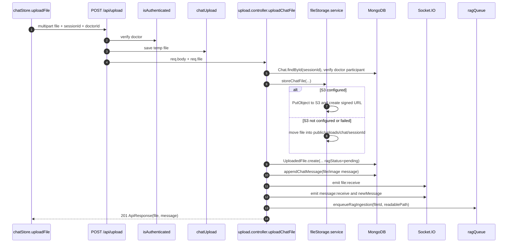
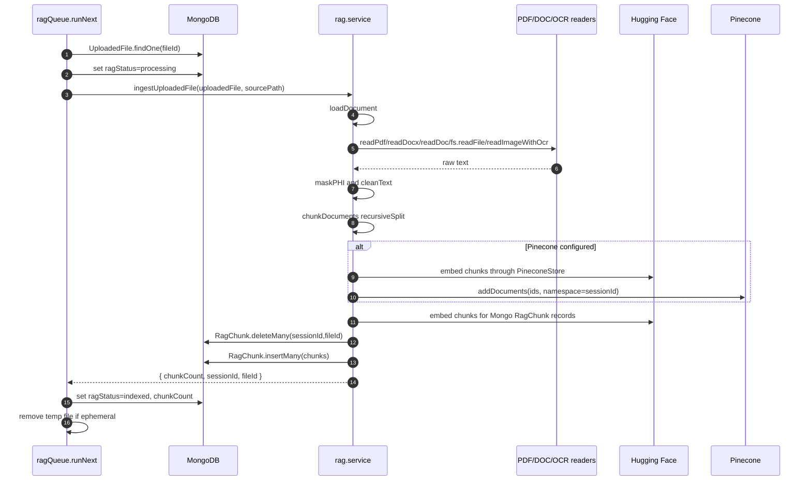
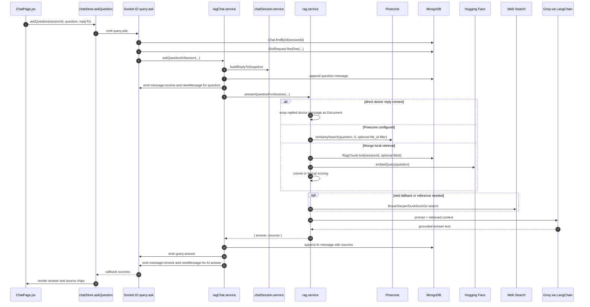

# MediConnect RAG Chat Internal Workflow

This document explains the RAG document Q&A chat implementation as it exists in the source code.
It is based on the files under `MediConnect/backend` and the current chat UI/store under
`MediConnect/frontend`.

It does not assume behavior that is not present in the code. Where a route, socket event, or service
exists but is not currently used by `ChatPage.jsx`, that is called out explicitly.

## Source Files Covered

Backend entry and routes:

- `backend/app.js`
- `backend/src/routes/chat.routes.js`
- `backend/src/routes/upload.routes.js`

Backend controllers and services:

- `backend/src/controllers/chat.controller.js`
- `backend/src/controllers/upload.controller.js`
- `backend/src/services/rag.service.js`
- `backend/src/services/ragChat.service.js`
- `backend/src/services/chatSession.service.js`
- `backend/src/services/fileStorage.service.js`
- `backend/src/services/webSearch.service.js`
- `backend/src/services/appointmentAccess.service.js`
- `backend/src/services/notification.service.js`
- `backend/src/jobs/ragQueue.js`

Backend models and utilities:

- `backend/src/models/chat.model.js`
- `backend/src/models/uploadedFile.model.js`
- `backend/src/models/ragChunk.model.js`
- `backend/src/models/slotRequest.model.js`
- `backend/src/models/doctor.models.js`
- `backend/src/models/client.model.js`
- `backend/src/models/notification.model.js`
- `backend/src/middlewares/auth.middleware.js`
- `backend/src/middlewares/multer.middleware.js`
- `backend/src/utils/socketHandlers.js`
- `backend/src/utils/cloudinary.js`
- `backend/src/utils/ApiError.js`
- `backend/src/utils/ApiResponse.js`
- `backend/src/utils/asyncHandler.js`

Frontend call sites:

- `frontend/pages/ChatPage.jsx`
- `frontend/store/chatStore.js`
- `frontend/utils/axois.js`
- `frontend/services/socket.js`
- `frontend/lib/socket.js`
- `frontend/context/ChatContext.js`
- `frontend/hooks/ChatIntegration.jsx`

## What The RAG Chat Does

MediConnect uses a normal doctor-patient chat as the RAG session. The MongoDB `Chat` document `_id`
is reused as the `sessionId` for document upload, chunk indexing, retrieval, and answer storage.

Doctors can upload supported documents into a chat. The backend saves file metadata in MongoDB,
broadcasts the file into the chat through Socket.IO, and enqueues asynchronous ingestion. The ingestion
worker extracts text, masks common PHI patterns, chunks the text, generates Hugging Face embeddings,
stores chunks locally in MongoDB, and optionally writes vectors to Pinecone.

Patients can ask questions about documents in the same chat. The backend stores the question as a chat
message, retrieves relevant chunks for that chat, builds a grounded prompt, calls Groq through
LangChain's OpenAI-compatible `ChatOpenAI` client, stores the answer as a chat message of type `ai`,
and broadcasts both the answer and normal chat message events.

The AI answer returns source metadata as:

```json
{
  "documents": ["example-report.pdf"],
  "web": [
    {
      "title": "Source title",
      "url": "https://example.com",
      "sourceName": "example.com"
    }
  ]
}
```

The implementation returns source names, not page numbers, character offsets, or per-sentence citations.

## Route Registration

In `backend/app.js`, chat routes are mounted twice:

```text
/chats      -> chatRouter
/api/chats  -> chatRouter
```

Upload routes are mounted under:

```text
/api        -> uploadRouter
```

Therefore the RAG-related HTTP routes are:

```text
POST   /chats/send-message
POST   /api/chats/send-message
POST   /chats/:chatId/query
POST   /api/chats/:chatId/query
POST   /api/upload
GET    /api/chats/:sessionId/files
```

The chat router also contains non-RAG chat routes that create chats, list chats, fetch messages, mark
messages as read, and delete messages.

## Runtime Setup In app.js

### Express And Middleware

`app.js` creates the Express app and HTTP server, configures CORS, parses cookies and JSON, serves the
`public` directory, and attaches `req.io` so controllers can emit Socket.IO events.

Relevant behavior:

- `cookieParser()` runs before routes.
- `express.static("public")` exposes local uploads under public paths.
- `express.json({ limit: "16kb" })` and `express.urlencoded({ extended: true, limit: "16kb" })` parse
  non-file requests.
- `req.io = io` makes the Socket.IO server available inside controllers such as `sendMessage`,
  `uploadChatFile`, and `askDocumentQuestion`.

### Socket.IO

`app.js` creates `new Server(server, ...)` and calls `initializeSocket(io)` from
`src/utils/socketHandlers.js`.

Socket.IO is used for:

- joining and leaving chat rooms
- broadcasting new chat messages
- broadcasting uploaded files
- asking RAG questions over the socket
- broadcasting RAG answers
- notifications
- video call signaling, which is not part of RAG

### Error Handler

The global Express error handler converts thrown errors into JSON:

```json
{
  "success": false,
  "statusCode": 400,
  "message": "..."
}
```

If Multer throws `LIMIT_FILE_SIZE`, the handler returns HTTP `413` and message
`File is too large for upload`.

## Authentication And Access Control

### isAuthenticated

File: `src/middlewares/auth.middleware.js`

Purpose:

- Protects all chat and upload routes.
- Decodes the JWT and attaches the authenticated doctor or client to the request.

Inputs:

- `req.cookies.accessToken`, or
- `Authorization: Bearer <token>`

Return value:

- It does not return a value directly.
- On success, it calls `next()`.
- On failure, it passes an `ApiError(401, ...)` to Express.

Internal logic:

1. Read token from cookie first.
2. If absent, read bearer token from `Authorization`.
3. Verify token using `ACCESS_TOKEN_SECRET`.
4. Try `Doctor.findById(decoded._id).select("-password -refreshToken")`.
5. If no doctor is found, try `Client.findById(decoded._id).select("-password -refreshToken")`.
6. Attach either:
   - `req.doctor = user`, `req.userType = "doctor"`, or
   - `req.client = user`, `req.userType = "client"`.

Database interactions:

- Reads `Doctor`.
- Reads `Client`.

Why it exists:

- Every RAG action must know whether the caller is a doctor or client and must know the user's MongoDB
  `_id`.

### Appointment-Based Chat Access

File: `src/services/appointmentAccess.service.js`

#### getDoctorClientPair({ userAId, userAType, userBId, userBType })

Purpose:

- Converts two generic participants into `{ doctorId, patientId }`.

Parameters:

- `userAId`, `userAType`
- `userBId`, `userBType`

Return value:

- `{ doctorId, patientId }` when one user is a doctor and the other is a client.
- `null` for unsupported pairs, such as doctor-doctor or client-client.

Database interactions:

- None.

Why it exists:

- `SlotRequest` stores appointments as `doctorId` and `patientId`, while chat code works with generic
  `participants`.

#### hasBookedAppointmentBetween({ userAId, userAType, userBId, userBType })

Purpose:

- Determines whether a doctor and patient are allowed to use chat.

Parameters:

- Same participant fields as `getDoctorClientPair`.

Return value:

- `true` when a matching slot request exists.
- `false` otherwise.

Internal logic:

1. Convert participants into `{ doctorId, patientId }`.
2. Query `SlotRequest.findOne`.
3. The slot must not be rejected.
4. It must satisfy one of:
   - `paymentStatus: "paid"`
   - `status: "accepted"`
   - `status: "pending"`

Database interactions:

- Reads `SlotRequest`.

Why it exists:

- Chat, file sharing, and socket room joins are restricted to doctor-patient pairs with a booked,
  pending, accepted, or paid slot request.

Important source-code boundary:

- `createOrGetChat`, `getUserChats`, `sendMessage`, `joinChat`, `message:send`, `file:upload`, and
  socket `query:ask` check booking access.
- The REST route `POST /chats/:chatId/query` calls `askQuestionInSession`, which checks chat
  participation but does not itself call `hasBookedAppointmentBetween`.

## Data Model

### Chat

File: `src/models/chat.model.js`

Purpose:

- Stores chat participants and embedded chat messages.
- The chat `_id` is the RAG `sessionId`.

Important fields:

- `participants[]`
  - `userId`: ObjectId with dynamic ref to `Doctor` or `Client`
  - `userType`: `"Doctor"` or `"Client"`
- `messages[]`
  - `content`: required string
  - `messageType`: `"text"`, `"image"`, `"file"`, `"voice"`, or `"ai"`
  - `fileUrl`, `fileId`, `fileName`, `fileSize`, `fileType`
  - `sources`: mixed object, defaults to `{ documents: [], web: [] }`
  - `metadata`: mixed object
  - `replyTo`: snapshot of another message
  - `createdAt`
  - `readBy[]`
  - `sender.userId`
  - `sender.userType`: `"Doctor"` or `"Client"`
- `lastMessage`
- `isActive`
- `chatType`

Indexes:

- `participants.userId`
- `lastMessage`
- `createdAt`

Important implementation detail:

- AI answers are stored as `messageType: "ai"`.
- The `sender.userType` schema only allows `"Doctor"` or `"Client"`, so AI answer messages are saved
  with the requester as the sender. The socket wrapper may label the emit sender as `"AI"`, but the
  message document itself uses the requester.

### UploadedFile

File: `src/models/uploadedFile.model.js`

Purpose:

- Stores metadata for files that enter the RAG ingestion pipeline.

Important fields:

- `fileId`: UUID string, unique
- `sessionId`: ObjectId ref to `Chat`
- `doctorId`: ObjectId ref to `Doctor`
- `fileName`
- `fileType`
- `fileExtension`
- `fileSize`
- `fileUrl`
- `storageProvider`: `"s3"`, `"local"`, or `"cloudinary"`
- `storageKey`
- `localPath`
- `ragStatus`: `"pending"`, `"processing"`, `"indexed"`, `"failed"`, or `"skipped"`
- `ragError`
- `chunkCount`
- `uploadedAt`

Indexes:

- `fileId`
- `sessionId`
- `doctorId`
- `ragStatus`
- `{ sessionId: 1, uploadedAt: -1 }`
- `{ sessionId: 1, doctorId: 1 }`

Why it exists:

- The chat message stores user-facing attachment metadata, while `UploadedFile` tracks ingestion state,
  storage location, file ownership, and chunk counts.

### RagChunk

File: `src/models/ragChunk.model.js`

Purpose:

- Stores local chunk text and optional embeddings in MongoDB.
- This is used as a local retrieval store when Pinecone is not configured, and as a backup local copy
  even when Pinecone is configured.

Important fields:

- `sessionId`: ObjectId ref to `Chat`
- `fileId`
- `fileName`
- `chunkIndex`
- `text`
- `embedding`: array of numbers
- `metadata`: mixed object

Index:

- Unique compound index on `{ sessionId: 1, fileId: 1, chunkIndex: 1 }`

Why it exists:

- Provides chat-scoped retrieval without Pinecone and preserves extracted chunks in MongoDB.

## File Upload Middleware

File: `src/middlewares/multer.middleware.js`

### chatUpload

Purpose:

- Accepts chat document uploads into a temporary directory before controller processing.

Parameters:

- Used as `chatUpload.single("file")`.

Return value:

- Middleware attaches `req.file`.

Internal logic:

1. Ensures `public/temp` exists under the backend process working directory.
2. Uses disk storage.
3. Builds safe filenames as:
   - timestamp
   - random UUID
   - sanitized original base name
   - original extension
4. Enforces file size:
   - `CHAT_UPLOAD_MAX_SIZE_BYTES`, or
   - 10 MB default
5. Allows only these MIME types and extensions:
   - PDF
   - DOC
   - DOCX
   - TXT
   - PNG
   - JPG/JPEG

Database interactions:

- None.

External API calls:

- None.

Why it exists:

- The ingestion code requires a readable local file path for extraction and OCR.

### CHAT_UPLOAD_ALLOWED_EXTENSIONS

Purpose:

- Exports the allowed extension list.

Current code:

- The exported constant is not used elsewhere in the inspected source.

## Controller And Shared-Service Helper Functions

This section catalogs helper functions that are not standalone routes but are part of the RAG chat
request path.

### chat.controller.js Helpers

#### RAG_SUPPORTED_EXTENSIONS

Purpose:

- Defines which doctor-uploaded files can be indexed when they are sent through `/chats/send-message`.

Current values:

```text
.pdf, .doc, .docx, .txt, .png, .jpg, .jpeg
```

Why it exists:

- `sendMessage` can accept files from both doctors and clients, but only doctor uploads with these
  extensions create `UploadedFile` records for RAG ingestion.

#### hydrateCloudinaryMessageUrls(message)

Purpose:

- Converts a saved message into a plain object and refreshes signed Cloudinary URLs for raw files.

Parameters:

- `message`: Mongoose subdocument or plain message object.

Return value:

- Plain message object.

Internal logic:

1. If the input is a Mongoose document, call `toObject`; otherwise shallow-copy it.
2. Read `message.metadata.cloudinary`.
3. If Cloudinary metadata exists and `resourceType === "raw"`:
   - regenerate `fileUrl` with `attachment: false`
   - regenerate `metadata.downloadUrl` with `attachment: true`
4. Return the hydrated message.

Database interactions:

- None.

External API calls:

- No upload call. It uses Cloudinary URL generation through `getCloudinaryFileUrl`.

Why it exists:

- Raw Cloudinary files use signed URLs that can expire; fetched messages need fresh open/download URLs.

### upload.controller.js Helpers

#### toUploadedFileResponse(uploadedFile)

Purpose:

- Shapes an `UploadedFile` document for frontend responses.

Parameters:

- `uploadedFile`: Mongoose document.

Return value:

```json
{
  "id": "fileId",
  "fileId": "fileId",
  "sessionId": "chat-id",
  "doctorId": "doctor-id",
  "fileName": "report.pdf",
  "fileType": "application/pdf",
  "fileUrl": "https://...",
  "fileSize": 12345,
  "ragStatus": "pending",
  "chunkCount": 0,
  "uploadedAt": "..."
}
```

Database interactions:

- None.

Why it exists:

- Keeps upload and file-list responses consistent and hides storage-only fields such as `storageKey`,
  `localPath`, and `ragError`.

### chatSession.service.js

File: `src/services/chatSession.service.js`

#### emptySources()

Purpose:

- Returns the default source object.

Return value:

```json
{
  "documents": [],
  "web": []
}
```

Why it exists:

- `appendChatMessage` needs a default `sources` value for non-AI messages.

#### getRequestUser(req)

Purpose:

- Normalizes an authenticated Express request into a `{ userId, userType, user }` object.

Parameters:

- `req`: Express request with either `req.doctor` or `req.client`.

Return value:

- `{ userId, userType: "Doctor", user }`, or
- `{ userId, userType: "Client", user }`

Errors:

- Throws `ApiError(401, "User not authenticated")` when neither request user exists.

Database interactions:

- None directly.

Why it exists:

- HTTP controllers and shared services can handle doctors and clients through the same shape.

#### getSocketUser(socket)

Purpose:

- Normalizes an authenticated Socket.IO connection into the same requester shape.

Parameters:

- `socket`: authenticated socket with `socket.user` and `socket.userType`.

Return value:

- `{ userId, userType, user }`

Why it exists:

- Lets `askQuestionInSession` work the same for HTTP and socket flows.

#### findChatForParticipant(sessionId, userId)

Purpose:

- Loads a chat and verifies the given user belongs to it.

Parameters:

- `sessionId`: chat `_id`
- `userId`: doctor/client `_id`

Return value:

- `Chat` document.

Internal logic:

1. `Chat.findById(sessionId)`.
2. Throw 404 if not found.
3. Check `chat.participants` for `userId`.
4. Throw 403 if the user is not a participant.
5. Return chat.

Database interactions:

- Reads `Chat`.

Why it exists:

- Prevents users from querying or uploading into chats they do not belong to.

#### truncateReplyPreview(value, maxLength)

Purpose:

- Shortens reply preview text.

Parameters:

- `value`: any text-like value
- `maxLength`: default 240

Return value:

- Trimmed preview string, ending with `...` when truncated.

Database interactions:

- None.

Current export status:

- It is private to `chatSession.service.js`.

#### parseReplyTo(replyTo)

Purpose:

- Accepts reply metadata from JSON body, multipart form data, or socket payload.

Parameters:

- `replyTo`: null, stringified JSON, or object.

Return value:

- Parsed reply object or `null`.

Errors:

- Throws `ApiError(400, "Invalid reply metadata")` for invalid JSON or unsupported types.

Why it exists:

- HTTP multipart requests send `replyTo` as a string, while socket and JSON routes can send objects.

#### buildReplyToSnapshot(chat, replyTo)

Purpose:

- Creates a trusted snapshot of the original message being replied to.

Parameters:

- `chat`: loaded `Chat` document.
- `replyTo`: parsed or string reply metadata.

Return value:

- `null`, or:

```json
{
  "messageId": "original-message-id",
  "content": "preview",
  "messageType": "file",
  "fileId": "optional-file-id",
  "fileName": "optional-name",
  "senderType": "Doctor"
}
```

Internal logic:

1. Parse the reply metadata.
2. Require `messageId` or `_id`.
3. Find the original embedded message with `chat.messages.id(messageId)`.
4. Throw 404 if the message is not in the same chat.
5. Build preview content from original file name, original content, or submitted fallback values.
6. Copy file and sender metadata from the original message where possible.

Database interactions:

- Uses the already loaded `Chat` document.

Why it exists:

- Prevents the client from inventing `replyTo` data and enables file-specific RAG retrieval through
  `replyTo.fileId`.

#### assertDoctorInSession(sessionId, doctorId)

Purpose:

- Ensures a doctor is a participant in the chat before allowing dedicated RAG upload.

Parameters:

- `sessionId`
- `doctorId`

Return value:

- `Chat` document.

Internal logic:

1. Calls `findChatForParticipant`.
2. Checks that the matching participant has `userType === "Doctor"`.
3. Throws 403 if not.

Database interactions:

- Reads `Chat`.

Why it exists:

- `/api/upload` is doctor-only.

#### appendChatMessage(sessionId, messageFields)

Purpose:

- Appends a message subdocument to a chat and returns the saved message.

Parameters:

- `sessionId`
- `messageFields` containing content, message type, sender, file metadata, sources, metadata, and
  optional `replyTo`.

Return value:

- The last message in `chat.messages` after save and sender population.

Internal logic:

1. Load `Chat.findById(sessionId)`.
2. Throw 404 if missing.
3. Build message object with defaults:
   - `messageType = "text"`
   - file fields default to null
   - `sources = emptySources()`
   - `metadata = {}`
   - `createdAt = new Date()`
4. Push into `chat.messages`.
5. Update `chat.lastMessage`.
6. Save chat.
7. Populate `messages.sender.userId` with `name avatar`.
8. Return the newest message.

Database interactions:

- Reads and writes `Chat`.

Why it exists:

- Used by dedicated upload, RAG question saving, and RAG answer saving so all chat messages are written
  consistently.

#### toMessageReceivePayload(sessionId, message)

Purpose:

- Converts a Mongoose message into the compact `message:receive` socket payload.

Return value:

```json
{
  "messageId": "message-id",
  "sessionId": "chat-id",
  "senderId": "sender-id",
  "message": "text",
  "type": "text",
  "fileId": null,
  "fileName": null,
  "fileUrl": null,
  "fileSize": null,
  "fileType": null,
  "sources": {},
  "replyTo": null,
  "createdAt": "..."
}
```

Why it exists:

- Supports a stable socket payload shape separate from the full Mongoose message object.

#### emitChatMessage(io, sessionId, message, senderType)

Purpose:

- Broadcasts a saved chat message in both socket formats used by the frontend.

Parameters:

- `io`
- `sessionId`
- `message`
- `senderType`

Emitted events:

- `message:receive` with compact payload.
- `newMessage` with `{ chatId, message, sender }`.

Why it exists:

- Keeps older and newer frontend listeners working.

#### emitFileReceive(io, uploadedFile)

Purpose:

- Broadcasts uploaded-file metadata to a chat room.

Emitted event:

- `file:receive`

Payload:

```json
{
  "fileId": "uuid",
  "sessionId": "chat-id",
  "fileName": "report.pdf",
  "fileUrl": "https://...",
  "fileType": "application/pdf",
  "uploadedAt": "..."
}
```

Why it exists:

- Lets the frontend update any uploaded-file state immediately when a file enters the chat.

## Storage And Cloudinary Utilities

### fileStorage.service.js

These functions are used by the dedicated `/api/upload` route.

#### s3IsConfigured()

Purpose:

- Returns true when both `AWS_S3_BUCKET` and `AWS_REGION` are set.

#### getS3Client()

Purpose:

- Creates an AWS S3 client.

Internal logic:

- Uses explicit `AWS_ACCESS_KEY_ID` and `AWS_SECRET_ACCESS_KEY` if provided.
- Otherwise lets the AWS SDK resolve credentials from the environment.

External API calls:

- None at construction time.

#### deleteTempFile(filePath)

Purpose:

- Deletes a temp file after S3 upload when a local copy is not needed.

Internal logic:

- Calls `fs.promises.unlink`.
- Ignores `ENOENT`.
- Logs other errors.

#### getPublicBaseUrl(req)

Purpose:

- Builds the base URL for local upload links.

Internal logic:

- Uses `BACKEND_PUBLIC_URL` when configured.
- Otherwise uses `req.protocol` and `req.get("host")`.

#### storeLocally({ file, sessionId, fileId, req })

Purpose:

- Moves a Multer temp file into `public/uploads/chat/<sessionId>`.

Return value:

```json
{
  "storageProvider": "local",
  "storageKey": "/uploads/chat/session/file.pdf",
  "localPath": "/absolute/path/to/public/uploads/chat/session/file.pdf",
  "fileUrl": "http://host/uploads/chat/session/file.pdf"
}
```

Why it exists:

- Provides local development storage and fallback when S3 is not configured or fails.

#### storeInS3({ file, sessionId, fileId, keepLocalCopy })

Purpose:

- Uploads the temp file to S3 and returns a signed read URL.

Internal logic:

1. Build key `chat/<sessionId>/<fileId><extension>`.
2. Send `PutObjectCommand` with file stream, content type, and metadata.
3. Generate a signed URL with `GetObjectCommand`.
4. Delete temp file unless `keepLocalCopy` is true.

Return value:

```json
{
  "storageProvider": "s3",
  "storageKey": "chat/session/file.pdf",
  "localPath": null,
  "fileUrl": "signed-url"
}
```

External API calls:

- AWS S3 `PutObject`.
- AWS signed URL generation.

Important source-code detail:

- When `/api/upload` calls `storeChatFile` with `keepLocalCopy: true` and S3 is configured, the temp
  file is left in place for ingestion but `localPath` in the return object is still `null`. The queue
  receives the temp path separately as `sourcePath` and later deletes it as an ephemeral source.

#### storeChatFile({ file, sessionId, fileId, req, keepLocalCopy })

Purpose:

- Chooses S3 or local storage.

Internal logic:

1. If S3 is configured, try `storeInS3`.
2. If S3 upload fails, log and fall back to `storeLocally`.
3. If S3 is not configured, use `storeLocally`.

#### resolveLocalReadablePath(uploadedFile)

Purpose:

- Returns `uploadedFile.localPath` when present.

Current source usage:

- It is exported but not used by the inspected RAG upload or ingestion code.

### cloudinary.js

These functions are used by `/chats/send-message`.

#### getFormatFromPublicId(publicId)

Purpose:

- Extracts an extension from a Cloudinary public ID for signed raw-file URL generation.

#### deleteLocalFile(path)

Purpose:

- Synchronously deletes a local temp file after Cloudinary upload when cleanup is enabled.

#### uploadToCloud(localPath, options)

Purpose:

- Uploads a local file to Cloudinary.

Parameters:

- `localPath`
- `options.cleanup`, default `true`

Return value:

- Cloudinary upload result with HTTPS `url` and `secure_url`, or `null` on failure.

Internal logic:

1. Choose Cloudinary `resource_type`:
   - `"raw"` for PDF/DOC/DOCX/TXT
   - `"auto"` for other uploads
2. Upload using `cloud.uploader.upload`.
3. Normalize returned URL to HTTPS.
4. Delete local file if `cleanup` is true.
5. On error, log, delete local file, and return `null`.

External API calls:

- Cloudinary upload API.

RAG-specific detail:

- `sendMessage` passes `cleanup: false` for doctor-supported RAG uploads so the queue can still read
  the temp file. The queue deletes that temp file later.

#### getCloudinaryFileUrl(fileInfo, options)

Purpose:

- Returns a usable Cloudinary URL for opening or downloading a file.

Parameters:

- `fileInfo`: Cloudinary public ID/resource type/type or existing URL fields.
- `options.attachment`: whether to generate a download URL.
- `options.expiresInSeconds`: optional signed URL expiry.

Return value:

- For raw resources, a signed private download URL.
- For non-raw resources, the existing secure URL.

Why it exists:

- Raw Cloudinary documents require signed URLs for access.

## Chat Notifications Used By RAG Chat

File: `src/services/notification.service.js`

#### createNotification(...)

Purpose:

- Creates a `Notification` document.

Parameters:

- recipient fields
- optional sender fields
- `type`
- `title`
- `message`
- optional appointment and metadata objects

Return value:

- Created notification document.

Database interactions:

- `Notification.create(notification)`.

#### notifyChatMessage({ recipientId, recipientModel, senderId, senderModel, senderName, chatId, message })

Purpose:

- Creates a notification for a normal chat message or uploaded file message.

Return value:

- Created notification document.

Internal logic:

- Calls `createNotification` with:
  - `type: "chat_message"`
  - `title: "New chat message"`
  - message preview limited to 120 characters
  - `metadata.chatId`

RAG-specific detail:

- `sendMessage` uses this for uploaded document messages.
- `askQuestionInSession` does not call `notifyChatMessage` for AI answers.

## Route-By-Route Workflow

### POST /chats/create-or-get

Controller: `createOrGetChat` in `src/controllers/chat.controller.js`

Purpose:

- Creates or retrieves a chat between the authenticated user and a selected participant.
- This is how a `Chat` session is created before document upload and Q&A.

Request body:

```json
{
  "participantId": "doctor-or-client-object-id",
  "participantType": "Doctor"
}
```

Authentication:

- Requires `isAuthenticated`.

Internal logic:

1. Validate `participantId` and `participantType`.
2. Determine current user from `req.doctor` or `req.client`.
3. Call `hasBookedAppointmentBetween`.
4. Reject with 403 if no booking exists.
5. Choose participant model:
   - `Doctor` if `participantType === "Doctor"`
   - `Client` otherwise
6. Verify the participant exists.
7. Query `Chat.findOne` where both participant IDs appear in `participants.userId`.
8. If no chat exists, create one with:
   - both participants
   - `chatType: "consultation"`
9. Populate participant `name`, `email`, and `avatar`.
10. Return the chat.

Database interactions:

- Reads `SlotRequest`.
- Reads `Doctor` or `Client`.
- Reads and possibly creates `Chat`.

External API calls:

- None.

Response:

```json
{
  "statusCode": 200,
  "data": {
    "_id": "chat-id",
    "participants": [],
    "messages": [],
    "chatType": "consultation"
  },
  "message": "Chat retrieved successfully",
  "success": true
}
```

Why it exists in the RAG workflow:

- The chat `_id` becomes the RAG `sessionId`.
- Uploaded files and chunks are scoped to this chat ID.

Frontend call site:

- `frontend/store/chatStore.js` function `createOrGetChat`.
- `frontend/pages/ChatPage.jsx` calls it when a user selects a booked contact.

### GET /chats/booked-contacts

Controller: `getBookedChatContacts`

Purpose:

- Lists doctors or patients that the current user can chat with.

Authentication:

- Requires `isAuthenticated`.

Internal logic:

1. Determine if the current user is a doctor or client.
2. Query `SlotRequest`:
   - if doctor: `doctorId = currentUserId`
   - if client: `patientId = currentUserId`
   - `status` must not be `"rejected"`
   - payment/status must be paid, accepted, or pending
3. Populate doctor and patient details.
4. Deduplicate contacts by contact `_id`.
5. Attach the latest booking metadata for each contact.

Database interactions:

- Reads `SlotRequest`.
- Populates `Doctor` and `Client`.

External API calls:

- None.

Why it exists in the RAG workflow:

- The frontend only lets users open chat with booked contacts, which leads to chat session creation.

Frontend call site:

- `ChatPage.jsx` function `fetchContacts`.

### GET /chats/user-chats

Controller: `getUserChats`

Purpose:

- Lists active chat sessions for the authenticated user.

Authentication:

- Requires `isAuthenticated`.

Internal logic:

1. Query `Chat.find` where `participants.userId` includes the current user and `isActive: true`.
2. Populate participant fields.
3. Sort by `lastMessage` descending and limit to 50.
4. For each chat, find the other participant.
5. Call `hasBookedAppointmentBetween`.
6. Only return chats with a valid booking.

Database interactions:

- Reads `Chat`.
- Reads `SlotRequest` once per candidate chat.

External API calls:

- None.

Why it exists in the RAG workflow:

- The chat list gives users access to sessions where RAG files and AI messages are stored.

Frontend call site:

- `chatStore.fetchUserChats`.

### POST /chats/send-message

Controller: `sendMessage`

Purpose:

- Sends a normal chat message.
- Also handles file uploads through the normal chat input.
- When the sender is a doctor and the uploaded file has a supported RAG extension, it creates an
  `UploadedFile` record and enqueues RAG ingestion.

Request type:

- `multipart/form-data`

Request fields:

```text
chatId       required
content      required unless file is present
messageType  optional, defaults to text
file         optional
replyTo      optional JSON string or object
```

Authentication:

- Requires `isAuthenticated`.
- Uses `chatUpload.single("file")`.

Internal logic:

1. Read `chatId`, `content`, and optional `req.file`.
2. Determine `messageType`:
   - image if file MIME starts with `image/`
   - file if file exists and is not image
   - otherwise body `messageType` or `"text"`
3. Validate that `chatId` exists and either content or file is present.
4. Load `Chat.findById(chatId)`.
5. Verify current user is a participant.
6. Find the other participant.
7. Call `hasBookedAppointmentBetween`.
8. Reject with 403 if no booking exists.
9. Build a `replyTo` snapshot using `buildReplyToSnapshot`.
10. Decide whether the file should enter RAG:
    - must be a doctor request (`req.doctor`)
    - must include `req.file`
    - extension must be one of `.pdf`, `.doc`, `.docx`, `.txt`, `.png`, `.jpg`, `.jpeg`
11. If a file is present:
    - call `uploadToCloud(req.file.path, { cleanup: !shouldIndexForRag })`
    - build Cloudinary file URL and download URL
    - if RAG indexing is enabled for this upload, create an `UploadedFile` with:
      - `fileId = uuidv4()`
      - `sessionId = chatId`
      - `doctorId = currentUser`
      - `storageProvider = "cloudinary"`
      - `storageKey = uploadResult.public_id`
      - `localPath = null`
      - `ragStatus = "pending"`
12. Push a message into `chat.messages`.
13. Save the chat and populate sender details.
14. Emit `newMessage` to the chat room.
15. Create a notification for the other participant and emit `notification:new`.
16. If a RAG `UploadedFile` was created:
    - emit `file:receive`
    - call `enqueueRagIngestion({ fileId, sourcePath: req.file.path })`
17. Return the saved message.

Database interactions:

- Reads and writes `Chat`.
- Reads `SlotRequest`.
- Creates `UploadedFile` for doctor-supported file uploads.
- Creates `Notification` through `notifyChatMessage`.

External API calls:

- Cloudinary upload through `uploadToCloud`.
- Cloudinary signed/private URL generation through `getCloudinaryFileUrl`.

Socket.IO events:

- `newMessage`
- `file:receive` when a doctor upload enters RAG
- `notification:new`

Response:

```json
{
  "statusCode": 201,
  "data": {
    "_id": "message-id",
    "content": "report.pdf",
    "messageType": "file",
    "fileUrl": "https://...",
    "fileId": "uuid-if-rag-file",
    "metadata": {
      "ragStatus": "pending",
      "storageProvider": "cloudinary",
      "cloudinary": {},
      "downloadUrl": "https://..."
    }
  },
  "message": "Message sent successfully",
  "success": true
}
```

Why it exists in the RAG workflow:

- This is the upload path currently used by `ChatPage.jsx` when a file is attached in the normal
  message composer.

Frontend call site:

- `ChatPage.jsx` `handleSendMessage`.
- `chatStore.sendMessage`.

Important source-code boundary:

- Patients can upload files through this route, but patient files do not create `UploadedFile` records
  for RAG because `shouldIndexForRag` requires `req.doctor`.

### POST /api/upload

Controller: `uploadChatFile` in `src/controllers/upload.controller.js`

Purpose:

- Dedicated doctor-only file upload route for RAG ingestion.
- Stores the file through local storage or S3, creates an `UploadedFile`, writes a chat file/image
  message, broadcasts the upload, and starts ingestion.

Request type:

- `multipart/form-data`

Request fields:

```text
sessionId  required, chat _id
doctorId   required, must match authenticated doctor
file       required
```

Authentication:

- Requires `isAuthenticated`.
- Uses `chatUpload.single("file")`.

Internal logic:

1. Validate `sessionId` and `doctorId`.
2. Require `req.file`.
3. Call `getRequestUser(req)`.
4. Reject unless authenticated user is a doctor.
5. Reject if `doctorId` does not match the authenticated doctor.
6. Call `assertDoctorInSession(sessionId, currentUser.userId)`.
7. Generate a UUID `fileId`.
8. Call `storeChatFile({ file, sessionId, fileId, req, keepLocalCopy: true })`.
9. Create an `UploadedFile` with:
   - file metadata
   - storage provider details
   - `localPath`
   - `ragStatus: "pending"`
10. Append a chat message with `appendChatMessage`.
11. Emit `file:receive`.
12. Emit the chat message through `emitChatMessage`, which sends both `message:receive` and
    `newMessage`.
13. Enqueue ingestion with `enqueueRagIngestion({ fileId, sourcePath })`.
14. Return the file response and saved message.

Database interactions:

- Reads and writes `Chat`.
- Creates `UploadedFile`.

External API calls:

- Optional AWS S3 upload if `AWS_S3_BUCKET` and `AWS_REGION` are configured.
- Otherwise local filesystem storage only.

Socket.IO events:

- `file:receive`
- `message:receive`
- `newMessage`

Response:

```json
{
  "statusCode": 201,
  "data": {
    "file": {
      "id": "file-uuid",
      "fileId": "file-uuid",
      "sessionId": "chat-id",
      "doctorId": "doctor-id",
      "fileName": "report.pdf",
      "fileType": "application/pdf",
      "fileUrl": "http://...",
      "fileSize": 12345,
      "ragStatus": "pending",
      "chunkCount": 0,
      "uploadedAt": "..."
    },
    "message": {}
  },
  "message": "File uploaded successfully. RAG ingestion has started.",
  "success": true
}
```

Why it exists in the RAG workflow:

- It is a clean, doctor-only RAG upload endpoint separate from normal message sending.

Frontend call site:

- `chatStore.uploadFile`.

Current UI usage:

- `ChatPage.jsx` does not destructure or call `uploadFile`; the visible chat page currently uploads
  attachments through `sendMessage`.

### GET /api/chats/:sessionId/files

Controller: `getChatFiles`

Purpose:

- Lists uploaded RAG files for a chat session.

Authentication:

- Requires `isAuthenticated`.

Internal logic:

1. Read `sessionId` from params.
2. Call `getRequestUser(req)`.
3. Call `findChatForParticipant(sessionId, currentUser.userId)`.
4. Query `UploadedFile.find({ sessionId })`.
5. Sort by `uploadedAt` descending.
6. Limit to 100.
7. Map each file through `toUploadedFileResponse`.

Database interactions:

- Reads `Chat`.
- Reads `UploadedFile`.

External API calls:

- None.

Response:

```json
{
  "statusCode": 200,
  "data": [
    {
      "fileId": "uuid",
      "sessionId": "chat-id",
      "fileName": "report.pdf",
      "ragStatus": "indexed",
      "chunkCount": 12
    }
  ],
  "message": "Files retrieved successfully",
  "success": true
}
```

Frontend call site:

- `chatStore.fetchUploadedFiles`.

Current UI usage:

- `ChatPage.jsx` does not currently call `fetchUploadedFiles`.

### POST /chats/:chatId/query

Controller: `askDocumentQuestion`

Purpose:

- HTTP fallback route for asking a document question.

Request body:

```json
{
  "question": "What does my report say about hemoglobin?",
  "replyTo": {
    "messageId": "optional-message-id",
    "fileId": "optional-file-id"
  }
}
```

Authentication:

- Requires `isAuthenticated`.

Internal logic:

1. Read `chatId` from params.
2. Read `question` and `replyTo` from body.
3. Convert the authenticated user into a requester with `getRequestUser`.
4. Call `askQuestionInSession`.
5. Return its payload in an `ApiResponse`.

Database interactions:

- Indirect through `askQuestionInSession` and `answerQuestionForSession`.

External API calls:

- Indirect Hugging Face, Pinecone, Groq, and optional web search calls.

Socket.IO events:

- Indirect events emitted by `askQuestionInSession`.

Response:

```json
{
  "statusCode": 200,
  "data": {
    "sessionId": "chat-id",
    "answer": "...",
    "sources": {
      "documents": [],
      "web": []
    },
    "message": {},
    "questionMessage": {},
    "replyTo": null
  },
  "message": "Question answered successfully",
  "success": true
}
```

Frontend call site:

- `chatStore.askQuestion` uses this HTTP route only when the socket is not connected.

Important source-code boundary:

- This controller itself does not call `hasBookedAppointmentBetween`. It relies on
  `askQuestionInSession` to check that the requester is a chat participant.

### GET /chats/:chatId/messages

Controller: `getChatMessages`

Purpose:

- Fetches paginated messages for a chat.

Authentication:

- Requires `isAuthenticated`.

Internal logic:

1. Load `Chat.findById(chatId)`.
2. Verify the current user is a participant.
3. Calculate pagination based on `page` and `limit`, default `1` and `50`.
4. Populate `messages.sender.userId`.
5. Slice messages from the embedded array.
6. Map through `hydrateCloudinaryMessageUrls`.
7. Return messages and pagination metadata.

Database interactions:

- Reads `Chat`.

External API calls:

- None.

Why it exists in the RAG workflow:

- AI answers are normal chat messages. This route fetches historical document Q&A along with normal
  messages.

### PATCH /chats/:chatId/mark-read

Controller: `markMessagesAsRead`

Purpose:

- Marks selected embedded chat messages as read by the current user.

Request body:

```json
{
  "messageIds": ["message-id"]
}
```

Internal logic:

1. Load chat.
2. Determine current user and type.
3. For each requested message ID:
   - find the subdocument
   - skip if the message was sent by current user
   - add a `readBy` item if one does not already exist
4. Save the chat.
5. Emit `messagesRead`.

Why it exists in the RAG workflow:

- AI messages are included in the same message stream and can be read-tracked like other messages.

### DELETE /chats/:chatId/messages/:messageId

Controller: `deleteMessage`

Purpose:

- Lets a user delete their own recent message.

Internal logic:

1. Load chat.
2. Find the embedded message.
3. Require the current user to be the sender.
4. Reject if message is older than five minutes.
5. Delete the subdocument.
6. Save chat.
7. Emit `messageDeleted`.

RAG-specific behavior:

- Deleting an uploaded file message does not delete the corresponding `UploadedFile`, `RagChunk`, or
  Pinecone vectors in the current code.
- Deleting an AI answer removes only the chat message, not source chunks.

## Upload And Ingestion Pipeline

### Queue

File: `src/jobs/ragQueue.js`

The queue is an in-memory array:

```js
const queue = [];
let active = false;
```

It is single-process and not durable. If the Node process restarts, queued jobs are lost. There is no
Redis, BullMQ, or database-backed job table in the current source.

#### enqueueRagIngestion({ fileId, sourcePath })

Purpose:

- Adds an ingestion job to the in-memory queue.

Parameters:

- `fileId`: UUID stored in `UploadedFile`.
- `sourcePath`: local readable path to the temporary or stored file.

Return value:

- No meaningful return value.

Internal logic:

1. Push `{ fileId, sourcePath }` to `queue`.
2. Log queue depth.
3. Call `setImmediate(runNext)`.

Database interactions:

- None directly.

Why it exists:

- Upload response can return immediately while text extraction, embeddings, and vector writes happen
  asynchronously.

#### runNext()

Purpose:

- Processes one queued ingestion job at a time.

Parameters:

- None; it reads from the module-level queue.

Return value:

- No public return value.

Internal logic:

1. If another job is active or queue is empty, return.
2. Mark `active = true`.
3. Shift one job from the queue.
4. Find `UploadedFile` by `fileId`.
5. If missing, log a warning and return.
6. Set:
   - `ragStatus = "processing"`
   - `ragError = null`
7. Save the file record.
8. Call `ingestUploadedFile({ uploadedFile, sourcePath })`.
9. On success:
   - `ragStatus = "indexed"` unless result has `skipped`
   - `chunkCount = result.chunkCount || 0`
   - `ragError = result.error || null`
10. On failure:
    - update file to `ragStatus = "failed"`
    - set `ragError = error.message`
11. In `finally`, find the file again and call `removeEphemeralSource`.
12. Set `active = false`.
13. Schedule the next job with `setImmediate(runNext)`.

Database interactions:

- Reads `UploadedFile`.
- Saves `UploadedFile`.
- Updates `UploadedFile` on failure.
- Indirectly writes `RagChunk` and optional Pinecone vectors through `ingestUploadedFile`.

External API calls:

- Indirect Hugging Face and Pinecone calls through ingestion.

Why it exists:

- Keeps ingestion outside the upload request cycle and serializes work in one backend process.

#### removeEphemeralSource(uploadedFile, sourcePath)

Purpose:

- Deletes temporary files after ingestion when they are not the persistent local file copy.

Parameters:

- `uploadedFile`
- `sourcePath`

Return value:

- No public return value.

Internal logic:

- If `sourcePath` is empty or equals `uploadedFile.localPath`, do nothing.
- Otherwise call `fs.promises.unlink(sourcePath)`.
- Ignore `ENOENT`, log other errors.

Why it exists:

- The Cloudinary upload path keeps the temp file long enough for ingestion, then deletes it.
- The local storage path keeps the stored public upload file.

### Document Loading And Text Extraction

File: `src/services/rag.service.js`

#### ingestUploadedFile({ uploadedFile, sourcePath })

Purpose:

- Public ingestion entry point used by the queue.

Parameters:

- `uploadedFile`: MongoDB `UploadedFile` document.
- `sourcePath`: local readable path.

Return value:

- Result from `ingestionPipeline`, normally:

```json
{
  "chunkCount": 10,
  "sessionId": "chat-id",
  "fileId": "file-uuid"
}
```

Internal logic:

- Calls `ingestionPipeline.invoke({ uploadedFile, sourcePath })`.

#### ingestionPipeline

Purpose:

- LangChain runnable sequence for ingestion.

Internal steps:

1. `loadDocument`
2. `chunkDocuments`
3. `embedAndStore`

Why it exists:

- Provides a clear staged pipeline using LangChain `RunnableSequence` and `RunnableLambda`.

#### loadDocument({ uploadedFile, sourcePath })

Purpose:

- Reads the uploaded file from disk and returns one LangChain `Document` containing cleaned text and
  metadata.

Parameters:

- `uploadedFile`: has file metadata, `sessionId`, `doctorId`, and `fileId`.
- `sourcePath`: optional local file path; falls back to `uploadedFile.localPath`.

Return value:

- Array with one `Document`:

```js
[
  new Document({
    pageContent: cleanedText,
    metadata: {
      session_id: "...",
      doctor_id: "...",
      file_name: "...",
      file_id: "..."
    }
  })
]
```

Internal logic:

1. Resolve local file path.
2. Throw if no path exists.
3. Build normalized string metadata.
4. Choose extraction method based on original filename extension:
   - `.pdf` -> `readPdf`
   - `.docx` -> `readDocx`
   - `.doc` -> `readDoc`
   - `.txt` -> `fs.promises.readFile`
   - `.png`, `.jpg`, `.jpeg` -> `readImageWithOcr`
5. Run `maskPHI`.
6. Run `cleanText`.
7. Throw if no readable text remains.
8. Return the `Document`.

Database interactions:

- None directly.

External API calls:

- None for PDF/DOC/DOCX/TXT.
- Tesseract OCR runs locally through `tesseract.js`.

Why it exists:

- Converts heterogeneous upload formats into a uniform LangChain document.

#### readPdf(filePath)

Purpose:

- Extracts text from PDFs.

Parameters:

- `filePath`: local path.

Return value:

- Extracted text string.

Internal logic:

1. Reads file bytes with `fs.promises.readFile`.
2. Creates `new PDFParse({ data })`.
3. Calls `parser.getText()`.
4. Returns `result.text`.
5. Destroys parser in `finally`.

#### readDocx(filePath)

Purpose:

- Extracts raw text from `.docx`.

External library:

- `mammoth.extractRawText({ path })`

Return value:

- `result.value`.

#### readDoc(filePath)

Purpose:

- Extracts body text from legacy `.doc`.

External library:

- `word-extractor`

Return value:

- `extracted.getBody()`.

#### readImageWithOcr(filePath)

Purpose:

- Extracts text from images.

Internal logic:

1. Creates Tesseract worker for English.
2. Calls `worker.recognize(filePath)`.
3. Returns `result.data.text`.
4. Terminates worker in `finally`.

External API calls:

- None in application code; OCR is through `tesseract.js`.

#### maskPHI(text)

Purpose:

- Performs simple regex masking of common personal health information patterns before embedding and
  LLM prompting.

Parameters:

- `text`: extracted document text.

Return value:

- Masked string.

Internal logic:

- Replaces values following labels such as patient name, address, city, PIN, Aadhaar/Aadhar, PAN, MRN,
  phone, email, and doctor/consultant name with `[MASKED]`.
- Also masks 12-digit numbers, PAN-like strings, phone-like digit patterns, and emails.

Database interactions:

- None.

Why it exists:

- Reduces exposure of obvious identifiers before storing chunks and sending context to the LLM.

Important boundary:

- This is regex masking, not a full PHI de-identification system.

#### cleanText(text)

Purpose:

- Normalizes extracted text.

Return value:

- Trimmed string with null characters removed, extra spaces before newlines removed, and three or more
  newlines reduced to two.

### Chunking

Constants:

```text
CHUNK_SIZE = 500
CHUNK_OVERLAP = 80
SPLIT_SEPARATORS = ["\n\n", "\n", ".", " ", ""]
```

#### chunkDocuments(documents)

Purpose:

- Splits loaded LangChain documents into smaller chunks.

Parameters:

- `documents`: array of LangChain `Document`.

Return value:

- Array of chunk `Document` objects with `chunk_index` added to metadata.

Internal logic:

1. For each document, call `recursiveSplit(document.pageContent)`.
2. Wrap each chunk string in a new `Document`.
3. Copy original metadata and add `chunk_index` as a string.
4. Log chunk count.

Database interactions:

- None.

Why it exists:

- Embeddings and retrieval work better on smaller focused chunks than on entire reports.

#### recursiveSplit(text, separators, chunkSize)

Purpose:

- Attempts structure-aware splitting before falling back to fixed-width splitting.

Internal logic:

1. Clean text.
2. If text fits within `chunkSize`, return it as one chunk.
3. Try splitting by the first separator.
4. If it does not split, recurse with the remaining separators.
5. Accumulate pieces into chunks up to `chunkSize`.
6. When flushing a chunk, keep the last `CHUNK_OVERLAP` characters as overlap.
7. If no separators remain, call `fixedWidthSplit`.

Return value:

- Array of chunk strings.

#### fixedWidthSplit(text, chunkSize, overlap)

Purpose:

- Last-resort splitting.

Internal logic:

- Uses step size `chunkSize - overlap`.
- Slices fixed-width chunks and trims empty chunks.

## Embeddings, Vector Storage, And Indexing

### Configuration Constants

File: `src/services/rag.service.js`

Relevant environment variables:

```text
GROQ_API_KEY
GROQ_MODEL
GROQ_BASE_URL
GROQ_MAX_TOKENS
HUGGINGFACE_API_KEY
HUGGING_FACE_TOKEN
HUGGINGFACE_EMBEDDING_MODEL
HUGGINGFACE_EMBEDDING_URL
HUGGINGFACE_EMBEDDING_BATCH_SIZE
PINECONE_API_KEY
PINECONE_INDEX
PINECONE_DIMENSION
PINECONE_CREATE_INDEX
PINECONE_CLOUD
PINECONE_REGION
WEB_SEARCH_ENABLED
WEB_SEARCH_RESULT_LIMIT
WEB_SEARCH_TIMEOUT_MS
BRAVE_SEARCH_API_KEY
SERPER_API_KEY
```

Default values in code:

- Embedding model: `sentence-transformers/all-MiniLM-L6-v2`
- Embedding endpoint: Hugging Face feature extraction pipeline URL for that model
- Chat model: `llama-3.1-8b-instant`
- Groq base URL: `https://api.groq.com/openai/v1`
- Pinecone index: `medical-chat`
- Pinecone dimension: `384`

#### isRagConfigured()

Purpose:

- Checks whether answer generation can run.

Return value:

- Boolean.

Internal logic:

- Returns `true` only when `GROQ_API_KEY` exists.

Important source-code detail:

- This does not check Pinecone or Hugging Face configuration. Ingestion can still run without Groq, but
  `answerQuestionForSession` returns the fallback answer when Groq is missing.

#### normalizeMetadata(metadata)

Purpose:

- Converts all metadata values to strings before attaching them to LangChain documents.

Parameters:

- `metadata`: object.

Return value:

- Object with the same keys and string values.

Why it exists:

- Pinecone metadata filters and LangChain document metadata are simpler when values such as ObjectIds
  are normalized to strings.

#### sleep(ms)

Purpose:

- Promise-based delay used between Hugging Face retry attempts.

### HuggingFaceFeatureExtractionEmbeddings

Purpose:

- Custom LangChain-compatible embeddings class that calls Hugging Face Inference API.

Constructor parameters:

- `apiKey`
- `endpoint`
- `batchSize`, default 8
- `maxRetries`, default 3

#### embedDocuments(texts)

Purpose:

- Generates embeddings for multiple chunk texts.

Parameters:

- `texts`: array of strings.

Return value:

- Array of normalized numeric vectors.

Internal logic:

1. Iterate over `texts` in batches.
2. Call `embedBatch` for each batch.
3. Concatenate vectors.

External API calls:

- Indirect through `embedBatch`.

#### embedQuery(text)

Purpose:

- Generates one embedding for a question.

Parameters:

- `text`: query string.

Return value:

- First vector from `embedDocuments([text])`.

#### embedBatch(texts)

Purpose:

- Calls Hugging Face feature extraction endpoint with retries.

Parameters:

- `texts`: one batch of strings.

Return value:

- Array of normalized vectors.

Internal logic:

1. Build `Content-Type: application/json` header.
2. Add `Authorization: Bearer <token>` if a token is configured.
3. `fetch` the endpoint with:
   - method `POST`
   - body `{ inputs, options: { wait_for_model: true } }`
4. Parse JSON response.
5. Throw if HTTP status is not OK or response includes `error`.
6. Call `parseEmbeddingResponse`.
7. Retry up to `maxRetries`, waiting `500 * attempt` milliseconds between failures.

External API calls:

- Hugging Face Inference API.

Why it exists:

- LangChain's vector stores need an embeddings object with `embedDocuments` and `embedQuery`.

### Embedding Response Helpers

#### isNumberArray(value)

Purpose:

- Checks whether a value is an array containing only numbers.

Why it exists:

- Hugging Face feature extraction responses can be nested, so the parser needs to distinguish a vector
  from a nested list of vectors.

#### parseEmbeddingResponse(data, expectedCount)

Purpose:

- Normalizes Hugging Face response shapes into one vector per input.

Return value:

- Array of normalized vectors.

Internal logic:

- Uses `data.embeddings || data`.
- For one input, coerces the response into one vector.
- For multiple inputs, requires the raw embedding array length to match `expectedCount`.
- Throws if Hugging Face does not return one embedding per input.

#### coerceEmbeddingVector(value)

Purpose:

- Handles Hugging Face responses that may be nested.

Return value:

- Numeric vector.

Internal logic:

- If `value` is a number array, return it.
- If it is a one-item array, recurse into that item.
- If it is an array of number arrays, average them.
- Otherwise throw.

#### averageVectors(vectors)

Purpose:

- Converts token-level vectors into a single vector by averaging by dimension.

#### normalizeVector(vector)

Purpose:

- L2-normalizes vectors.

Why it exists:

- Keeps vector magnitudes consistent for cosine similarity and vector storage.

#### getEmbeddings()

Purpose:

- Creates a `HuggingFaceFeatureExtractionEmbeddings` instance with environment-based configuration.

Return value:

- New embeddings object.

Configuration:

- API key from `HUGGINGFACE_API_KEY` or `HUGGING_FACE_TOKEN`.
- Endpoint from `HUGGINGFACE_EMBEDDING_URL`.
- Batch size from `HUGGINGFACE_EMBEDDING_BATCH_SIZE`, default 8.
- Retry count fixed at 3.

### Pinecone

#### isPineconeConfigured()

Purpose:

- Returns `true` if `PINECONE_API_KEY` exists.

#### getPineconeIndex()

Purpose:

- Creates or retrieves the configured Pinecone index client.

Return value:

- Pinecone index object.

Internal logic:

1. Reuses a module-level `pineconeIndexPromise`.
2. Creates a `Pinecone` client with `PINECONE_API_KEY`.
3. If `PINECONE_CREATE_INDEX === "true"`:
   - list indexes
   - create index if missing
   - use configured dimension, cosine metric, cloud, and region
   - wait until ready
4. Return `pinecone.index(PINECONE_INDEX)`.

External API calls:

- Pinecone list indexes.
- Optional Pinecone create index.
- Pinecone index access.

#### getVectorStore(namespace)

Purpose:

- Creates a LangChain `PineconeStore` for an existing Pinecone index and namespace.

Parameters:

- `namespace`: chat/session ID.

Return value:

- `PineconeStore`.

Internal logic:

1. Get Pinecone index.
2. Call `PineconeStore.fromExistingIndex(getEmbeddings(), { pineconeIndex, namespace, textKey: "text" })`.

Why namespace matters:

- Each chat session stores and retrieves vectors in the namespace matching the chat `_id`.

#### buildPineconeMetadataFilter(fileId)

Purpose:

- Builds the optional Pinecone metadata filter for file-specific retrieval.

Parameters:

- `fileId`: optional target file ID.

Return value:

- `{ file_id: String(fileId) }` when `fileId` exists.
- `undefined` otherwise.

Why it exists:

- When a patient replies to a specific uploaded file, retrieval should search only chunks from that
  file.

### embedAndStore(documents)

Purpose:

- Embeds chunk documents and stores them in Pinecone when configured, and always stores them locally in
  MongoDB.

Parameters:

- `documents`: chunk `Document` objects from `chunkDocuments`.

Return value:

```json
{
  "chunkCount": 10,
  "sessionId": "chat-id",
  "fileId": "file-uuid"
}
```

Internal logic:

1. Throw if no chunks were generated.
2. Read `sessionId` and `fileId` from metadata.
3. If Pinecone is configured:
   - get vector store for namespace `sessionId`
   - create IDs as `${fileId}-${index}`
   - call `vectorStore.addDocuments(documents, { ids, namespace: sessionId })`
4. Call `storeChunksLocally(documents)` no matter whether Pinecone is configured.
5. Return count and IDs.

Database interactions:

- Indirectly writes `RagChunk` through `storeChunksLocally`.

External API calls:

- Hugging Face embeddings through PineconeStore.
- Pinecone upsert through LangChain when Pinecone is configured.
- Hugging Face embeddings again inside `storeChunksLocally`.

Important source-code detail:

- With Pinecone enabled, the code still writes local `RagChunk` records.
- Retrieval chooses Pinecone when configured; it does not merge Pinecone and MongoDB results.

### storeChunksLocally(documents)

Purpose:

- Stores chunk text and embeddings in MongoDB.

Parameters:

- `documents`: chunk `Document` objects.

Return value:

```json
{
  "chunkCount": 10,
  "sessionId": "chat-id",
  "fileId": "file-uuid"
}
```

Internal logic:

1. Try to embed all chunk texts with Hugging Face.
2. If embedding fails:
   - log error
   - store chunks with empty `embedding` arrays
3. Read `sessionId`, `fileId`, and `fileName` from metadata.
4. Delete old chunks for the same `sessionId` and `fileId`.
5. Insert all chunks with:
   - `sessionId`
   - `fileId`
   - `fileName`
   - `chunkIndex`
   - `text`
   - `embedding`
   - `metadata`

Database interactions:

- `RagChunk.deleteMany({ sessionId, fileId })`
- `RagChunk.insertMany(...)`

External API calls:

- Hugging Face embedding endpoint.

Why it exists:

- Provides a MongoDB fallback retrieval path and keeps chunk text inspectable in the database.

## Retrieval And Answer Generation

### askQuestionInSession

File: `src/services/ragChat.service.js`

Purpose:

- Orchestrates the chat-level RAG question workflow.

Parameters:

```js
{
  sessionId,
  question,
  replyTo,
  requester,
  io
}
```

- `sessionId`: chat `_id`
- `question`: user's question
- `replyTo`: optional reply metadata
- `requester`: `{ userId, userType, user }`
- `io`: Socket.IO server

Return value:

```json
{
  "sessionId": "chat-id",
  "answer": "...",
  "sources": {
    "documents": [],
    "web": []
  },
  "message": {},
  "questionMessage": {},
  "replyTo": null
}
```

Internal logic:

1. Trim and validate question.
2. Call `findChatForParticipant(sessionId, requester.userId)`.
3. Build a `replyToSnapshot`.
4. Determine `targetFileId`:
   - `replyToSnapshot.fileId` if the user is replying to a file message.
5. Determine `directReplyContext`:
   - only when there is no `targetFileId`
   - and the replied message sender is the doctor
   - then use the replied doctor's message content as context
6. Append the user's question as a chat message:
   - `messageType: "text"`
   - `metadata.questionType = "rag"`
   - `metadata.targetFileId`
7. Emit the question with `emitChatMessage`.
8. Call `answerQuestionForSession`.
9. Append the AI answer as a chat message:
   - `messageType: "ai"`
   - `sources: result.sources`
   - `metadata.generatedBy = "rag"`
   - `metadata.question`
   - `metadata.targetFileId`
10. Build payload.
11. Emit `query:answer`.
12. Emit the AI answer with `emitChatMessage`.
13. Return payload.

Database interactions:

- Reads and writes `Chat`.
- Indirectly reads `RagChunk` or Pinecone and may call web search.

External API calls:

- Indirect Hugging Face, Pinecone, Groq, and optional web search through `answerQuestionForSession`.

Why it exists:

- Keeps chat persistence, socket delivery, and RAG answering in one service shared by HTTP and Socket.IO.

### answerQuestionForSession

File: `src/services/rag.service.js`

Purpose:

- Retrieves context and generates a grounded answer.

Parameters:

```js
{
  sessionId,
  question,
  fileId = null,
  directContext = null
}
```

Return value:

```json
{
  "answer": "...",
  "sources": {
    "documents": ["report.pdf"],
    "web": []
  }
}
```

Internal logic:

1. If `isRagConfigured()` is false, return fallback answer and empty sources.
2. If `directContext.content` exists:
   - wrap it as a LangChain `Document`
   - metadata uses the message ID and source name
3. Else if Pinecone is configured:
   - get vector store for namespace `sessionId`
   - run `similaritySearch(question, 5, filter)`
   - filter is `{ file_id: String(fileId) }` if a target file was supplied
4. Else:
   - call `retrieveLocalDocuments({ sessionId, question, fileId, k: 5 })`
5. Remove empty documents.
6. If documents exist:
   - call `answerWithContext({ question, documents, webDocuments: [] })`
7. Decide whether web context is needed:
   - `needsWebFallback`: no docs, empty answer, or fallback answer
   - `needsWebReference`: general medical/reference query pattern matched, docs existed, answer was not
     fallback, and no file was explicitly targeted
8. If web is needed:
   - call `searchWeb`
   - convert results with `webResultsToDocuments`
   - if web docs exist, call `answerWithContext` again
   - when web is fallback, doctor documents are omitted from the second answer call
   - when web is reference, doctor documents and web documents are both provided
9. Normalize final answer with `cleanText`.
10. If answer is empty, use `RAG_FALLBACK_ANSWER`.
11. Build source lists with `buildSources`.
12. Return answer and sources.

Database interactions:

- Reads `RagChunk` only when Pinecone is not configured and no direct context exists.

External API calls:

- Hugging Face query embedding for local vector retrieval.
- Pinecone similarity search when configured.
- Groq-compatible chat completion through LangChain.
- Optional Brave, Serper, or DuckDuckGo search.

Important source-code boundaries:

- `isRagConfigured()` only checks `GROQ_API_KEY`. If Groq is not configured, answering returns the fixed
  fallback even if documents are indexed.
- If Pinecone is configured, retrieval uses Pinecone. The code does not fall back to MongoDB if the
  Pinecone call itself fails.
- If Pinecone is not configured, retrieval uses MongoDB `RagChunk`.
- Web search can be used even when no document chunks are found, unless `WEB_SEARCH_ENABLED=false`.

### RAG_FALLBACK_ANSWER

Value:

```text
I don't have enough information from the documents shared by your doctor to answer this.
```

Used when:

- Groq is not configured.
- No answer is generated.
- The model is instructed to use it when provided context is insufficient.

### Local Retrieval

#### retrieveLocalDocuments({ sessionId, question, fileId, k })

Purpose:

- Retrieves relevant chunks from MongoDB when Pinecone is not configured.

Parameters:

- `sessionId`: chat ID
- `question`
- `fileId`: optional target file
- `k`: result count, default 5

Return value:

- Array of LangChain `Document` objects.

Internal logic:

1. Build filter `{ sessionId }`.
2. If `fileId` exists, add `filter.fileId = String(fileId)`.
3. Read chunks with `RagChunk.find(filter).lean()`.
4. If no chunks, return empty array.
5. If question is a file list question:
   - dedupe by `fileId`
   - return up to `k` chunks, one per file
6. Otherwise, try to embed the question with Hugging Face.
7. If query embedding succeeds and chunk embeddings exist:
   - score chunks by cosine similarity
8. Otherwise:
   - score by lexical overlap against chunk text and file name
9. Sort descending by score.
10. Keep top `k`.
11. Filter out zero-score chunks.
12. Convert chunks to LangChain `Document` objects.

Database interactions:

- Reads `RagChunk`.

External API calls:

- Hugging Face embedding endpoint for query embedding.

Why it exists:

- Allows the system to operate without Pinecone, and also provides fallback scoring if embeddings are
  missing.

#### isFileListQuestion(question)

Purpose:

- Detects questions asking which documents/files were uploaded.

Logic:

- The question must mention an upload/share/availability/attachment word and a document/file/pdf/report
  word.

Why it exists:

- For file list questions, returning one chunk per file is more useful than semantic similarity ranking.

#### tokenize(text), lexicalScore(query, text), cosineSimilarity(a, b)

Purpose:

- Support local retrieval scoring.

Logic:

- `tokenize` lowercases, removes non-alphanumeric characters, splits on whitespace, and keeps tokens
  longer than two characters.
- `lexicalScore` computes the fraction of query tokens present in text tokens.
- `cosineSimilarity` computes cosine similarity only when both vectors exist and have equal length.

#### emptySources()

Purpose:

- Returns `{ documents: [], web: [] }` for RAG answers with no sources.

Where used:

- `answerQuestionForSession` returns this when Groq is not configured.

#### isFallbackAnswer(answer)

Purpose:

- Detects whether the generated answer is the fixed RAG fallback.

Parameters:

- `answer`: model output.

Return value:

- Boolean.

Internal logic:

1. Clean and lowercase the answer.
2. Lowercase `RAG_FALLBACK_ANSWER`.
3. Return true if the answer equals or includes the fallback sentence.

Why it exists:

- The service uses it to decide whether to try web fallback and how to build sources.

#### shouldUseWebReference({ question, documents, answer, fileId })

Purpose:

- Decides whether to add web reference context after a document-based answer already exists.

Return value:

- Boolean.

Internal logic:

- Returns true only when:
  - no specific file is targeted
  - document chunks were retrieved
  - answer is not the fallback
  - the question matches `WEB_REFERENCE_PATTERN`

Why it exists:

- Some questions ask for general interpretation, ranges, side effects, treatment, or current/reference
  information. The code can supplement doctor-specific facts with web snippets for those cases.

#### webResultsToDocuments(results)

Purpose:

- Converts web search results into LangChain `Document` objects.

Parameters:

- `results`: array from `searchWeb`.

Return value:

- Array of `Document` objects where:
  - `pageContent` is snippet, title, or URL
  - metadata includes `source_type`, `title`, `url`, and `source_name`

Why it exists:

- `answerWithContext` expects all context to be LangChain `Document` objects.

### Prompt Construction

#### SYSTEM_PROMPT

Purpose:

- Controls grounding and fallback behavior for the Groq answer.

Core instructions in source:

- The assistant is inside a doctor-patient chat.
- Use only provided context.
- Prefer doctor-provided document or replied-message context.
- Use web reference context only when doctor context is missing, insufficient, or needs general
  reference interpretation.
- When answering from doctor context, say "According to..." and name the document when available.
- If web context is used because documents lack the answer, say the uploaded documents do not contain
  the information.
- If neither document nor web context contains the answer, respond exactly with `RAG_FALLBACK_ANSWER`.

#### formatDocumentContext(documents)

Purpose:

- Converts retrieved document chunks into prompt context.

Output format:

```text
Doctor Source 1: report.pdf
chunk text
```

#### formatWebContext(documents)

Purpose:

- Converts web snippets into prompt context.

Output format:

```text
Web Source 1: Title (url)
snippet text
```

#### formatHybridContext({ documents, webDocuments })

Purpose:

- Builds the final context block with these sections when present:
  - `Doctor-provided context:`
  - `Web reference context:`

#### answerWithContext({ question, documents, webDocuments })

Purpose:

- Calls the LLM to produce the final answer.

Parameters:

- `question`
- `documents`
- `webDocuments`

Return value:

- Cleaned answer string.

Internal logic:

1. Create `ChatPromptTemplate` with:
   - system prompt
   - human prompt containing `{context}` and `{question}`
2. Build LangChain `RunnableSequence`:
   - prompt
   - `getChatModel()`
   - `StringOutputParser`
3. Invoke the chain with hybrid context and question.
4. Clean the response.

External API calls:

- Groq chat completions through `ChatOpenAI`.

### Groq / LangChain Model Client

#### getChatModel()

Purpose:

- Creates an OpenAI-compatible LangChain chat model pointed at Groq.

Return value:

- `ChatOpenAI` instance.

Configuration:

- `apiKey`: `GROQ_API_KEY`
- `model`: `GROQ_MODEL` or default
- `temperature`: 0
- `maxTokens`: `GROQ_MAX_TOKENS` or 800
- `maxRetries`: 3
- `configuration.baseURL`: `GROQ_BASE_URL`

Why it exists:

- Groq exposes an OpenAI-compatible API, so LangChain can use `ChatOpenAI` with a custom base URL.

### Web Search

File: `src/services/webSearch.service.js`

#### searchWeb({ query, limit })

Purpose:

- Provides optional web reference snippets when document context is absent or insufficient.

Parameters:

- `query`: user question
- `limit`: result count, default 4

Return value:

- Array of:

```json
{
  "title": "...",
  "url": "...",
  "snippet": "...",
  "sourceName": "..."
}
```

Internal logic:

1. If `WEB_SEARCH_ENABLED === "false"`, return empty array.
2. Build search query as:
   - `<question> medical reference patient education`
3. Try providers in order:
   - Brave, only if `BRAVE_SEARCH_API_KEY` exists
   - Serper, only if `SERPER_API_KEY` exists
   - DuckDuckGo HTML fallback
4. Return first provider's non-empty results.
5. If all fail or return none, return empty array.

External API calls:

- Brave Search API.
- Serper Google search API.
- DuckDuckGo HTML endpoint.

Helper functions:

- `decodeHtmlEntities`: decodes a small set of HTML entities.
- `stripHtml`: removes tags, decodes entities, normalizes whitespace.
- `normalizeDuckDuckGoUrl`: unwraps DuckDuckGo redirect URLs.
- `getHostname`: extracts source host.
- `fetchWithTimeout`: wraps fetch with `AbortController`.
- `searchWithBrave`, `searchWithSerper`, `searchWithDuckDuckGo`: provider implementations.
- `buildSearchQuery`: appends medical-reference wording.

### Source Citation Construction

#### buildSources({ documents, webDocuments })

Purpose:

- Converts retrieved context into the `sources` object saved on AI chat messages and returned to the
  frontend.

Return value:

```json
{
  "documents": ["report.pdf"],
  "web": [
    {
      "title": "Title",
      "url": "https://...",
      "sourceName": "example.com"
    }
  ]
}
```

Internal logic:

- `documents` is a unique list of `metadata.file_name`.
- `web` maps web document metadata to title, URL, and source name, then deduplicates by URL or title.

Important boundary:

- The code returns document names and web links. It does not return chunk IDs, page numbers, page
  coordinates, or exact quote spans.

## Socket.IO Workflow

File: `src/utils/socketHandlers.js`

### Socket Authentication

#### getOtherChatParticipant(chat, currentUserId)

Purpose:

- Finds the other participant in a two-person chat.

Parameters:

- `chat`
- `currentUserId`

Return value:

- Participant object or `undefined`.

Database interactions:

- None; uses the loaded chat document.

Why it exists:

- Chat notification and booking checks need the participant on the other side of the conversation.

#### ensureBookedChatAccess(chat, currentUserId, currentUserType)

Purpose:

- Checks whether the current socket user has appointment-based access to a chat.

Parameters:

- `chat`
- `currentUserId`
- `currentUserType`

Return value:

- Boolean.

Internal logic:

1. Find the other participant with `getOtherChatParticipant`.
2. If none exists, return false.
3. Call `hasBookedAppointmentBetween`.

Database interactions:

- Reads `SlotRequest` indirectly.

Why it exists:

- Socket chat rooms, messages, file broadcasts, and RAG questions should only be available to booked
  doctor-patient pairs.

#### authenticateSocket(socket, token)

Purpose:

- Authenticates a Socket.IO connection.

Parameters:

- `socket`
- `token`

Return value:

- `{ user, userType }`

Internal logic:

1. Verify JWT with `ACCESS_TOKEN_SECRET`.
2. Try to find doctor by decoded `_id`.
3. If not found, try client.
4. Return the user and `"Doctor"` or `"Client"`.
5. Throw on failure.

Database interactions:

- Reads `Doctor`.
- Reads `Client`.

### initializeSocket(io)

Purpose:

- Registers all socket middleware and event handlers.

RAG-relevant connection behavior:

1. Authenticates each socket.
2. Stores user connection in `connectedUsers`.
3. Joins user-specific notification room `user_<userId>`.
4. Emits `authenticated`.

### joinChat

Event:

```text
joinChat(chatId)
```

Purpose:

- Adds the socket to a chat room.

Internal logic:

1. Load chat.
2. Verify current socket user is a participant.
3. Verify booked chat access with `ensureBookedChatAccess`.
4. Join room named by `chatId`.
5. Emit `joinedChat`.

Why it matters:

- Upload, answer, and message events are emitted to this room.

### sendMessage

Event:

```js
socket.emit("sendMessage", { chatId, content, messageType, replyTo })
```

Purpose:

- Older socket text-message path.

RAG relevance:

- It does not upload files and does not trigger RAG ingestion.
- It writes to the same `Chat.messages` array, so messages created here can be replied to later.

Internal logic:

1. Validate `chatId` and `content`.
2. Load `Chat.findById(chatId)`.
3. Verify participant membership.
4. Check booked appointment access.
5. Build `replyTo` snapshot.
6. Push the new message into `chat.messages`.
7. Save the chat.
8. Populate sender info.
9. Emit `newMessage`.
10. Notify the other participant with `notifyChatMessage`.

Database interactions:

- Reads and writes `Chat`.
- Reads `SlotRequest`.
- Creates `Notification`.

Important source-code detail:

- This event emits `newMessage` but not `message:receive`.

### message:send

Event:

```js
socket.emit("message:send", { sessionId, senderId, message, replyTo }, callback)
```

Purpose:

- Sends text messages over Socket.IO.

RAG relevance:

- This is not used for document upload.
- It writes messages into the same `Chat.messages` array used by RAG questions and answers.

Internal logic:

1. Validate `sessionId` and message.
2. Ensure optional `senderId` matches socket user.
3. Find chat for participant.
4. Check booking access.
5. Append chat message.
6. Emit `message:receive` and `newMessage`.
7. Notify other participant.
8. Invoke callback.

### file:upload

Event:

```js
socket.emit("file:upload", { sessionId, fileId }, callback)
```

Purpose:

- Broadcasts an already-uploaded file.

Important boundary:

- This event does not upload file bytes and does not enqueue ingestion.
- It looks up an existing `UploadedFile`.

Internal logic:

1. Validate `sessionId` and `fileId`.
2. Find `UploadedFile`.
3. Find chat for participant.
4. Check booking access.
5. Emit `file:receive`.
6. Callback with file metadata.

### query:ask

Event:

```js
socket.emit("query:ask", { sessionId, question, replyTo }, callback)
```

Purpose:

- Primary real-time path for document Q&A in the frontend store.

Internal logic:

1. Validate `sessionId` and question.
2. Find chat for participant.
3. Check booking access.
4. Call `askQuestionInSession`.
5. Callback with:
   - answer
   - sources
   - AI message
   - question message
   - replyTo
6. On error, callback with failure and emit `query:error`.

Database interactions:

- Reads and writes `Chat`.
- Reads `SlotRequest`.
- Reads vectors/chunks indirectly.

External API calls:

- Indirect Hugging Face, Pinecone, Groq, web search.

Events emitted by the service:

- `message:receive` for the question
- `newMessage` for the question
- `query:answer`
- `message:receive` for the AI answer
- `newMessage` for the AI answer

### Other Socket Helpers

These exported helpers are in `socketHandlers.js` and support broader socket status/call behavior. They
are not specific to document RAG, but they share the same Socket.IO module.

#### getConnectedUsers()

- Returns all currently tracked connection records from the in-memory `connectedUsers` map.

#### isUserOnline(userId)

- Returns true when a tracked user has `status === "online"`.

#### getUserSocket(userId)

- Returns the socket ID for a tracked user, or `null`.

#### sendNotificationToUser(io, userId, event, data)

- Looks up a user's socket and emits an event to that socket if connected.
- Returns true if the socket was found, false otherwise.

#### getActiveCallRooms()

- Returns in-memory video call room summaries.
- Not part of RAG chat.

#### isUserInCall(userId)

- Returns the current call object for a user if one exists.
- Not part of RAG chat.

## Frontend Workflow

### ChatPage.jsx

The visible chat page does these RAG-related things:

- Initializes user type from doctor/client auth state.
- Connects Socket.IO through `chatStore.connectSocket`.
- Fetches booked contacts through `GET /chats/booked-contacts`.
- Creates or gets a chat through `POST /chats/create-or-get`.
- Fetches messages through `GET /chats/:chatId/messages`.
- Sends normal messages and file attachments through `POST /chats/send-message`.
- Lets clients ask document questions through `chatStore.askQuestion`.
- Lets clients reply to a file message and ask a file-specific question.
- Renders AI messages with document and web source chips.

Important UI behavior:

- `handleSendMessage` sends file attachments through `sendMessage`.
- If the current user is a client, is replying to a message with `fileId`, has no selected file, and
  entered text, `handleSendMessage` calls `askQuestion` instead of `sendMessage`.
- There is also a separate client-only document question form that always calls `askQuestion`.
- Doctors can attach files using the normal paperclip flow; those uploads become RAG documents through
  `sendMessage`.

#### formatMessageTime(dateString)

Purpose:

- Formats message timestamps for display.

Parameters:

- `dateString`: message `createdAt`.

Return value:

- Localized `hh:mm` time string, or `"Now"` when missing/invalid.

RAG relevance:

- AI answer messages use the same timestamp formatting as normal messages.

#### truncatePreview(value, maxLength)

Purpose:

- Creates short previews for reply UI.

Parameters:

- `value`
- `maxLength`, default 80

Return value:

- `"Message"` for empty values, otherwise the value truncated with `...` when needed.

#### getReplyTitle(reply)

Purpose:

- Chooses display title for a reply preview.

Logic:

- Uses `reply.fileName`, then `reply.content`, then `"Message"`.

#### getReplyTypeLabel(reply)

Purpose:

- Chooses the label above a reply preview.

Return value examples:

- `"Image"` for image files
- `"Document"` for non-image files
- `"MediConnect AI"` for AI messages
- `"Doctor's Message"` for doctor text replies
- `"Message"` otherwise

#### getDocumentSources(sources)

Purpose:

- Extracts document source names from an AI message.

Internal logic:

- If `sources` is an array, return it.
- Else return `sources.documents` when it is an array.
- Else return `[]`.

#### getWebSources(sources)

Purpose:

- Extracts web source objects from an AI message.

Return value:

- `sources.web` if it is an array, otherwise `[]`.

#### getWebSourceTitle(source)

Purpose:

- Computes display text for a web source chip.

Logic:

- For strings, returns the string.
- For objects, uses `title`, `sourceName`, `url`, or `"Web source"`.

#### getWebSourceUrl(source)

Purpose:

- Returns a web source URL only when the source is an object with `url`.

#### getCurrentUserId()

Purpose:

- Returns the current doctor or client ID from auth stores based on `userType`.

RAG relevance:

- The UI uses this to decide whether a message is own, other participant, or AI.

#### createReplyPayload(message)

Purpose:

- Converts a displayed message into the `replyTo` payload expected by backend `buildReplyToSnapshot`.

Return value:

```json
{
  "messageId": "message-id",
  "content": "preview",
  "messageType": "file",
  "fileId": "optional-file-id",
  "fileName": "optional-file-name",
  "senderType": "Doctor"
}
```

RAG relevance:

- When the payload contains `fileId`, `askQuestionInSession` uses it as `targetFileId` so retrieval is
  constrained to that uploaded file.

#### handleReplyToMessage(message)

Purpose:

- Stores a reply payload in local state.

#### handleSendMessage(event)

Purpose:

- Sends either a normal message/file or a document question from the main composer.

Internal logic:

1. Prevent default form submit.
2. Stop typing.
3. Infer message type from selected file.
4. If the user is a client replying to a file and no file is selected, call `askQuestion`.
5. Otherwise call `sendMessage`.
6. Clear input, selected file, and reply state.

#### selectFile(file)

Purpose:

- Applies client-side file-size check before storing the selected file.

Internal logic:

- Rejects files larger than 10 MB.
- Does not perform MIME/extension validation beyond the input `accept` attribute; backend Multer is the
  enforcing validator.

#### handleAskDocumentQuestion(event)

Purpose:

- Sends the separate client-only document Q&A form.

Internal logic:

1. Prevent default form submit.
2. Require current chat and non-empty question.
3. Call `askQuestion(currentChat._id, documentQuestion.trim(), replyingTo)`.
4. Clear question and reply state.

### chatStore.js

#### normaliseSources(sources)

Purpose:

- Ensures every message has sources shaped as `{ documents: [], web: [] }`.

Why it exists:

- Older or socket-transformed messages may have sources as an array.

#### normaliseMessage(msg)

Purpose:

- Normalizes message source shape and ensures a valid `createdAt`.

Return value:

- Message object.

#### messageFromReceivePayload(payload)

Purpose:

- Converts the compact `message:receive` socket payload into the message shape expected by the UI.

#### connectSocket()

Purpose:

- Opens authenticated Socket.IO connection and installs chat event listeners.

Internal logic:

1. Reads doctor or client access token from localStorage.
2. Reads doctor or client ID from localStorage.
3. Calls `io(API_BASE, { auth: { token, userType, userId }, transports: ["websocket"] })`.
4. On connect, marks connected and joins current chat if selected.
5. Handles events:
   - `newMessage`
   - `message:receive`
   - `file:receive`
   - `query:answer`
   - delivery/read/typing events

Important boundary:

- The store emits `startTyping` and `stopTyping`, while the backend currently listens for `typing`
  and also has read handlers. This is outside the RAG path.

#### sendMessage(chatId, content, messageType, file, replyTo)

Purpose:

- Sends normal text or file messages over HTTP.

Internal logic:

1. Build `FormData`.
2. Append `chatId`, `content`, `messageType`.
3. Append `file` if present.
4. Append `replyTo` as JSON if present.
5. POST to `/chats/send-message`.
6. Normalize returned message.
7. Add it to local message state if not already received by socket.
8. Update chat list preview.

RAG relevance:

- This is the active UI upload path for doctor-uploaded RAG documents.

#### uploadFile(sessionId, file)

Purpose:

- Calls dedicated `POST /api/upload`.

Internal logic:

1. Read `doctorId` from localStorage.
2. Build `FormData` with file, sessionId, and doctorId.
3. POST to `/api/upload`.
4. Track upload progress.
5. Store uploaded file and associated chat message in state.

Current UI usage:

- This function exists in the store but is not currently called by `ChatPage.jsx`.

#### fetchUploadedFiles(sessionId)

Purpose:

- Calls `GET /api/chats/:sessionId/files`.

Current UI usage:

- Exists in the store but is not currently called by `ChatPage.jsx`.

#### askQuestion(sessionId, question, replyTo)

Purpose:

- Asks RAG questions.

Internal logic:

1. Validate session and question.
2. Set `isAskingQuestion`.
3. If socket is connected:
   - emit `query:ask`
   - wait up to 45 seconds
   - reject if callback is unsuccessful
4. If socket is not connected:
   - POST to `/chats/:sessionId/query`
5. Save returned question and AI messages into state if not already present.
6. Update chat list preview.

Why it exists:

- Gives the UI real-time RAG when possible with HTTP fallback.

### axiosInstance

File: `frontend/utils/axois.js`

Purpose:

- Shared Axios client for backend API calls.

Configuration:

- `baseURL`: `VITE_API_URL` or `http://localhost:5000`
- `withCredentials: true`
- default `Content-Type: application/json`

RAG relevance:

- Used by `chatStore` for chat routes, file upload, file listing, and HTTP RAG query fallback.

Response interceptor:

- On a 401 response, it tries `POST /client/refresh-token` once, then retries the original request.
- If refresh fails, it removes `clientId` from localStorage and rejects.

### Other Frontend Socket And Chat Helpers

These files exist in the frontend source but are not the active RAG chat path used by `App.jsx` and
`ChatPage.jsx`.

#### frontend/services/socket.js

Purpose:

- Exports a Socket.IO client instance with `autoConnect: false` and `withCredentials: true`.

Current source usage:

- The inspected `ChatPage.jsx` uses `chatStore.connectSocket`, which creates its own socket instance.

#### frontend/lib/socket.js

Purpose:

- Exports `createSocket(token, userType, userId)`, a helper that creates an authenticated socket with
  websocket/polling transports and reconnection options.

Current source usage:

- The inspected `ChatPage.jsx` and `chatStore.js` do not import this helper.

#### frontend/context/ChatContext.js

Purpose:

- Defines a separate React chat context with chat/message state and basic message HTTP functions.

Current source usage:

- `App.jsx` does not mount `ChatProvider`.
- The file imports `socket` from `../utils/socket`, while the inspected frontend tree contains
  `services/socket.js` and `lib/socket.js`; this context is not part of the active RAG chat flow shown
  by `ChatPage.jsx`.

#### frontend/hooks/ChatIntegration.jsx

Purpose:

- Defines hooks intended to connect auth state with a chat store.

Current source usage:

- `App.jsx` does not import these hooks.
- The imports reference `../store/useClientAuthStore` and `../store/useChatStore`, while the inspected
  store files are named `clientAuthStore.js` and `chatStore.js`.
- It is not part of the active RAG chat flow.

### Source Rendering

In `ChatPage.jsx`, AI messages are recognized by:

```js
message.messageType === "ai"
```

The UI:

- displays `Document Answer`
- renders `message.content`
- extracts document source names from `message.sources.documents`
- extracts web sources from `message.sources.web`
- renders document source chips with a file icon
- renders web source chips as links when URLs exist

## Mermaid Diagrams

### Doctor Upload Through /chats/send-message

```mermaid
sequenceDiagram
  autonumber
  participant UI as ChatPage.jsx
  participant Store as chatStore.sendMessage
  participant API as POST /chats/send-message
  participant Auth as isAuthenticated
  participant Multer as chatUpload
  participant ChatCtl as chat.controller.sendMessage
  participant Cloud as Cloudinary
  participant Mongo as MongoDB
  participant Socket as Socket.IO
  participant Queue as ragQueue

  UI->>Store: sendMessage(chatId, content, type, file, replyTo)
  Store->>API: multipart/form-data
  API->>Auth: verify JWT, attach req.doctor or req.client
  API->>Multer: save file to public/temp
  API->>ChatCtl: req.body + req.file
  ChatCtl->>Mongo: Chat.findById(chatId)
  ChatCtl->>Mongo: SlotRequest.findOne(...)
  ChatCtl->>Cloud: uploadToCloud(tempPath, cleanup=false for RAG doctor file)
  Cloud-->>ChatCtl: public_id, secure_url, resource_type
  ChatCtl->>Mongo: UploadedFile.create(... ragStatus=pending)
  ChatCtl->>Mongo: chat.messages.push(...); chat.save()
  ChatCtl->>Socket: emit newMessage
  ChatCtl->>Socket: emit file:receive
  ChatCtl->>Queue: enqueueRagIngestion(fileId, tempPath)
  ChatCtl-->>Store: 201 ApiResponse(saved message)
  Store->>UI: update messages unless already received
```

### Dedicated Upload Through /api/upload



### Async Ingestion



### Patient Question Over Socket.IO



## End-To-End Request And Response Flow

### 1. Chat Session Creation

1. User selects a booked contact in `ChatPage.jsx`.
2. `chatStore.createOrGetChat(participantId, participantType)` posts to `/chats/create-or-get`.
3. Backend verifies JWT.
4. Backend checks appointment access through `SlotRequest`.
5. Backend creates or returns a `Chat`.
6. Frontend joins the chat room over Socket.IO.

Result:

- `Chat._id` is the RAG `sessionId`.

### 2. Doctor Uploads A Document

Active visible UI path:

1. Doctor attaches a file in `ChatPage.jsx`.
2. `chatStore.sendMessage` posts multipart data to `/chats/send-message`.
3. Multer saves the file to `public/temp`.
4. Backend uploads it to Cloudinary.
5. Because sender is a doctor and extension is supported, backend creates `UploadedFile`.
6. Backend appends a `file` or `image` message with `fileId`.
7. Backend emits `newMessage` and `file:receive`.
8. Backend enqueues RAG ingestion.

Alternative route present in code:

1. `chatStore.uploadFile` posts to `/api/upload`.
2. Backend stores to S3 or local public storage.
3. Backend creates `UploadedFile`.
4. Backend appends chat message.
5. Backend emits `file:receive`, `message:receive`, and `newMessage`.
6. Backend enqueues RAG ingestion.

### 3. Queue Processes Document

1. `ragQueue.runNext` marks `UploadedFile.ragStatus = "processing"`.
2. `ingestUploadedFile` loads text from PDF/DOC/DOCX/TXT/image.
3. `maskPHI` masks obvious identifiers.
4. `chunkDocuments` creates 500-character chunks with 80-character overlap.
5. `embedAndStore` optionally upserts into Pinecone namespace `sessionId`.
6. `storeChunksLocally` writes chunks and embeddings into `RagChunk`.
7. Queue marks `UploadedFile.ragStatus = "indexed"` and saves `chunkCount`.

Important boundary:

- The current code does not emit a socket event when ingestion status changes from processing to
  indexed or failed. Status can be fetched through `GET /api/chats/:sessionId/files`.

### 4. Patient Asks A Question

1. Patient submits the document Q&A form in `ChatPage.jsx`, or replies to a file and sends text.
2. `chatStore.askQuestion` prefers Socket.IO `query:ask`.
3. If socket is disconnected, it uses `POST /chats/:sessionId/query`.
4. Backend stores the patient question as a normal text message with RAG metadata.
5. Backend retrieves context:
   - direct replied doctor message, or
   - Pinecone namespace `sessionId`, optionally filtered by `file_id`, or
   - MongoDB `RagChunk` local retrieval
6. Backend optionally adds web snippets.
7. Backend calls Groq through LangChain.
8. Backend stores AI answer as `messageType: "ai"` with `sources`.
9. Backend emits answer events and returns/callbacks payload.
10. UI renders the AI message and source chips.

## Error Handling

### HTTP Errors

Controllers use `asyncHandler`, which forwards rejected promises to the global Express error handler.

`ApiError` includes:

- `statusCode`
- `message`
- `success = false`
- optional `errors`

`ApiResponse` wraps successful results with:

- `statusCode`
- `data`
- `message`
- `success`

### Upload Errors

Multer rejects unsupported upload types with:

```text
Unsupported file type. Upload PDF, DOC, DOCX, TXT, PNG, JPG, or JPEG files only.
```

Multer file size violations return:

```text
File is too large for upload
```

### Ingestion Errors

If ingestion throws:

- Queue logs the error.
- `UploadedFile.ragStatus` becomes `"failed"`.
- `UploadedFile.ragError` stores `error.message`.

Examples of ingestion failures:

- no local readable file path
- unsupported extension
- no readable text extracted
- Hugging Face failures that occur outside the local-storage fallback path
- Pinecone errors

### Embedding Fallback

Inside `storeChunksLocally`, if Hugging Face embedding fails:

- The code logs the failure.
- Chunks are still inserted into MongoDB with empty embeddings.
- Later local retrieval can fall back to lexical scoring.

Inside local query retrieval, if query embedding fails:

- The code logs the failure.
- Retrieval uses lexical scoring.

### Socket Errors

Socket handlers generally:

- call callback with `{ success: false, message }` when a callback exists
- emit `error` or `query:error`
- log server-side errors

## What Is Not Implemented In The Current RAG Chat

These points are important for interview accuracy:

- No persistent queue backend. `ragQueue` is in-memory only.
- No socket event announces `ragStatus` changes after ingestion completes.
- No chunk-level citations, page numbers, or highlighted evidence spans are returned.
- Deleting a chat file message does not delete its `UploadedFile`, `RagChunk`, or Pinecone vectors.
- The visible `ChatPage.jsx` uses `/chats/send-message` for file uploads, not the dedicated
  `/api/upload` path.
- `chatStore.uploadFile` and `fetchUploadedFiles` exist but are not called by the current `ChatPage.jsx`.
- The REST query route checks chat participation through `findChatForParticipant`, but does not perform
  the appointment-access check that the socket `query:ask` handler performs.
- The `/agent/query` route in `agent.controller.js` is an appointment/scheduling assistant, not the
  document RAG chat.
- The `/chat` endpoint in `app.js` is a separate dashboard assistant with in-memory history, not the
  RAG document chat.

## Interview-Ready Explanation

The easiest way to explain MediConnect RAG chat is:

1. A chat is created only between a booked doctor-patient pair. The `Chat._id` becomes the RAG session.
2. The doctor uploads a report inside that chat. The current UI sends it through `/chats/send-message`.
3. The backend stores the visible attachment message and also creates an `UploadedFile` record if the
   sender is a doctor and the file type is supported.
4. An in-memory queue processes the file asynchronously. It extracts text using PDF, Word, text, or OCR
   readers, masks obvious PHI, chunks the text, embeds the chunks with Hugging Face, writes chunks to
   MongoDB, and optionally upserts vectors into Pinecone under a namespace equal to the chat ID.
5. When a patient asks a question, the backend first saves the question as a chat message, then retrieves
   context only from the current chat. If the patient replied to a specific file message, retrieval is
   filtered by that file ID. If the patient replied to a doctor's text message, that text can be used as
   direct context.
6. The prompt tells the LLM to answer only from provided context, prefer doctor-provided documents, and
   use a fixed fallback sentence when context is insufficient. The LLM call is made through LangChain's
   `ChatOpenAI` client pointed at Groq.
7. The answer is saved as an `ai` chat message with a `sources` object. Socket.IO broadcasts both the
   question and answer so both chat participants see the same conversation.
8. The UI renders document source chips from file names and web source chips from URLs, but it does not
   show page-level citations.

Short version:

> MediConnect treats every doctor-patient chat as a RAG namespace. Doctor uploads are extracted,
> chunked, embedded, stored in MongoDB and optionally Pinecone, then patient questions retrieve only
> that chat's chunks before Groq generates a grounded answer. The final answer is saved and delivered as
> a normal real-time chat message with source metadata.
